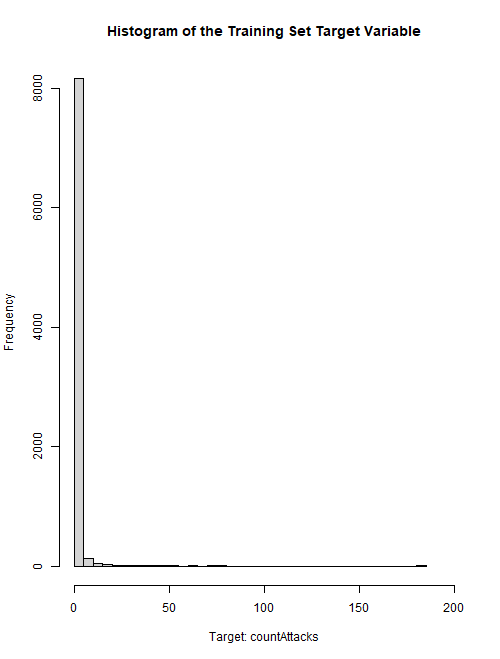
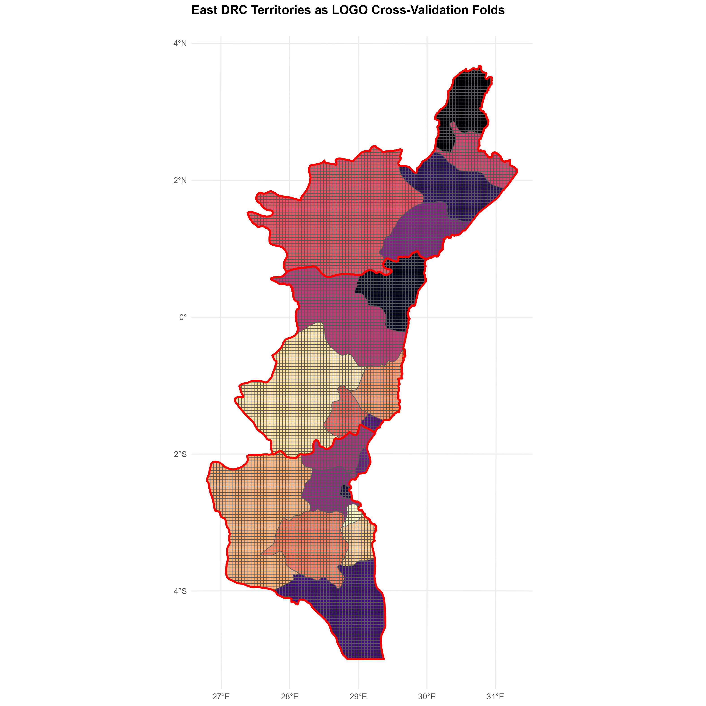
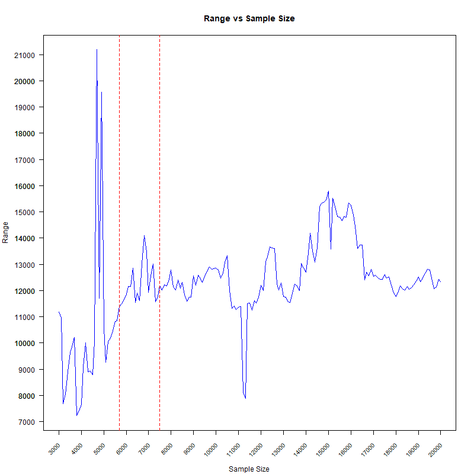
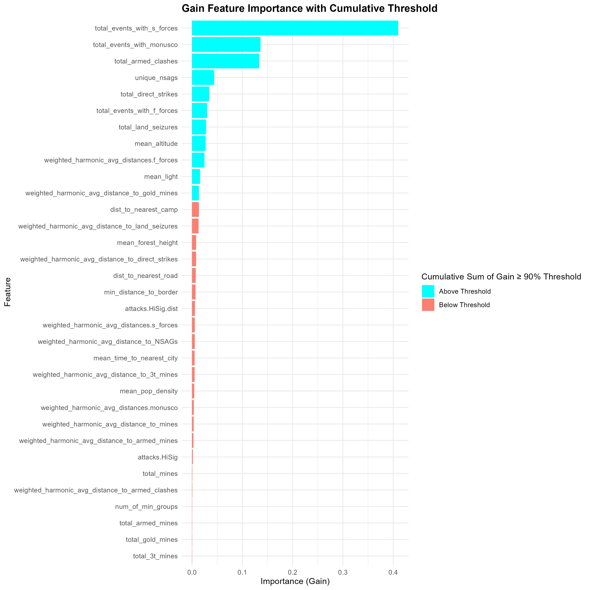
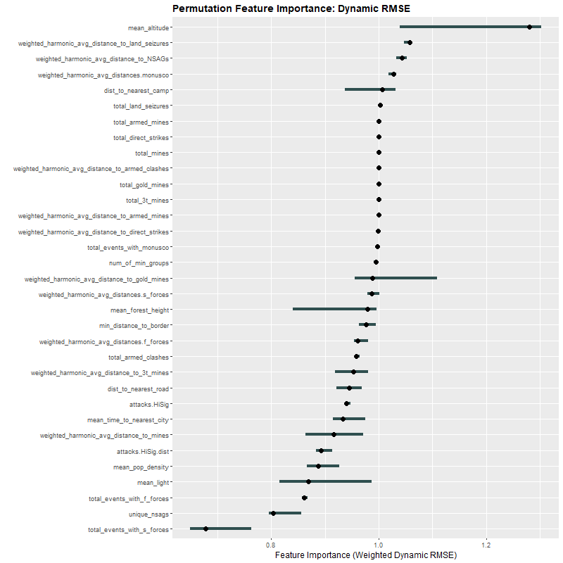

```{r echo=FALSE}

library(stringr)

# Get the current page number from the file name
current_page <- as.numeric(str_extract(knitr::current_input(), "\\d+"))

# Set the total number of pages
total_pages <- 5

# Generate the URLs for the previous and next pages
previous_page <- ifelse(current_page > 1, paste0("part_", current_page - 1, "-spatial_forecast-east_drc-attacks_on_civilians.html"), NA)
next_page <- ifelse(current_page < total_pages, paste0("part_", current_page + 1, "-spatial_forecast-east_drc-attacks_on_civilians.html"), NA)

```

<ul class="pager">
  <li><a href="`r previous_page`" style="color: crimson;">Previous Page</a></li>
  <li><a href="`r next_page`" style="color: crimson;">Next Page</a></li>
</ul>

<br>

### **Leveraging Dynamically Weighted Metrics and Custom Evaluation Techniques for Skewed Geospatial Data:**

<br>

#### In preparation for building our geospatial models, we must create metrics for hyperparameter tuning using training data and for model evaluation on test data. Recall my explanation in the introduction of this portfolio project of metrics I will be using. Before we define the code for our custom regression metrics — those not built into mlr3 — it is important to understand why creating these dynamically weighted metrics is necessary. To emphasize this, let's examine the skewness of our target variable in more detail.

<br>

#### Investigating skewness is crucial because it can significantly impact model performance. A highly skewed target variable can cause models to focus on predicting the most frequent values — in this case, zero attacks — making such models less effective at capturing rare but critical higher attack counts. Ignoring this imbalance may lead to models being created that miss important patterns, resulting in inaccurate predictions. 

<br>

#### It is important to note that while it is common practice to use resampling strategies (e.g., oversampling, undersampling, or SMOTE) with to balance many forms of highly skewed data, this is not the case with geospatial data. Because resampling strategies can disrupt the spatial dependencies and autocorrelation inherent in highly skewed geospatial data, potentially introducing bias and invalidating statistical assumptions models rely on to make accurate predictions, most data scientists avoid using them to balance such datasets.

<br>

#### Understanding our data's distribution can help us decide how to address these imbalances, such as through hyperparameter tuning using custom dynamically weighted metrics. By incorporating these specially designed metrics during tuning, we ensure our models give appropriate attention to both common and rare values, enhancing their predictive performance.

<br>

#### For the test set evaluation phase, we will use both custom dynamically weighted metrics and dynamically weighted asymmetric metrics (the latter of which penalize underpredictions more than overpredictions), alongside standard regression metrics. While these asymmetric metrics will not be used during hyperparameter tuning and consequently will not influence the model during training, they provide a more nuanced assessment of its performance on test data. Underpredicting attack counts can have more severe consequences than overpredicting them, so applying greater penalties to underpredictions during evaluation helps us understand where the model may be lacking and highlights areas for potential improvement. Additionally, if tuning solely with dynamically weighted metrics results in too many underpredictions or overpredictions, in future projects I may consider experimenting with tuning methods that incorporate custom metrics which are both dynamically weighted and asymmetric (designed to penalize either underpredictions or overpredictions, according to the need).

<br>

#### The following histogram illustrates the extreme skewness of our target variable, the number of attacks on civilians ("countAttacks"), in the training set. Out of the 8,409 total grid cells in my map, over 8,000 of the grid cells in the training set contain attack counts so small that they are in the first bin. This makes sense given that earlier in this project we found that 7,366 (or 92%) of the training set grid cells contain 0 attacks on civilians, and that 8,273 (or 98%) of the test set grid cells also contain zero attacks.

<br>

```{r Histogram of Training Set Target Variable, cache=TRUE, cache.lazy=FALSE, fig.height=10.5, fig.width=10.5, eval=FALSE, echo=TRUE}

png("histogram of target variable.png", width = 500, height = 500 / (11/14.5)) # Aspect ratio that shows outliers

hist(final_net.sf.attacks_train$countAttacks, breaks = 50, xlim = c(0, 200), main = "Histogram of the Training Set Target Variable", xlab = "Target: countAttacks")

```

<br>

```{r Histogram of Training Set Target Variable - Plot, cache=TRUE, cache.lazy=FALSE, fig.height=10.5, fig.width=10.5, eval=TRUE, echo=FALSE, out.width="100%", fig.align='center'}



```

<br>

#### Below are some additional measures showing just how skewed the target variable is in the training set. A skewness value of 21.07904 indicates a highly positively skewed distribution. This means that the bulk of the data is concentrated on the left (lower values), with a long tail extending to the right (higher values). This means that most data points have low values (many zeros), but there are a few instances with very high values. A kurtosis value of 774.896 signifies an extremely leptokurtic distribution. This means the distribution has a sharp peak and heavy tails. There is a high presence of outliers or extreme values, which can significantly affect statistical analyses and modeling, if not handled properly.

<br>

#### The quantile distribution shows that up to the 80th percentile, the target variable is zero. At the 90th percentile, it increases to a value of 1. This means that 90% of the data points have values ≤ 1. Between the 90th and 100th percentiles of data points, the target variable sharply increases from 1 to 183.

<br>

#### By addressing skewness using dynamically weighted custom metrics, we enable our models to better handle the data's inherent imbalances, leading to more accurate and reliable geospatial predictions. Specifically, as previously discussed, dynamic weighting during hyperparameter tuning in regression tasks helps by assigning higher weights to large prediction errors in grid cells, especially to extreme outliers, so models prioritize reducing significant errors and achieving balanced performance across grid cells with both typical and extreme values. Since these metrics impose greater penalties on large prediction errors — typically occurring in the rare grid cells containing higher count values — they also help our models effectively learn from and more accurately predict the location and values in these high-count grid cells.

<br>

```{r Training Set Skewness Measures, cache=TRUE, cache.lazy=FALSE, fig.height=10.5, fig.width=10.5, eval=FALSE, echo=TRUE}

library(e1071)

print("Skewness - Attacks")
skewness(final_net.sf.attacks_train$countAttacks, na.rm = TRUE)
# > skewness(final_net.sf.attacks_train$countAttacks, na.rm = TRUE)
# [1] 21.07904

print("Kurtosis - Attacks")
kurtosis(final_net.sf.attacks_train$countAttacks, na.rm = TRUE)
# > kurtosis(final_net.sf.attacks_train$countAttacks, na.rm = TRUE)
# [1] 774.896

print("Quantile - Attacks")
quantile(final_net.sf.attacks_train$countAttacks, probs = seq(0, 1, by = 0.1), na.rm = TRUE)
# > quantile(final_net.sf.attacks_train$countAttacks, probs = seq(0, 1, by = 0.1), na.rm = TRUE)
#   0%  10%  20%  30%  40%  50%  60%  70%  80%  90% 100% 
#    0    0    0    0    0    0    0    0    0    1  183 

```

<br>

---

### **Custom Metrics:**

<br>

<details>
  <summary style="font-size: 18px; color: crimson; font-weight: bold; margin-bottom: 60px; text-decoration: underline;">Click here to expand the code and see the output</summary>
  
```{r Define Custom Metrics, cache=TRUE, cache.lazy=FALSE, fig.height=10.5, fig.width=10.5, eval=FALSE, echo=TRUE}

library(mlr3)
library(mlr3measures)
library(R6)

MeasureQuantileLoss <- R6Class(
  "MeasureQuantileLoss",
  inherit = mlr3::MeasureRegr,
  public = list(
    initialize = function() {
      super$initialize(
        id = "quantile_loss",
        packages = character(),
        properties = character(),
        predict_type = "response",
        range = c(0, Inf),
        minimize = TRUE
      )
    }
  ),
  private = list(
    .score = function(prediction, ...) {
      truth <- prediction$truth
      response <- prediction$response
      tau <- 0.5 # Setting tau to 0.5 for regular quantile loss, symmetrically penalized
      residuals <- truth - response
      quantile_loss <- mean((tau - as.numeric(residuals < 0)) * residuals)
      return(quantile_loss)
    }
  )
)

MeasureDynamicQuantileLoss <- R6Class(
  "MeasureDynamicQuantileLoss",
  inherit = mlr3::MeasureRegr,
  public = list(
    initialize = function() {
      super$initialize(
        id = "dynamic_quantile_loss",
        packages = character(),
        properties = character(),
        predict_type = "response",
        range = c(0, Inf),
        minimize = TRUE
      )
    }
  ),
  private = list(
    .score = function(prediction, ...) {
      truth <- prediction$truth
      response <- prediction$response
      quantile_loss <- function(truth, response, tau = 0.5) { # If tau = 0.5, penalties are applied symmetrically - i.e., equally to underpredictions and overpredictions
        residuals <- truth - response
        weights <- ifelse(truth > 0, 1 + truth, 1)  # Dynamic weights based on true values
        return(mean(weights * (tau - as.numeric(residuals < 0)) * residuals))
      }
      return(quantile_loss(truth, response))
    }
  )
)

MeasureAsymmetricDynamicQuantileLoss <- R6Class(
  "MeasureAsymmetricDynamicQuantileLoss",
  inherit = mlr3::MeasureRegr,
  public = list(
    initialize = function() {
      super$initialize(
        id = "asymmetric_dynamic_quantile_loss",
        packages = character(),
        properties = character(),
        predict_type = "response",
        range = c(0, Inf),
        minimize = TRUE
      )
    }
  ),
  private = list(
    .score = function(prediction, ...) {
      truth <- prediction$truth
      response <- prediction$response
      quantile_loss <- function(truth, response, tau = 0.25) { # If tau=0.25 (i.e., < 0.5), it penalizes underpredictions more than overpredictions.
        residuals <- truth - response
        weights <- ifelse(truth > 0, 1 + truth, 1)  # Dynamic weights based on true values
        return(mean(weights * (tau - as.numeric(residuals < 0)) * residuals))
      }
      return(quantile_loss(truth, response))
    }
  )
)

# The tau parameter in the Quantile Loss function represents the quantile to be estimated. It is a value between 0 and 1. When tau is set to 0.5, it corresponds to the median, and the Quantile Loss function thus becomes the Mean Absolute Error (MAE).

# The Quantile Loss function penalizes overestimations and underestimations differently depending on the value of tau. It penalizes overestimates more when tau is closer to 1 and penalizes underestimates more when tau is closer to 0. If I wanted to penalize underestimations more than overestimations, e.g., I would set tau = 0.25 here rather than tau = 0.5.

# Robustness to Outliers: Unlike RMSE, which is heavily influenced by outliers due to the squaring of errors, and even MAE to a lesser extent, MedAE is more robust to outliers. It focuses on the median of the absolute errors, making it less sensitive to extreme values.

# Central Tendency: MedAE provides a measure of the central tendency of the errors, offering a different perspective than the mean-based measures like RMSE and MAE. This can be particularly valuable in datasets where the error distribution is skewed or has heavy tails.

MeasureHuberLoss <- R6Class(
  "MeasureHuberLoss",
  inherit = mlr3::MeasureRegr,
  public = list(
    initialize = function() {
      super$initialize(
        id = "huber_loss",
        packages = character(),
        properties = character(),
        predict_type = "response",
        range = c(0, Inf),
        minimize = TRUE
      )
    }
  ),
  private = list(
    .score = function(prediction, ...) {
      truth <- prediction$truth
      response <- prediction$response
      huber_loss <- function(truth, response, delta = 1.0) {
        residuals <- truth - response
        abs_residuals <- abs(residuals)
        return(mean(ifelse(abs_residuals <= delta, 0.5 * residuals^2, delta * (abs_residuals - 0.5 * delta))))
      }
      return(huber_loss(truth, response))
    }
  )
)

MeasureDynamicHuberLoss <- R6Class(
  "MeasureDynamicHuberLoss",
  inherit = mlr3::MeasureRegr,
  public = list(
    initialize = function() {
      super$initialize(
        id = "dynamic_huber_loss",
        packages = character(),
        properties = character(),
        predict_type = "response",
        range = c(0, Inf),
        minimize = TRUE
      )
    }
  ),
  private = list(
    .score = function(prediction, ...) {
      truth <- prediction$truth
      response <- prediction$response
      huber_loss <- function(truth, response, delta = 1.0) {
        residuals <- truth - response
        abs_residuals <- abs(residuals)
        w = 1 # If w=2 in this modified version, underpredictions (residuals < 0) are penalized w times more than overpredictions. You can adjust w based on how much more you want to penalize underestimations. Currently, w=1 applies penalties symmetrically
        weights <- ifelse(truth > 0, 1 + truth, 1)  # Dynamic weights based on true values
        return(mean(ifelse(abs_residuals <= delta, 0.5 * residuals^2 * weights * ifelse(residuals < 0, w, 1), delta * (abs_residuals - 0.5 * delta) * weights * ifelse(residuals < 0, w, 1))))
      }
      return(huber_loss(truth, response))
    }
  )
)

MeasureAsymmetricDynamicHuberLoss <- R6Class(
  "MeasureAsymmetricDynamicHuberLoss",
  inherit = mlr3::MeasureRegr,
  public = list(
    initialize = function() {
      super$initialize(
        id = "asymmetric_dynamic_huber_loss",
        packages = character(),
        properties = character(),
        predict_type = "response",
        range = c(0, Inf),
        minimize = TRUE
      )
    }
  ),
  private = list(
    .score = function(prediction, ...) {
      truth <- prediction$truth
      response <- prediction$response
      huber_loss <- function(truth, response, delta = 1.0) {
        residuals <- truth - response
        abs_residuals <- abs(residuals)
        w = 2 # If w=2 in this modified version, underestimations (residuals < 0) are penalized twice as much as overestimations.
        weights <- ifelse(truth > 0, 1 + truth, 1)  # Dynamic weights based on true values
        return(mean(ifelse(abs_residuals <= delta, 0.5 * residuals^2 * weights * ifelse(residuals < 0, w, 1), delta * (abs_residuals - 0.5 * delta) * weights * ifelse(residuals < 0, w, 1))))
      }
      return(huber_loss(truth, response))
    }
  )
)


MeasureLogCoshLoss <- R6Class(
  "MeasureLogCoshLoss",
  inherit = mlr3::MeasureRegr,
  public = list(
    initialize = function() {
      super$initialize(
        id = "log_cosh_loss",
        packages = character(),
        properties = character(),
        predict_type = "response",
        range = c(0, Inf),
        minimize = TRUE
      )
    }
  ),
  private = list(
    .score = function(prediction, ...) {
      truth <- prediction$truth
      response <- prediction$response
      log_cosh_loss <- function(truth, response) {
        residuals <- truth - response
        return(mean(log(cosh(residuals))))
      }
      return(log_cosh_loss(truth, response))
    }
  )
)

# Define the custom measure as an R6Class
MeasureDynamicRMSE <- R6Class(
  "MeasureDynamicRMSE",
  inherit = mlr3::MeasureRegr,
  public = list(
    initialize = function() {
      super$initialize(
        id = "dynamic_rmse",
        packages = character(), # no package dependencies
        properties = character(), # no special properties
        predict_type = "response", # measures response prediction
        range = c(0, Inf),
        minimize = TRUE
      )
    }
  ),
  private = list(
    .score = function(prediction, ...) {
      # Extract truth and response from prediction object
      truth <- prediction$truth
      response <- prediction$response

      # Define the DynamicWeightedRMSE function
      DynamicWeightedRMSE <- function(truth, response) {
        # Adjust weights based on observed count
        weights <- ifelse(truth > 0, 1 + truth, 1)

        # Calculate RMSE with the dynamic weights
        calculate_d_rmse <- sqrt(mean((truth - response)^2 * weights))
        return(calculate_d_rmse)
      }
      # Use the custom RMSE function
      d_rmse <- DynamicWeightedRMSE(truth, response)
      return(d_rmse)
    }
  )
)

# Define the custom measure as an R6Class
MeasureAsymmetricDynamicRMSE <- R6Class(
  "MeasureAsymmetricDynamicRMSE",
  inherit = mlr3::MeasureRegr,
  public = list(
    initialize = function() {
      super$initialize(
        id = "asymmetric_dynamic_rmse",
        packages = character(), # no package dependencies
        properties = character(), # no special properties
        predict_type = "response", # measures response prediction
        range = c(0, Inf),
        minimize = TRUE
      )
    }
  ),
  private = list(
    .score = function(prediction, ...) {
      # Extract truth and response from prediction object
      truth <- prediction$truth
      response <- prediction$response

      # Define the DynamicWeightedRMSE function
      DynamicWeightedRMSE <- function(truth, response) {
        # Adjust weights based on observed count and asymmetry
        weights <- ifelse(truth > 0, 1 + truth, 1)
        asymmetry_weights <- ifelse(response < truth, 2, 1) # penalize underestimations twice as much

        # Calculate RMSE with the dynamic weights and asymmetric penalties
        calculate_d_rmse <- sqrt(mean((truth - response)^2 * weights * asymmetry_weights))
        return(calculate_d_rmse)
      }
      # Use the custom RMSE function
      d_rmse <- DynamicWeightedRMSE(truth, response)
      return(d_rmse)
    }
  )
)

# Define the custom measure as an R6Class
MeasureDynamicMAE <- R6Class(
  "MeasureDynamicMAE",
  inherit = mlr3::MeasureRegr,
  public = list(
    initialize = function() {
      super$initialize(
        id = "dynamic_mae",
        packages = character(), # no package dependencies
        properties = character(), # no special properties
        predict_type = "response", # measures response prediction
        range = c(0, Inf),
        minimize = TRUE
      )
    }
  ),
  private = list(
    .score = function(prediction, ...) {
      # Extract truth and response from prediction object
      truth <- prediction$truth
      response <- prediction$response

      # Define the DynamicWeightedMAE function
      DynamicWeightedMAE <- function(truth, response) {
        # Adjust weights based on observed count
        weights <- ifelse(truth > 0, 1 + truth, 1)

        # Calculate MAE with the dynamic weights
        calculate_d_mae <- mean(abs(truth - response) * weights)
        return(calculate_d_mae)
      }

      # Use the custom MAE function
      d_mae <- DynamicWeightedMAE(truth, response)
      return(d_mae)
    }
  )
)

MeasureAsymmetricDynamicMAE <- R6Class(
  "MeasureAsymmetricDynamicMAE",
  inherit = mlr3::MeasureRegr,
  public = list(
    initialize = function() {
      super$initialize(
        id = "asymmetric_dynamic_mae",
        packages = character(), # no package dependencies
        properties = character(), # no special properties
        predict_type = "response", # measures response prediction
        range = c(0, Inf),
        minimize = TRUE
      )
    }
  ),
  private = list(
    .score = function(prediction, ...) {
      # Extract truth and response from prediction object
      truth <- prediction$truth
      response <- prediction$response

      # Define the DynamicWeightedMAE function
      DynamicWeightedMAE <- function(truth, response) {
        # Adjust weights based on observed count and asymmetry
        weights <- ifelse(truth > 0, 1 + truth, 1)
        asymmetry_weights <- ifelse(response < truth, 2, 1) # penalize underestimations more

        # Calculate MAE with the dynamic weights and asymmetry penalties
        calculate_d_mae <- mean(abs(truth - response) * weights * asymmetry_weights)
        return(calculate_d_mae)
      }

      # Use the custom MAE function
      d_mae <- DynamicWeightedMAE(truth, response)
      return(d_mae)
    }
  )
)

# Dynamic Weighted Mean Squared Error (Dynamic MSE): Similar to dynamic RMSE and MAE, but focuses on squared errors. This metric is useful for penalizing larger errors more heavily.

MeasureDynamicMSE <- R6Class(
  "MeasureDynamicMSE",
  inherit = mlr3::MeasureRegr,
  public = list(
    initialize = function() {
      super$initialize(
        id = "dynamic_mse",
        packages = character(),
        properties = character(),
        predict_type = "response",
        range = c(0, Inf),
        minimize = TRUE
      )
    }
  ),
  private = list(
    .score = function(prediction, ...) {
      truth <- prediction$truth
      response <- prediction$response

      DynamicWeightedMSE <- function(truth, response) {
        weights <- ifelse(truth > 0, 1 + truth, 1)
        calculate_d_mse <- mean((truth - response)^2 * weights)
        return(calculate_d_mse)
      }
      return(DynamicWeightedMSE(truth, response))
    }
  )
)

MeasureAsymmetricDynamicMSE <- R6Class(
  "MeasureAsymmetricDynamicMSE",
  inherit = mlr3::MeasureRegr,
  public = list(
    initialize = function() {
      super$initialize(
        id = "asymmetric_dynamic_mse",
        packages = character(),
        properties = character(),
        predict_type = "response",
        range = c(0, Inf),
        minimize = TRUE
      )
    }
  ),
  private = list(
    .score = function(prediction, ...) {
      truth <- prediction$truth
      response <- prediction$response

      DynamicWeightedMSE <- function(truth, response) {
        weights <- ifelse(truth > 0, 1 + truth, 1)
        asymmetry_weights <- ifelse(response < truth, 2, 1) # penalize underestimations more

        calculate_d_mse <- mean((truth - response)^2 * weights * asymmetry_weights)
        return(calculate_d_mse)
      }
      return(DynamicWeightedMSE(truth, response))
    }
  )
)

# Create a Custom Metric, Regular MASE
MeasureMASE <- R6Class(
  "MeasureMASE",
  inherit = mlr3::MeasureRegr,
  public = list(
    initialize = function() {
      super$initialize(
        id = "regr.mase",
        packages = character(),
        properties = character(),
        predict_type = "response",
        range = c(0, Inf),
        minimize = TRUE
      )
    }
  ),
  private = list(
    .score = function(prediction, ...) {
      truth <- prediction$truth
      response <- prediction$response

      MASE <- function(truth, response) {
        n <- length(truth)
        scale <- mean(abs(truth[-1] - truth[-n])) # Mean absolute difference of the truth values (naive forecast)
        mean(abs(truth - response) / scale)
      }

      return(MASE(truth, response))
    }
  )
)

# Create a Custom Metric, Dynamic MASE
MeasureDynamicMASE <- R6Class(
  "MeasureDynamicMASE",
  inherit = mlr3::MeasureRegr,
  public = list(
    initialize = function() {
      super$initialize(
        id = "dynamic_mase",
        packages = character(),
        properties = character(),
        predict_type = "response",
        range = c(0, Inf),
        minimize = TRUE
      )
    }
  ),
  private = list(
    .score = function(prediction, ...) {
      truth <- prediction$truth
      response <- prediction$response

      DynamicWeightedMASE <- function(truth, response) {
        n <- length(truth)
        scale <- mean(abs(truth[-1] - truth[-n])) # Use naive forecast for scaling
        weights <- ifelse(truth > 0, 1 + truth, 1)
        calculate_d_mase <- mean(abs(truth - response) / scale * weights)
        return(calculate_d_mase)
      }
      return(DynamicWeightedMASE(truth, response))
    }
  )
)

# Create a Custom Metric, Asymmetric Dynamic MASE
MeasureAsymmetricDynamicMASE <- R6Class(
  "MeasureAsymmetricDynamicMASE",
  inherit = mlr3::MeasureRegr,
  public = list(
    initialize = function() {
      super$initialize(
        id = "asymmetric_dynamic_mase",
        packages = character(),
        properties = character(),
        predict_type = "response",
        range = c(0, Inf),
        minimize = TRUE
      )
    }
  ),
  private = list(
    .score = function(prediction, ...) {
      truth <- prediction$truth
      response <- prediction$response

      AsymmetricDynamicMASE <- function(truth, response) {
        n <- length(truth)
        scale <- mean(abs(truth[-1] - truth[-n])) # Use naive forecast for scaling
        weights <- ifelse(truth > 0, 1 + truth, 1)
        diff <- truth - response
        penalty <- ifelse(diff > 0, 2, 1)  # Double penalty for underpredictions
        mean(abs(diff) / scale * weights * penalty)
      }

      return(AsymmetricDynamicMASE(truth, response))
    }
  )
)

# Define the custom R6 class for Logarithmic penalty
MeasureDynamicLogarithmicMedAE <- R6Class(
  "MeasureDynamicLogarithmicMedAE",
  inherit = mlr3::MeasureRegr,
  public = list(
    initialize = function() {
      super$initialize(
        id = "dynamic_logarithmic_medae",
        packages = character(),
        properties = character(),
        predict_type = "response",
        range = c(0, Inf),
        minimize = TRUE
      )
    }
  ),
  private = list(
    .score = function(prediction, ...) {
      truth <- prediction$truth
      response <- prediction$response
      errors <- truth - response
      base_weights <- 1 + truth
      penalties <- log(1 + abs(errors)^2) # Penalties apply symmetrically. Use the below commented out line instead to apply penalties more for underpredictions than overpredictions
      # penalties <- ifelse(errors > 0, log(1 + abs(errors)^2), log(1 + sqrt(abs(errors))))
      weighted_errors <- abs(errors) * base_weights * penalties
      calculate_d_medae <- median(weighted_errors)
      return(calculate_d_medae)
    }
  )
)

# Define the custom R6 class for Logarithmic penalty
MeasureAsymmetricDynamicLogarithmicMedAE <- R6Class(
  "MeasureAsymmetricDynamicLogarithmicMedAE",
  inherit = mlr3::MeasureRegr,
  public = list(
    initialize = function() {
      super$initialize(
        id = "asymmetric_dynamic_logarithmic_medae",
        packages = character(),
        properties = character(),
        predict_type = "response",
        range = c(0, Inf),
        minimize = TRUE
      )
    }
  ),
  private = list(
    .score = function(prediction, ...) {
      truth <- prediction$truth
      response <- prediction$response
      errors <- truth - response
      base_weights <- 1 + truth
      # penalties <- log(1 + abs(errors)^2) # If this line is used, penalties apply symmetrically.
      penalties <- ifelse(errors > 0, log(1 + abs(errors)^2), log(1 + sqrt(abs(errors)))) # If this line is used instead, penalties apply more for underpredictions than overpredictions
      weighted_errors <- abs(errors) * base_weights * penalties
      calculate_d_medae <- median(weighted_errors)
      return(calculate_d_medae)
    }
  )
)

# Define the custom R6 class for Square Root penalty
MeasureDynamicSqrtMedAE <- R6Class(
  "MeasureDynamicSqrtMedAE",
  inherit = mlr3::MeasureRegr,
  public = list(
    initialize = function() {
      super$initialize(
        id = "dynamic_sqrt_medae",
        packages = character(),
        properties = character(),
        predict_type = "response",
        range = c(0, Inf),
        minimize = TRUE
      )
    }
  ),
  private = list(
    .score = function(prediction, ...) {
      truth <- prediction$truth
      response <- prediction$response
      errors <- truth - response
      base_weights <- 1 + truth
      penalties <- sqrt(abs(errors)) # Penalties apply symmetrically. Use the below commented out line to apply penalties more for underpredictions than overpredictions
      # penalties <- ifelse(errors > 0, abs(errors), sqrt(abs(errors)))
      weighted_errors <- abs(errors) * base_weights * penalties
      calculate_d_medae <- median(weighted_errors)
      return(calculate_d_medae)
    }
  )
)

# Asymmetric penalized version of the above function. Penalizes underpredictions more than overpredictions:
# Define the custom R6 class for Square Root penalty
MeasureAsymmetricDynamicSqrtMedAE <- R6Class(
  "MeasureAsymmetricDynamicSqrtMedAE",
  inherit = mlr3::MeasureRegr,
  public = list(
    initialize = function() {
      super$initialize(
        id = "asymmetric_dynamic_sqrt_medae",
        packages = character(),
        properties = character(),
        predict_type = "response",
        range = c(0, Inf),
        minimize = TRUE
      )
    }
  ),
  private = list(
    .score = function(prediction, ...) {
      truth <- prediction$truth
      response <- prediction$response
      errors <- truth - response
      base_weights <- 1 + truth
      # penalties <- sqrt(abs(errors)) # If this line were used, penalties would apply symmetrically
      penalties <- ifelse(errors > 0, abs(errors), sqrt(abs(errors))) # Use this line instead to apply penalties more for underpredictions than overpredictions
      weighted_errors <- abs(errors) * base_weights * penalties
      calculate_d_medae <- median(weighted_errors)
      return(calculate_d_medae)
    }
  )
)


# Define the custom R6 class for Polynomial (x^(2/3) penalty for underpredictions and (x^(1/3)) penalty for overpredictions
MeasureDynamicPoly_2.3_and_1.3_MedAE <- R6Class(
  "MeasureDynamicPoly_2.3_and_1.3_MedAE",
  inherit = mlr3::MeasureRegr,
  public = list(
    initialize = function() {
      super$initialize(
        id = "dynamic_poly_2.3_and_1.3_medae",
        packages = character(),
        properties = character(),
        predict_type = "response",
        range = c(0, Inf),
        minimize = TRUE
      )
    }
  ),
  private = list(
    .score = function(prediction, ...) {
      truth <- prediction$truth
      response <- prediction$response
      errors <- truth - response
      base_weights <- 1 + truth
      penalties <- ifelse(errors > 0, abs(errors)^(2/3), abs(errors)^(1/3))
      weighted_errors <- abs(errors) * base_weights * penalties
      calculate_d_medae <- median(weighted_errors)
      return(calculate_d_medae)
    }
  )
)

# Define the custom R6 class for Polynomial (x^(2/3) penalty for underpredictions and (x^(1/2)) penalty for overpredictions

MeasureDynamicPoly_2.3_and_1.2_MedAE <- R6Class(
  "MeasureDynamicPoly_2.3_and_1.2_MedAE",
  inherit = mlr3::MeasureRegr,
  public = list(
    initialize = function() {
      super$initialize(
        id = "dynamic_poly_2.3_and_1.2_medae",
        packages = character(),
        properties = character(),
        predict_type = "response",
        range = c(0, Inf),
        minimize = TRUE
      )
    }
  ),
  private = list(
    .score = function(prediction, ...) {
      truth <- prediction$truth
      response <- prediction$response
      errors <- truth - response
      base_weights <- 1 + truth
      penalties <- ifelse(errors > 0, abs(errors)^(2/3), abs(errors)^(1/2))
      weighted_errors <- abs(errors) * base_weights * penalties
      calculate_d_medae <- median(weighted_errors)
      return(calculate_d_medae)
    }
  )
)

# Define the custom R6 class for Logistic penalty
MeasureDynamicLogisticMedAE <- R6Class(
  "MeasureDynamicLogisticMedAE",
  inherit = mlr3::MeasureRegr,
  public = list(
    initialize = function() {
      super$initialize(
        id = "dynamic_logistic_medae",
        packages = character(),
        properties = character(),
        predict_type = "response",
        range = c(0, Inf),
        minimize = TRUE
      )
    }
  ),
  private = list(
    .score = function(prediction, ...) {
      truth <- prediction$truth
      response <- prediction$response
      errors <- truth - response
      base_weights <- 1 + truth
      penalties <- 1 / (1 + exp(-abs(errors))) # Penalties are applied symmetrically
      # penalties <- ifelse(errors > 0, 1 / (1 + exp(-abs(errors))), 1 / (1 + exp(-sqrt(abs(errors))))) # Use this line instead to penalize underpredictions more than overpredictions
      weighted_errors <- abs(errors) * base_weights * penalties
      calculate_d_medae <- median(weighted_errors)
      return(calculate_d_medae)
    }
  )
)

# Define the custom R6 class for Logistic penalty
MeasureAsymmetricDynamicLogisticMedAE <- R6Class(
  "MeasureAsymmetricDynamicLogisticMedAE",
  inherit = mlr3::MeasureRegr,
  public = list(
    initialize = function() {
      super$initialize(
        id = "asymmetric_dynamic_logistic_medae",
        packages = character(),
        properties = character(),
        predict_type = "response",
        range = c(0, Inf),
        minimize = TRUE
      )
    }
  ),
  private = list(
    .score = function(prediction, ...) {
      truth <- prediction$truth
      response <- prediction$response
      errors <- truth - response
      base_weights <- 1 + truth
      # penalties <- 1 / (1 + exp(-abs(errors))) # If this line were used, penalties would be applied symmetrically
      penalties <- ifelse(errors > 0, 1 / (1 + exp(-abs(errors))), 1 / (1 + exp(-sqrt(abs(errors))))) # This penalties line is instead used to penalize underpredictions more than overpredictions
      weighted_errors <- abs(errors) * base_weights * penalties
      calculate_d_medae <- median(weighted_errors)
      return(calculate_d_medae)
    }
  )
)

# Geometric Mean Absolute Error (GMAE): This metric emphasizes multiplicative errors, which can be useful in the context of skewed data.

MeasureGMAE <- R6Class(
  "MeasureGMAE",
  inherit = mlr3::MeasureRegr,
  public = list(
    initialize = function() {
      super$initialize(
        id = "gmae",
        packages = character(),
        properties = character(),
        predict_type = "response",
        range = c(0, Inf),
        minimize = TRUE
      )
    }
  ),
  private = list(
    .score = function(prediction, ...) {
      truth <- prediction$truth
      response <- prediction$response
      gmae <- function(truth, response) {
        return(exp(mean(log(abs(truth - response) + 1))) - 1)
      }
      return(gmae(truth, response))
    }
  )
)

# Register the custom measures with mlr3
mlr3::mlr_measures$add("quantile_loss", MeasureQuantileLoss$new())
mlr3::mlr_measures$add("dynamic_quantile_loss", MeasureDynamicQuantileLoss$new())
mlr3::mlr_measures$add("asymmetric_dynamic_quantile_loss", MeasureAsymmetricDynamicQuantileLoss$new())
mlr3::mlr_measures$add("huber_loss", MeasureHuberLoss$new())
mlr3::mlr_measures$add("dynamic_huber_loss", MeasureDynamicHuberLoss$new())
mlr3::mlr_measures$add("asymmetric_dynamic_huber_loss", MeasureAsymmetricDynamicHuberLoss$new())
mlr3::mlr_measures$add("dynamic_rmse", MeasureDynamicRMSE$new())
mlr3::mlr_measures$add("asymmetric_dynamic_rmse", MeasureAsymmetricDynamicRMSE$new())
mlr3::mlr_measures$add("dynamic_mae", MeasureDynamicMAE$new())
mlr3::mlr_measures$add("asymmetric_dynamic_mae", MeasureAsymmetricDynamicMAE$new())
mlr3::mlr_measures$add("dynamic_logarithmic_medae", MeasureDynamicLogarithmicMedAE$new())
mlr3::mlr_measures$add("asymmetric_dynamic_logarithmic_medae", MeasureAsymmetricDynamicLogarithmicMedAE$new())
mlr3::mlr_measures$add("dynamic_sqrt_medae", MeasureDynamicSqrtMedAE$new())
mlr3::mlr_measures$add("asymmetric_dynamic_sqrt_medae", MeasureAsymmetricDynamicSqrtMedAE$new())
mlr3::mlr_measures$add("dynamic_logistic_medae", MeasureDynamicLogisticMedAE$new())
mlr3::mlr_measures$add("asymmetric_dynamic_logistic_medae", MeasureAsymmetricDynamicLogisticMedAE$new())
mlr3::mlr_measures$add("dynamic_mse", MeasureDynamicMSE$new())
mlr3::mlr_measures$add("asymmetric_dynamic_mse", MeasureAsymmetricDynamicMSE$new())
mlr3::mlr_measures$add("regr.mase", MeasureMASE$new())
mlr3::mlr_measures$add("dynamic_mase", MeasureDynamicMASE$new())
mlr3::mlr_measures$add("asymmetric_dynamic_mase", MeasureAsymmetricDynamicMASE$new())
mlr3::mlr_measures$add("gmae", MeasureGMAE$new())
mlr3::mlr_measures$add("log_cosh_loss", MeasureLogCoshLoss$new())
mlr3::mlr_measures$add("dynamic_poly_2.3_and_1.3_medae", MeasureDynamicPoly_2.3_and_1.3_MedAE$new())
mlr3::mlr_measures$add("dynamic_poly_2.3_and_1.2_medae", MeasureDynamicPoly_2.3_and_1.2_MedAE$new())

# Verify that all custom measures have been successfully added to the mlr3 measures registry:
c("quantile_loss", "dynamic_quantile_loss", "asymmetric_dynamic_quantile_loss",
  "huber_loss", "dynamic_huber_loss", "asymmetric_dynamic_huber_loss",
  "dynamic_rmse", "asymmetric_dynamic_rmse",
  "dynamic_mae", "asymmetric_dynamic_mae",
  "dynamic_logarithmic_medae", "asymmetric_dynamic_logarithmic_medae",
  "dynamic_sqrt_medae", "asymmetric_dynamic_sqrt_medae",
  "dynamic_logistic_medae", "asymmetric_dynamic_logistic_medae",
  "dynamic_mse", "asymmetric_dynamic_mse",
  "regr.mase", "dynamic_mase", "asymmetric_dynamic_mase",
  "dynamic_poly_2.3_and_1.3_medae",
  "dynamic_poly_2.3_and_1.2_medae",
  "log_cosh_loss", 
  "gmae") %in% mlr3::mlr_measures$keys()

```

<br>

<hr style="border:1px solid black">

<br>

### **Explanation of Administrative District-Based Leave-One-Group-Out (LOGO) Cross-Validation:**

<br>

#### Soon, I will create our first geospatial machine learning model. Choosing the right cross-validation technique when working with geospatial data is very important. The first technique we will explore is leave-one-group-out (LOGO) spatial cross-validation, in which each 3rd order aministrative district (i.e., East DRC territory) will one-by-one be held out as a test fold, while all others together will act as the training set, to make predictions. In mlr3, this is implemented using the `custom_cv` resampling function. This map represents each territory as a separate fold for `custom_cv` LOGO cross-validation.

<br>

```{r Map of custom_cv LOGO Cross-Validation Folds, cache=TRUE, cache.lazy=FALSE, fig.height=10.5, fig.width=10.5, eval=FALSE, echo=TRUE}

setwd("C:/Users/rsb84/Desktop/RB/ds_projects/GIS/DRC/")

source("https://raw.githubusercontent.com/urbanSpatial/Public-Policy-Analytics-Landing/master/functions.r")
options(scipen=9999)
library(tidyverse)
library(dplyr)
library(sf)
library(spatstat)
library(viridis)
library(FNN)
library(grid)
library(gridExtra)
library(raster)
library(rgdal)
library(rasterVis)
library(rhdf5)
library(tidyr)
library(raster)
library(ggplot2)
library(viridis)
library(exactextractr)
library(rgeos)

# The following custom map theme function is modified from the original, which comes from the following site: https://raw.githubusercontent.com/urbanSpatial/Public-Policy-Analytics-Landing/master/functions.r

mapTheme <- function(base_size = 12, title_size = 16) {
  theme(
    text = element_text( color = "black"),
    plot.title = element_text(size = title_size,colour = "black"),
    plot.subtitle=element_text(face="italic"),
    plot.caption=element_text(hjust=0),
    axis.ticks = element_blank(),
    panel.background = element_blank(),axis.title = element_blank(),
    axis.text = element_blank(),
    axis.title.x = element_blank(),
    axis.title.y = element_blank(),
    panel.grid.minor = element_blank(),
    panel.border = element_rect(colour = "black", fill=NA, linewidth = 2),
    strip.text.x = element_text(size = 14))
}

e_drc_adm2_map <- readRDS("e_drc_adm2_map.rds")

e_drc_adm3_map <- readRDS("e_drc_adm3_map.rds")

e_drc_adm3_map <- e_drc_adm3_map %>%
  st_transform(crs=4326)

final_net.sf.attacks_train <- readRDS(file = "final_net.sf.attacks_train-after_adding_HiSig_and_HiSig.dist.rds")
final_net.sf.attacks_test <- readRDS(file = "final_net.sf.attacks_test-after_adding_HiSig_and_HiSig.dist.rds")


ggplot() +
  geom_sf(data = final_net.sf.attacks_train, aes(fill = NAME_3), linewidth = 0.3, show.legend=FALSE) +
  scale_fill_viridis(option = "magma", discrete = T,
                    name="Attacks Count") +
  geom_sf(data = e_drc_adm2_map, fill = NA, color = "red", linewidth = 1) +
  labs(title = "East DRC Territories as LOGO Cross-Validation Folds",
       subtitle = " ") +
  theme_minimal() +
  theme(
    plot.title = element_text(face = "bold")
  ) +
  coord_sf()

```

<br>

```{r Map of custom_cv LOGO Cross-Validation Folds - Plot, cache=TRUE, cache.lazy=FALSE, fig.height=10.5, fig.width=10.5, eval=TRUE, echo=FALSE, out.width="100%", fig.align='center'}

# Note: Uncomment out the following code to generate the image below

# g_plot_10 <- ggplot() +
#   geom_sf(data = final_net.sf.attacks_train, aes(fill = NAME_3), linewidth = 0.3, show.legend=FALSE) +
#   viridis::scale_fill_viridis(option = "magma", discrete = T,
#                     name="Attacks Count") +
#   geom_sf(data = e_drc_adm2_map, fill = NA, color = "red", linewidth = 1) +
#   labs(title = "East DRC Territories as LOGO Cross-Validation Folds",
#        subtitle = " ") +
#   theme_minimal() +
#   theme(
#     plot.title = element_text(face = "bold")
#   ) +
#   coord_sf()
# 
# # Save the plot
# ggsave("East DRC Territories as LOGO Cross-Validation Folds.png", plot = g_plot_10, width = 10.5, height = 10.5, units = "in")



```

<br>

#### Potential problems arise with this strategy: Using administrative district-based folds in LOGO spatial cross-validation can be problematic when districts vary significantly in size, as they do in our case. Larger districts may dominate training data, while smaller districts could be underrepresented, leading to imbalanced folds. This imbalance can skew performance estimates, as the model may perform well on large districts but poorly on smaller ones, affecting its generalization ability.

<br>

#### Additionally, large districts may introduce spatial autocorrelation within folds, as data points in such areas often share similar geographic, social, or environmental characteristics. This can lead to artificially high performance estimates since the model is tested on spatially correlated data, reducing the independence between training and test sets. To address this, geographically balanced folds or stratified grouping provide more representative and fair cross-validation results.

<br>

#### Standard cross-validation strategies like LOGO cross-validation that are not designed to handle spatial autocorrelation also could potentially allow data leakage across cross-validation folds due to similar values existing along fold edges. It is therefore important to identify whether and the extent to which there is spatial autocorrelation in our data. One measure of this is the Global Moran's I value:

<br>

```{r Global Morans I, cache=TRUE, cache.lazy=FALSE, fig.height=24, fig.width=16, eval=FALSE, echo=TRUE}

library(spdep)

final_net.attacks_train.weights <- readRDS(file = "final_net.attacks_train.weights.rds")

# Calculate Global Moran's I - We want to first see an overall picture of how much spatial autocorrelation exists in the data. A Global Moran's I value gives us one value to measure this overall level of spatial autocorrelation

# Convert the 'sf' object to a 'Spatial' object because the weights were created using 'as_Spatial'
attacks_train_Spatial <- sf::as_Spatial(final_net.sf.attacks_train)

moran_result <- spdep::moran.test(attacks_train_Spatial$countAttacks, listw = final_net.attacks_train.weights)
print(moran_result)

# Output:

# > print(moran_result)

#	Moran I test under randomisation

# data:  attacks_train_Spatial$countAttacks  
# weights: final_net.attacks_train.weights    

# Moran I statistic standard deviate = 2.6204, p-value = 0.004391
# alternative hypothesis: greater
# sample estimates:
# Moran I statistic       Expectation          Variance 
#     0.1188218607     -0.0001189343      0.0020602408 

```

<br>

#### This Global Moran's I output can be interpreted as follows:

<br>

#### A Global Moran's I statistic of 0.1188218607 represents a minor to moderate level of spatial autocorrelation. This means that areas with high (or low) counts of attacks tend to be surrounded by areas with similarly high (or low) counts, more than would be expected if the spatial distribution were random. The p-value of 0.004391 shows that the Moran's I statistic is statistically significant at common significance levels (e.g., 0.05, 0.01), leading to the rejection of the null hypothesis of no spatial autocorrelation. This low p-value indicates that the observed spatial patterns are unlikely to be due to random chance.

<br>

#### Since the data only has a minor level of spatial autocorrelation, it may be possible to use a cross-validation technique such as mlr3's `custom_cv` for LOGO cross-validation. If the Global Moran's I value were roughly 0.3 or higher or -0.3 or lower, this would signify a moderate to high level of spatial autocorrelation. In that case, it might be critical to use a cross-validation strategy specifically designed to handle spatial autocorrelation. 

<br>

#### As briefly mentioned before, it is possible that highly spatially autocorrelated data can lead to leakage of spatial information across cross-validation folds, which can lead to overly optimistic performance metrics. Overly optimistic performance metrics can similarly result since the cross-validation assumption of independence between observations is violated. Here, the model may simply be capturing the spatial pattern rather than learning from the features in a way that generalizes well. A model that performs well according to these metrics under spatially autocorrelated cross-validation may not perform as well in predicting outcomes for areas not represented in the training data, because the spatial patterns it has learned may not apply for the test set or other unseen data.

<br>

#### To further gauge the appropriateness of using `custom_cv` LOGO cross-validation in mlr3, I will analyze the Global Moran's I statistic for each third order administrative district territory to see whether there are some territories with high spatial autocorrelation, in which case a stronger technique for handling spatial autocorrelation may be better to use:

<br>

#### **Explanation of Moran's I Values:**

#### Moran's I measures spatial autocorrelation, showing the degree of similarity or dissimilarity between values in spatial data.

<br>

#### Moran's I closer to +1: Strong positive spatial autocorrelation. Similar values (high with high, low with low) cluster together in space.

<br>

#### Moran's I close to 0: No spatial autocorrelation. Values are randomly distributed, showing no clear spatial pattern.

<br>

#### Moran's I closer to -1: Strong negative spatial autocorrelation. Dissimilar values (high with low, low with high) are found near each other, indicating dispersion of similar values.

<br>


#### **Thresholds for Spatial Autocorrelation:**

#### - Low spatial autocorrelation: |Moran's I| < 0.1). This suggests little to no spatial structure.

<br>

#### - Mild spatial autocorrelation: Moran's I between ± 0.1 and ± 0.3. A weak spatial pattern is present.

<br>

#### - Moderate spatial autocorrelation: Moran's I between ± 0.3 and ± 0.5. A moderate pattern of clustering or dispersion.

<br>

#### - Moderately high spatial autocorrelation: Moran's I between ± 0.5 and ± 0.7. A strong tendency for clustering or dispersion.

<br>

#### - High spatial autocorrelation: |Moran's I| > 0.7. Very strong clustering (positive) or dispersion (negative) of values.

<br>

#### **Code to Calculate the Global Moran's I for Each Territory:**

<details>
  <summary style="font-size: 18px; color: crimson; font-weight: bold; margin-bottom: 60px; text-decoration: underline;">Click here to expand the code and see the output</summary>


```{r Global Morans I for Each Territory, cache=TRUE, cache.lazy=FALSE, fig.height=24, fig.width=16, eval=FALSE, echo=TRUE}


# Extract districts from the original sf data frame
districts <- unique(attacks_train_Spatial$NAME_3)

# Initialize a data frame to store Moran's I and p-value for each district
morans_results <- data.frame(
  District = districts,
  Morans_I = NA_real_,
  P_Value = NA_real_,
  stringsAsFactors = FALSE
)

for (d in districts) {
  # Find indexes of data in this district
  district_indexes <- which(attacks_train_Spatial$NAME_3 == d)
  
  # Check if there are enough points to perform analysis
  if (length(district_indexes) > 1) {
    # Extract subset of Spatial DataFrame for the district
    district_data <- attacks_train_Spatial[district_indexes, ]
    
    # Recalculate neighborhoods within this subset
    district_nb <- poly2nb(district_data, queen = TRUE)
    
    # Calculate IDW weights for this subset
    district_weights <- nb2listwdist(district_nb, district_data, type = "idw", alpha = 2)
    
    # Perform Moran's test using the subset data and weights
    # Directly access countAttacks without using @data
    moran <- moran.test(district_data$countAttacks, listw = district_weights)
    
    # Store Moran's I value and p-value for the district
    morans_results$Morans_I[morans_results$District == d] <- moran[["estimate"]][["Moran I statistic"]]
    morans_results$P_Value[morans_results$District == d] <- moran[["p.value"]]
  } else {
    # Not enough data points to calculate Moran's I for this district
    morans_results$Morans_I[morans_results$District == d] <- NA
    morans_results$P_Value[morans_results$District == d] <- NA
  }
}

# Print the results
print(morans_results)
# > print(morans_results)
#    District       Morans_I          P_Value
# 1    Bukavu  0.10543267427 0.01516801353776
# 2      Beni  0.07110132673 0.00292894495841
# 3      Goma  0.04436530954 0.23175271395032
# 4    Lubero  0.03869412936 0.00608869656494
# 5    Masisi  0.07285966780 0.13772247752260
# 6  Rutshuru  0.20288450821 0.00000000149617
# 7  Walikale  0.03630353323 0.03548391526612
# 8      Fizi  0.08491123423 0.00006115823484
# 9     Idjwi -0.02818177975 0.51123272748764
# 10   Kabare  0.15286116158 0.00053903306451
# 11   Kalehe -0.00496580450 0.50924273791368
# 12   Mwenga  0.03932692043 0.06706636369430
# 13 Shabunda -0.00002408329 0.48145955865925
# 14    Uvira  0.12225517775 0.00119671215549
# 15  Walungu  0.32702912662 0.04858314942198
# 16      Aru  0.02228509304 0.38678259569893
# 17    Djugu  0.11229439602 0.00000602803142
# 18    Irumu  0.05240590281 0.03013479998239
# 19   Mahagi  0.19149823453 0.00000003280537
# 20  Mambasa  0.06566756895 0.00000066244635

```

<br>

---

<br>

#### **Global Moran's I Values for the Eastern DRC Territories:** 

#### -Positive Low to Mild Values: Most districts show positive but minor Moran's I values (e.g., Bukavu: 0.1054, Beni: 0.0711, Masisi: 0.0729), suggesting a minor level of spatial clustering of similar values.

<br>

#### -Negative Values: A few districts (e.g., Idjwi: -0.0282, Kalehe: -0.00496, Shabunda: -0.000024) show negative Moran's I values, although these are close to zero, indicating a slight dispersion of values but mostly suggesting randomness (confirmed by statistically insignificant p-values above 0.05).

<br>

#### -Mild to Moderate Positive Values: Certain districts (e.g., Rutshuru: 0.2029, Walungu: 0.327, Mahagi: 0.1915) exhibit mild to moderate Moran's I statistics that have statistically significant p-values, indicating mild to moderate spatial autocorrelation within these districts.

<br>

#### The presence of mild to moderate spatial autocorrelation in certain districts suggests that spatial patterns within these districts are significant and could potentially influence model predictions. Using a standard cross-validation approach like `custom_cv` without considering these spatial patterns may lead to over-optimistic bias in model evaluation metrics because the model may learn these spatial dependencies present in the training data, which then appear in the test data. Specifically, for districts with moderate Moran's I values, spatially aware cross-validation techniques that ensure spatially proximate observations are grouped together might better preserve the integrity of the spatial structure in both training and testing phases.

<br>

#### Given the diverse spatial autocorrelation patterns across the territories, a method that accounts for spatial structure explicitly could be more appropriate. What I will do is the following: 

#### - I will first use `custom_cv` as my baseline resampling technique knowing that it is possible predictions are over-optimistic. 

#### - Afterwards, I will compare the results to various spatially aware cross-validation strategies to see if some of the latter approaches achieve even better performance. In each case, my baseline algorithm that will be used is Extreme Gradient Boosting (XGBoost), known for its strong predictive abilities. After finding which spatial cross-validation strategy is most effective, I will then compare the XGBoost model with other algorithms (Random Forest and Support Vector Machines) using the cross-validation strategy found to be optimal to find the optimal algorithm - cross-validation strategy combination.

---

<br>

### **Code for Geospatial Machine Learning Models:**

<br>

#### The following code for `custom_cv` Leave-One-Group-Out (LOGO) cross-validation with XGBoost regression uses the NAME_3 column, which contains the names of the third order administrative district (territory) associated with each grid cell.

<br>

#### Why use LOGO cross-validation?:

<br>

#### One potential advantage of using LOGO cross validation with administrative districts is that it inherently respects the boundaries of administrative districts that have geospatial characteristics (e.g., social, cultural, demographic, governmental, political, and spatial) that may impact the target variable being predicted. However, even with these advantages, we cannot forget that LOGO cross-validation is not designed specifically to handle spatial autocorrelation.

<br>

#### I will perform multi-optimization tuning using Hyperband and using the core dynamically weighted metrics previously mentioned. I will next remove outlier solutions using the Inter-Quartile Range (IQR) method, before performing min-max scaling on the remaining solutions' metrics to ensure all metrics being compared will be using the same scale.

<br>

#### I will then calculate the Pareto optimal front using NSGA-II (Non-dominated Sorting Genetic Algorithm II) for obtaining all possible solutions which may contain the optimal hyperparameters and metrics, and will then use Principal Component Analysis (PCA) to identify the single best solution (i.e., best parameter set and best metrics) located on the Pareto front.

<br>

#### Because each metric will have been normalized between a range of 0 to 1 where lower values represent better performance, and then these normalized metric values will be used to compute a composite score based on PCA-derived weights, the resulting composite scores will align with the principle that lower scores are better. This will allow us to then find the optimal hyperparameter values associated with the lowest composite score. 

<br>

#### The weights derived from PCA are important because they will tell us the given proportion of the variance in the signal each metric is capturing. These weights will later be used when ranking the performance of each complete model I create in relation to each other. Specifically, for each Pareto optimal solution, the composite score is calculated as a weighted sum of the normalized metric values, where the weights comprise the vector of normalized Pareto weights.

<br>


#### **XGBoost Model With mlr3's `custom_cv` LOGO Cross-Validation:**

<br>

<details>
  <summary style="font-size: 18px; color: crimson; font-weight: bold; margin-bottom: 60px; text-decoration: underline;">Click here to expand the code and see the output</summary>
  
```{r XGBoost Model with custom_cv LOGO Cross-Validation, cache=TRUE, cache.lazy=FALSE, fig.height=10.5, fig.width=10.5, eval=FALSE, echo=TRUE}

setwd("C:/Users/rsb84/Desktop/RB/ds_projects/GIS/DRC/")

source("https://raw.githubusercontent.com/urbanSpatial/Public-Policy-Analytics-Landing/master/functions.r")

options(scipen=9999)

library(tidyverse)
library(sf)
library(dplyr)
library(spatstat)
library(viridis)
library(FNN)
library(spdep)
library(gridExtra)
library(raster)
library(rgdal)
library(rasterVis)
library(rhdf5)
library(tidyr)
library(raster)
library(ggplot2)
library(viridis)
library(exactextractr)
library(rgeos)
library(mlr3)
library(mlr3spatial)
library(mlr3spatiotempcv)
library(mlr3tuning)
library(mlr3learners)
library(mlr3extralearners)
library(mlr3pipelines)
library(mlr3hyperband)
library(mlr3verse)
library(e1071)
library(xgboost)
library(bbotk)
library(paradox)
library(data.table)
library(sperrorest)
library(nsga2R)

set.seed(123)

# Make sure to load these files if not already loaded:
 
# final_net.sf.attacks_train <- readRDS(file = "final_net.sf.attacks_train-after_adding_HiSig_and_HiSig.dist.rds")
# final_net.sf.attacks_test <- readRDS(file = "final_net.sf.attacks_test-after_adding_HiSig_and_HiSig.dist.rds")


# Load the map shapefile
e_drc_adm3_map <- sf::st_read("COD_adm/east_drc_adm3_most_violent_provinces.shp")

e_drc_adm3_map <- sf::st_set_crs(e_drc_adm3_map, 4326)

# Create a second order administrative map from the above third order administrative map

e_drc_adm2_map <- e_drc_adm3_map %>%
  group_by(NAME_2) %>%
  summarise(geometry = st_union(geometry)) %>%
  ungroup() 

projected_crs <- "+proj=tmerc +lat_0=-0.6888125 +lon_0=29.0698245 +k=1 +x_0=0 +y_0=0 +datum=WGS84 +units=m +no_defs"

e_drc_adm2_map <- st_transform(e_drc_adm2_map, crs = projected_crs)
e_drc_adm3_map <- st_transform(e_drc_adm3_map, crs = projected_crs)

# Get the bounding box of e_drc_adm3_map
map_bbox <- st_bbox(e_drc_adm3_map)

# Create a bbox object for st_make_grid
bbox_obj <- st_as_sfc(map_bbox)

fishnet <- readRDS("fishnet.rds")

columns.xgb.attacks <- c("uniqueID",
                         "NAME_3",
                          "countAttacks",
                          "mean_light",
                          "mean_pop_density",
                          "mean_time_to_nearest_city",
                          "mean_altitude",
                          "mean_forest_height",
                          "min_distance_to_border",
                          "num_of_min_groups",
                          "total_mines",
                          "weighted_harmonic_avg_distance_to_mines",
                          "total_3t_mines",
                          "weighted_harmonic_avg_distance_to_3t_mines",
                          "total_gold_mines",
                          "weighted_harmonic_avg_distance_to_gold_mines",
                          "total_armed_mines",
                          "weighted_harmonic_avg_distance_to_armed_mines",
                          "unique_nsags",
                          "weighted_harmonic_avg_distance_to_NSAGs",
                          "total_land_seizures",
                          "weighted_harmonic_avg_distance_to_land_seizures",
                          "total_armed_clashes",
                          "weighted_harmonic_avg_distance_to_armed_clashes",
                          "total_direct_strikes",
                          "weighted_harmonic_avg_distance_to_direct_strikes",
                          "total_events_with_s_forces",
                          "weighted_harmonic_avg_distances.s_forces",
                          "total_events_with_f_forces",
                          "weighted_harmonic_avg_distances.f_forces",
                          "total_events_with_monusco",
                          "weighted_harmonic_avg_distances.monusco",
                          "dist_to_nearest_road",
                          "dist_to_nearest_camp",
                          "attacks.HiSig",
                          "attacks.HiSig.dist")

data.attacks_train <- final_net.sf.attacks_train[, columns.xgb.attacks]
data.attacks_test <- final_net.sf.attacks_test[, columns.xgb.attacks]

# Converting all columns to numeric
for(col in columns.xgb.attacks) {
  data.attacks_train[[col]] <- as.numeric(data.attacks_train[[col]])
  data.attacks_test[[col]] <- as.numeric(data.attacks_test[[col]])
}

# Set the seed for reproducibility
set.seed(123)

data.regr.train <- data.attacks_train
data.regr.test <- data.attacks_test
data.regr.train$count_target <- as.numeric(data.attacks_train[["countAttacks"]])
data.regr.test$count_target <- as.numeric(data.attacks_test[["countAttacks"]])


data.regr.train <- data.regr.train %>% dplyr::select(-countAttacks)
data.regr.test <- data.regr.test %>% dplyr::select(-countAttacks, -NAME_3)

data_centroids.regr.train <- st_centroid(data.regr.train)
data_centroids.regr.test <- st_centroid(data.regr.test)

task_regr_train <- as_task_regr_st(data_centroids.regr.train, target = "count_target", coordinate_names = c("geometry"), crs = projected_crs, coords_as_features = FALSE, label= "count_model", drop_original_target = TRUE)

task_regr_train$set_col_roles("NAME_3", "group")
task_regr_train$set_col_roles("uniqueID", "order")

task_regr_test <- as_task_regr_st(data_centroids.regr.test, target = "count_target", coordinate_names = c("geometry"), crs = projected_crs, coords_as_features = FALSE, label= "count_model", drop_original_target = TRUE)

task_regr_test$set_col_roles("uniqueID", "order")

# Define a pipeline with scaling
pipeline <- po("scale", id = "scale")
pipeline_task_regr_train = pipeline$train(list(task_regr_train))[[1]]

resampling_regr <- rsmp("custom_cv")
resampling_regr$instantiate(task_regr_train, col = "NAME_3")

learner_regr_train <- lrn("regr.xgboost",
                              nrounds           = to_tune(p_int(50, 2000, tags = "budget")),
                              eta               = to_tune(1e-4, 1),
                              max_depth         = to_tune(3, 40),
                              colsample_bytree  = to_tune(0.2, 1),
                              gamma             = to_tune(1e-3, 15),
                              min_child_weight  = to_tune(1e-3, 10),
                              subsample         = to_tune(0.2, 1),
                              scale_pos_weight  = to_tune(1, 300)
                          )  

# Normally, scale_pos_weight is used for classification for imbalanced datasets. But I want to see whether it will improve performance also for regression


# Combine the pipeline and learner into a GraphLearner. This is important as it encapsulates the pipeline as well as the learner. This ensures that the transformations are applied to the data at each step of the resampling strategy. When the TuningInstanceBatchMultiCrit is set up with this GraphLearner, the evaluation/test sets within the training data are transformed automatically as part of the resampling/hyperparameter tuning process. GraphLearner is not necessary for the final prediction phase on held out test data, but the pipeline still must be used to transform the test data in the same way the pipeline transformed the training data.

graph_learner <- GraphLearner$new(pipeline %>>% learner_regr_train)

# Optimizer configuration using NSGA-II (calculating the Pareto optimal front) for Hyperband

dynamic_measure_names <- c("dynamic_quantile_loss", "dynamic_huber_loss", "dynamic_rmse", "dynamic_mae", "dynamic_mase")

dynamic_measures <- msrs(dynamic_measure_names)


# Use parallel processing to speed up the hyperparameter tuning process
if (future::supportsMulticore()) {
  future::plan(future::multicore, workers = 6)
} else {
  future::plan(future::multisession, workers = 6)
}

instance.multi_tuning <- TuningInstanceBatchMultiCrit$new(
  task = pipeline_task_regr_train,
  learner = graph_learner,
  resampling = resampling_regr,
  measures = dynamic_measures,
  terminator = trm("none"),
  store_models = TRUE,
  check_values = TRUE
)

# Use the hyperband grid search algorithm for tuning
tuner <- tnr("hyperband")
tuner$optimize(instance.multi_tuning)

saveRDS(instance.multi_tuning, "instance.multi_tuning.xgb.custom_cv.dynamic.rds", compress = TRUE)
# instance.multi_tuning <- readRDS("instance.multi_tuning.xgb.custom_cv.dynamic.rds")


# Process results
archive_regr <- as.data.table(instance.multi_tuning$archive)

saveRDS(archive_regr, "archive_regr.xgb.custom_cv.dynamic.rds", compress=TRUE)
# archive_regr <- readRDS("archive_regr.xgb.custom_cv.dynamic.rds")

# End parallel processing
future::plan("sequential")
future:::ClusterRegistry("stop") 

# Assigning the Pareto front solutions directly to a learner
# Filter out only the hyperparameter columns necessary for the learner
param_cols <- c("regr.xgboost.eta", "regr.xgboost.max_depth", "regr.xgboost.colsample_bytree", "regr.xgboost.gamma", "regr.xgboost.min_child_weight", "regr.xgboost.subsample", "regr.xgboost.scale_pos_weight", "regr.xgboost.nrounds")

scores_cols <- dynamic_measure_names

normalized_cols <- paste0("normalized_", scores_cols)

# Using PCA to weight the various metrics in importance to determine the optimal hyperparameter values:


# 'pareto_solutions.xgb' contains the Pareto optimal solutions with metric columns
# Normalize the data using data.table syntax

# Define a function for min-max scaling to range [0, 1]: It is critical to use min max scaling rather than z-score transformations. By normalizing each metric to a range of 0 to 1 where lower values represent better performance, and then using these normalized metric values to compute a composite score based on PCA-derived weights, the resulting composite score aligns with the principle that lower scores are better. This will allow us to then find the optimal hyperparameter values associated with the lowest composite score. 

# If we instead used z-score scaling, it may not always be the case that the lowest composite scores always are associated with the best hyperparameter combination because z-score scaling centers data around the mean with a standard deviation of one, which does not necessarily scale the metric values within a bounded range like [0, 1]. Thus, negative values can result, and higher absolute values (both positive and negative) might dominate the composite score. This can lead to situations where hyperparameter sets with better absolute performance on some metrics could receive unfairly high (i.e., worse) composite scores simply due to the distribution and scaling of other metrics in the data set.

# When performing Principal Component Analysis (PCA), it is important to ensure that all metrics are fairly represented. If four out of five metrics have extremely high (poor) values and only one metric has a good value, the PCA might interpret that most of the variance in the data comes from the variability of that single good metric. This can distort the PCA results, leading to a misleading understanding of each metric's importance.

# To address this issue, we should use robust normalization to reduce the impact of outliers. Outliers can disproportionately affect the results, skewing the analysis. By identifying and removing these outliers, we can ensure a more accurate representation of the metrics.

# Here is how you can identify outliers using the Interquartile Range (IQR) method:

# Function to identify outliers using the IQR method
identify_outliers <- function(x) {
  q75 <- quantile(x, 0.75, na.rm = TRUE)
  q25 <- quantile(x, 0.25, na.rm = TRUE)
  iqr <- q75 - q25
  lower_bound <- q25 - 1.5 * iqr
  upper_bound <- q75 + 1.5 * iqr
  return(x < lower_bound | x > upper_bound)
}

# Apply the outlier identification function to each metric column
outliers <- archive_regr[, lapply(.SD, identify_outliers), .SDcols = scores_cols]

# Create a logical vector indicating rows to keep (non-outliers)
rows_to_keep <- !rowSums(outliers)

# Filter the dataset to remove outliers
archive_regr_clean <- archive_regr[rows_to_keep]

min_max_scale <- function(x) {
  (x - min(x, na.rm = TRUE)) / (max(x, na.rm = TRUE) - min(x, na.rm = TRUE))
}

# Apply min-max scaling to the cleaned dataset
# The .SDcols argument is part of the data.table package
# .SD represents a subset of the data.table containing only the columns specified by .SDcols.
# .SDcols = scores_cols specifies which columns to include in .SD (in this case, the columns listed in scores_cols).
# This allows lapply() to apply the min_max_scale function to each of those specified columns in scores_cols, and the result is assigned to the columns indicated by normalized_cols within archive_regr_clean.

archive_regr_clean[, (normalized_cols) := lapply(.SD, min_max_scale), .SDcols = scores_cols]

# The fastNonDominatedSorting function comes from the nsga2R library

# Perform Pareto front selection on the normalized columns
pareto_indices.xgb <- fastNonDominatedSorting(as.matrix(archive_regr_clean[, ..normalized_cols]))

# Extract Pareto optimal solutions
pareto_solutions.xgb <- archive_regr_clean[pareto_indices.xgb[[1]], ]

# Define the number of near-optimal solutions to include. In reality, these will include both Pareto solutions and near-Pareto solutions 
N_near_optimal <- 50

# Function to calculate Euclidean distance between two points
euclidean_distance <- function(x, y) {
  sqrt(sum((x - y) ^ 2))
}

# Extract normalized data for Pareto optimal solutions
pareto_data <- as.matrix(pareto_solutions.xgb[, ..normalized_cols])

# Extract normalized data for all solutions
all_data <- as.matrix(archive_regr_clean[, ..normalized_cols])

# Calculate the minimum distance of each solution to the Pareto front
min_distances <- apply(all_data, 1, function(x) {
  apply(pareto_data, 1, function(y) euclidean_distance(x, y)) %>% min()
})

# Add the distances to the data table
archive_regr_clean[, distance_to_pareto := min_distances]

# Select top N near-optimal solutions based on distance to Pareto front.
near_optimal_solutions <- archive_regr_clean[order(distance_to_pareto)][1:N_near_optimal]

# Before performing PCA, let's see whether using one principal component is sufficient in terms of capturing the vast majority of the variance, or whether combining additional principal components might add a substantial amount of the variance, and thus be helpful in producing weights/loadings that even better reflect the amount of variance each metric captures:

# Perform PCA
pca_result.xgb <- prcomp(as.data.frame(pareto_solutions.xgb[, ..normalized_cols]))

# Summary of PCA to check variance explained by each component
pca_summary <- summary(pca_result.xgb)
print(pca_summary)

# > print(pca_summary)
# Importance of components:
#                            PC1     PC2      PC3                     PC4
# Standard deviation     0.03969 0.02247 0.001003 0.000000000000000002725
# Proportion of Variance 0.75696 0.24256 0.000480 0.000000000000000000000
# Cumulative Proportion  0.75696 0.99952 1.000000 1.000000000000000000000

# Cumulative variance explained
cumulative_variance <- cumsum(pca_summary$importance[2, ])
print(cumulative_variance)

# > print(cumulative_variance)
#     PC1     PC2     PC3     PC4 
# 0.75696 0.99952 1.00000 1.00000 

# Let's use both PC1 and PC2 for all of our models, for the following reasons:

# - More Comprehensive Capture of Variance: Using both PC1 and PC2 captures almost all the variance in the data (99.96%), leading to a more comprehensive understanding of the underlying patterns.

# - Balanced View of Performance Metrics: Including PC2 ensures that secondary patterns, which may be important for certain trade-offs between metrics, are not ignored.

# Apply PCA on the combined solutions
pca_result_combined <- prcomp(as.data.frame(near_optimal_solutions[, ..normalized_cols]))
loadings_pc1_combined <- pca_result_combined$rotation[, 1]
loadings_pc2_combined <- pca_result_combined$rotation[, 2]
variance_pc1_combined <- summary(pca_result_combined)$importance[2, 1]
variance_pc2_combined <- summary(pca_result_combined)$importance[2, 2]
combined_weights <- variance_pc1_combined * abs(loadings_pc1_combined) + variance_pc2_combined * abs(loadings_pc2_combined)
pareto_weights <- combined_weights / sum(combined_weights)  # Normalize to sum to 1

# Use these weights to calculate composite scores for only Pareto optimal solutions
pareto_solutions.xgb[, composite_score := as.matrix(.SD) %*% pareto_weights, .SDcols = normalized_cols]

# Find the best set of hyperparameters based on the lowest composite score
best_index.xgb <- which.min(pareto_solutions.xgb$composite_score)
best_solution.xgb <- pareto_solutions.xgb[best_index.xgb, ]

saveRDS(pareto_weights, "pareto_weights.xgb.custom_cv.rds")
# pareto_weights <- readRDS("pareto_weights.xgb.custom_cv.rds")

print(pareto_weights[order(pareto_weights, decreasing = TRUE)])

# > print(pareto_weights[order(pareto_weights, decreasing = TRUE)])
#          normalized_dynamic_rmse    normalized_dynamic_huber_loss 
#                        0.2463382                        0.2137066 
# normalized_dynamic_quantile_loss           normalized_dynamic_mae 
#                        0.2105006                        0.2105006 
#          normalized_dynamic_mase 
#                        0.1189540

# Extract and print the best hyperparameters and their scores
best_hyperparameters.xgb <- best_solution.xgb[, ..param_cols]
best_metrics.xgb <- best_solution.xgb[, ..scores_cols]

names(best_hyperparameters.xgb) <- gsub("^regr.xgboost\\.", "", names(best_hyperparameters.xgb))

saveRDS(best_hyperparameters.xgb, "best_hyperparameters.xgb.custom_cv.dynamic.rds")
saveRDS(best_metrics.xgb, "best_metrics.xgb.custom_cv.dynamic.rds")
# best_hyperparameters.xgb <- readRDS("best_hyperparameters.xgb.custom_cv.dynamic.rds")
# best_metrics.xgb <- readRDS("best_metrics.xgb.custom_cv.dynamic.rds")

# Format the hyperparameters for printing
params.xgb <- sprintf(
  "eta = %s\nmax_depth = %s\ncolsample_bytree = %s\ngamma = %s\nmin_child_weight = %s\nsubsample = %s\nscale_pos_weight = %s\nnrounds = %s",
  best_hyperparameters.xgb$eta,
  best_hyperparameters.xgb$max_depth,
  best_hyperparameters.xgb$colsample_bytree,
  best_hyperparameters.xgb$gamma,
  best_hyperparameters.xgb$min_child_weight,
  best_hyperparameters.xgb$subsample,
  best_hyperparameters.xgb$scale_pos_weight,
  best_hyperparameters.xgb$nrounds
)

# Format the metrics for printing
metrics.xgb <- sapply(names(best_metrics.xgb), function(col) {
  sprintf("%s = %s", col, best_metrics.xgb[[col]])
})

# Combine hyperparameters and metrics into a single character vector
param_metrics_descriptions.xgb <- c("\nOptimal Hyperparameters:", params.xgb, "\nMetrics:", metrics.xgb)

# Print the parameters and metrics
cat("Best Parameters & Dynamic Metrics for XGBoost Model with Administrative District Cross-Validation:\n", paste(param_metrics_descriptions.xgb, collapse="\n"), "\n")

# Best Parameters & Dynamic Metrics for XGBoost Model with Administrative District Cross-Validation:
 
# Optimal Hyperparameters:
# eta = 0.248801491821534
# max_depth = 20
# colsample_bytree = 0.650013446994126
# gamma = 11.5591851070479
# min_child_weight = 6.84640235391795
# subsample = 0.844887580908835
# scale_pos_weight = 174.848514143145
# nrounds = 250
# 
# Metrics:
# dynamic_quantile_loss = 5.74271816859278
# dynamic_huber_loss = 10.6440964068665
# dynamic_rmse = 11.50471806049
# dynamic_mae = 11.4854363371856
# dynamic_mase = 4.6017459939888  

saveRDS(param_metrics_descriptions.xgb, "params_metrics.xgb.custom_cv.dynamic.rds")
# param_metrics_descriptions.xgb <- readRDS("params_metrics.xgb.custom_cv.dynamic.rds")


# Directly use the best solution to configure the learner
best_learner.xgb <- lrn("regr.xgboost")
best_learner.xgb$param_set$values <- as.list(best_hyperparameters.xgb)

set.seed(123) # Make sure to set the seed again here or else the results will not be reproducible
best_learner.xgb$train(pipeline_task_regr_train)

saveRDS(best_learner.xgb, "best_learner.xgb.custom_cv.dynamic.after_training.rds")
# best_learner.xgb <- readRDS("best_learner.xgb.custom_cv.dynamic.after_training.rds")

# Transform the test data using the pipeline in the same way the training data was transformed earlier
pipeline_task_regr_test <- pipeline$predict(list(task_regr_test))[[1]]

# Make predictions
test_predictions_regr <- best_learner.xgb$predict_newdata(newdata = pipeline_task_regr_test$data(), task = pipeline_task_regr_test)

saveRDS(test_predictions_regr, "test_predictions_regr.xgb.custom_cv.dynamic.rds")
# test_predictions_regr <- readRDS("test_predictions_regr.xgb.custom_cv.dynamic.rds")

# Core Metrics with which to Compare Models:
core_dynamic_measures_list.regr.custom_cv <- list(
  measure.dynamic_quantile_loss <- test_predictions_regr$score(msr("dynamic_quantile_loss")),
  measure.dynamic_huber_loss <- test_predictions_regr$score(msr("dynamic_huber_loss")),
  measure.dynamic_rmse <- test_predictions_regr$score(msr("dynamic_rmse")),
  measure.dynamic_mae <- test_predictions_regr$score(msr("dynamic_mae")),
  measure.dynamic_mase <- test_predictions_regr$score(msr("dynamic_mase"))
  )
  
saveRDS(core_dynamic_measures_list.regr.custom_cv, "core_dynamic_measures_list.regr.custom_cv.rds")
# core_dynamic_measures_list.regr.custom_cv <- readRDS("core_dynamic_measures_list.regr.custom_cv.rds")

# Print the core dynamically weighted test set metrics
print(core_dynamic_measures_list.regr.custom_cv)

# > print(core_dynamic_measures_list.regr.custom_cv)
# [[1]]
# dynamic_quantile_loss 
#             0.1199314 
# 
# [[2]]
# dynamic_huber_loss 
#          0.1207403 
# 
# [[3]]
# dynamic_rmse 
#    0.8379456 
# 
# [[4]]
# dynamic_mae 
#   0.2398629 
# 
# [[5]]
# dynamic_mase 
#     3.954445  


# Non-core metrics from predictions on unseen test data:
measures_list.regr.custom_cv <- list(
  # Root Mean Squared Error (RMSE)
  measure.rmse <- test_predictions_regr$score(msr("regr.rmse")),
  measure.dynamic_rmse <- test_predictions_regr$score(msr("dynamic_rmse")),
  measure.asymmetric_dynamic_rmse <- test_predictions_regr$score(msr("asymmetric_dynamic_rmse")),

  # Mean Squared Error (MSE)
  measure.mse <- test_predictions_regr$score(msr("regr.mse")),
  measure.dynamic_mse <- test_predictions_regr$score(msr("dynamic_mse")),
  measure.asymmetric_dynamic_mse <- test_predictions_regr$score(msr("asymmetric_dynamic_mse")),

  # Mean Absolute Error (MAE)
  measure.mae <- test_predictions_regr$score(msr("regr.mae")),
  measure.dynamic_mae <- test_predictions_regr$score(msr("dynamic_mae")),
  measure.asymmetric_dynamic_mae <- test_predictions_regr$score(msr("asymmetric_dynamic_mae")),

  # Mean Absolute Scaled Error (MASE)
  measure.mase <- test_predictions_regr$score(msr("regr.mase")),
  measure.dynamic_mase <- test_predictions_regr$score(msr("dynamic_mase")),
  measure.asymmetric_dynamic_mase <- test_predictions_regr$score(msr("asymmetric_dynamic_mase")),

  # Quantile Loss
  measure.quantile_loss <- test_predictions_regr$score(msr("quantile_loss")),
  measure.dynamic_quantile_loss <- test_predictions_regr$score(msr("dynamic_quantile_loss")),
  measure.asymmetric_dynamic_quantile_loss <- test_predictions_regr$score(msr("asymmetric_dynamic_quantile_loss")),

  # Huber Loss
  measure.huber_loss <- test_predictions_regr$score(msr("huber_loss")),
  measure.dynamic_huber_loss <- test_predictions_regr$score(msr("dynamic_huber_loss")),
  measure.asymmetric_dynamic_huber_loss <- test_predictions_regr$score(msr("asymmetric_dynamic_huber_loss")),

  # Logarithmic MedAE
  measure.dynamic_logarithmic_medae <- test_predictions_regr$score(msr("dynamic_logarithmic_medae")),
  measure.asymmetric_dynamic_logarithmic_medae <- test_predictions_regr$score(msr("asymmetric_dynamic_logarithmic_medae")),

  # Sqrt MedAE
  measure.dynamic_sqrt_medae <- test_predictions_regr$score(msr("dynamic_sqrt_medae")),
  measure.asymmetric_dynamic_sqrt_medae <- test_predictions_regr$score(msr("asymmetric_dynamic_sqrt_medae")),

  # Logistic MedAE
  measure.dynamic_logistic_medae <- test_predictions_regr$score(msr("dynamic_logistic_medae")),
  measure.asymmetric_dynamic_logistic_medae <- test_predictions_regr$score(msr("asymmetric_dynamic_logistic_medae")),

  # Polynomial MedAE
  measure.dynamic_poly_2.3_and_1.3_medae <- test_predictions_regr$score(msr("dynamic_poly_2.3_and_1.3_medae")),
  measure.dynamic_poly_2.3_and_1.2_medae <- test_predictions_regr$score(msr("dynamic_poly_2.3_and_1.2_medae")),

  # Geometric Mean Absolute Error (GMAE)
  measure.gmae <- test_predictions_regr$score(msr("gmae")),
  
  # Log-Cosh Loss
  measure.log_cosh_loss <- test_predictions_regr$score(msr("log_cosh_loss")),

  # Other measures
  measure.medae <- test_predictions_regr$score(msr("regr.medae")),
  measure.medse <- test_predictions_regr$score(msr("regr.medse")),
  measure.msle <- test_predictions_regr$score(msr("regr.msle")),
  measure.rmsle <- test_predictions_regr$score(msr("regr.rmsle")),
  measure.rae <- test_predictions_regr$score(msr("regr.rae")),
  measure.rrse <- test_predictions_regr$score(msr("regr.rrse"))
)

saveRDS(measures_list.regr.custom_cv, "measures_list.regr.xgb.custom_cv.rds")
#measures_list.regr.custom_cv <- readRDS("measures_list.regr.xgb.custom_cv.rds")

# Print all test set evaluation metrics
print(measures_list.regr.custom_cv)
# > print(measures_list.regr.custom_cv)
# [[1]]
# regr.rmse 
# 0.4988996 
# 
# [[2]]
# dynamic_rmse 
#    0.8379456 
# 
# [[3]]
# asymmetric_dynamic_rmse 
#                1.049973 
# 
# [[4]]
#  regr.mse 
# 0.2489008 
# 
# [[5]]
# dynamic_mse 
#   0.7021527 
# 
# [[6]]
# asymmetric_dynamic_mse 
#               1.102443 
# 
# [[7]]
#  regr.mae 
# 0.1597256 
# 
# [[8]]
# dynamic_mae 
#   0.2398629 
# 
# [[9]]
# asymmetric_dynamic_mae 
#               0.322411 
# 
# [[10]]
# regr.mase 
#   2.63328 
# 
# [[11]]
# dynamic_mase 
#     3.954445 
# 
# [[12]]
# asymmetric_dynamic_mase 
#                5.315357 
# 
# [[13]]
# quantile_loss 
#    0.07986279 
# 
# [[14]]
# dynamic_quantile_loss 
#             0.1199314 
# 
# [[15]]
# asymmetric_dynamic_quantile_loss 
#                        0.1386231 
# 
# [[16]]
# huber_loss 
# 0.05418763 
# 
# [[17]]
# dynamic_huber_loss 
#          0.1207403 
# 
# [[18]]
# asymmetric_dynamic_huber_loss 
#                     0.1788929 
# 
# [[19]]
# dynamic_logarithmic_medae 
#              0.0001249558 
# 
# [[20]]
# asymmetric_dynamic_logarithmic_medae 
#                          0.008721946 
# 
# [[21]]
# dynamic_sqrt_medae 
#         0.01118535 
# 
# [[22]]
# asymmetric_dynamic_sqrt_medae 
#                    0.01007285 
# 
# [[23]]
# dynamic_logistic_medae 
#             0.02563271 
# 
# [[24]]
# asymmetric_dynamic_logistic_medae 
#                        0.02742081 
# 
# [[25]]
# dynamic_poly_2.3_and_1.3_medae 
#                      0.0169847 
# 
# [[26]]
# dynamic_poly_2.3_and_1.2_medae 
#                     0.01054461 
# 
# [[27]]
#      gmae 
# 0.1287661 
# 
# [[28]]
# log_cosh_loss 
#    0.05054256 
# 
# [[29]]
# regr.medae 
# 0.04999516 
# 
# [[30]]
#  regr.medse 
# 0.002499516 
# 
# [[31]]
# regr.msle 
#       NaN 
# 
# [[32]]
# regr.rmsle 
#        NaN 
# 
# [[33]]
# regr.rae 
# 2.547038 
# 
# [[34]]
# regr.rrse 
#  1.383516 

```

<br>

---

<br>

#### Next, we will look an XGBoost model that uses the `spcv_coords` spatial cross-validation technique. This method is especially valuable for spatially homogeneous datasets, where traditional random sampling might lead to overestimating model performance due to spatial autocorrelation. The method is based on the partition_kmeans function from the R package sperrorest and the work of Brenning (2012).

<br>

#### **How `spcv_coords` Works:**

<br>

#### Clustering in Coordinate Space: `spcv_coords` uses k-means clustering in the coordinate space to divide the data into irregular shaped folds. This means that data points are grouped based on their spatial locations, and each cluster forms a fold. The user defines the number of folds (and thus spatial coordinate clusters). The result is to ensure that each fold contains spatially distinct regions, thus ensuring the folds in the training set are spatially distinct from the fold in the test set, thereby at least reducing spatial autocorrelation but not necessarily eliminating spatial autocorrelation between training and test sets. Without the ability to set the autocorrelation range, spcv_coords use of k-means clustering to partition the data may therefore not necessarily align with the actual spatial dependencies present.

<br>


#### One limitation besides not necessarily preventing data leakage from spatial autocorrelation is that k-means clustering may produce clusters that are not contiguous in space (because it partitions data in coordinate space without considering geographical connectivity), potentially leading to folds that are not geographically coherent.

<br>

#### **XGBoost Model With `spcv_coords` Cross-Validation:**

<br>

<details>
  <summary style="font-size: 18px; color: crimson; font-weight: bold; margin-bottom: 60px; text-decoration: underline;">Click here to expand the code and see the output</summary>
  
```{r XGBoost Model with spcv_coords Cross-Validation, cache=TRUE, cache.lazy=FALSE, fig.height=10.5, fig.width=10.5, eval=FALSE, echo=TRUE}

# XGBoost spcv_coords model.

data.attacks_train <- final_net.sf.attacks_train[, columns.xgb.attacks]
data.attacks_test <- final_net.sf.attacks_test[, columns.xgb.attacks]

for(col in columns.xgb.attacks) {
  data.attacks_train[[col]] <- as.numeric(data.attacks_train[[col]])
  data.attacks_test[[col]] <- as.numeric(data.attacks_test[[col]])
}


# Set the seed for reproducibility
set.seed(123)
library(mlr3verse)


data.regr.train <- data.attacks_train
data.regr.test <- data.attacks_test
data.regr.train$count_target <- as.numeric(data.attacks_train[["countAttacks"]])
data.regr.test$count_target <- as.numeric(data.attacks_test[["countAttacks"]])


data.regr.train <- data.regr.train %>% dplyr::select(-countAttacks, -NAME_3)
data.regr.test <- data.regr.test %>% dplyr::select(-countAttacks, -NAME_3)

data_centroids.regr.train <- st_centroid(data.regr.train)
data_centroids.regr.test <- st_centroid(data.regr.test)

projected_crs = "+proj=tmerc +lat_0=-0.6888125 +lon_0=29.0698245 +k=1 +x_0=0 +y_0=0 +datum=WGS84 +units=m +no_defs"

task_regr_train <- as_task_regr_st(data_centroids.regr.train, target = "count_target", coordinate_names = c("geometry"), crs = projected_crs, coords_as_features = FALSE, label= "count_model", drop_original_target = TRUE)

task_regr_train$set_col_roles("uniqueID", "order")

task_regr_test <- as_task_regr_st(data_centroids.regr.test, target = "count_target", coordinate_names = c("geometry"), crs = projected_crs, coords_as_features = FALSE, label= "count_model", drop_original_target = TRUE)

task_regr_test$set_col_roles("uniqueID", "order")

# Define a pipeline with scaling
pipeline <- po("scale", id = "scale")
pipeline_task_regr_train = pipeline$train(list(task_regr_train))[[1]]


resampling_regr <- rsmp("spcv_coords", folds = 10)

resampling_regr$instantiate(pipeline_task_regr_train)


learner_regr_train <- lrn("regr.xgboost",
        nrounds           = to_tune(p_int(50, 2000, tags = "budget")),
        eta               = to_tune(1e-4, 1),
        max_depth         = to_tune(3, 40),
        colsample_bytree  = to_tune(0.2, 1),
        gamma             = to_tune(1e-3, 15),
        min_child_weight  = to_tune(1e-3, 10),
        subsample         = to_tune(0.2, 1),
        scale_pos_weight  = to_tune(1, 300)
)

graph_learner <- GraphLearner$new(pipeline %>>% learner_regr_train)

dynamic_measure_names <- c("dynamic_quantile_loss", "dynamic_huber_loss", "dynamic_rmse", "dynamic_mae", "dynamic_mase")

dynamic_measures <- msrs(dynamic_measure_names)


if (future::supportsMulticore()) {
  future::plan(future::multicore, workers = 6)
} else {
  future::plan(future::multisession, workers = 6)
}


instance.multi_tuning <- TuningInstanceBatchMultiCrit$new(
  task = pipeline_task_regr_train,
  learner = graph_learner,
  resampling = resampling_regr,
  measures = dynamic_measures,
  terminator = trm("none"),
  store_models = TRUE,
  check_values = TRUE
)

tuner <- tnr("hyperband")
tuner$optimize(instance.multi_tuning)

saveRDS(instance.multi_tuning, "instance.multi_tuning.xgb.spcv_coords.rds", compress = TRUE)
# instance.multi_tuning <- readRDS("instance.multi_tuning.xgb.spcv_coords.rds")

# Process results
archive_regr <- as.data.table(instance.multi_tuning$archive)

# saveRDS(archive_regr, "archive_regr.xgb.spcv_coords.rds", compress=TRUE)
# archive_regr <- readRDS("archive_regr.xgb.spcv_coords.rds")

saveRDS(archive_regr, "archive_regr.xgb.spcv_coords.rds", compress=TRUE)
# archive_regr <- readRDS("archive_regr.xgb.spcv_coords.rds")

future::plan("sequential")
future:::ClusterRegistry("stop")

param_cols <- c("regr.xgboost.eta", "regr.xgboost.max_depth", "regr.xgboost.colsample_bytree", "regr.xgboost.gamma", "regr.xgboost.min_child_weight",
                "regr.xgboost.subsample", "regr.xgboost.scale_pos_weight", "regr.xgboost.nrounds")

scores_cols <- dynamic_measure_names

normalized_cols <- paste0("normalized_", scores_cols)

# Function to identify outliers using the IQR method
identify_outliers <- function(x) {
  q75 <- quantile(x, 0.75, na.rm = TRUE)
  q25 <- quantile(x, 0.25, na.rm = TRUE)
  iqr <- q75 - q25
  lower_bound <- q25 - 1.5 * iqr
  upper_bound <- q75 + 1.5 * iqr
  return(x < lower_bound | x > upper_bound)
}

# Apply the outlier identification function to each metric column
outliers <- archive_regr[, lapply(.SD, identify_outliers), .SDcols = scores_cols]

# Create a logical vector indicating rows to keep (non-outliers)
rows_to_keep <- !rowSums(outliers)

# Filter the dataset to remove outliers
archive_regr_clean <- archive_regr[rows_to_keep]

min_max_scale <- function(x) {
  (x - min(x, na.rm = TRUE)) / (max(x, na.rm = TRUE) - min(x, na.rm = TRUE))
}

# Apply min-max scaling to the cleaned dataset
archive_regr_clean[, (normalized_cols) := lapply(.SD, min_max_scale), .SDcols = scores_cols]

# Perform Pareto front selection on the normalized columns
pareto_indices.xgb <- fastNonDominatedSorting(as.matrix(archive_regr_clean[, ..normalized_cols]))

# Extract Pareto optimal solutions
pareto_solutions.xgb <- archive_regr_clean[pareto_indices.xgb[[1]], ]

# Define the number of near-optimal solutions to include
N_near_optimal <- 50

# Function to calculate Euclidean distance between two points
euclidean_distance <- function(x, y) {
  sqrt(sum((x - y) ^ 2))
}

# Extract normalized data for Pareto optimal solutions
pareto_data <- as.matrix(pareto_solutions.xgb[, ..normalized_cols])

# Extract normalized data for all solutions
all_data <- as.matrix(archive_regr_clean[, ..normalized_cols])

# Calculate the minimum distance of each solution to the Pareto front
min_distances <- apply(all_data, 1, function(x) {
  apply(pareto_data, 1, function(y) euclidean_distance(x, y)) %>% min()
})

# Add the distances to the data table
archive_regr_clean[, distance_to_pareto := min_distances]

# Select top N near-optimal solutions based on distance to Pareto front.
near_optimal_solutions <- archive_regr_clean[order(distance_to_pareto)][1:N_near_optimal]

# Apply PCA on the combined solutions
pca_result_combined <- prcomp(as.data.frame(near_optimal_solutions[, ..normalized_cols]))
loadings_pc1_combined <- pca_result_combined$rotation[, 1]
loadings_pc2_combined <- pca_result_combined$rotation[, 2]
variance_pc1_combined <- summary(pca_result_combined)$importance[2, 1]
variance_pc2_combined <- summary(pca_result_combined)$importance[2, 2]
combined_weights <- variance_pc1_combined * abs(loadings_pc1_combined) + variance_pc2_combined * abs(loadings_pc2_combined)
pareto_weights <- combined_weights / sum(combined_weights)  # Normalize to sum to 1

# Use these weights to calculate composite scores for only Pareto optimal solutions
pareto_solutions.xgb[, composite_score := as.matrix(.SD) %*% pareto_weights, .SDcols = normalized_cols]

# Find the best set of hyperparameters based on the lowest composite score
best_index.xgb <- which.min(pareto_solutions.xgb$composite_score)
best_solution.xgb <- pareto_solutions.xgb[best_index.xgb, ]

saveRDS(pareto_weights, "pareto_weights.xgb.spcv_coords.rds")
# pareto_weights <- readRDS("pareto_weights.spcv_coords.rds")

print(pareto_weights[order(pareto_weights, decreasing = TRUE)])


# Extract and print the best hyperparameters and their scores
best_hyperparameters.xgb <- best_solution.xgb[, ..param_cols]
best_metrics.xgb <- best_solution.xgb[, ..scores_cols]

names(best_hyperparameters.xgb) <- gsub("^regr.xgboost\\.", "", names(best_hyperparameters.xgb))

saveRDS(best_hyperparameters.xgb, "best_hyperparameters.xgb-spcv_coords.rds")
# best_hyperparameters.xgb <- readRDS("best_hyperparameters.xgb-spcv_coords.rds")

saveRDS(best_metrics.xgb, "best_metrics.xgb-spcv_coords.rds")

# Format the hyperparameters for printing
params.xgb <- sprintf(
  "eta = %s\nmax_depth = %s\ncolsample_bytree = %s\ngamma = %s\nmin_child_weight = %s\nsubsample = %s\nscale_pos_weight = %s\nnrounds = %s",
  best_hyperparameters.xgb$eta,
  best_hyperparameters.xgb$max_depth,
  best_hyperparameters.xgb$colsample_bytree,
  best_hyperparameters.xgb$gamma,
  best_hyperparameters.xgb$min_child_weight,
  best_hyperparameters.xgb$subsample,
  best_hyperparameters.xgb$scale_pos_weight,
  best_hyperparameters.xgb$nrounds
)

# Format the metrics for printing
metrics.xgb <- sapply(names(best_metrics.xgb), function(col) {
  sprintf("%s = %s", col, best_metrics.xgb[[col]])
})

# Combine hyperparameters and metrics into a single character vector
param_metrics_descriptions.xgb <- c("\nOptimal Hyperparameters:", params.xgb, "\nMetrics:", metrics.xgb)

# Print the parameters and metrics
cat("Best Parameters & Metrics for XGBoost Model with spcv_coords Cross-Validation:\n", paste(param_metrics_descriptions.xgb, collapse="\n"), "\n")

# Best Parameters & Metrics for XGBoost Model with spcv_coords Cross-Validation:
#  
# Optimal Hyperparameters:
# eta = 0.562006962576578
# max_depth = 21
# colsample_bytree = 0.728425841033459
# gamma = 8.47235242800531
# min_child_weight = 1.38995600994001
# subsample = 0.977945607341826
# scale_pos_weight = 178.687618444441
# nrounds = 125
# 
# Metrics:
# dynamic_quantile_loss = 3.16183951298874
# dynamic_huber_loss = 5.87807785780093
# dynamic_rmse = 9.39057506997629
# dynamic_mae = 6.32367902597748
# dynamic_mase = 4.55179183073633 

# Save the formatted description to an RDS file
saveRDS(param_metrics_descriptions.xgb, "params_metrics.xgb-spcv_coords.rds")
# param_metrics_descriptions.xgb <- readRDS("params_metrics.xgb-spcv_coords.rds")


# Directly use the best solution to configure the learner
best_learner.xgb <- lrn("regr.xgboost")
best_learner.xgb$param_set$values <- as.list(best_hyperparameters.xgb)


saveRDS(best_learner.xgb, "best_learner.xgb-spcv_coords.rds")
# best_learner.xgb <- readRDS("best_learner.xgb-spcv_coords.rds")


set.seed(123)
best_learner.xgb$train(pipeline_task_regr_train)
saveRDS(best_learner.xgb, "best_learner.xgb.spcv_coords.after_training.rds")


# Transform the test data using the pipeline in the same way the training data was transformed earlier
pipeline_task_regr_test <- pipeline$predict(list(task_regr_test))[[1]]

# Make predictions
test_predictions_regr <- best_learner.xgb$predict_newdata(newdata = pipeline_task_regr_test$data(), task = pipeline_task_regr_test)

saveRDS(test_predictions_regr, "test_predictions_regr.xgb.spcv_coords.rds")
# test_predictions_regr <- readRDS("test_predictions_regr.xgb.spcv_coords.rds")

# Core Metrics with which to Compare Models:
core_dynamic_measures_list.spcv_coords <- list(
  measure.dynamic_quantile_loss <- test_predictions_regr$score(msr("dynamic_quantile_loss")),
  measure.dynamic_huber_loss <- test_predictions_regr$score(msr("dynamic_huber_loss")),
  measure.dynamic_rmse <- test_predictions_regr$score(msr("dynamic_rmse")),
  measure.dynamic_mae <- test_predictions_regr$score(msr("dynamic_mae")),
  measure.dynamic_mase <- test_predictions_regr$score(msr("dynamic_mase"))
)

saveRDS(core_dynamic_measures_list.spcv_coords, "core_dynamic_measures_list.xgb.spcv_coords.rds")

print(core_dynamic_measures_list.spcv_coords)
# > print(core_dynamic_measures_list.spcv_coords)
# [[1]]
# dynamic_quantile_loss 
#             0.1237997 
# 
# [[2]]
# dynamic_huber_loss 
#          0.1281833 
# 
# [[3]]
# dynamic_rmse 
#     0.894617 
# 
# [[4]]
# dynamic_mae 
#   0.2475995 
# 
# [[5]]
# dynamic_mase 
#     4.081993

# Non-core metrics from predictions on unseen test data:
measures_list.spcv_coords <- list(
  # Root Mean Squared Error (RMSE)
  measure.rmse <- test_predictions_regr$score(msr("regr.rmse")),
  measure.dynamic_rmse <- test_predictions_regr$score(msr("dynamic_rmse")),
  measure.asymmetric_dynamic_rmse <- test_predictions_regr$score(msr("asymmetric_dynamic_rmse")),
  
  # Mean Squared Error (MSE)
  measure.mse <- test_predictions_regr$score(msr("regr.mse")),
  measure.dynamic_mse <- test_predictions_regr$score(msr("dynamic_mse")),
  measure.asymmetric_dynamic_mse <- test_predictions_regr$score(msr("asymmetric_dynamic_mse")),
  
  # Mean Absolute Error (MAE)
  measure.mae <- test_predictions_regr$score(msr("regr.mae")),
  measure.dynamic_mae <- test_predictions_regr$score(msr("dynamic_mae")),
  measure.asymmetric_dynamic_mae <- test_predictions_regr$score(msr("asymmetric_dynamic_mae")),
  
  # Mean Absolute Scaled Error (MASE)
  measure.mase <- test_predictions_regr$score(msr("regr.mase")),
  measure.dynamic_mase <- test_predictions_regr$score(msr("dynamic_mase")),
  measure.asymmetric_dynamic_mase <- test_predictions_regr$score(msr("asymmetric_dynamic_mase")),
  
  # Quantile Loss
  measure.quantile_loss <- test_predictions_regr$score(msr("quantile_loss")),
  measure.dynamic_quantile_loss <- test_predictions_regr$score(msr("dynamic_quantile_loss")),
  measure.asymmetric_dynamic_quantile_loss <- test_predictions_regr$score(msr("asymmetric_dynamic_quantile_loss")),
  
  # Huber Loss
  measure.huber_loss <- test_predictions_regr$score(msr("huber_loss")),
  measure.dynamic_huber_loss <- test_predictions_regr$score(msr("dynamic_huber_loss")),
  measure.asymmetric_dynamic_huber_loss <- test_predictions_regr$score(msr("asymmetric_dynamic_huber_loss")),

  # Logarithmic MedAE
  measure.dynamic_logarithmic_medae <- test_predictions_regr$score(msr("dynamic_logarithmic_medae")),
  measure.asymmetric_dynamic_logarithmic_medae <- test_predictions_regr$score(msr("asymmetric_dynamic_logarithmic_medae")),
  
  # Sqrt MedAE
  measure.dynamic_sqrt_medae <- test_predictions_regr$score(msr("dynamic_sqrt_medae")),
  measure.asymmetric_dynamic_sqrt_medae <- test_predictions_regr$score(msr("asymmetric_dynamic_sqrt_medae")),
  
  # Logistic MedAE
  measure.dynamic_logistic_medae <- test_predictions_regr$score(msr("dynamic_logistic_medae")),
  measure.asymmetric_dynamic_logistic_medae <- test_predictions_regr$score(msr("asymmetric_dynamic_logistic_medae")),
  
  # Polynomial MedAE
  measure.dynamic_poly_2.3_and_1.3_medae <- test_predictions_regr$score(msr("dynamic_poly_2.3_and_1.3_medae")),
  measure.dynamic_poly_2.3_and_1.2_medae <- test_predictions_regr$score(msr("dynamic_poly_2.3_and_1.2_medae")),
  
  # Geometric Mean Absolute Error (GMAE)
  measure.gmae <- test_predictions_regr$score(msr("gmae")),
  
  # Log-Cosh Loss
  measure.log_cosh_loss <- test_predictions_regr$score(msr("log_cosh_loss")),
  
  # Other measures
  measure.medae <- test_predictions_regr$score(msr("regr.medae")),
  measure.medse <- test_predictions_regr$score(msr("regr.medse")),
  measure.msle <- test_predictions_regr$score(msr("regr.msle")),
  measure.rmsle <- test_predictions_regr$score(msr("regr.rmsle")),
  measure.rae <- test_predictions_regr$score(msr("regr.rae")),
  measure.rrse <- test_predictions_regr$score(msr("regr.rrse"))
  )

saveRDS(measures_list.spcv_coords, "measures_list.xgb.spcv_coords.rds")

print(measures_list.spcv_coords)
# > print(measures_list.spcv_coords)
# [[1]]
# regr.rmse 
#  0.461014 
# 
# [[2]]
# dynamic_rmse 
#     0.894617 
# 
# [[3]]
# asymmetric_dynamic_rmse 
#                1.179188 
# 
# [[4]]
#  regr.mse 
# 0.2125339 
# 
# [[5]]
# dynamic_mse 
#   0.8003395 
# 
# [[6]]
# asymmetric_dynamic_mse 
#               1.390484 
# 
# [[7]]
#  regr.mae 
# 0.1524723 
# 
# [[8]]
# dynamic_mae 
#   0.2475995 
# 
# [[9]]
# asymmetric_dynamic_mae 
#              0.3799474 
# 
# [[10]]
# regr.mase 
#  2.513701 
# 
# [[11]]
# dynamic_mase 
#     4.081993 
# 
# [[12]]
# asymmetric_dynamic_mase 
#                6.263917 
# 
# [[13]]
# quantile_loss 
#    0.07623617 
# 
# [[14]]
# dynamic_quantile_loss 
#             0.1237997 
# 
# [[15]]
# asymmetric_dynamic_quantile_loss 
#                        0.1195256 
# 
# [[16]]
# huber_loss 
# 0.04637911 
# 
# [[17]]
# dynamic_huber_loss 
#          0.1281833 
# 
# [[18]]
# asymmetric_dynamic_huber_loss 
#                     0.1713527 
# 
# [[19]]
# dynamic_logarithmic_medae 
#              0.0003966574 
# 
# [[20]]
# asymmetric_dynamic_logarithmic_medae 
#                          0.001920911 
# 
# [[21]]
# dynamic_sqrt_medae 
#         0.01994314 
# 
# [[22]]
# asymmetric_dynamic_sqrt_medae 
#                   0.008944812 
# 
# [[23]]
# dynamic_logistic_medae 
#             0.03812192 
# 
# [[24]]
# asymmetric_dynamic_logistic_medae 
#                         0.0403309 
# 
# [[25]]
# dynamic_poly_2.3_and_1.3_medae 
#                     0.01734232 
# 
# [[26]]
# dynamic_poly_2.3_and_1.2_medae 
#                     0.01703927 
# 
# [[27]]
#      gmae 
# 0.1269016 
# 
# [[28]]
# log_cosh_loss 
#     0.0431481 
# 
# [[29]]
# regr.medae 
# 0.07354093 
# 
# [[30]]
#  regr.medse 
# 0.005408268 
# 
# [[31]]
# regr.msle 
# 0.0393297 
# 
# [[32]]
# regr.rmsle 
#  0.1983172 
# 
# [[33]]
# regr.rae 
# 2.431375 
# 
# [[34]]
# regr.rrse 
#  1.278454

```

<br>

---

<br>

#### The `spcv_coords` spatial cross-validation strategy above did not require that we specify the range of spatial autocorrelation in our data. However, the next spatial resampling strategy we will use - mlr3's `spcv_block` - does, in order to increase the likelihood of spatial independence between training and test folds during cross-validation.

<br>

---

<br>

#### **How `spcv_block` Works:**

<br>

#### - *Block Creation:* `spcv_block` divides the study area into blocks, in my case by using a specified distance (size). The blocks are rectangular or hexagonal, and they are assigned to folds in a random pattern. The blocks are assigned according to the extent and shape of the spatial data. The range parameter of `spcv_block` (X meters) specifies the size of each block in terms of width and height, forming squares. This means that the spatial area is divided into blocks where each block has a width of approximately X meters. Given this block size, mlr3's `spcv_block` will create as many blocks as possible that fit within the study area, and then it will randomly assign these blocks to the specified number of folds (10 in my case). If the blocks do not perfectly fit the spatial extent of the data, the remaining areas are handled by offsetting the blocks, which may result in some areas not being fully covered. 

<br>

#### **Importance of `spcv_block`:**

<br>

#### Using `spcv_block` helps provide a more robust evaluation of model performance in spatial contexts. By creating spatially independent folds, it ensures that the model is tested on data from distinct geographic areas, which is crucial when the model will be used to make predictions in new spatial locations. This method helps to mitigate overestimation of model accuracy that can occur when spatial autocorrelation is not properly accounted for in cross-validation.

<br>

#### **How to Find the Value to Use for the `spcv_block` Range Parameter:**

<br>

#### One common approach to estimating the empirical range of significant spatial autocorrelation is to use a "variogram", which plots the semi-variance of the spatial data against distances, helping to identify at what distances the data points become spatially independent (no longer spatially clustered together). I will next seek to identify this empirical range using the cv_spatial_autocor() function from the blockCV library, which fits variograms to raster data, and can - depending on a given sample size of data - estimate the range of spatial autocorrelation and calculate the Sum of Squared Residuals (SSR) as a goodness-of-fit measure. I will therefore create a function that iterates through a range of sample sizes, calculating the empirical range and SSR value. 

<br>

#### **Analysis of Sample Size and SSR (Sum of Squared Residuals):**

<br>

#### Initially, I tested sample sizes ranging from 3,000 to 100,000, but after reaching 40,000, it became evident that increasing further was unnecessary. The reason is that range values stabilized fairly early on among the iterations. 

<br>

#### As expected, SSR generally rises with sample size due to increased variability in larger datasets, though range estimates stabilize with larger samples, yielding more reliable spatial autocorrelation results.

<br>

#### -Small vs. Large Sample Sizes:

<br>

#### *Small Sample Size:*

#### Pros: Lower computational cost, potentially lower SSR.
#### Cons: Higher risk of overfitting, less representative spatial structure.

<br>

#### *Large Sample Size:*

#### Pros: Better representation of spatial patterns, stable range estimates.
#### Cons: Higher computational cost, possibly higher SSR due to data variability.

<br>

#### -Key Insights:
#### Smaller sample sizes may result in lower SSR, but are not always reliable. The goal is to find a balance where the sample size is large enough for stable estimates without excessively increasing the SSR or computational costs.

<br>

#### **My Approach for Optimal Sample Size:**

<br>

#### -Balanced Sample Size: Choose a sample size where range estimates stabilize, avoiding excessively small samples that risk overfitting.

<br>

#### -Plot Monitoring: Plot range estimates across sample sizes, identifying a plateau where range values begin to stabilize. Select the sample size within this stretch of stablilized range values at the point where SSR achieves its minimum value. This method strikes a balance between stability, accuracy, and computational efficiency. I will also plot two red dotted vertical lines showing the interval where the range values first start to stabilize (although it is by no means a genuine plateu).

<br>

#### **Fitting Variograms to Calculate Potential Spatial Autocorrelation Range Values & Plotting Range Estimates Across Sample Sizes:**

<br>

<details>
  <summary style="font-size: 18px; color: crimson; font-weight: bold; margin-bottom: 60px; text-decoration: underline;">Click here to expand the code and see the output</summary>
  
```{r Compute Spatial Autocorrelation Range, cache=TRUE, cache.lazy=FALSE, fig.height=10.5, fig.width=10.5, eval=FALSE, echo=TRUE}

# Technique for identifying the range of spatial autocorrelation across a given spatial dataset.

library(blockCV)
library(terra)

bbox <- st_bbox(final_net.sf.attacks_train)


# Create a raster template with fine resolution
raster_template <- terra::rast(xmin = bbox["xmin"], xmax = bbox["xmax"], 
                        ymin = bbox["ymin"], ymax = bbox["ymax"],
                        crs = projected_crs,
                        resolution = 500) # 500m resolution

# Rasterize the sf object. The field argument determines which attribute from the vector dataset is used to populate the raster cells.
rasterized_data <- rasterize(final_net.sf.attacks_train, raster_template, field = "countAttacks")

# Function to compute the range of spatial autocorrelation (calculated from variograms) and to extract the Sum of Squared Residuals (SSR). I will use the SSR for goodness-of-fit to compare which sample size leads to the optimal value to use for the range:

compute_sac_ssr <- function(sample_size) {
  set.seed(123)
  sac_result <- cv_spatial_autocor(
    r = rasterized_data,
    num_sample = sample_size,
    plot = FALSE,
    progress = TRUE
  )
  sserr <- sac_result[["variograms"]][[1]]$sserr
  range <- sac_result[["range"]]
  return(list(ssrr = sserr, range = range))
}

# Define sample sizes to iterate over
sample_sizes <- seq(3000, 100000, by = 100)

# Store results
results <- data.frame(sample_size = integer(), ssr = numeric(), range = numeric())

# Iterate and store results
for (size in sample_sizes) {
  result <- compute_sac_ssr(size)
  results <- rbind(results, data.frame(sample_size = size, ssr = result$ssrr, range = result$range))
  cat("Sample Size:", size, "SSR:", result$ssrr, "Range:", result$range, "\n")
}

 
# Sample Size: 3000 SSR: 0.002433472 Range: 11176.11 
# Sample Size: 3100 SSR: 0.002065468 Range: 10971.04 
# Sample Size: 3200 SSR: 0.002131494 Range: 7680.801 
# Sample Size: 3300 SSR: 0.002299269 Range: 8045.734 
# Sample Size: 3400 SSR: 0.002012255 Range: 8901.346 
# Sample Size: 3500 SSR: 0.002244436 Range: 9649.616 
# Sample Size: 3600 SSR: 0.001978778 Range: 9861.246 
# Sample Size: 3700 SSR: 0.001945336 Range: 10208.83 
# Sample Size: 3800 SSR: 0.002607478 Range: 7223.301 
# Sample Size: 3900 SSR: 0.002754062 Range: 7422.592 
# Sample Size: 4000 SSR: 0.002155514 Range: 7649.816 
# Sample Size: 4100 SSR: 0.001846572 Range: 9081.407 
# Sample Size: 4200 SSR: 0.001793309 Range: 10019.56 
# Sample Size: 4300 SSR: 0.001816133 Range: 8905.25 
# Sample Size: 4400 SSR: 0.001371346 Range: 8922.586 
# Sample Size: 4500 SSR: 0.00121168 Range: 8798.347 
# Sample Size: 4600 SSR: 0.003431295 Range: 10085.69 
# Sample Size: 4700 SSR: 0.003374904 Range: 21191.85 
# Sample Size: 4800 SSR: 0.003120566 Range: 11695.43 
# Sample Size: 4900 SSR: 0.003126509 Range: 19575.29 
# Sample Size: 5000 SSR: 0.003181943 Range: 10547.13 
# Sample Size: 5100 SSR: 0.002998456 Range: 9261.314 
# Sample Size: 5200 SSR: 0.002929512 Range: 10059.1 
# Sample Size: 5300 SSR: 0.002889046 Range: 10198.45 
# Sample Size: 5400 SSR: 0.002766765 Range: 10471.85 
# Sample Size: 5500 SSR: 0.00240457 Range: 10819.59 
# Sample Size: 5600 SSR: 0.002422614 Range: 10851.19 
# Sample Size: 5700 SSR: 0.002352081 Range: 11380.74 
# Sample Size: 5800 SSR: 0.00234826 Range: 11491.41 
# Sample Size: 5900 SSR: 0.002425938 Range: 11650.44 
# Sample Size: 6000 SSR: 0.002360562 Range: 11864.4 
# Sample Size: 6100 SSR: 0.002289062 Range: 12159.04 
# Sample Size: 6200 SSR: 0.002221666 Range: 12165.72 
# Sample Size: 6300 SSR: 0.002295324 Range: 12849.46 
# Sample Size: 6400 SSR: 0.002607992 Range: 11552.08 
# Sample Size: 6500 SSR: 0.002692444 Range: 11898.59 
# Sample Size: 6600 SSR: 0.002840301 Range: 11622.63 
# Sample Size: 6700 SSR: 0.002967729 Range: 13024.2 
# Sample Size: 6800 SSR: 0.002933054 Range: 14101.32 
# Sample Size: 6900 SSR: 0.002784822 Range: 13478.98 
# Sample Size: 7000 SSR: 0.002995589 Range: 11939.27 
# Sample Size: 7100 SSR: 0.003111187 Range: 12557.75 
# Sample Size: 7200 SSR: 0.003139653 Range: 13017.99 
# Sample Size: 7300 SSR: 0.006170841 Range: 11580.29 
# Sample Size: 7400 SSR: 0.006333964 Range: 11769.15 
# Sample Size: 7500 SSR: 0.006258269 Range: 12183.35 
# Sample Size: 7600 SSR: 0.005859049 Range: 12026.4 
# Sample Size: 7700 SSR: 0.005757947 Range: 12224.98 
# Sample Size: 7800 SSR: 0.005481503 Range: 12185.88 
# Sample Size: 7900 SSR: 0.005584335 Range: 12429.22 
# Sample Size: 8000 SSR: 0.005553937 Range: 12781.81 
# Sample Size: 8100 SSR: 0.005795544 Range: 12135.87 
# Sample Size: 8200 SSR: 0.00558877 Range: 12021.02 
# Sample Size: 8300 SSR: 0.005799922 Range: 12408.74 
# Sample Size: 8400 SSR: 0.005868014 Range: 12100.77 
# Sample Size: 8500 SSR: 0.005816523 Range: 12309.96 
# Sample Size: 8600 SSR: 0.005910211 Range: 11838.77 
# Sample Size: 8700 SSR: 0.006535487 Range: 11590.32 
# Sample Size: 8800 SSR: 0.006944724 Range: 11758.96 
# Sample Size: 8900 SSR: 0.007082334 Range: 11757.48 
# Sample Size: 9000 SSR: 0.006624178 Range: 12574.68 
# Sample Size: 9100 SSR: 0.006635176 Range: 12210.59 
# Sample Size: 9200 SSR: 0.00661399 Range: 12584.97 
# Sample Size: 9300 SSR: 0.006374556 Range: 12447.6 
# Sample Size: 9400 SSR: 0.006265057 Range: 12322.7 
# Sample Size: 9500 SSR: 0.00622695 Range: 12534.44 
# Sample Size: 9600 SSR: 0.0061923 Range: 12722.75 
# Sample Size: 9700 SSR: 0.006059229 Range: 12913.46 
# Sample Size: 9800 SSR: 0.005950577 Range: 12814.27 
# Sample Size: 9900 SSR: 0.005758299 Range: 12845.37 
# Sample Size: 10000 SSR: 0.005579519 Range: 12864.99 
# Sample Size: 10100 SSR: 0.005656048 Range: 12786.46 
# Sample Size: 10200 SSR: 0.005677867 Range: 12467.71 
# Sample Size: 10300 SSR: 0.005631889 Range: 12662.01 
# Sample Size: 10400 SSR: 0.005331794 Range: 13076.43 
# Sample Size: 10500 SSR: 0.005416965 Range: 13325.01 
# Sample Size: 10600 SSR: 0.005756204 Range: 12000.14 
# Sample Size: 10700 SSR: 0.006142131 Range: 11328.61 
# Sample Size: 10800 SSR: 0.006054272 Range: 11420.1 
# Sample Size: 10900 SSR: 0.006167355 Range: 11270.65 
# Sample Size: 11000 SSR: 0.006436461 Range: 11363.55 
# Sample Size: 11100 SSR: 0.006480495 Range: 11394.96 
# Sample Size: 11200 SSR: 0.006701183 Range: 8107.04 
# Sample Size: 11300 SSR: 0.00683725 Range: 7885.249 
# Sample Size: 11400 SSR: 0.006883717 Range: 11507.22 
# Sample Size: 11500 SSR: 0.007067133 Range: 11515.9 
# Sample Size: 11600 SSR: 0.00712165 Range: 11244.61 
# Sample Size: 11700 SSR: 0.007100603 Range: 11617.63 
# Sample Size: 11800 SSR: 0.00692973 Range: 11528.21 
# Sample Size: 11900 SSR: 0.007126732 Range: 11752.79 
# Sample Size: 12000 SSR: 0.007030901 Range: 12202.52 
# Sample Size: 12100 SSR: 0.00695436 Range: 12005.03 
# Sample Size: 12200 SSR: 0.006882151 Range: 13115.14 
# Sample Size: 12300 SSR: 0.006859823 Range: 13285.16 
# Sample Size: 12400 SSR: 0.006840543 Range: 13680.08 
# Sample Size: 12500 SSR: 0.006635923 Range: 13621.81 
# Sample Size: 12600 SSR: 0.006923827 Range: 13603.73 
# Sample Size: 12700 SSR: 0.007274849 Range: 12250.88 
# Sample Size: 12800 SSR: 0.00772296 Range: 12032.78 
# Sample Size: 12900 SSR: 0.007948819 Range: 12304.06 
# Sample Size: 13000 SSR: 0.008066139 Range: 11772.43 
# Sample Size: 13100 SSR: 0.007971548 Range: 11748.11 
# Sample Size: 13200 SSR: 0.007955374 Range: 11576.66 
# Sample Size: 13300 SSR: 0.007854897 Range: 11540.52 
# Sample Size: 13400 SSR: 0.007907428 Range: 11895.14 
# Sample Size: 13500 SSR: 0.007810526 Range: 12257.3 
# Sample Size: 13600 SSR: 0.007756149 Range: 12178.3 
# Sample Size: 13700 SSR: 0.007733205 Range: 12004.34 
# Sample Size: 13800 SSR: 0.007924937 Range: 13041.62 
# Sample Size: 13900 SSR: 0.008043781 Range: 12853.2 
# Sample Size: 14000 SSR: 0.007979839 Range: 12690.57 
# Sample Size: 14100 SSR: 0.0085234 Range: 13435.72 
# Sample Size: 14200 SSR: 0.00840344 Range: 14193.04 
# Sample Size: 14300 SSR: 0.008289732 Range: 13503.94 
# Sample Size: 14400 SSR: 0.008220188 Range: 13087.87 
# Sample Size: 14500 SSR: 0.008217871 Range: 13622.31 
# Sample Size: 14600 SSR: 0.008491239 Range: 15197.67 
# Sample Size: 14700 SSR: 0.009240451 Range: 15314.82 
# Sample Size: 14800 SSR: 0.009328317 Range: 15371.75 
# Sample Size: 14900 SSR: 0.009562346 Range: 15451.27 
# Sample Size: 15000 SSR: 0.009404426 Range: 15789.04 
# Sample Size: 15100 SSR: 0.009460926 Range: 13570.37 
# Sample Size: 15200 SSR: 0.009483223 Range: 15525.47 
# Sample Size: 15300 SSR: 0.00968757 Range: 15198.57 
# Sample Size: 15400 SSR: 0.009673957 Range: 14814.96 
# Sample Size: 15500 SSR: 0.01001188 Range: 14811.29 
# Sample Size: 15600 SSR: 0.01014925 Range: 14665.92 
# Sample Size: 15700 SSR: 0.01008972 Range: 14823.43 
# Sample Size: 15800 SSR: 0.01008839 Range: 14808.75 
# Sample Size: 15900 SSR: 0.01013222 Range: 15352.88 
# Sample Size: 16000 SSR: 0.009703811 Range: 15264.28 
# Sample Size: 16100 SSR: 0.009694238 Range: 14900.18 
# Sample Size: 16200 SSR: 0.009803129 Range: 14448.62 
# Sample Size: 16300 SSR: 0.009827939 Range: 13611.07 
# Sample Size: 16400 SSR: 0.009878621 Range: 13745.41 
# Sample Size: 16500 SSR: 0.01004859 Range: 13731.2 
# Sample Size: 16600 SSR: 0.01027136 Range: 12401.91 
# Sample Size: 16700 SSR: 0.01037763 Range: 12693.52 
# Sample Size: 16800 SSR: 0.01034869 Range: 12564.89 
# Sample Size: 16900 SSR: 0.01038444 Range: 12812.34 
# Sample Size: 17000 SSR: 0.01022015 Range: 12551.15 
# Sample Size: 17100 SSR: 0.01042886 Range: 12590.31 
# Sample Size: 17200 SSR: 0.01055949 Range: 12506.97 
# Sample Size: 17300 SSR: 0.01072459 Range: 12425.4 
# Sample Size: 17400 SSR: 0.01077808 Range: 12420.82 
# Sample Size: 17500 SSR: 0.01079864 Range: 12611.68 
# Sample Size: 17600 SSR: 0.01084793 Range: 12485.19 
# Sample Size: 17700 SSR: 0.01081236 Range: 12522.14 
# Sample Size: 17800 SSR: 0.01075532 Range: 12210.34 
# Sample Size: 17900 SSR: 0.01066073 Range: 11902.09 
# Sample Size: 18000 SSR: 0.0107829 Range: 11775.94 
# Sample Size: 18100 SSR: 0.01084531 Range: 11905.78 
# Sample Size: 18200 SSR: 0.01087777 Range: 12187.56 
# Sample Size: 18300 SSR: 0.01098702 Range: 12057.46 
# Sample Size: 18400 SSR: 0.01100489 Range: 12017.17 
# Sample Size: 18500 SSR: 0.01096924 Range: 12163.05 
# Sample Size: 18600 SSR: 0.01105549 Range: 12045.32 
# Sample Size: 18700 SSR: 0.0110986 Range: 12116.82 
# Sample Size: 18800 SSR: 0.01117156 Range: 12223.55 
# Sample Size: 18900 SSR: 0.01127061 Range: 12350.68 
# Sample Size: 19000 SSR: 0.01109408 Range: 12524.41 
# Sample Size: 19100 SSR: 0.01124827 Range: 12341.86 
# Sample Size: 19200 SSR: 0.01130368 Range: 12470.29 
# Sample Size: 19300 SSR: 0.01108522 Range: 12665.97 
# Sample Size: 19400 SSR: 0.01114081 Range: 12811.8 
# Sample Size: 19500 SSR: 0.01120978 Range: 12784.21 
# Sample Size: 19600 SSR: 0.01129848 Range: 12465.85 
# Sample Size: 19700 SSR: 0.01189764 Range: 12065.28 
# Sample Size: 19800 SSR: 0.01180356 Range: 12126.89 
# Sample Size: 19900 SSR: 0.01184144 Range: 12418.22 
# Sample Size: 20000 SSR: 0.01201267 Range: 12349.71 
# Sample Size: 20100 SSR: 0.01177609 Range: 12199.12 
# Sample Size: 20200 SSR: 0.01180617 Range: 12040.62 
# Sample Size: 20300 SSR: 0.0117671 Range: 12169.77 
# Sample Size: 20400 SSR: 0.01168443 Range: 12251.44 
# Sample Size: 20500 SSR: 0.01188268 Range: 12180.93 
# Sample Size: 20600 SSR: 0.01270251 Range: 11694.37 
# Sample Size: 20700 SSR: 0.01287212 Range: 11185.86 
# Sample Size: 20800 SSR: 0.01292062 Range: 11431.71 
# Sample Size: 20900 SSR: 0.01306509 Range: 11350.92 
# Sample Size: 21000 SSR: 0.01306454 Range: 11219.65 
# Sample Size: 21100 SSR: 0.01304493 Range: 11329.41 
# Sample Size: 21200 SSR: 0.01313204 Range: 11583.63 
# Sample Size: 21300 SSR: 0.01323858 Range: 11634.6 
# Sample Size: 21400 SSR: 0.0131557 Range: 11499.9 
# Sample Size: 21500 SSR: 0.0131176 Range: 11559.6 
# Sample Size: 21600 SSR: 0.01305998 Range: 11556.98 
# Sample Size: 21700 SSR: 0.01321971 Range: 12322.27 
# Sample Size: 21800 SSR: 0.0131155 Range: 12539.1 
# Sample Size: 21900 SSR: 0.01808859 Range: 11813.46 
# Sample Size: 22000 SSR: 0.01807232 Range: 11948.4 
# Sample Size: 22100 SSR: 0.02380279 Range: 11833.29 
# Sample Size: 22200 SSR: 0.02402117 Range: 11948.92 
# Sample Size: 22300 SSR: 0.02416444 Range: 12018.81 
# Sample Size: 22400 SSR: 0.02414784 Range: 12578.16 
# Sample Size: 22500 SSR: 0.02412417 Range: 12676.93 
# Sample Size: 22600 SSR: 0.02394772 Range: 12592.32 
# Sample Size: 22700 SSR: 0.02436281 Range: 12509.3 
# Sample Size: 22800 SSR: 0.02434316 Range: 12241.49 
# Sample Size: 22900 SSR: 0.02466544 Range: 12409.7 
# Sample Size: 23000 SSR: 0.0243605 Range: 12342.59 
# Sample Size: 23100 SSR: 0.02380177 Range: 12125.24 
# Sample Size: 23200 SSR: 0.02347701 Range: 13121.62 
# Sample Size: 23300 SSR: 0.02339837 Range: 13160.49 
# Sample Size: 23400 SSR: 0.02358542 Range: 12956.63 
# Sample Size: 23500 SSR: 0.02405721 Range: 12878.29 
# Sample Size: 23600 SSR: 0.02408759 Range: 12875.82 
# Sample Size: 23700 SSR: 0.02469733 Range: 12239.47 
# Sample Size: 23800 SSR: 0.02433362 Range: 12256.57 
# Sample Size: 23900 SSR: 0.02414449 Range: 12523.52 
# Sample Size: 24000 SSR: 0.02454145 Range: 13586.62 
# Sample Size: 24100 SSR: 0.02384221 Range: 14017.22 
# Sample Size: 24200 SSR: 0.02386534 Range: 14410.4 
# Sample Size: 24300 SSR: 0.02367713 Range: 13021.68 
# Sample Size: 24400 SSR: 0.02417266 Range: 13234.28 
# Sample Size: 24500 SSR: 0.02439332 Range: 12321.53 
# Sample Size: 24600 SSR: 0.02435755 Range: 11903.5 
# Sample Size: 24700 SSR: 0.0244224 Range: 11369.65 
# Sample Size: 24800 SSR: 0.02482246 Range: 11518.57 
# Sample Size: 24900 SSR: 0.02610736 Range: 12046.41 
# Sample Size: 25000 SSR: 0.0260533 Range: 11347.47 
# Sample Size: 25100 SSR: 0.02645719 Range: 11223.57 
# Sample Size: 25200 SSR: 0.02664308 Range: 10863.27 
# Sample Size: 25300 SSR: 0.02657874 Range: 10861.97 
# Sample Size: 25400 SSR: 0.02646977 Range: 11946.74 
# Sample Size: 25500 SSR: 0.02633277 Range: 11794.63 
# Sample Size: 25600 SSR: 0.0263522 Range: 12854.41 
# Sample Size: 25700 SSR: 0.02656101 Range: 12437.78 
# Sample Size: 25800 SSR: 0.02688974 Range: 12035.01 
# Sample Size: 25900 SSR: 0.02720438 Range: 11661.28 
# Sample Size: 26000 SSR: 0.0268604 Range: 11891.1 
# Sample Size: 26100 SSR: 0.02750235 Range: 12015.89 
# Sample Size: 26200 SSR: 0.02736109 Range: 12130.35 
# Sample Size: 26300 SSR: 0.02682411 Range: 12284 
# Sample Size: 26400 SSR: 0.02689274 Range: 11996.24 
# Sample Size: 26500 SSR: 0.02670025 Range: 11388.16 
# Sample Size: 26600 SSR: 0.02662011 Range: 11520.92 
# Sample Size: 26700 SSR: 0.02672569 Range: 11690.03 
# Sample Size: 26800 SSR: 0.02599957 Range: 12967.83 
# Sample Size: 26900 SSR: 0.02646576 Range: 12235.15 
# Sample Size: 27000 SSR: 0.02614993 Range: 11862.44 
# Sample Size: 27100 SSR: 0.02639243 Range: 11869.89 
# Sample Size: 27200 SSR: 0.02620579 Range: 11816.44 
# Sample Size: 27300 SSR: 0.02626788 Range: 11453.91 
# Sample Size: 27400 SSR: 0.02640894 Range: 11219.4 
# Sample Size: 27500 SSR: 0.02638431 Range: 11771.66 
# Sample Size: 27600 SSR: 0.02667629 Range: 11272.81 
# Sample Size: 27700 SSR: 0.02721671 Range: 10341.38 
# Sample Size: 27800 SSR: 0.02693464 Range: 10512.32 
# Sample Size: 27900 SSR: 0.02680868 Range: 10761.7 
# Sample Size: 28000 SSR: 0.02674564 Range: 10460.04 
# Sample Size: 28100 SSR: 0.02674199 Range: 11288.41 
# Sample Size: 28200 SSR: 0.0273318 Range: 11478.27 
# Sample Size: 28300 SSR: 0.02723877 Range: 11703.08 
# Sample Size: 28400 SSR: 0.02731702 Range: 11846.17 
# Sample Size: 28500 SSR: 0.02829374 Range: 11614.03 
# Sample Size: 28600 SSR: 0.02819007 Range: 11845.26 
# Sample Size: 28700 SSR: 0.02787155 Range: 11932.44 
# Sample Size: 28800 SSR: 0.02826694 Range: 12082.68 
# Sample Size: 28900 SSR: 0.02855587 Range: 12458.32 
# Sample Size: 29000 SSR: 0.02864032 Range: 12428.83 
# Sample Size: 29100 SSR: 0.0284682 Range: 12481.24 
# Sample Size: 29200 SSR: 0.02886989 Range: 12080.29 
# Sample Size: 29300 SSR: 0.02899403 Range: 11947.58 
# Sample Size: 29400 SSR: 0.02877384 Range: 11827.49 
# Sample Size: 29500 SSR: 0.02876584 Range: 11410.27 
# Sample Size: 29600 SSR: 0.02888614 Range: 11678.07 
# Sample Size: 29700 SSR: 0.02831457 Range: 12798.64 
# Sample Size: 29800 SSR: 0.02804923 Range: 13017.49 
# Sample Size: 29900 SSR: 0.028551 Range: 12624.67 
# Sample Size: 30000 SSR: 0.02907468 Range: 12294.8 
# Sample Size: 30100 SSR: 0.02891763 Range: 12152.83 
# Sample Size: 30200 SSR: 0.0290411 Range: 11676.02 
# Sample Size: 30300 SSR: 0.02928174 Range: 11358.64 
# Sample Size: 30400 SSR: 0.02954041 Range: 11068.18 
# Sample Size: 30500 SSR: 0.02963396 Range: 11215.12 
# Sample Size: 30600 SSR: 0.02989911 Range: 10568.41 
# Sample Size: 30700 SSR: 0.0303477 Range: 9814.008 
# Sample Size: 30800 SSR: 0.03036869 Range: 9618.534 
# Sample Size: 30900 SSR: 0.03086615 Range: 9527.471 
# Sample Size: 31000 SSR: 0.03025554 Range: 9733.002 
# Sample Size: 31100 SSR: 0.03040766 Range: 9826.626 
# Sample Size: 31200 SSR: 0.02971376 Range: 9325.894 
# Sample Size: 31300 SSR: 0.02974495 Range: 8961.608 
# Sample Size: 31400 SSR: 0.02964747 Range: 8912.577 
# Sample Size: 31500 SSR: 0.03619985 Range: 8552.252 
# Sample Size: 31600 SSR: 0.03625942 Range: 8790.44 
# Sample Size: 31700 SSR: 0.03641564 Range: 8991.823 
# Sample Size: 31800 SSR: 0.03760984 Range: 9053.187 
# Sample Size: 31900 SSR: 0.03764472 Range: 9134.649 
# Sample Size: 32000 SSR: 0.03772459 Range: 9316.908 
# Sample Size: 32100 SSR: 0.03766197 Range: 9450.947 
# Sample Size: 32200 SSR: 0.03819374 Range: 8754.043 
# Sample Size: 32300 SSR: 0.03886919 Range: 8522.16 
# Sample Size: 32400 SSR: 0.03902015 Range: 8472.926 
# Sample Size: 32500 SSR: 0.03956665 Range: 8713.066 
# Sample Size: 32600 SSR: 0.03904105 Range: 8607.056 
# Sample Size: 32700 SSR: 0.03894467 Range: 9028.18 
# Sample Size: 32800 SSR: 0.03904434 Range: 9089.722 
# Sample Size: 32900 SSR: 0.03909617 Range: 9211.556 
# Sample Size: 33000 SSR: 0.039661 Range: 8912.305 
# Sample Size: 33100 SSR: 0.03914029 Range: 8797.865 
# Sample Size: 33200 SSR: 0.03897646 Range: 9036.378 
# Sample Size: 33300 SSR: 0.03937556 Range: 8624.629 
# Sample Size: 33400 SSR: 0.03979168 Range: 8217.016 
# Sample Size: 33500 SSR: 0.03956749 Range: 8230.312 
# Sample Size: 33600 SSR: 0.03982624 Range: 8363.15 
# Sample Size: 33700 SSR: 0.03979536 Range: 8353.773 
# Sample Size: 33800 SSR: 0.04052097 Range: 8316.189 
# Sample Size: 33900 SSR: 0.04067677 Range: 8230.925 
# Sample Size: 34000 SSR: 0.0405595 Range: 8264.862 
# Sample Size: 34100 SSR: 0.04039351 Range: 8274.827 
# Sample Size: 34200 SSR: 0.04038497 Range: 8336.73 
# Sample Size: 34300 SSR: 0.04120439 Range: 8663.062 
# Sample Size: 34400 SSR: 0.04137688 Range: 8404.424 
# Sample Size: 34500 SSR: 0.04193536 Range: 8148.751 
# Sample Size: 34600 SSR: 0.04196085 Range: 8245.84 
# Sample Size: 34700 SSR: 0.0413584 Range: 8220.943 
# Sample Size: 34800 SSR: 0.04175418 Range: 8246.672 
# Sample Size: 34900 SSR: 0.04202989 Range: 8328.446 
# Sample Size: 35000 SSR: 0.04236957 Range: 8456.81 
# Sample Size: 35100 SSR: 0.04183084 Range: 8164.926 
# Sample Size: 35200 SSR: 0.04214963 Range: 8201.008 
# Sample Size: 35300 SSR: 0.0422268 Range: 8222.067 
# Sample Size: 35400 SSR: 0.04232355 Range: 8276.045 
# Sample Size: 35500 SSR: 0.04203263 Range: 8291.024 
# Sample Size: 35600 SSR: 0.04183296 Range: 8349.558 
# Sample Size: 35700 SSR: 0.04149658 Range: 8287.963 
# Sample Size: 35800 SSR: 0.04111776 Range: 8539.571 
# Sample Size: 35900 SSR: 0.04096043 Range: 8617.669 
# Sample Size: 36000 SSR: 0.04072501 Range: 8606.049 
# Sample Size: 36100 SSR: 0.04047328 Range: 8548.264 
# Sample Size: 36200 SSR: 0.0407568 Range: 8583.342 
# Sample Size: 36300 SSR: 0.04051156 Range: 8711.539 
# Sample Size: 36400 SSR: 0.04066281 Range: 8737.978 
# Sample Size: 36500 SSR: 0.04045611 Range: 8795.483 
# Sample Size: 36600 SSR: 0.04076183 Range: 8830.493 
# Sample Size: 36700 SSR: 0.04116834 Range: 8908.513 
# Sample Size: 36800 SSR: 0.04134415 Range: 8980.92 
# Sample Size: 36900 SSR: 0.04175312 Range: 8994.611 
# Sample Size: 37000 SSR: 0.04181229 Range: 8703.177 
# Sample Size: 37100 SSR: 0.04205418 Range: 8736.403 
# Sample Size: 37200 SSR: 0.04211391 Range: 8807.372 
# Sample Size: 37300 SSR: 0.04180479 Range: 8758.344 
# Sample Size: 37400 SSR: 0.04201331 Range: 8823.183 
# Sample Size: 37500 SSR: 0.04227391 Range: 8649.687 
# Sample Size: 37600 SSR: 0.04211315 Range: 8792.253 
# Sample Size: 37700 SSR: 0.04225341 Range: 8530.133 
# Sample Size: 37800 SSR: 0.04273441 Range: 8613.239 
# Sample Size: 37900 SSR: 0.042904 Range: 8591.05 
# Sample Size: 38000 SSR: 0.04312354 Range: 8613.209 
# Sample Size: 38100 SSR: 0.04317999 Range: 8731.77 
# Sample Size: 38200 SSR: 0.04314452 Range: 8756.211 
# Sample Size: 38300 SSR: 0.04405033 Range: 8599.022 
# Sample Size: 38400 SSR: 0.04370126 Range: 8594.847 
# Sample Size: 38500 SSR: 0.0437451 Range: 8844.755 
# Sample Size: 38600 SSR: 0.04425317 Range: 8738.108 
# Sample Size: 38700 SSR: 0.04388356 Range: 9170.671 
# Sample Size: 38800 SSR: 0.04355089 Range: 9194.134 
# Sample Size: 38900 SSR: 0.04370817 Range: 9305.691 
# Sample Size: 39000 SSR: 0.04494621 Range: 9134.193 
# Sample Size: 39100 SSR: 0.04531605 Range: 9527.509 
# Sample Size: 39200 SSR: 0.04526391 Range: 9310.988 
# Sample Size: 39300 SSR: 0.04546608 Range: 9487.001 
# Sample Size: 39400 SSR: 0.04530002 Range: 9473.838 
# Sample Size: 39500 SSR: 0.04511368 Range: 9572.092 
# Sample Size: 39600 SSR: 0.04531986 Range: 9666.819 
# Sample Size: 39700 SSR: 0.04540864 Range: 9772.7 
# Sample Size: 39800 SSR: 0.05447572 Range: 9489.754 
# Sample Size: 39900 SSR: 0.05434592 Range: 10069.48 
# Sample Size: 40000 SSR: 0.05535362 Range: 10230.55 

# I stopped when the sample size reached 40,000, not continuing to 100,000 as originally planned, since the range values stabilized early on (even before the sample size reached 20,000), making it unnecessary to proceed further.

# We can examine just the range values within the iterations reaching up to a sample size of 20,000. 

results <- results %>%
  filter(sample_size <= 20000)


saveRDS(results, "variogram.results.rds")
# results <- readRDS("variogram.results.rds")


# Set graphical parameters to adjust the x-axis labels only
par(mar = c(5, 5, 4, 2) + 0.1)  # Adjust margins
par(mgp = c(4, 1, 0))  # Adjust axis title distance (first value controls title spacing)
par(las = 1)  # Ensure y-axis labels remain horizontal

# Plot the results
plot(results$sample_size, results$range, type = "l", col = "blue", 
     xlab = "Sample Size", ylab = "Range", xaxt = 'n')  # Disable default x-axis

# Add custom axes with rotated x-axis labels
axis(1, at = seq(3000, 20000, by = 1000), labels = FALSE)  # Add ticks but no labels
text(x = seq(3000, 20000, by = 1000), y = par("usr")[3] - 500, 
     labels = seq(3000, 20000, by = 1000), srt = 45, adj = 1, xpd = TRUE, cex = 0.8)

# Add y-axis as usual
axis(2, at = seq(0, max(results$range, na.rm = TRUE), by = 1000))  # Keep y-axis labels horizontal

# Add vertical red dotted lines at x = 5700 and x = 7500
abline(v = 5700, col = "red", lty = 2)  # Red dotted line at x = 5700
abline(v = 7500, col = "red", lty = 2)  # Red dotted line at x = 7500

# Add title
title(main = "Range vs Sample Size")

```

<br>

```{r Compute Spatial Autocorrelation Range - Plot, cache=TRUE, cache.lazy=FALSE, fig.height=10.5, fig.width=10.5, eval=TRUE, echo=FALSE, out.width="100%", fig.align='center'}

# Note: Uncomment out the following code to generate the image below

# results <- readRDS("variogram.results.rds")
# 
# png("Spatial Autocorrelation Range vs Sample Size.png", width = 800, height = 800)
# 
# # Set graphical parameters to adjust the x-axis labels only
# par(mar = c(5, 5, 4, 2) + 0.1)  # Adjust margins
# par(mgp = c(4, 1, 0))  # Adjust axis title distance (first value controls title spacing)
# par(las = 1)  # Ensure y-axis labels remain horizontal
# 
# # Plot the results
# plot(results$sample_size, results$range, type = "l", col = "blue", 
#      xlab = "Sample Size", ylab = "Range", xaxt = 'n')  # Disable default x-axis
# 
# # Add custom axes with rotated x-axis labels
# axis(1, at = seq(3000, 20000, by = 1000), labels = FALSE)  # Add ticks but no labels
# text(x = seq(3000, 20000, by = 1000), y = par("usr")[3] - 500, 
#      labels = seq(3000, 20000, by = 1000), srt = 45, adj = 1, xpd = TRUE, cex = 0.8)
# 
# # Add y-axis as usual
# axis(2, at = seq(0, max(results$range, na.rm = TRUE), by = 1000))  # Keep y-axis labels horizontal
# 
# # Add vertical red dotted lines at x = 5700 and x = 7500
# abline(v = 5700, col = "red", lty = 2)  # Red dotted line at x = 5700
# abline(v = 7500, col = "red", lty = 2)  # Red dotted line at x = 7500
# 
# # Add title
# title(main = "Range vs Sample Size")



```

<br>

---

<br>

#### **Identify the Empirical Range Stabilization Point:**

<br>

#### From the plot shown in the code output above, we see the range does not begin to stabilize until the sample size is between around 5,700 and 7,500.

<br>

#### I have pasted this section from the above output displaying the sample size, SSR, and range:

Sample Size: 5700 SSR: 0.002352081 Range: 11380.74

Sample Size: 5800 SSR: 0.00234826 Range: 11491.41 

Sample Size: 5900 SSR: 0.002425938 Range: 11650.44 

Sample Size: 6000 SSR: 0.002360562 Range: 11864.4 

Sample Size: 6100 SSR: 0.002289062 Range: 12159.04 

Sample Size: 6200 SSR: 0.002221666 Range: 12165.72 

Sample Size: 6300 SSR: 0.002295324 Range: 12849.46

Sample Size: 6400 SSR: 0.002607992 Range: 11552.08 

Sample Size: 6500 SSR: 0.002692444 Range: 11898.59 

Sample Size: 6600 SSR: 0.002840301 Range: 11622.63 

Sample Size: 6700 SSR: 0.002967729 Range: 13024.2 

Sample Size: 6800 SSR: 0.002933054 Range: 14101.32 

Sample Size: 6900 SSR: 0.002784822 Range: 13478.98 

Sample Size: 7000 SSR: 0.002995589 Range: 11939.27 

Sample Size: 7100 SSR: 0.003111187 Range: 12557.75 

Sample Size: 7200 SSR: 0.003139653 Range: 13017.99 

Sample Size: 7300 SSR: 0.006170841 Range: 11580.29 

Sample Size: 7400 SSR: 0.006333964 Range: 11769.15 

Sample Size: 7500 SSR: 0.006258269 Range: 12183.35

<br>

#### We can see from this output that the best SSR value (0.002221666) occurs when the sample size is 6200 and the range is 12165.72. I.e., this is the correct empirical range of spatial autocorrelation in the dataset. However, it is necessary to consider increasing the range argument for `spcv_block` spatial cross-validation even further to prevent potential leakage of spatially autocorrelated data between folds during the  cross-validation process. 

<br>

#### Spatial cross-validation often benefits from incorporating buffer zones between blocks to further reduce the risk of spatial autocorrelation. By increasing the range argument, you effectively create a natural buffer zone. Studies and empirical evidence (e.g., see Roberts et. al. (2017), <https://rpkg.net/packages/mlr3spatiotempcv/reference/mlr_resamplings_repeated_spcv_block.ob>) also suggest that using a range slightly larger than the detected range of spatial autocorrelation can improve the robustness of the model validation process. This practice ensures that the folds are more independent and that the validation results are more reliable. I will first increase the range argument for `spcv_block` resampling by a factor of 1.5. This would mean a range value of 12165.72 * 1.5 = 18,249. I will then evaluate the performance of a series of additional models using higher range argument values on held out test data. The series of models will contain range argument values between 1.5 x and 3.5 x the empirical range.

<br>

#### However, if you set the range argument value too large, you could potentially remove vital training data that can lead to poorer performance.

<br>

#### I will evaluate the performance of a series of models using a variety of range argument values for `spcv_block` resampling, between 1.5 x the empirical range to 3.5 x the empirical range, and will identify the version that achieves the best metric results on unseen test data.

<br>

#### **XGBoost Model Using `spcv_block` With Range = 1.5 x the Empirical Range of Spatial Autocorrelation:**

<br>

<details>
  <summary style="font-size: 18px; color: crimson; font-weight: bold; margin-bottom: 60px; text-decoration: underline;">Click here to expand the code and see the output</summary>
  
```{r XGBoost Model with spcv_block Cross-Validation - 1.5 x the Empirical Range, cache=TRUE, cache.lazy=FALSE, fig.height=10.5, fig.width=10.5, eval=FALSE, echo=TRUE}

# spcv_block with the range argument set to 18,249 (1.5 x empirical range):

data.attacks_train <- final_net.sf.attacks_train[, columns.xgb.attacks]
data.attacks_test <- final_net.sf.attacks_test[, columns.xgb.attacks]

for(col in columns.xgb.attacks) {
  data.attacks_train[[col]] <- as.numeric(data.attacks_train[[col]])
  data.attacks_test[[col]] <- as.numeric(data.attacks_test[[col]])
}

# Set the seed for reproducibility
set.seed(123)

data.regr.train <- data.attacks_train
data.regr.test <- data.attacks_test
data.regr.train$count_target <- as.numeric(data.attacks_train[["countAttacks"]])
data.regr.test$count_target <- as.numeric(data.attacks_test[["countAttacks"]])


data.regr.train <- data.regr.train %>% dplyr::select(-countAttacks, -NAME_3)
data.regr.test <- data.regr.test %>% dplyr::select(-countAttacks, -NAME_3)

data_centroids.regr.train <- st_centroid(data.regr.train)
data_centroids.regr.test <- st_centroid(data.regr.test)

projected_crs = "+proj=tmerc +lat_0=-0.6888125 +lon_0=29.0698245 +k=1 +x_0=0 +y_0=0 +datum=WGS84 +units=m +no_defs"

task_regr_train <- as_task_regr_st(data_centroids.regr.train, target = "count_target", coordinate_names = c("geometry"), crs = projected_crs, coords_as_features = FALSE, label= "count_model", drop_original_target = TRUE)

task_regr_train$set_col_roles("uniqueID", "order")

task_regr_test <- as_task_regr_st(data_centroids.regr.test, target = "count_target", coordinate_names = c("geometry"), crs = projected_crs, coords_as_features = FALSE, label= "count_model", drop_original_target = TRUE)

task_regr_test$set_col_roles("uniqueID", "order")

# Define a pipeline with scaling
pipeline <- po("scale", id = "scale")
pipeline_task_regr_train = pipeline$train(list(task_regr_train))[[1]]

resampling_regr <- rsmp("spcv_block", range = 18249, folds = 10)

resampling_regr$instantiate(pipeline_task_regr_train)


learner_regr_train <- lrn("regr.xgboost",
        nrounds           = to_tune(p_int(50, 2000, tags = "budget")),
        eta               = to_tune(1e-4, 1),
        max_depth         = to_tune(3, 40),
        colsample_bytree  = to_tune(0.2, 1),
        gamma             = to_tune(1e-3, 15),
        min_child_weight  = to_tune(1e-3, 10),
        subsample         = to_tune(0.2, 1),
        scale_pos_weight  = to_tune(1, 300)
        ) 

graph_learner <- GraphLearner$new(pipeline %>>% learner_regr_train)

dynamic_measure_names <- c("dynamic_quantile_loss", "dynamic_huber_loss", "dynamic_rmse", "dynamic_mae", "dynamic_mase")

dynamic_measures <- msrs(dynamic_measure_names)

if (future::supportsMulticore()) {
  future::plan(future::multicore, workers = 6)
} else {
  future::plan(future::multisession, workers = 6)
}

instance.multi_tuning <- TuningInstanceBatchMultiCrit$new(
  task = pipeline_task_regr_train,
  learner = graph_learner,
  resampling = resampling_regr,
  measures = dynamic_measures,
  terminator = trm("none"),
  store_models = TRUE,
  check_values = TRUE
)

tuner <- tnr("hyperband")
tuner$optimize(instance.multi_tuning)

saveRDS(instance.multi_tuning, "instance.multi_tuning-xgb.spcv_block.1.5_factor_range.rds", compress = TRUE)
# instance.multi_tuning <- readRDS("instance.multi_tuning-xgb.spcv_block.1.5_factor_range.rds")


archive_regr <- as.data.table(instance.multi_tuning$archive)

saveRDS(archive_regr, "archive_regr-xgb.spcv_block.1.5_factor_range.rds", compress=TRUE)
# archive_regr <- readRDS("archive_regr-xgb.spcv_block.1.5_factor_range.rds")

future::plan("sequential")
future:::ClusterRegistry("stop")

param_cols <- c("regr.xgboost.eta", "regr.xgboost.max_depth", "regr.xgboost.colsample_bytree", "regr.xgboost.gamma", "regr.xgboost.min_child_weight",
                "regr.xgboost.subsample", "regr.xgboost.scale_pos_weight", "regr.xgboost.nrounds")

scores_cols <- dynamic_measure_names

normalized_cols <- paste0("normalized_", scores_cols)

# Function to identify outliers using the IQR method
identify_outliers <- function(x) {
  q75 <- quantile(x, 0.75, na.rm = TRUE)
  q25 <- quantile(x, 0.25, na.rm = TRUE)
  iqr <- q75 - q25
  lower_bound <- q25 - 1.5 * iqr
  upper_bound <- q75 + 1.5 * iqr
  return(x < lower_bound | x > upper_bound)
}

# Apply the outlier identification function to each metric column
outliers <- archive_regr[, lapply(.SD, identify_outliers), .SDcols = scores_cols]

# Create a logical vector indicating rows to keep (non-outliers)
rows_to_keep <- !rowSums(outliers)

# Filter the dataset to remove outliers
archive_regr_clean <- archive_regr[rows_to_keep]

min_max_scale <- function(x) {
  (x - min(x, na.rm = TRUE)) / (max(x, na.rm = TRUE) - min(x, na.rm = TRUE))
}

# Apply min-max scaling to the cleaned dataset
archive_regr_clean[, (normalized_cols) := lapply(.SD, min_max_scale), .SDcols = scores_cols]

# Perform Pareto front selection on the normalized columns
pareto_indices.xgb <- fastNonDominatedSorting(as.matrix(archive_regr_clean[, ..normalized_cols]))

# Extract Pareto optimal solutions
pareto_solutions.xgb <- archive_regr_clean[pareto_indices.xgb[[1]], ]

# Define the number of near-optimal solutions to include
N_near_optimal <- 50

# Function to calculate Euclidean distance between two points
euclidean_distance <- function(x, y) {
  sqrt(sum((x - y) ^ 2))
}

# Extract normalized data for Pareto optimal solutions
pareto_data <- as.matrix(pareto_solutions.xgb[, ..normalized_cols])

# Extract normalized data for all solutions
all_data <- as.matrix(archive_regr_clean[, ..normalized_cols])

# Calculate the minimum distance of each solution to the Pareto front
min_distances <- apply(all_data, 1, function(x) {
  apply(pareto_data, 1, function(y) euclidean_distance(x, y)) %>% min()
})

# Add the distances to the data table
archive_regr_clean[, distance_to_pareto := min_distances]

# Select top N near-optimal solutions based on distance to Pareto front.
near_optimal_solutions <- archive_regr_clean[order(distance_to_pareto)][1:N_near_optimal]

# Apply PCA on the combined solutions
pca_result_combined <- prcomp(as.data.frame(near_optimal_solutions[, ..normalized_cols]))
loadings_pc1_combined <- pca_result_combined$rotation[, 1]
loadings_pc2_combined <- pca_result_combined$rotation[, 2]
variance_pc1_combined <- summary(pca_result_combined)$importance[2, 1]
variance_pc2_combined <- summary(pca_result_combined)$importance[2, 2]
combined_weights <- variance_pc1_combined * abs(loadings_pc1_combined) + variance_pc2_combined * abs(loadings_pc2_combined)
pareto_weights <- combined_weights / sum(combined_weights)  # Normalize to sum to 1

# Use these weights (from the Pareto optimal front and the near Pareto optimal front solutions) to calculate composite scores for only Pareto optimal solutions
pareto_solutions.xgb[, composite_score := as.matrix(.SD) %*% pareto_weights, .SDcols = normalized_cols]

# Find the best set of hyperparameters based on the lowest composite score
best_index.xgb <- which.min(pareto_solutions.xgb$composite_score)
best_solution.xgb <- pareto_solutions.xgb[best_index.xgb, ]

saveRDS(pareto_weights, "pareto_weights.xgb.spcv_block.1.5_factor_range.rds")
# pareto_weights <- readRDS("pareto_weights.xgb.spcv_block.1.5_factor_range.rds")

print(pareto_weights[order(pareto_weights, decreasing = TRUE)])
# > print(pareto_weights[order(pareto_weights, decreasing = TRUE)])
#          normalized_dynamic_rmse           normalized_dynamic_mae 
#                        0.2551685                        0.1895288 
# normalized_dynamic_quantile_loss    normalized_dynamic_huber_loss 
#                        0.1895288                        0.1846440 
#          normalized_dynamic_mase 
#                        0.1811298 

# Extract and print the best hyperparameters and their scores
best_hyperparameters.xgb <- best_solution.xgb[, ..param_cols]
best_metrics.xgb <- best_solution.xgb[, ..scores_cols]

names(best_hyperparameters.xgb) <- gsub("^regr.xgboost\\.", "", names(best_hyperparameters.xgb))

saveRDS(best_hyperparameters.xgb, "best_hyperparameters.xgb.spcv_block.1.5_factor_range.rds")
saveRDS(best_metrics.xgb, "best_metrics.xgb.spcv_block.1.5_factor_range.rds")

# Format the hyperparameters for printing
params.xgb <- sprintf(
  "eta = %s\nmax_depth = %s\ncolsample_bytree = %s\ngamma = %s\nmin_child_weight = %s\nsubsample = %s\nscale_pos_weight = %s\nnrounds = %s",
  best_hyperparameters.xgb$eta,
  best_hyperparameters.xgb$max_depth,
  best_hyperparameters.xgb$colsample_bytree,
  best_hyperparameters.xgb$gamma,
  best_hyperparameters.xgb$min_child_weight,
  best_hyperparameters.xgb$subsample,
  best_hyperparameters.xgb$scale_pos_weight,
  best_hyperparameters.xgb$nrounds
)

# Format the metrics for printing
metrics.xgb <- sapply(names(best_metrics.xgb), function(col) {
  sprintf("%s = %s", col, best_metrics.xgb[[col]])
})

# Combine hyperparameters and metrics into a single character vector
param_metrics_descriptions.xgb <- c("\nOptimal Hyperparameters:", params.xgb, "\nMetrics:", metrics.xgb)

# Print the parameters and metrics
cat("Best Parameters & Metrics for XGBoost Model with spcv_block (1.5 x the Range) Cross-Validation:\n", paste(param_metrics_descriptions.xgb, collapse="\n"), "\n")

# Best Parameters & Metrics for XGBoost Model with spcv_block (1.5 x the Range) Cross-Validation:
 
# Optimal Hyperparameters:
# eta = 0.177150088755996
# max_depth = 20
# colsample_bytree = 0.431539967469871
# gamma = 8.24843029226805
# min_child_weight = 4.08231954290322
# subsample = 0.647043904848397
# scale_pos_weight = 277.573459751904
# nrounds = 125
# 
# Metrics:
# dynamic_quantile_loss = 3.75971707219956
# dynamic_huber_loss = 7.0227310909105
# dynamic_rmse = 12.5192965436867
# dynamic_mae = 7.51943414439912
# dynamic_mase = 6.46814321356556 


# Save the formatted description to an RDS file
saveRDS(param_metrics_descriptions.xgb, "params_metrics.xgb.spcv_block.1.5_factor_range.rds")
# param_metrics_descriptions.xgb <- readRDS("params_metrics.xgb.spcv_block.1.5_factor_range.rds")


# Directly use the best solution to configure the learner
best_learner.xgb <- lrn("regr.xgboost")
best_learner.xgb$param_set$values <- as.list(best_hyperparameters.xgb)

set.seed(123) # Make sure to set the seed again here or else the results will not be reproducible
best_learner.xgb$train(pipeline_task_regr_train)

saveRDS(best_learner.xgb, "best_learner.xgb.spcv_block.1.5_factor_range.after_training.rds")
# best_learner.xgb <- readRDS("best_learner.xgb.spcv_block.1.5_factor_range.after_training.rds")

# Transform the test data using the pipeline in the same way the training data was transformed earlier
pipeline_task_regr_test <- pipeline$predict(list(task_regr_test))[[1]]

# Make predictions
test_predictions_regr <- best_learner.xgb$predict_newdata(newdata = pipeline_task_regr_test$data(), task = pipeline_task_regr_test)

saveRDS(test_predictions_regr, "test_predictions-xgb.spcv_block.1.5_factor_range.rds")
# test_predictions_regr <- readRDS("test_predictions-xgb.spcv_block.1.5_factor_range.rds")

# Core Metrics with which to Compare Models:
core_dynamic_measures_list.xgb.spcv_block <- list(
  measure.dynamic_quantile_loss <- test_predictions_regr$score(msr("dynamic_quantile_loss")),
  measure.dynamic_huber_loss <- test_predictions_regr$score(msr("dynamic_huber_loss")),
  measure.dynamic_rmse <- test_predictions_regr$score(msr("dynamic_rmse")),
  measure.dynamic_mae <- test_predictions_regr$score(msr("dynamic_mae")),
  measure.dynamic_mase <- test_predictions_regr$score(msr("dynamic_mase"))
)

saveRDS(core_dynamic_measures_list.xgb.spcv_block, "core_dynamic_measures_list.xgb.spcv_block.1.5_factor_range.rds")
# core_dynamic_measures_list.xgb.spcv_block <- readRDS("core_dynamic_measures_list.xgb.spcv_block.1.5_factor_range.rds")

print(core_dynamic_measures_list.xgb.spcv_block)

# > print(core_dynamic_measures_list.xgb.spcv_block)
# [[1]]
# dynamic_quantile_loss 
#             0.1466288 
# 
# [[2]]
# dynamic_huber_loss 
#          0.1402695 
# 
# [[3]]
# dynamic_rmse 
#    0.9116031 
# 
# [[4]]
# dynamic_mae 
#   0.2932577 
# 
# [[5]]
# dynamic_mase 
#     4.834727  

# Non-core metrics from predictions on unseen test data:
measures_list.xgb.spcv_block <- list(
  
  # Root Mean Squared Error (RMSE)
  measure.rmse <- test_predictions_regr$score(msr("regr.rmse")),
  measure.dynamic_rmse <- test_predictions_regr$score(msr("dynamic_rmse")),
  measure.asymmetric_dynamic_rmse <- test_predictions_regr$score(msr("asymmetric_dynamic_rmse")),
  
  # Mean Squared Error (MSE)
  measure.mse <- test_predictions_regr$score(msr("regr.mse")),
  measure.dynamic_mse <- test_predictions_regr$score(msr("dynamic_mse")),
  measure.asymmetric_dynamic_mse <- test_predictions_regr$score(msr("asymmetric_dynamic_mse")),
  
  # Mean Absolute Error (MAE)
  measure.mae <- test_predictions_regr$score(msr("regr.mae")),
  measure.dynamic_mae <- test_predictions_regr$score(msr("dynamic_mae")),
  measure.asymmetric_dynamic_mae <- test_predictions_regr$score(msr("asymmetric_dynamic_mae")),
  
  # Mean Absolute Scaled Error (MASE)
  measure.mase <- test_predictions_regr$score(msr("regr.mase")),
  measure.dynamic_mase <- test_predictions_regr$score(msr("dynamic_mase")),
  measure.asymmetric_dynamic_mase <- test_predictions_regr$score(msr("asymmetric_dynamic_mase")),
  
  # Quantile Loss
  measure.quantile_loss <- test_predictions_regr$score(msr("quantile_loss")),
  measure.dynamic_quantile_loss <- test_predictions_regr$score(msr("dynamic_quantile_loss")),
  measure.asymmetric_dynamic_quantile_loss <- test_predictions_regr$score(msr("asymmetric_dynamic_quantile_loss")),
  
  # Huber Loss
  measure.huber_loss <- test_predictions_regr$score(msr("huber_loss")),
  measure.dynamic_huber_loss <- test_predictions_regr$score(msr("dynamic_huber_loss")),
  measure.asymmetric_dynamic_huber_loss <- test_predictions_regr$score(msr("asymmetric_dynamic_huber_loss")),
  
  # Logarithmic MedAE
  measure.dynamic_logarithmic_medae <- test_predictions_regr$score(msr("dynamic_logarithmic_medae")),
  measure.asymmetric_dynamic_logarithmic_medae <- test_predictions_regr$score(msr("asymmetric_dynamic_logarithmic_medae")),
  
  # Sqrt MedAE
  measure.dynamic_sqrt_medae <- test_predictions_regr$score(msr("dynamic_sqrt_medae")),
  measure.asymmetric_dynamic_sqrt_medae <- test_predictions_regr$score(msr("asymmetric_dynamic_sqrt_medae")),
  
  # Logistic MedAE
  measure.dynamic_logistic_medae <- test_predictions_regr$score(msr("dynamic_logistic_medae")),
  measure.asymmetric_dynamic_logistic_medae <- test_predictions_regr$score(msr("asymmetric_dynamic_logistic_medae")),
  
  # Polynomial MedAE
  measure.dynamic_poly_2.3_and_1.3_medae <- test_predictions_regr$score(msr("dynamic_poly_2.3_and_1.3_medae")),
  measure.dynamic_poly_2.3_and_1.2_medae <- test_predictions_regr$score(msr("dynamic_poly_2.3_and_1.2_medae")),
  
  # Geometric Mean Absolute Error (GMAE)
  measure.gmae <- test_predictions_regr$score(msr("gmae")),
  
  # Log-Cosh Loss
  measure.log_cosh_loss <- test_predictions_regr$score(msr("log_cosh_loss")),
  
  # Other measures
  measure.medae <- test_predictions_regr$score(msr("regr.medae")),
  measure.medse <- test_predictions_regr$score(msr("regr.medse")),
  measure.msle <- test_predictions_regr$score(msr("regr.msle")),
  measure.rmsle <- test_predictions_regr$score(msr("regr.rmsle")),
  measure.rae <- test_predictions_regr$score(msr("regr.rae")),
  measure.rrse <- test_predictions_regr$score(msr("regr.rrse"))
)

saveRDS(measures_list.xgb.spcv_block, "measures_list.xgb.spcv_block.1.5_factor_range.rds")
# measures_list.xgb.spcv_block <- readRDS("measures_list.xgb.spcv_block.1.5_factor_range.rds")

print(measures_list.xgb.spcv_block)

# > print(measures_list.xgb.spcv_block)
# [[1]]
# regr.rmse 
#  0.538175 
# 
# [[2]]
# dynamic_rmse 
#    0.9116031 
# 
# [[3]]
# asymmetric_dynamic_rmse 
#                1.100248 
# 
# [[4]]
#  regr.mse 
# 0.2896323 
# 
# [[5]]
# dynamic_mse 
#   0.8310203 
# 
# [[6]]
# asymmetric_dynamic_mse 
#               1.210546 
# 
# [[7]]
#  regr.mae 
# 0.2085892 
# 
# [[8]]
# dynamic_mae 
#   0.2932577 
# 
# [[9]]
# asymmetric_dynamic_mae 
#              0.3770112 
# 
# [[10]]
# regr.mase 
#  3.438859 
# 
# [[11]]
# dynamic_mase 
#     4.834727 
# 
# [[12]]
# asymmetric_dynamic_mase 
#                6.215509 
# 
# [[13]]
# quantile_loss 
#     0.1042946 
# 
# [[14]]
# dynamic_quantile_loss 
#             0.1466288 
# 
# [[15]]
# asymmetric_dynamic_quantile_loss 
#                        0.1780665 
# 
# [[16]]
# huber_loss 
#  0.0682123 
# 
# [[17]]
# dynamic_huber_loss 
#          0.1402695 
# 
# [[18]]
# asymmetric_dynamic_huber_loss 
#                     0.2229103 
# 
# [[19]]
# dynamic_logarithmic_medae 
#               0.001112558 
# 
# [[20]]
# asymmetric_dynamic_logarithmic_medae 
#                           0.02380076 
# 
# [[21]]
# dynamic_sqrt_medae 
#          0.0334535 
# 
# [[22]]
# asymmetric_dynamic_sqrt_medae 
#                    0.02966992 
# 
# [[23]]
# dynamic_logistic_medae 
#             0.05468892 
# 
# [[24]]
# asymmetric_dynamic_logistic_medae 
#                        0.05936107 
# 
# [[25]]
# dynamic_poly_2.3_and_1.3_medae 
#                     0.04484924 
# 
# [[26]]
# dynamic_poly_2.3_and_1.2_medae 
#                     0.03186887 
# 
# [[27]]
#      gmae 
# 0.1730152 
# 
# [[28]]
# log_cosh_loss 
#    0.06395146 
# 
# [[29]]
# regr.medae 
#  0.1037297 
# 
# [[30]]
# regr.medse 
# 0.01075985 
# 
# [[31]]
# regr.msle 
# 0.0609966 
# 
# [[32]]
# regr.rmsle 
#  0.2469749 
# 
# [[33]]
# regr.rae 
# 3.326233 
# 
# [[34]]
# regr.rrse 
#  1.492432

```

<br>

---

<br>

#### **XGBoost Model Using `spcv_block` With Range = 2 x the Empirical Range of Spatial Autocorrelation:**

<br>

<details>
  <summary style="font-size: 18px; color: crimson; font-weight: bold; margin-bottom: 60px; text-decoration: underline;">Click here to expand the code and see the output</summary>
  
```{r XGBoost Model with spcv_block Cross-Validation - 2 x the Empirical Range, cache=TRUE, cache.lazy=FALSE, fig.height=10.5, fig.width=10.5, eval=FALSE, echo=TRUE}

# Regular spcv_block spatial resampling with 2 x the empirical range used as the range for creating blocks in folds:

# Empirical range = 12165.72

# 12165.72 * 2 = 24331

data.attacks_train <- final_net.sf.attacks_train[, columns.xgb.attacks]
data.attacks_test <- final_net.sf.attacks_test[, columns.xgb.attacks]

for(col in columns.xgb.attacks) {
  data.attacks_train[[col]] <- as.numeric(data.attacks_train[[col]])
  data.attacks_test[[col]] <- as.numeric(data.attacks_test[[col]])
}

# Set the seed for reproducibility
set.seed(123)

data.regr.train <- data.attacks_train
data.regr.test <- data.attacks_test
data.regr.train$count_target <- as.numeric(data.attacks_train[["countAttacks"]])
data.regr.test$count_target <- as.numeric(data.attacks_test[["countAttacks"]])


data.regr.train <- data.regr.train %>% dplyr::select(-countAttacks, -NAME_3)
data.regr.test <- data.regr.test %>% dplyr::select(-countAttacks, -NAME_3)

data_centroids.regr.train <- st_centroid(data.regr.train)
data_centroids.regr.test <- st_centroid(data.regr.test)

projected_crs = "+proj=tmerc +lat_0=-0.6888125 +lon_0=29.0698245 +k=1 +x_0=0 +y_0=0 +datum=WGS84 +units=m +no_defs"

task_regr_train <- as_task_regr_st(data_centroids.regr.train, target = "count_target", coordinate_names = c("geometry"), crs = projected_crs, coords_as_features = FALSE, label= "count_model", drop_original_target = TRUE)

task_regr_train$set_col_roles("uniqueID", "order")

task_regr_test <- as_task_regr_st(data_centroids.regr.test, target = "count_target", coordinate_names = c("geometry"), crs = projected_crs, coords_as_features = FALSE, label= "count_model", drop_original_target = TRUE)

task_regr_test$set_col_roles("uniqueID", "order")

# Define a pipeline with scaling
pipeline <- po("scale", id = "scale")
pipeline_task_regr_train = pipeline$train(list(task_regr_train))[[1]]

resampling_regr <- rsmp("spcv_block", range = 24331, folds = 10)

resampling_regr$instantiate(pipeline_task_regr_train)

learner_regr_train <- lrn("regr.xgboost",
        nrounds           = to_tune(p_int(50, 2000, tags = "budget")),
        eta               = to_tune(1e-4, 1),
        max_depth         = to_tune(3, 40),
        colsample_bytree  = to_tune(0.2, 1),
        gamma             = to_tune(1e-3, 15),
        min_child_weight  = to_tune(1e-3, 10),
        subsample         = to_tune(0.2, 1),
        scale_pos_weight  = to_tune(1, 300)
        ) 

graph_learner <- GraphLearner$new(pipeline %>>% learner_regr_train)

dynamic_measure_names <- c("dynamic_quantile_loss", "dynamic_huber_loss", "dynamic_rmse", "dynamic_mae", "dynamic_mase")

dynamic_measures <- msrs(dynamic_measure_names)


if (future::supportsMulticore()) {
  future::plan(future::multicore, workers = 6)
} else {
  future::plan(future::multisession, workers = 6)
}


instance.multi_tuning <- TuningInstanceBatchMultiCrit$new(
  task = pipeline_task_regr_train,
  learner = graph_learner,
  resampling = resampling_regr,
  measures = dynamic_measures,
  terminator = trm("none"),
  store_models = TRUE,
  check_values = TRUE
)

tuner <- tnr("hyperband")
tuner$optimize(instance.multi_tuning)

saveRDS(instance.multi_tuning, "instance.multi_tuning-xgb.spcv_block.2_factor_range.rds", compress = TRUE)
# instance.multi_tuning <- readRDS("instance.multi_tuning-xgb.spcv_block.2_factor_range.rds")


# Process results
archive_regr <- as.data.table(instance.multi_tuning$archive)

saveRDS(archive_regr, "archive_regr-xgb.spcv_block.2_factor_range.rds", compress=TRUE)
# archive_regr <- readRDS("archive_regr-xgb.spcv_block.2_factor_range.rds")


future::plan("sequential")
future:::ClusterRegistry("stop")


param_cols <- c("regr.xgboost.eta", "regr.xgboost.max_depth", "regr.xgboost.colsample_bytree", "regr.xgboost.gamma", "regr.xgboost.min_child_weight",
                "regr.xgboost.subsample", "regr.xgboost.scale_pos_weight", "regr.xgboost.nrounds")

scores_cols <- dynamic_measure_names

normalized_cols <- paste0("normalized_", scores_cols)

# Function to identify outliers using the IQR method
identify_outliers <- function(x) {
  q75 <- quantile(x, 0.75, na.rm = TRUE)
  q25 <- quantile(x, 0.25, na.rm = TRUE)
  iqr <- q75 - q25
  lower_bound <- q25 - 1.5 * iqr
  upper_bound <- q75 + 1.5 * iqr
  return(x < lower_bound | x > upper_bound)
}

# Apply the outlier identification function to each metric column
outliers <- archive_regr[, lapply(.SD, identify_outliers), .SDcols = scores_cols]

# Create a logical vector indicating rows to keep (non-outliers)
rows_to_keep <- !rowSums(outliers)

# Filter the dataset to remove outliers
archive_regr_clean <- archive_regr[rows_to_keep]

min_max_scale <- function(x) {
  (x - min(x, na.rm = TRUE)) / (max(x, na.rm = TRUE) - min(x, na.rm = TRUE))
}

# Apply min-max scaling to the cleaned dataset
archive_regr_clean[, (normalized_cols) := lapply(.SD, min_max_scale), .SDcols = scores_cols]

# Perform Pareto front selection on the normalized columns
pareto_indices.xgb <- fastNonDominatedSorting(as.matrix(archive_regr_clean[, ..normalized_cols]))

# Extract Pareto optimal solutions
pareto_solutions.xgb <- archive_regr_clean[pareto_indices.xgb[[1]], ]

# Define the number of near-optimal solutions to include
N_near_optimal <- 50

# Function to calculate Euclidean distance between two points
euclidean_distance <- function(x, y) {
  sqrt(sum((x - y) ^ 2))
}

# Extract normalized data for Pareto optimal solutions
pareto_data <- as.matrix(pareto_solutions.xgb[, ..normalized_cols])

# Extract normalized data for all solutions
all_data <- as.matrix(archive_regr_clean[, ..normalized_cols])

# Calculate the minimum distance of each solution to the Pareto front
min_distances <- apply(all_data, 1, function(x) {
  apply(pareto_data, 1, function(y) euclidean_distance(x, y)) %>% min()
})

# Add the distances to the data table
archive_regr_clean[, distance_to_pareto := min_distances]

# Select top N near-optimal solutions based on distance to Pareto front.
near_optimal_solutions <- archive_regr_clean[order(distance_to_pareto)][1:N_near_optimal]

# Apply PCA on the combined solutions
pca_result_combined <- prcomp(as.data.frame(near_optimal_solutions[, ..normalized_cols]))
loadings_pc1_combined <- pca_result_combined$rotation[, 1]
loadings_pc2_combined <- pca_result_combined$rotation[, 2]
variance_pc1_combined <- summary(pca_result_combined)$importance[2, 1]
variance_pc2_combined <- summary(pca_result_combined)$importance[2, 2]
combined_weights <- variance_pc1_combined * abs(loadings_pc1_combined) + variance_pc2_combined * abs(loadings_pc2_combined)
pareto_weights <- combined_weights / sum(combined_weights)  # Normalize to sum to 1

# Use these weights to calculate composite scores for only Pareto optimal solutions
pareto_solutions.xgb[, composite_score := as.matrix(.SD) %*% pareto_weights, .SDcols = normalized_cols]

# Find the best set of hyperparameters based on the lowest composite score
best_index.xgb <- which.min(pareto_solutions.xgb$composite_score)
best_solution.xgb <- pareto_solutions.xgb[best_index.xgb, ]

saveRDS(pareto_weights, "pareto_weights.xgb.spcv_block.2_factor_range.rds")
# pareto_weights <- readRDS("pareto_weights.xgb.spcv_block.2_factor_range.rds")

print(pareto_weights[order(pareto_weights, decreasing = TRUE)])
# > print(pareto_weights[order(pareto_weights, decreasing = TRUE)])
#          normalized_dynamic_rmse normalized_dynamic_quantile_loss 
#                        0.2461679                        0.1960106 
#           normalized_dynamic_mae    normalized_dynamic_huber_loss 
#                        0.1960106                        0.1914895 
#          normalized_dynamic_mase 
#                        0.1703213

# Extract and print the best hyperparameters and their scores
best_hyperparameters.xgb <- best_solution.xgb[, ..param_cols]
best_metrics.xgb <- best_solution.xgb[, ..scores_cols]

names(best_hyperparameters.xgb) <- gsub("^regr.xgboost\\.", "", names(best_hyperparameters.xgb))

saveRDS(best_hyperparameters.xgb, "best_hyperparameters.xgb.spcv_block.2_factor_range.rds")
saveRDS(best_metrics.xgb, "best_metrics.xgb.spcv_block.2_factor_range.rds")

# Format the hyperparameters for printing
params.xgb <- sprintf(
  "eta = %s\nmax_depth = %s\ncolsample_bytree = %s\ngamma = %s\nmin_child_weight = %s\nsubsample = %s\nscale_pos_weight = %s\nnrounds = %s",
  best_hyperparameters.xgb$eta,
  best_hyperparameters.xgb$max_depth,
  best_hyperparameters.xgb$colsample_bytree,
  best_hyperparameters.xgb$gamma,
  best_hyperparameters.xgb$min_child_weight,
  best_hyperparameters.xgb$subsample,
  best_hyperparameters.xgb$scale_pos_weight,
  best_hyperparameters.xgb$nrounds
)

# Format the metrics for printing
metrics.xgb <- sapply(names(best_metrics.xgb), function(col) {
  sprintf("%s = %s", col, best_metrics.xgb[[col]])
})

# Combine hyperparameters and metrics into a single character vector
param_metrics_descriptions.xgb <- c("\nOptimal Hyperparameters:", params.xgb, "\nMetrics:", metrics.xgb)

# Print the parameters and metrics
cat("Best Parameters & Metrics for XGBoost Model with spcv_block (2 x the Empirical Range) Cross-Validation:\n", paste(param_metrics_descriptions.xgb, collapse="\n"), "\n")

# Best Parameters & Metrics for XGBoost Model with spcv_block (2 x the Empirical Range) Cross-Validation:
 
# Optimal Hyperparameters:
# eta = 0.123116972869728
# max_depth = 36
# colsample_bytree = 0.985405151918531
# gamma = 5.69058191709477
# min_child_weight = 0.543131271936232
# subsample = 0.371602886542678
# scale_pos_weight = 146.550710470648
# nrounds = 125
# 
# Metrics:
# dynamic_quantile_loss = 3.54574951563155
# dynamic_huber_loss = 6.64635632867161
# dynamic_rmse = 12.3378973912766
# dynamic_mae = 7.09149903126309
# dynamic_mase = 6.04446143048274 


# Save the formatted description to an RDS file
saveRDS(param_metrics_descriptions.xgb, "params_metrics.xgb.spcv_block.2_factor_range.rds")
# param_metrics_descriptions.xgb <- readRDS("params_metrics.xgb.spcv_block.2_factor_range.rds")


# Directly use the best solution to configure the learner
best_learner.xgb <- lrn("regr.xgboost")
best_learner.xgb$param_set$values <- as.list(best_hyperparameters.xgb)


set.seed(123) # Make sure to set the seed again here or else the results will not be reproducible
best_learner.xgb$train(pipeline_task_regr_train)

saveRDS(best_learner.xgb, "best_learner.xgb.spcv_block.2_factor_range.after_training.rds")
# best_learner.xgb <- readRDS("best_learner.xgb.spcv_block.2_factor_range.after_training.rds")

# Transform the test data using the pipeline in the same way the training data was transformed earlier
pipeline_task_regr_test <- pipeline$predict(list(task_regr_test))[[1]]

# Make predictions
test_predictions_regr <- best_learner.xgb$predict_newdata(newdata = pipeline_task_regr_test$data(), task = pipeline_task_regr_test)

saveRDS(test_predictions_regr, "test_predictions_regr-xgb.spcv_block.2_factor_range.rds")
# test_predictions_regr <- readRDS("test_predictions_regr-xgb.spcv_block.2_factor_range.rds")

# Core Metrics with which to Compare Models:
core_dynamic_measures_list.spcv_block <- list(
  measure.dynamic_quantile_loss <- test_predictions_regr$score(msr("dynamic_quantile_loss")),
  measure.dynamic_huber_loss <- test_predictions_regr$score(msr("dynamic_huber_loss")),
  measure.dynamic_rmse <- test_predictions_regr$score(msr("dynamic_rmse")),
  measure.dynamic_mae <- test_predictions_regr$score(msr("dynamic_mae")),
  measure.dynamic_mase <- test_predictions_regr$score(msr("dynamic_mase"))
)

saveRDS(core_dynamic_measures_list.spcv_block, "core_dynamic_measures_list.xgb.spcv_block.2_factor_range.rds")

print(core_dynamic_measures_list.spcv_block)

# > print(core_dynamic_measures_list.spcv_block)
# [[1]]
# dynamic_quantile_loss 
#             0.1293405 
# 
# [[2]]
# dynamic_huber_loss 
#          0.1176287 
# 
# [[3]]
# dynamic_rmse 
#     0.760023 
# 
# [[4]]
# dynamic_mae 
#    0.258681 
# 
# [[5]]
# dynamic_mase 
#     4.264685

# Non-core metrics from predictions on unseen test data:
measures_list.spcv_block <- list(
  # Root Mean Squared Error (RMSE)
  measure.rmse <- test_predictions_regr$score(msr("regr.rmse")),
  measure.dynamic_rmse <- test_predictions_regr$score(msr("dynamic_rmse")),
  measure.asymmetric_dynamic_rmse <- test_predictions_regr$score(msr("asymmetric_dynamic_rmse")),
  
  # Mean Squared Error (MSE)
  measure.mse <- test_predictions_regr$score(msr("regr.mse")),
  measure.dynamic_mse <- test_predictions_regr$score(msr("dynamic_mse")),
  measure.asymmetric_dynamic_mse <- test_predictions_regr$score(msr("asymmetric_dynamic_mse")),
  
  # Mean Absolute Error (MAE)
  measure.mae <- test_predictions_regr$score(msr("regr.mae")),
  measure.dynamic_mae <- test_predictions_regr$score(msr("dynamic_mae")),
  measure.asymmetric_dynamic_mae <- test_predictions_regr$score(msr("asymmetric_dynamic_mae")),

  # Mean Absolute Scaled Error (MASE)
  measure.mase <- test_predictions_regr$score(msr("regr.mase")),
  measure.dynamic_mase <- test_predictions_regr$score(msr("dynamic_mase")),
  measure.asymmetric_dynamic_mase <- test_predictions_regr$score(msr("asymmetric_dynamic_mase")),
  
  # Quantile Loss
  measure.quantile_loss <- test_predictions_regr$score(msr("quantile_loss")),
  measure.dynamic_quantile_loss <- test_predictions_regr$score(msr("dynamic_quantile_loss")),
  measure.asymmetric_dynamic_quantile_loss <- test_predictions_regr$score(msr("asymmetric_dynamic_quantile_loss")),
  
  # Huber Loss
  measure.huber_loss <- test_predictions_regr$score(msr("huber_loss")),
  measure.dynamic_huber_loss <- test_predictions_regr$score(msr("dynamic_huber_loss")),
  measure.asymmetric_dynamic_huber_loss <- test_predictions_regr$score(msr("asymmetric_dynamic_huber_loss")),
 
  # Logarithmic MedAE
  measure.dynamic_logarithmic_medae <- test_predictions_regr$score(msr("dynamic_logarithmic_medae")),
  measure.asymmetric_dynamic_logarithmic_medae <- test_predictions_regr$score(msr("asymmetric_dynamic_logarithmic_medae")),
  
  # Sqrt MedAE
  measure.dynamic_sqrt_medae <- test_predictions_regr$score(msr("dynamic_sqrt_medae")),
  measure.asymmetric_dynamic_sqrt_medae <- test_predictions_regr$score(msr("asymmetric_dynamic_sqrt_medae")),
  
  # Logistic MedAE
  measure.dynamic_logistic_medae <- test_predictions_regr$score(msr("dynamic_logistic_medae")),
  measure.asymmetric_dynamic_logistic_medae <- test_predictions_regr$score(msr("asymmetric_dynamic_logistic_medae")),
  
  # Polynomial MedAE
  measure.dynamic_poly_2.3_and_1.3_medae <- test_predictions_regr$score(msr("dynamic_poly_2.3_and_1.3_medae")),
  measure.dynamic_poly_2.3_and_1.2_medae <- test_predictions_regr$score(msr("dynamic_poly_2.3_and_1.2_medae")),
  
  # Geometric Mean Absolute Error (GMAE)
  measure.gmae <- test_predictions_regr$score(msr("gmae")),
  
  # Log-Cosh Loss
  measure.log_cosh_loss <- test_predictions_regr$score(msr("log_cosh_loss")),
  
  # Other measures
  measure.medae <- test_predictions_regr$score(msr("regr.medae")),
  measure.medse <- test_predictions_regr$score(msr("regr.medse")),
  measure.msle <- test_predictions_regr$score(msr("regr.msle")),
  measure.rmsle <- test_predictions_regr$score(msr("regr.rmsle")),
  measure.rae <- test_predictions_regr$score(msr("regr.rae")),
  measure.rrse <- test_predictions_regr$score(msr("regr.rrse"))
)

saveRDS(measures_list.spcv_block, "measures_list.xgb.spcv_block.2_factor_range.rds")
# measures_list.spcv_block <- readRDS("measures_list.xgb.spcv_block.2_factor_range.rds")

print(measures_list.spcv_block)

# > print(measures_list.spcv_block)
# [[1]]
# regr.rmse 
# 0.4714375 
# 
# [[2]]
# dynamic_rmse 
#     0.760023 
# 
# [[3]]
# asymmetric_dynamic_rmse 
#               0.9534912 
# 
# [[4]]
#  regr.mse 
# 0.2222534 
# 
# [[5]]
# dynamic_mse 
#   0.5776349 
# 
# [[6]]
# asymmetric_dynamic_mse 
#              0.9091454 
# 
# [[7]]
# regr.mae 
# 0.184637 
# 
# [[8]]
# dynamic_mae 
#    0.258681 
# 
# [[9]]
# asymmetric_dynamic_mae 
#              0.3657963 
# 
# [[10]]
# regr.mase 
#  3.043977 
# 
# [[11]]
# dynamic_mase 
#     4.264685 
# 
# [[12]]
# asymmetric_dynamic_mase 
#                6.030618 
# 
# [[13]]
# quantile_loss 
#    0.09231852 
# 
# [[14]]
# dynamic_quantile_loss 
#             0.1293405 
# 
# [[15]]
# asymmetric_dynamic_quantile_loss 
#                        0.1404531 
# 
# [[16]]
# huber_loss 
# 0.05702196 
# 
# [[17]]
# dynamic_huber_loss 
#          0.1176287 
# 
# [[18]]
# asymmetric_dynamic_huber_loss 
#                     0.1769445 
# 
# [[19]]
# dynamic_logarithmic_medae 
#              0.0008093568 
# 
# [[20]]
# asymmetric_dynamic_logarithmic_medae 
#                           0.01027681 
# 
# [[21]]
# dynamic_sqrt_medae 
#         0.02851169 
# 
# [[22]]
# asymmetric_dynamic_sqrt_medae 
#                    0.01776632 
# 
# [[23]]
# dynamic_logistic_medae 
#             0.04884034 
# 
# [[24]]
# asymmetric_dynamic_logistic_medae 
#                        0.05137876 
# 
# [[25]]
# dynamic_poly_2.3_and_1.3_medae 
#                     0.03029254 
# 
# [[26]]
# dynamic_poly_2.3_and_1.2_medae 
#                     0.02390026 
# 
# [[27]]
#      gmae 
# 0.1550299 
# 
# [[28]]
# log_cosh_loss 
#    0.05313012 
# 
# [[29]]
# regr.medae 
# 0.09327655 
# 
# [[30]]
#  regr.medse 
# 0.008700514 
# 
# [[31]]
#  regr.msle 
# 0.05379955 
# 
# [[32]]
# regr.rmsle 
#  0.2319473 
# 
# [[33]]
# regr.rae 
# 2.944284 
# 
# [[34]]
# regr.rrse 
#   1.30736

```

<br>

---

<br>

#### **XGBoost Model Using `spcv_block` With Range = 2.25 x the Empirical Range of Spatial Autocorrelation:**

<br>

<details>
  <summary style="font-size: 18px; color: crimson; font-weight: bold; margin-bottom: 60px; text-decoration: underline;">Click here to expand the code and see the output</summary>
  
```{r XGBoost Model with spcv_block Cross-Validation - 2.25 x the Empirical Range, cache=TRUE, cache.lazy=FALSE, fig.height=10.5, fig.width=10.5, eval=FALSE, echo=TRUE}

# Regular spcv_block spatial resampling with 2.25 x the empirical range used as the range for creating blocks in folds:

# Empirical range = 12165.72

# 12165.72 * 2.25 = 27373


data.attacks_train <- final_net.sf.attacks_train[, columns.xgb.attacks]
data.attacks_test <- final_net.sf.attacks_test[, columns.xgb.attacks]

for(col in columns.xgb.attacks) {
  data.attacks_train[[col]] <- as.numeric(data.attacks_train[[col]])
  data.attacks_test[[col]] <- as.numeric(data.attacks_test[[col]])
}

# Set the seed for reproducibility
set.seed(123)

data.regr.train <- data.attacks_train
data.regr.test <- data.attacks_test
data.regr.train$count_target <- as.numeric(data.attacks_train[["countAttacks"]])
data.regr.test$count_target <- as.numeric(data.attacks_test[["countAttacks"]])

data.regr.train <- data.regr.train %>% dplyr::select(-countAttacks, -NAME_3)
data.regr.test <- data.regr.test %>% dplyr::select(-countAttacks, -NAME_3)

data_centroids.regr.train <- st_centroid(data.regr.train)
data_centroids.regr.test <- st_centroid(data.regr.test)

projected_crs = "+proj=tmerc +lat_0=-0.6888125 +lon_0=29.0698245 +k=1 +x_0=0 +y_0=0 +datum=WGS84 +units=m +no_defs"

task_regr_train <- as_task_regr_st(data_centroids.regr.train, target = "count_target", coordinate_names = c("geometry"), crs = projected_crs, coords_as_features = FALSE, label= "count_model", drop_original_target = TRUE)

task_regr_train$set_col_roles("uniqueID", "order")

task_regr_test <- as_task_regr_st(data_centroids.regr.test, target = "count_target", coordinate_names = c("geometry"), crs = projected_crs, coords_as_features = FALSE, label= "count_model", drop_original_target = TRUE)

task_regr_test$set_col_roles("uniqueID", "order")

# Define a pipeline with scaling
pipeline <- po("scale", id = "scale")
pipeline_task_regr_train = pipeline$train(list(task_regr_train))[[1]]

resampling_regr <- rsmp("spcv_block", range = 27373, folds = 10)

resampling_regr$instantiate(pipeline_task_regr_train)


learner_regr_train <- lrn("regr.xgboost",
        nrounds           = to_tune(p_int(50, 2000, tags = "budget")),
        eta               = to_tune(1e-4, 1),
        max_depth         = to_tune(3, 40),
        colsample_bytree  = to_tune(0.2, 1),
        gamma             = to_tune(1e-3, 15),
        min_child_weight  = to_tune(1e-3, 10),
        subsample         = to_tune(0.2, 1),
        scale_pos_weight  = to_tune(1, 300)
        ) 

graph_learner <- GraphLearner$new(pipeline %>>% learner_regr_train)

dynamic_measure_names <- c("dynamic_quantile_loss", "dynamic_huber_loss", "dynamic_rmse", "dynamic_mae", "dynamic_mase")

dynamic_measures <- msrs(dynamic_measure_names)

if (future::supportsMulticore()) {
  future::plan(future::multicore, workers = 6)
} else {
  future::plan(future::multisession, workers = 6)
}

instance.multi_tuning <- TuningInstanceBatchMultiCrit$new(
  task = pipeline_task_regr_train,
  learner = graph_learner,
  resampling = resampling_regr,
  measures = dynamic_measures,
  terminator = trm("none"),
  store_models = TRUE,
  check_values = TRUE
)

tuner <- tnr("hyperband")
tuner$optimize(instance.multi_tuning)

saveRDS(instance.multi_tuning, "instance.multi_tuning-xgb.spcv_block.2.25_factor_range.rds", compress = TRUE)
# instance.multi_tuning <- readRDS("instance.multi_tuning-xgb.spcv_block.2.25_factor_range.rds")


# Process results
archive_regr <- as.data.table(instance.multi_tuning$archive)

saveRDS(archive_regr, "archive_regr-xgb.spcv_block.2.25_factor_range.rds", compress=TRUE)
# archive_regr <- readRDS("archive_regr-xgb.spcv_block.2.25_factor_range.rds")

future::plan("sequential")
future:::ClusterRegistry("stop")


param_cols <- c("regr.xgboost.eta", "regr.xgboost.max_depth", "regr.xgboost.colsample_bytree", "regr.xgboost.gamma", "regr.xgboost.min_child_weight",
                "regr.xgboost.subsample", "regr.xgboost.scale_pos_weight", "regr.xgboost.nrounds")

scores_cols <- dynamic_measure_names

normalized_cols <- paste0("normalized_", scores_cols)

# Function to identify outliers using the IQR method
identify_outliers <- function(x) {
  q75 <- quantile(x, 0.75, na.rm = TRUE)
  q25 <- quantile(x, 0.25, na.rm = TRUE)
  iqr <- q75 - q25
  lower_bound <- q25 - 1.5 * iqr
  upper_bound <- q75 + 1.5 * iqr
  return(x < lower_bound | x > upper_bound)
}

# Apply the outlier identification function to each metric column
outliers <- archive_regr[, lapply(.SD, identify_outliers), .SDcols = scores_cols]

# Create a logical vector indicating rows to keep (non-outliers)
rows_to_keep <- !rowSums(outliers)

# Filter the dataset to remove outliers
archive_regr_clean <- archive_regr[rows_to_keep]

min_max_scale <- function(x) {
  (x - min(x, na.rm = TRUE)) / (max(x, na.rm = TRUE) - min(x, na.rm = TRUE))
}

# Apply min-max scaling to the cleaned dataset
archive_regr_clean[, (normalized_cols) := lapply(.SD, min_max_scale), .SDcols = scores_cols]

# Perform Pareto front selection on the normalized columns
pareto_indices.xgb <- fastNonDominatedSorting(as.matrix(archive_regr_clean[, ..normalized_cols]))

# Extract Pareto optimal solutions
pareto_solutions.xgb <- archive_regr_clean[pareto_indices.xgb[[1]], ]

# Define the number of near-optimal solutions to include
N_near_optimal <- 50

# Function to calculate Euclidean distance between two points
euclidean_distance <- function(x, y) {
  sqrt(sum((x - y) ^ 2))
}

# Extract normalized data for Pareto optimal solutions
pareto_data <- as.matrix(pareto_solutions.xgb[, ..normalized_cols])

# Extract normalized data for all solutions
all_data <- as.matrix(archive_regr_clean[, ..normalized_cols])

# Calculate the minimum distance of each solution to the Pareto front
min_distances <- apply(all_data, 1, function(x) {
  apply(pareto_data, 1, function(y) euclidean_distance(x, y)) %>% min()
}) # The apply() function processes each row in order, ensuring the resulting distances maintain the same order as the input rows.

# Add the distances to the data table
archive_regr_clean[, distance_to_pareto := min_distances]

# Select top N near-optimal solutions based on distance to Pareto front. The actual Pareto optimal solutions on the front will also be included in this object
near_optimal_solutions <- archive_regr_clean[order(distance_to_pareto)][1:N_near_optimal]

# Apply PCA on the combined solutions
pca_result_combined <- prcomp(as.data.frame(near_optimal_solutions[, ..normalized_cols]))
loadings_pc1_combined <- pca_result_combined$rotation[, 1]
loadings_pc2_combined <- pca_result_combined$rotation[, 2]
variance_pc1_combined <- summary(pca_result_combined)$importance[2, 1]
variance_pc2_combined <- summary(pca_result_combined)$importance[2, 2]
combined_weights <- variance_pc1_combined * abs(loadings_pc1_combined) + variance_pc2_combined * abs(loadings_pc2_combined)
pareto_weights <- combined_weights / sum(combined_weights)  # Normalize to sum to 1

# Use these weights to calculate composite scores for only Pareto optimal solutions
pareto_solutions.xgb[, composite_score := as.matrix(.SD) %*% pareto_weights, .SDcols = normalized_cols]

# Find the best set of hyperparameters based on the lowest composite score
best_index.xgb <- which.min(pareto_solutions.xgb$composite_score)
best_solution.xgb <- pareto_solutions.xgb[best_index.xgb, ]

saveRDS(pareto_weights, "pareto_weights.xgb.spcv_block.2.25_factor_range.rds")
# pareto_weights <- readRDS("pareto_weights.xgb.spcv_block.2.25_factor_range.rds")

print(pareto_weights[order(pareto_weights, decreasing = TRUE)])
# > print(pareto_weights[order(pareto_weights, decreasing = TRUE)])
#          normalized_dynamic_rmse           normalized_dynamic_mae 
#                        0.2980289                        0.1838712 
# normalized_dynamic_quantile_loss    normalized_dynamic_huber_loss 
#                        0.1838712                        0.1798773 
#          normalized_dynamic_mase 
#                        0.1543513

# Extract and print the best hyperparameters and their scores
best_hyperparameters.xgb <- best_solution.xgb[, ..param_cols]
best_metrics.xgb <- best_solution.xgb[, ..scores_cols]

names(best_hyperparameters.xgb) <- gsub("^regr.xgboost\\.", "", names(best_hyperparameters.xgb))

saveRDS(best_hyperparameters.xgb, "best_hyperparameters.xgb.spcv_block.2.25_factor_range.rds")
saveRDS(best_metrics.xgb, "best_metrics.xgb.spcv_block.2.25_factor_range.rds")

# Format the hyperparameters for printing
params.xgb<- sprintf(
  "eta = %s\nmax_depth = %s\ncolsample_bytree = %s\ngamma = %s\nmin_child_weight = %s\nsubsample = %s\nscale_pos_weight = %s\nnrounds = %s",
  best_hyperparameters.xgb$eta,
  best_hyperparameters.xgb$max_depth,
  best_hyperparameters.xgb$colsample_bytree,
  best_hyperparameters.xgb$gamma,
  best_hyperparameters.xgb$min_child_weight,
  best_hyperparameters.xgb$subsample,
  best_hyperparameters.xgb$scale_pos_weight,
  best_hyperparameters.xgb$nrounds
)

# Format the metrics for printing
metrics.xgb <- sapply(names(best_metrics.xgb), function(col) {
  sprintf("%s = %s", col, best_metrics.xgb[[col]])
})

# Combine hyperparameters and metrics into a single character vector
param_metrics_descriptions.xgb <- c("\nOptimal Hyperparameters:", params.xgb, "\nMetrics:", metrics.xgb)

# Print the parameters and metrics
cat("Best Parameters & Metrics for XGBoost Model with spcv_block (2.25 x the Range) Cross-Validation:\n", paste(param_metrics_descriptions.xgb, collapse="\n"), "\n")

# Best Parameters & Metrics for XGBoost Model with spcv_block (2.25 x the Range) Cross-Validation:
# 
# Optimal Hyperparameters:
# eta = 0.586736665806221
# max_depth = 18
# colsample_bytree = 0.652074614353478
# gamma = 5.67290952071222
# min_child_weight = 2.28382799822837
# subsample = 0.927312066592276
# scale_pos_weight = 55.6711164007429
# nrounds = 250
# 
# Metrics:
# dynamic_quantile_loss = 3.75903742495709
# dynamic_huber_loss = 7.07939844420301
# dynamic_rmse = 13.0356430277884
# dynamic_mae = 7.51807484991418
# dynamic_mase = 6.39887652146949


# Save the formatted description to an RDS file
saveRDS(param_metrics_descriptions.xgb, "params_metrics.xgb.spcv_block.2.25_factor_range.rds")
# param_metrics_descriptions.xgb <- readRDS("params_metrics.xgb.spcv_block.2.25_factor_range.rds")


# Directly use the best solution to configure the learner
best_learner.xgb <- lrn("regr.xgboost")
best_learner.xgb$param_set$values <- as.list(best_hyperparameters.xgb)

set.seed(123) # Make sure to set the seed again here or else the results will not be reproducible
best_learner.xgb$train(pipeline_task_regr_train)

saveRDS(best_learner.xgb, "best_learner.xgb.spcv_block.2.25_factor_range.after_training.rds")
# best_learner.xgb <- readRDS("best_learner.xgb.spcv_block.2.25_factor_range.after_training.rds") 

# Transform the test data using the pipeline in the same way the training data was transformed earlier
pipeline_task_regr_test <- pipeline$predict(list(task_regr_test))[[1]]
saveRDS(pipeline_task_regr_test, "pipeline_task_regr_test.spcv_block.2.25.transformed_after_training.rds")

# Make predictions
test_predictions_regr <- best_learner.xgb$predict_newdata(newdata = pipeline_task_regr_test$data(), task = pipeline_task_regr_test)

saveRDS(test_predictions_regr, "test_predictions_regr-xgb.spcv_block.2.25_factor_range.rds")
# test_predictions_regr <- readRDS("test_predictions_regr-xgb.spcv_block.2.25_factor_range.rds")

# Core Metrics with which to Compare Models:
core_dynamic_measures_list.spcv_block <- list(
  measure.dynamic_quantile_loss <- test_predictions_regr$score(msr("dynamic_quantile_loss")),
  measure.dynamic_huber_loss <- test_predictions_regr$score(msr("dynamic_huber_loss")),
  measure.dynamic_rmse <- test_predictions_regr$score(msr("dynamic_rmse")),
  measure.dynamic_mae <- test_predictions_regr$score(msr("dynamic_mae")),
  measure.dynamic_mase <- test_predictions_regr$score(msr("dynamic_mase"))
)

saveRDS(core_dynamic_measures_list.spcv_block, "core_dynamic_measures_list.xgb.spcv_block.2.25_factor_range.rds")

print(core_dynamic_measures_list.spcv_block)
# > print(core_dynamic_measures_list.spcv_block)
# [[1]]
# dynamic_quantile_loss 
#             0.1057474 
# 
# [[2]]
# dynamic_huber_loss 
#          0.1153928 
# 
# [[3]]
# dynamic_rmse 
#    0.7940919 
# 
# [[4]]
# dynamic_mae 
#   0.2114949 
# 
# [[5]]
# dynamic_mase 
#     3.486763 

# Non-core metrics from predictions on unseen test data:
measures_list.spcv_block <- list(
  # Root Mean Squared Error (RMSE)
  measure.rmse <- test_predictions_regr$score(msr("regr.rmse")),
  measure.dynamic_rmse <- test_predictions_regr$score(msr("dynamic_rmse")),
  measure.asymmetric_dynamic_rmse <- test_predictions_regr$score(msr("asymmetric_dynamic_rmse")),
  
  # Mean Squared Error (MSE)
  measure.mse <- test_predictions_regr$score(msr("regr.mse")),
  measure.dynamic_mse <- test_predictions_regr$score(msr("dynamic_mse")),
  measure.asymmetric_dynamic_mse <- test_predictions_regr$score(msr("asymmetric_dynamic_mse")),
  
  # Mean Absolute Error (MAE)
  measure.mae <- test_predictions_regr$score(msr("regr.mae")),
  measure.dynamic_mae <- test_predictions_regr$score(msr("dynamic_mae")),
  measure.asymmetric_dynamic_mae <- test_predictions_regr$score(msr("asymmetric_dynamic_mae")),

  # Mean Absolute Scaled Error (MASE)
  measure.mase <- test_predictions_regr$score(msr("regr.mase")),
  measure.dynamic_mase <- test_predictions_regr$score(msr("dynamic_mase")),
  measure.asymmetric_dynamic_mase <- test_predictions_regr$score(msr("asymmetric_dynamic_mase")),
  
  # Quantile Loss
  measure.quantile_loss <- test_predictions_regr$score(msr("quantile_loss")),
  measure.dynamic_quantile_loss <- test_predictions_regr$score(msr("dynamic_quantile_loss")),
  measure.asymmetric_dynamic_quantile_loss <- test_predictions_regr$score(msr("asymmetric_dynamic_quantile_loss")),
  
  # Huber Loss
  measure.huber_loss <- test_predictions_regr$score(msr("huber_loss")),
  measure.dynamic_huber_loss <- test_predictions_regr$score(msr("dynamic_huber_loss")),
  measure.asymmetric_dynamic_huber_loss <- test_predictions_regr$score(msr("asymmetric_dynamic_huber_loss")),

  # Logarithmic MedAE
  measure.dynamic_logarithmic_medae <- test_predictions_regr$score(msr("dynamic_logarithmic_medae")),
  measure.asymmetric_dynamic_logarithmic_medae <- test_predictions_regr$score(msr("asymmetric_dynamic_logarithmic_medae")),
  
  # Sqrt MedAE
  measure.dynamic_sqrt_medae <- test_predictions_regr$score(msr("dynamic_sqrt_medae")),
  measure.asymmetric_dynamic_sqrt_medae <- test_predictions_regr$score(msr("asymmetric_dynamic_sqrt_medae")),
  
  # Logistic MedAE
  measure.dynamic_logistic_medae <- test_predictions_regr$score(msr("dynamic_logistic_medae")),
  measure.asymmetric_dynamic_logistic_medae <- test_predictions_regr$score(msr("asymmetric_dynamic_logistic_medae")),
  
  # Polynomial MedAE
  measure.dynamic_poly_2.3_and_1.3_medae <- test_predictions_regr$score(msr("dynamic_poly_2.3_and_1.3_medae")),
  measure.dynamic_poly_2.3_and_1.2_medae <- test_predictions_regr$score(msr("dynamic_poly_2.3_and_1.2_medae")),
  
  # Geometric Mean Absolute Error (GMAE)
  measure.gmae <- test_predictions_regr$score(msr("gmae")),
  
  # Log-Cosh Loss
  measure.log_cosh_loss <- test_predictions_regr$score(msr("log_cosh_loss")),
  
  # Other measures
  measure.medae <- test_predictions_regr$score(msr("regr.medae")),
  measure.medse <- test_predictions_regr$score(msr("regr.medse")),
  measure.msle <- test_predictions_regr$score(msr("regr.msle")),
  measure.rmsle <- test_predictions_regr$score(msr("regr.rmsle")),
  measure.rae <- test_predictions_regr$score(msr("regr.rae")),
  measure.rrse <- test_predictions_regr$score(msr("regr.rrse"))
)

saveRDS(measures_list.spcv_block, "measures_list.xgb.spcv_block.2.25_factor_range.rds")
# measures_list.spcv_block <- readRDS("measures_list.xgb.spcv_block.2.25_factor_range.rds")

print(measures_list.spcv_block)

# > print(measures_list.spcv_block)
# [[1]]
# regr.rmse 
#  0.528931 
# 
# [[2]]
# dynamic_rmse 
#    0.7940919 
# 
# [[3]]
# asymmetric_dynamic_rmse 
#               0.9801503 
# 
# [[4]]
# regr.mse 
# 0.279768 
# 
# [[5]]
# dynamic_mse 
#   0.6305819 
# 
# [[6]]
# asymmetric_dynamic_mse 
#              0.9606946 
# 
# [[7]]
#  regr.mae 
# 0.1352553 
# 
# [[8]]
# dynamic_mae 
#   0.2114949 
# 
# [[9]]
# asymmetric_dynamic_mae 
#              0.2977757 
# 
# [[10]]
# regr.mase 
#  2.229856 
# 
# [[11]]
# dynamic_mase 
#     3.486763 
# 
# [[12]]
# asymmetric_dynamic_mase 
#                4.909213 
# 
# [[13]]
# quantile_loss 
#    0.06762764 
# 
# [[14]]
# dynamic_quantile_loss 
#             0.1057474 
# 
# [[15]]
# asymmetric_dynamic_quantile_loss 
#                        0.1154808 
# 
# [[16]]
# huber_loss 
# 0.05271691 
# 
# [[17]]
# dynamic_huber_loss 
#          0.1153928 
# 
# [[18]]
# asymmetric_dynamic_huber_loss 
#                     0.1715069 
# 
# [[19]]
# dynamic_logarithmic_medae 
#             0.00009362897 
# 
# [[20]]
# asymmetric_dynamic_logarithmic_medae 
#                          0.004479424 
# 
# [[21]]
# dynamic_sqrt_medae 
#        0.009681195 
# 
# [[22]]
# asymmetric_dynamic_sqrt_medae 
#                   0.009681195 
# 
# [[23]]
# dynamic_logistic_medae 
#             0.02322778 
# 
# [[24]]
# asymmetric_dynamic_logistic_medae 
#                        0.02512321 
# 
# [[25]]
# dynamic_poly_2.3_and_1.3_medae 
#                     0.01620745 
# 
# [[26]]
# dynamic_poly_2.3_and_1.2_medae 
#                    0.009681195 
# 
# [[27]]
#      gmae 
# 0.1026773 
# 
# [[28]]
# log_cosh_loss 
#    0.04940077 
# 
# [[29]]
# regr.medae 
# 0.04542406 
# 
# [[30]]
#  regr.medse 
# 0.002063345 
# 
# [[31]]
# regr.msle 
#       NaN 
# 
# [[32]]
# regr.rmsle 
#        NaN 
# 
# [[33]]
# regr.rae 
# 2.156826 
# 
# [[34]]
# regr.rrse 
#  1.466797

```

<br>

---

<br>

#### **XGBoost Model Using `spcv_block` With Range = 2.5 x the Empirical Range of Spatial Autocorrelation:**

<br>

<details>
  <summary style="font-size: 18px; color: crimson; font-weight: bold; margin-bottom: 60px; text-decoration: underline;">Click here to expand the code and see the output</summary>
  
```{r XGBoost Model with spcv_block Cross-Validation - 2.5 x the Empirical Range, cache=TRUE, cache.lazy=FALSE, fig.height=10.5, fig.width=10.5, eval=FALSE, echo=TRUE}
# Regular spcv_block spatial resampling with 2.5 x the empirical range used as the range for creating blocks in folds:

# Empirical range = 12165.72

# 12165.72 * 2.5 = 30414

data.attacks_train <- final_net.sf.attacks_train[, columns.xgb.attacks]
data.attacks_test <- final_net.sf.attacks_test[, columns.xgb.attacks]

for(col in columns.xgb.attacks) {
  data.attacks_train[[col]] <- as.numeric(data.attacks_train[[col]])
  data.attacks_test[[col]] <- as.numeric(data.attacks_test[[col]])
}

# Set the seed for reproducibility
set.seed(123)

data.regr.train <- data.attacks_train
data.regr.test <- data.attacks_test
data.regr.train$count_target <- as.numeric(data.attacks_train[["countAttacks"]])
data.regr.test$count_target <- as.numeric(data.attacks_test[["countAttacks"]])

data.regr.train <- data.regr.train %>% dplyr::select(-countAttacks, -NAME_3)
data.regr.test <- data.regr.test %>% dplyr::select(-countAttacks, -NAME_3)

data_centroids.regr.train <- st_centroid(data.regr.train)
data_centroids.regr.test <- st_centroid(data.regr.test)

projected_crs = "+proj=tmerc +lat_0=-0.6888125 +lon_0=29.0698245 +k=1 +x_0=0 +y_0=0 +datum=WGS84 +units=m +no_defs"

task_regr_train <- as_task_regr_st(data_centroids.regr.train, target = "count_target", coordinate_names = c("geometry"), crs = projected_crs, coords_as_features = FALSE, label= "count_model", drop_original_target = TRUE)

task_regr_train$set_col_roles("uniqueID", "order")

task_regr_test <- as_task_regr_st(data_centroids.regr.test, target = "count_target", coordinate_names = c("geometry"), crs = projected_crs, coords_as_features = FALSE, label= "count_model", drop_original_target = TRUE)

task_regr_test$set_col_roles("uniqueID", "order")

# Define a pipeline with scaling
pipeline <- po("scale", id = "scale")
pipeline_task_regr_train = pipeline$train(list(task_regr_train))[[1]]

resampling_regr <- rsmp("spcv_block", range = 30414, folds = 10)

resampling_regr$instantiate(pipeline_task_regr_train)


learner_regr_train <- lrn("regr.xgboost",
        nrounds           = to_tune(p_int(50, 2000, tags = "budget")),
        eta               = to_tune(1e-4, 1),
        max_depth         = to_tune(3, 40),
        colsample_bytree  = to_tune(0.2, 1),
        gamma             = to_tune(1e-3, 15),
        min_child_weight  = to_tune(1e-3, 10),
        subsample         = to_tune(0.2, 1),
        scale_pos_weight  = to_tune(1, 300)
        ) 


graph_learner <- GraphLearner$new(pipeline %>>% learner_regr_train)

dynamic_measure_names <- c("dynamic_quantile_loss", "dynamic_huber_loss", "dynamic_rmse", "dynamic_mae", "dynamic_mase")

dynamic_measures <- msrs(dynamic_measure_names)

if (future::supportsMulticore()) {
  future::plan(future::multicore, workers = 6)
} else {
  future::plan(future::multisession, workers = 6)
}

instance.multi_tuning <- TuningInstanceBatchMultiCrit$new(
  task = pipeline_task_regr_train,
  learner = graph_learner,
  resampling = resampling_regr,
  measures = dynamic_measures,
  terminator = trm("none"),
  store_models = TRUE,
  check_values = TRUE
)

tuner <- tnr("hyperband")
tuner$optimize(instance.multi_tuning)

saveRDS(instance.multi_tuning, "instance.multi_tuning-xgb.spcv_block.regular.2.5_factor_range.rds", compress = TRUE)
# instance.multi_tuning <- readRDS("instance.multi_tuning-xgb.spcv_block.regular.2.5_factor_range.rds")

# Process results
archive_regr <- as.data.table(instance.multi_tuning$archive)

saveRDS(archive_regr, "archive_regr-xgb.spcv_block.regular.2.5_factor_range.rds", compress=TRUE)
# archive_regr <- readRDS("archive_regr-xgb.spcv_block.regular.2.5_factor_range.rds")

future::plan("sequential")
future:::ClusterRegistry("stop")


param_cols <- c("regr.xgboost.eta", "regr.xgboost.max_depth", "regr.xgboost.colsample_bytree", "regr.xgboost.gamma", "regr.xgboost.min_child_weight",
                "regr.xgboost.subsample", "regr.xgboost.scale_pos_weight", "regr.xgboost.nrounds")

scores_cols <- dynamic_measure_names

normalized_cols <- paste0("normalized_", scores_cols)

# Function to identify outliers using the IQR method
identify_outliers <- function(x) {
  q75 <- quantile(x, 0.75, na.rm = TRUE)
  q25 <- quantile(x, 0.25, na.rm = TRUE)
  iqr <- q75 - q25
  lower_bound <- q25 - 1.5 * iqr
  upper_bound <- q75 + 1.5 * iqr
  return(x < lower_bound | x > upper_bound)
}

# Apply the outlier identification function to each metric column
outliers <- archive_regr[, lapply(.SD, identify_outliers), .SDcols = scores_cols]

# Create a logical vector indicating rows to keep (non-outliers)
rows_to_keep <- !rowSums(outliers)

# Filter the dataset to remove outliers
archive_regr_clean <- archive_regr[rows_to_keep]

min_max_scale <- function(x) {
  (x - min(x, na.rm = TRUE)) / (max(x, na.rm = TRUE) - min(x, na.rm = TRUE))
}

# Apply min-max scaling to the cleaned dataset
archive_regr_clean[, (normalized_cols) := lapply(.SD, min_max_scale), .SDcols = scores_cols]

# Perform Pareto front selection on the normalized columns
pareto_indices.xgb <- fastNonDominatedSorting(as.matrix(archive_regr_clean[, ..normalized_cols]))

# Extract Pareto optimal solutions
pareto_solutions.xgb <- archive_regr_clean[pareto_indices.xgb[[1]], ]

# Define the number of near-optimal solutions to include
N_near_optimal <- 50

# Function to calculate Euclidean distance between two points
euclidean_distance <- function(x, y) {
  sqrt(sum((x - y) ^ 2))
}

# Extract normalized data for Pareto optimal solutions
pareto_data <- as.matrix(pareto_solutions.xgb[, ..normalized_cols])

# Extract normalized data for all solutions
all_data <- as.matrix(archive_regr_clean[, ..normalized_cols])

# Calculate the minimum distance of each solution to the Pareto front
min_distances <- apply(all_data, 1, function(x) {
  apply(pareto_data, 1, function(y) euclidean_distance(x, y)) %>% min()
})

# Add the distances to the data table
archive_regr_clean[, distance_to_pareto := min_distances]

# Select top N near-optimal solutions based on distance to Pareto front.
near_optimal_solutions <- archive_regr_clean[order(distance_to_pareto)][1:N_near_optimal]

# Apply PCA on the combined solutions
pca_result_combined <- prcomp(as.data.frame(near_optimal_solutions[, ..normalized_cols]))
loadings_pc1_combined <- pca_result_combined$rotation[, 1]
loadings_pc2_combined <- pca_result_combined$rotation[, 2]
variance_pc1_combined <- summary(pca_result_combined)$importance[2, 1]
variance_pc2_combined <- summary(pca_result_combined)$importance[2, 2]
combined_weights <- variance_pc1_combined * abs(loadings_pc1_combined) + variance_pc2_combined * abs(loadings_pc2_combined)
pareto_weights <- combined_weights / sum(combined_weights)  # Normalize to sum to 1

# Use these weights to calculate composite scores for only Pareto optimal solutions
pareto_solutions.xgb[, composite_score := as.matrix(.SD) %*% pareto_weights, .SDcols = normalized_cols]

# Find the best set of hyperparameters based on the lowest composite score
best_index.xgb <- which.min(pareto_solutions.xgb$composite_score)
best_solution.xgb <- pareto_solutions.xgb[best_index.xgb, ]

saveRDS(pareto_weights, "pareto_weights.xgb.2.5_factor_range.rds")
# pareto_weights <- readRDS("pareto_weights.xgb.2.5_factor_range.rds")

print(pareto_weights[order(pareto_weights, decreasing = TRUE)])

# Extract and print the best hyperparameters and their scores
best_hyperparameters.xgb <- best_solution.xgb[, ..param_cols]
best_metrics.xgb <- best_solution.xgb[, ..scores_cols]

names(best_hyperparameters.xgb) <- gsub("^regr.xgboost\\.", "", names(best_hyperparameters.xgb))

saveRDS(best_hyperparameters.xgb, "best_hyperparameters.xgb.spcv_block.regular.2.5_factor_range.rds")
saveRDS(best_metrics.xgb, "best_metrics.xgb.spcv_block.regular.2.5_factor_range.rds")

# Format the hyperparameters for printing
params.xgb <- sprintf(
  "eta = %s\nmax_depth = %s\ncolsample_bytree = %s\ngamma = %s\nmin_child_weight = %s\nsubsample = %s\nscale_pos_weight = %s\nnrounds = %s",
  best_hyperparameters.xgb$eta,
  best_hyperparameters.xgb$max_depth,
  best_hyperparameters.xgb$colsample_bytree,
  best_hyperparameters.xgb$gamma,
  best_hyperparameters.xgb$min_child_weight,
  best_hyperparameters.xgb$subsample,
  best_hyperparameters.xgb$scale_pos_weight,
  best_hyperparameters.xgb$nrounds
)

# Format the metrics for printing
metrics.xgb <- sapply(names(best_metrics.xgb), function(col) {
  sprintf("%s = %s", col, best_metrics.xgb[[col]])
})

# Combine hyperparameters and metrics into a single character vector
param_metrics_descriptions.xgb <- c("\nOptimal Hyperparameters:", params.xgb, "\nMetrics:", metrics.xgb)

# Print the parameters and metrics
cat("Best Parameters & Metrics for XGBoost Model with spcv_block Cross-Validation:\n", paste(param_metrics_descriptions.xgb, collapse="\n"), "\n")

# Best Parameters & Metrics for XGBoost Model with spcv_block Cross-Validation:
#  
# Optimal Hyperparameters:
# eta = 0.531013818731508
# max_depth = 39
# colsample_bytree = 0.928915528021753
# gamma = 1.10413564116159
# min_child_weight = 1.01719892805675
# subsample = 0.880228548124433
# scale_pos_weight = 80.111435799161
# nrounds = 62
# 
# Metrics:
# dynamic_quantile_loss = 3.63345111683289
# dynamic_huber_loss = 6.85585331878337
# dynamic_rmse = 11.25701981747
# dynamic_mae = 7.26690223366578
# dynamic_mase = 5.67513035234016 


# Save the formatted description to an RDS file
saveRDS(param_metrics_descriptions.xgb, "params_metrics.xgb.spcv_block.regular.2.5_factor_range.rds")
# param_metrics_descriptions.xgb <- readRDS("params_metrics.xgb.spcv_block.regular.2.5_factor_range.rds")


# Directly use the best solution to configure the learner
best_learner.xgb <- lrn("regr.xgboost")
best_learner.xgb$param_set$values <- as.list(best_hyperparameters.xgb)


saveRDS(best_learner.xgb, "best_learner.xgb.spcv_block.regular.2.5_factor_range.rds")
best_learner.xgb <- readRDS("best_learner.xgb.spcv_block.regular.2.5_factor_range.rds")

set.seed(123) # Make sure to set the seed again here or else the results will not be reproducible
best_learner.xgb$train(pipeline_task_regr_train)

# Transform the test data using the pipeline in the same way the training data was transformed earlier
pipeline_task_regr_test <- pipeline$predict(list(task_regr_test))[[1]]

# Make predictions
test_predictions_regr <- best_learner.xgb$predict_newdata(newdata = pipeline_task_regr_test$data(), task = pipeline_task_regr_test)

saveRDS(test_predictions_regr, "test_predictions_regr-xgb.spcv_block.regular.2.5_factor_range.rds")
# test_predictions_regr <- readRDS("test_predictions_regr-xgb.spcv_block.regular.2.5_factor_range.rds")

# Core Metrics with which to Compare Models:
core_dynamic_measures_list.spcv_block <- list(
  measure.dynamic_quantile_loss <- test_predictions_regr$score(msr("dynamic_quantile_loss")),
  measure.dynamic_huber_loss <- test_predictions_regr$score(msr("dynamic_huber_loss")),
  measure.dynamic_rmse <- test_predictions_regr$score(msr("dynamic_rmse")),
  measure.dynamic_mae <- test_predictions_regr$score(msr("dynamic_mae")),
  measure.dynamic_mase <- test_predictions_regr$score(msr("dynamic_mase"))
)

saveRDS(core_dynamic_measures_list.spcv_block, "core_dynamic_measures_list.xgb.spcv_block.2.5_factor_range.rds")

print(core_dynamic_measures_list.spcv_block)
# > print(core_dynamic_measures_list.spcv_block)
# [[1]]
# dynamic_quantile_loss 
#             0.1091069 
# 
# [[2]]
# dynamic_huber_loss 
#          0.1323401 
# 
# [[3]]
# dynamic_rmse 
#    0.8668784 
# 
# [[4]]
# dynamic_mae 
#   0.2182137 
# 
# [[5]]
# dynamic_mase 
#     3.597532 

# Non-core metrics from predictions on unseen test data:
measures_list.spcv_block <- list(
  # Root Mean Squared Error (RMSE)
  measure.rmse <- test_predictions_regr$score(msr("regr.rmse")),
  measure.dynamic_rmse <- test_predictions_regr$score(msr("dynamic_rmse")),
  measure.asymmetric_dynamic_rmse <- test_predictions_regr$score(msr("asymmetric_dynamic_rmse")),
  
  # Mean Squared Error (MSE)
  measure.mse <- test_predictions_regr$score(msr("regr.mse")),
  measure.dynamic_mse <- test_predictions_regr$score(msr("dynamic_mse")),
  measure.asymmetric_dynamic_mse <- test_predictions_regr$score(msr("asymmetric_dynamic_mse")),
  
  # Mean Absolute Error (MAE)
  measure.mae <- test_predictions_regr$score(msr("regr.mae")),
  measure.dynamic_mae <- test_predictions_regr$score(msr("dynamic_mae")),
  measure.asymmetric_dynamic_mae <- test_predictions_regr$score(msr("asymmetric_dynamic_mae")),
 
  # Mean Absolute Scaled Error (MASE)
  measure.mase <- test_predictions_regr$score(msr("regr.mase")),
  measure.dynamic_mase <- test_predictions_regr$score(msr("dynamic_mase")),
  measure.asymmetric_dynamic_mase <- test_predictions_regr$score(msr("asymmetric_dynamic_mase")),
  
  # Quantile Loss
  measure.quantile_loss <- test_predictions_regr$score(msr("quantile_loss")),
  measure.dynamic_quantile_loss <- test_predictions_regr$score(msr("dynamic_quantile_loss")),
  measure.asymmetric_dynamic_quantile_loss <- test_predictions_regr$score(msr("asymmetric_dynamic_quantile_loss")),
  
  # Huber Loss
  measure.huber_loss <- test_predictions_regr$score(msr("huber_loss")),
  measure.dynamic_huber_loss <- test_predictions_regr$score(msr("dynamic_huber_loss")),
  measure.asymmetric_dynamic_huber_loss <- test_predictions_regr$score(msr("asymmetric_dynamic_huber_loss")),

  # Logarithmic MedAE
  measure.dynamic_logarithmic_medae <- test_predictions_regr$score(msr("dynamic_logarithmic_medae")),
  measure.asymmetric_dynamic_logarithmic_medae <- test_predictions_regr$score(msr("asymmetric_dynamic_logarithmic_medae")),
  
  # Sqrt MedAE
  measure.dynamic_sqrt_medae <- test_predictions_regr$score(msr("dynamic_sqrt_medae")),
  measure.asymmetric_dynamic_sqrt_medae <- test_predictions_regr$score(msr("asymmetric_dynamic_sqrt_medae")),
  
  # Logistic MedAE
  measure.dynamic_logistic_medae <- test_predictions_regr$score(msr("dynamic_logistic_medae")),
  measure.asymmetric_dynamic_logistic_medae <- test_predictions_regr$score(msr("asymmetric_dynamic_logistic_medae")),
  
  # Polynomial MedAE
  measure.dynamic_poly_2.3_and_1.3_medae <- test_predictions_regr$score(msr("dynamic_poly_2.3_and_1.3_medae")),
  measure.dynamic_poly_2.3_and_1.2_medae <- test_predictions_regr$score(msr("dynamic_poly_2.3_and_1.2_medae")),
  
  # Geometric Mean Absolute Error (GMAE)
  measure.gmae <- test_predictions_regr$score(msr("gmae")),
  
  # Log-Cosh Loss
  measure.log_cosh_loss <- test_predictions_regr$score(msr("log_cosh_loss")),
  
  # Other measures
  measure.medae <- test_predictions_regr$score(msr("regr.medae")),
  measure.medse <- test_predictions_regr$score(msr("regr.medse")),
  measure.msle <- test_predictions_regr$score(msr("regr.msle")),
  measure.rmsle <- test_predictions_regr$score(msr("regr.rmsle")),
  measure.rae <- test_predictions_regr$score(msr("regr.rae")),
  measure.rrse <- test_predictions_regr$score(msr("regr.rrse"))
)

saveRDS(measures_list.spcv_block, "measures_list.xgb.spcv_block.2.5_factor_range.rds")
# measures_list.spcv_block <- readRDS("measures_list.xgb.spcv_block.2.5_factor_range.rds")

print(measures_list.spcv_block)
# > print(measures_list.spcv_block)
# [[1]]
# regr.rmse 
# 0.5036702 
# 
# [[2]]
# dynamic_rmse 
#    0.8668784 
# 
# [[3]]
# asymmetric_dynamic_rmse 
#                1.104436 
# 
# [[4]]
#  regr.mse 
# 0.2536837 
# 
# [[5]]
# dynamic_mse 
#   0.7514782 
# 
# [[6]]
# asymmetric_dynamic_mse 
#               1.219779 
# 
# [[7]]
#  regr.mae 
# 0.1288244 
# 
# [[8]]
# dynamic_mae 
#   0.2182137 
# 
# [[9]]
# asymmetric_dynamic_mae 
#               0.313474 
# 
# [[10]]
# regr.mase 
#  2.123834 
# 
# [[11]]
# dynamic_mase 
#     3.597532 
# 
# [[12]]
# asymmetric_dynamic_mase 
#                5.168018 
# 
# [[13]]
# quantile_loss 
#    0.06441218 
# 
# [[14]]
# dynamic_quantile_loss 
#             0.1091069 
# 
# [[15]]
# asymmetric_dynamic_quantile_loss 
#                        0.1160302 
# 
# [[16]]
# huber_loss 
# 0.05735715 
# 
# [[17]]
# dynamic_huber_loss 
#          0.1323401 
# 
# [[18]]
# asymmetric_dynamic_huber_loss 
#                     0.1948019 
# 
# [[19]]
# dynamic_logarithmic_medae 
#            0.000003556997 
# 
# [[20]]
# asymmetric_dynamic_logarithmic_medae 
#                          0.000710504 
# 
# [[21]]
# dynamic_sqrt_medae 
#         0.00188611 
# 
# [[22]]
# asymmetric_dynamic_sqrt_medae 
#                   0.001272057 
# 
# [[23]]
# dynamic_logistic_medae 
#            0.007691014 
# 
# [[24]]
# asymmetric_dynamic_logistic_medae 
#                       0.007986605 
# 
# [[25]]
# dynamic_poly_2.3_and_1.3_medae 
#                     0.00271462 
# 
# [[26]]
# dynamic_poly_2.3_and_1.2_medae 
#                    0.001511152 
# 
# [[27]]
#       gmae 
# 0.09298541 
# 
# [[28]]
# log_cosh_loss 
#    0.05337299 
# 
# [[29]]
# regr.medae 
# 0.01526551 
# 
# [[30]]
#   regr.medse 
# 0.0002330358 
# 
# [[31]]
# regr.msle 
#       NaN 
# 
# [[32]]
# regr.rmsle 
#        NaN 
# 
# [[33]]
# regr.rae 
# 2.054277 
# 
# [[34]]
# regr.rrse 
#  1.396745

```

<br>

---

<br>

#### **XGBoost Model Using `spcv_block` With Range = 2.75 x the Empirical Range of Spatial Autocorrelation:**

<br>

<details>
  <summary style="font-size: 18px; color: crimson; font-weight: bold; margin-bottom: 60px; text-decoration: underline;">Click here to expand the code and see the output</summary>
  
```{r XGBoost Model with spcv_block Cross-Validation - 2.75 x the Empirical Range, cache=TRUE, cache.lazy=FALSE, fig.height=10.5, fig.width=10.5, eval=FALSE, echo=TRUE}

# Regular spcv_block spatial resampling with 2.75 x the empirical range used as the range for creating blocks in folds:

# Empirical range = 12165.72

# 12165.72 * 2.75 = 33456

data.attacks_train <- final_net.sf.attacks_train[, columns.xgb.attacks]
data.attacks_test <- final_net.sf.attacks_test[, columns.xgb.attacks]

for(col in columns.xgb.attacks) {
  data.attacks_train[[col]] <- as.numeric(data.attacks_train[[col]])
  data.attacks_test[[col]] <- as.numeric(data.attacks_test[[col]])
}

# Set the seed for reproducibility
set.seed(123)

data.regr.train <- data.attacks_train
data.regr.test <- data.attacks_test
data.regr.train$count_target <- as.numeric(data.attacks_train[["countAttacks"]])
data.regr.test$count_target <- as.numeric(data.attacks_test[["countAttacks"]])

data.regr.train <- data.regr.train %>% dplyr::select(-countAttacks, -NAME_3)
data.regr.test <- data.regr.test %>% dplyr::select(-countAttacks, -NAME_3)

data_centroids.regr.train <- st_centroid(data.regr.train)
data_centroids.regr.test <- st_centroid(data.regr.test)

projected_crs = "+proj=tmerc +lat_0=-0.6888125 +lon_0=29.0698245 +k=1 +x_0=0 +y_0=0 +datum=WGS84 +units=m +no_defs"

task_regr_train <- as_task_regr_st(data_centroids.regr.train, target = "count_target", coordinate_names = c("geometry"), crs = projected_crs, coords_as_features = FALSE, label= "count_model", drop_original_target = TRUE)

task_regr_train$set_col_roles("uniqueID", "order")

task_regr_test <- as_task_regr_st(data_centroids.regr.test, target = "count_target", coordinate_names = c("geometry"), crs = projected_crs, coords_as_features = FALSE, label= "count_model", drop_original_target = TRUE)

task_regr_test$set_col_roles("uniqueID", "order")

# Define a pipeline with scaling
pipeline <- po("scale", id = "scale")
pipeline_task_regr_train = pipeline$train(list(task_regr_train))[[1]]

resampling_regr <- rsmp("spcv_block", range = 33456, folds = 10) # 2.75 x the empirical range

resampling_regr$instantiate(pipeline_task_regr_train)


learner_regr_train <- lrn("regr.xgboost",
        nrounds           = to_tune(p_int(50, 2000, tags = "budget")),
        eta               = to_tune(1e-4, 1),
        max_depth         = to_tune(3, 40),
        colsample_bytree  = to_tune(0.2, 1),
        gamma             = to_tune(1e-3, 15),
        min_child_weight  = to_tune(1e-3, 10),
        subsample         = to_tune(0.2, 1),
        scale_pos_weight  = to_tune(1, 300)
        ) 

graph_learner <- GraphLearner$new(pipeline %>>% learner_regr_train)

dynamic_measure_names <- c("dynamic_quantile_loss", "dynamic_huber_loss", "dynamic_rmse", "dynamic_mae", "dynamic_mase")

dynamic_measures <- msrs(dynamic_measure_names)

if (future::supportsMulticore()) {
  future::plan(future::multicore, workers = 6)
} else {
  future::plan(future::multisession, workers = 6)
}

instance.multi_tuning <- TuningInstanceBatchMultiCrit$new(
  task = pipeline_task_regr_train,

  learner = graph_learner,
  resampling = resampling_regr,
  measures = dynamic_measures,
  terminator = trm("none"),
  store_models = TRUE,
  check_values = TRUE
)

tuner <- tnr("hyperband")
tuner$optimize(instance.multi_tuning)

saveRDS(instance.multi_tuning, "instance.multi_tuning-xgb.spcv_block.regular.2.75_factor_range.rds", compress = TRUE)
# instance.multi_tuning <- readRDS("instance.multi_tuning-xgb.spcv_block.regular.2.75_factor_range.rds")

# Process results
archive_regr <- as.data.table(instance.multi_tuning$archive)

saveRDS(archive_regr, "archive_regr-xgb.spcv_block.regular.2.75_factor_range.rds", compress=TRUE)
# archive_regr <- readRDS("archive_regr-xgb.spcv_block.regular.2.75_factor_range.rds")

future::plan("sequential")
future:::ClusterRegistry("stop")


param_cols <- c("regr.xgboost.eta", "regr.xgboost.max_depth", "regr.xgboost.colsample_bytree", "regr.xgboost.gamma", "regr.xgboost.min_child_weight",
                "regr.xgboost.subsample", "regr.xgboost.scale_pos_weight", "regr.xgboost.nrounds")

scores_cols <- dynamic_measure_names

normalized_cols <- paste0("normalized_", scores_cols)

# Function to identify outliers using the IQR method
identify_outliers <- function(x) {
  q75 <- quantile(x, 0.75, na.rm = TRUE)
  q25 <- quantile(x, 0.25, na.rm = TRUE)
  iqr <- q75 - q25
  lower_bound <- q25 - 1.5 * iqr
  upper_bound <- q75 + 1.5 * iqr
  return(x < lower_bound | x > upper_bound)
}

# Apply the outlier identification function to each metric column
outliers <- archive_regr[, lapply(.SD, identify_outliers), .SDcols = scores_cols]

# Create a logical vector indicating rows to keep (non-outliers)
rows_to_keep <- !rowSums(outliers)

# Filter the dataset to remove outliers
archive_regr_clean <- archive_regr[rows_to_keep]

min_max_scale <- function(x) {
  (x - min(x, na.rm = TRUE)) / (max(x, na.rm = TRUE) - min(x, na.rm = TRUE))
}

# Apply min-max scaling to the cleaned dataset
archive_regr_clean[, (normalized_cols) := lapply(.SD, min_max_scale), .SDcols = scores_cols]

# Perform Pareto front selection on the normalized columns
pareto_indices.xgb <- fastNonDominatedSorting(as.matrix(archive_regr_clean[, ..normalized_cols]))

# Extract Pareto optimal solutions
pareto_solutions.xgb <- archive_regr_clean[pareto_indices.xgb[[1]], ]

# Define the number of near-optimal solutions to include
N_near_optimal <- 50

# Function to calculate Euclidean distance between two points
euclidean_distance <- function(x, y) {
  sqrt(sum((x - y) ^ 2))
}

# Extract normalized data for Pareto optimal solutions
pareto_data <- as.matrix(pareto_solutions.xgb[, ..normalized_cols])

# Extract normalized data for all solutions
all_data <- as.matrix(archive_regr_clean[, ..normalized_cols])

# Calculate the minimum distance of each solution to the Pareto front
min_distances <- apply(all_data, 1, function(x) {
  apply(pareto_data, 1, function(y) euclidean_distance(x, y)) %>% min()
})

# Add the distances to the data table
archive_regr_clean[, distance_to_pareto := min_distances]

# Select top N near-optimal solutions based on distance to Pareto front.
near_optimal_solutions <- archive_regr_clean[order(distance_to_pareto)][1:N_near_optimal]

# Apply PCA on the combined solutions
pca_result_combined <- prcomp(as.data.frame(near_optimal_solutions[, ..normalized_cols]))
loadings_pc1_combined <- pca_result_combined$rotation[, 1]
loadings_pc2_combined <- pca_result_combined$rotation[, 2]
variance_pc1_combined <- summary(pca_result_combined)$importance[2, 1]
variance_pc2_combined <- summary(pca_result_combined)$importance[2, 2]
combined_weights <- variance_pc1_combined * abs(loadings_pc1_combined) + variance_pc2_combined * abs(loadings_pc2_combined)
pareto_weights <- combined_weights / sum(combined_weights)  # Normalize to sum to 1

# Use these weights to calculate composite scores for only Pareto optimal solutions
pareto_solutions.xgb[, composite_score := as.matrix(.SD) %*% pareto_weights, .SDcols = normalized_cols]

# Find the best set of hyperparameters based on the lowest composite score
best_index.xgb <- which.min(pareto_solutions.xgb$composite_score)
best_solution.xgb <- pareto_solutions.xgb[best_index.xgb, ]

saveRDS(pareto_weights, "pareto_weights.xgb.spcv_block.2.75_factor_range.rds")
# pareto_weights <- readRDS("pareto_weights.xgb.spcv_block.2.75_factor_range.rds")

print(pareto_weights[order(pareto_weights, decreasing = TRUE)])


# Extract and print the best hyperparameters and their scores
best_hyperparameters.xgb <- best_solution.xgb[, ..param_cols]
best_metrics.xgb <- best_solution.xgb[, ..scores_cols]

names(best_hyperparameters.xgb) <- gsub("^regr.xgboost\\.", "", names(best_hyperparameters.xgb))

saveRDS(best_hyperparameters.xgb, "best_hyperparameters.xgb.spcv_block.2.75_factor_range.rds")
saveRDS(best_metrics.xgb, "best_metrics.xgb.spcv_block.2.75_factor_range.rds")

# Format the hyperparameters for printing
params.xgb <- sprintf(
  "eta = %s\nmax_depth = %s\ncolsample_bytree = %s\ngamma = %s\nmin_child_weight = %s\nsubsample = %s\nscale_pos_weight = %s\nnrounds = %s",
  best_hyperparameters.xgb$eta,
  best_hyperparameters.xgb$max_depth,
  best_hyperparameters.xgb$colsample_bytree,
  best_hyperparameters.xgb$gamma,
  best_hyperparameters.xgb$min_child_weight,
  best_hyperparameters.xgb$subsample,
  best_hyperparameters.xgb$scale_pos_weight,
  best_hyperparameters.xgb$nrounds
)

# Format the metrics for printing
metrics.xgb <- sapply(names(best_metrics.xgb), function(col) {
  sprintf("%s = %s", col, best_metrics.xgb[[col]])
})

# Combine hyperparameters and metrics into a single character vector
param_metrics_descriptions.xgb <- c("\nOptimal Hyperparameters:", params.xgb, "\nMetrics:", metrics.xgb)

# Print the parameters and metrics
cat("Best Parameters & Metrics for XGBoost Model with spcv_block Cross-Validation (2.75 x the Empirical Range):\n", paste(param_metrics_descriptions.xgb, collapse="\n"), "\n")

# Best Parameters & Metrics for XGBoost Model with spcv_block Cross-Validation (2.75 x the Empirical Range):
#  
# Optimal Hyperparameters:
# eta = 0.0597704623122932
# max_depth = 39
# colsample_bytree = 0.703512397967279
# gamma = 13.4188588767184
# min_child_weight = 0.609860943481093
# subsample = 0.26853366009891
# scale_pos_weight = 110.125876146369
# nrounds = 500
# 
# Metrics:
# dynamic_quantile_loss = 3.59379342103991
# dynamic_huber_loss = 6.70071074776609
# dynamic_rmse = 12.3460998575951
# dynamic_mae = 7.18758684207982
# dynamic_mase = 6.42089384873309 


# Save the formatted description to an RDS file
saveRDS(param_metrics_descriptions.xgb, "params_metrics.xgb.spcv_block.2.75_factor_range.rds")
# param_metrics_descriptions.xgb <- readRDS("params_metrics.xgb.spcv_block.2.75_factor_range.rds")


# Directly use the best solution to configure the learner
best_learner.xgb <- lrn("regr.xgboost")
best_learner.xgb$param_set$values <- as.list(best_hyperparameters.xgb)


set.seed(123) # Make sure to set the seed again here or else the results will not be reproducible
best_learner.xgb$train(pipeline_task_regr_train)

saveRDS(best_learner.xgb, "best_learner.xgb.spcv_block.2.75_factor_range.rds")
# best_learner.xgb <- readRDS("best_learner.xgb.spcv_block.2.75_factor_range.rds")

# Transform the test data using the pipeline in the same way the training data was transformed earlier
pipeline_task_regr_test <- pipeline$predict(list(task_regr_test))[[1]]

# Make predictions
test_predictions_regr <- best_learner.xgb$predict_newdata(newdata = pipeline_task_regr_test$data(), task = pipeline_task_regr_test)

saveRDS(test_predictions_regr, "test_predictions_regr-xgb.spcv_block.2.75_factor_range.rds")
# test_predictions_regr <- readRDS("test_predictions_regr-xgb.spcv_block.2.75_factor_range.rds")

# Core Metrics with which to Compare Models:
core_dynamic_measures_list.spcv_block <- list(
  measure.dynamic_quantile_loss <- test_predictions_regr$score(msr("dynamic_quantile_loss")),
  measure.dynamic_huber_loss <- test_predictions_regr$score(msr("dynamic_huber_loss")),
  measure.dynamic_rmse <- test_predictions_regr$score(msr("dynamic_rmse")),
  measure.dynamic_mae <- test_predictions_regr$score(msr("dynamic_mae")),
  measure.dynamic_mase <- test_predictions_regr$score(msr("dynamic_mase"))
)

saveRDS(core_dynamic_measures_list.spcv_block, "core_dynamic_measures_list.xgb.spcv_block.2.75_factor_range.rds")

print(core_dynamic_measures_list.spcv_block)
# > print(core_dynamic_measures_list.spcv_block)
# [[1]]
# dynamic_quantile_loss 
#             0.1385182 
# 
# [[2]]
# dynamic_huber_loss 
#          0.1232005 
# 
# [[3]]
# dynamic_rmse 
#    0.7939535 
# 
# [[4]]
# dynamic_mae 
#   0.2770364 
# 
# [[5]]
# dynamic_mase 
#     4.567298 


# Non-core metrics from predictions on unseen test data:
measures_list.spcv_block <- list(
  # Root Mean Squared Error (RMSE)
  measure.rmse <- test_predictions_regr$score(msr("regr.rmse")),
  measure.dynamic_rmse <- test_predictions_regr$score(msr("dynamic_rmse")),
  measure.asymmetric_dynamic_rmse <- test_predictions_regr$score(msr("asymmetric_dynamic_rmse")),
  
  # Mean Squared Error (MSE)
  measure.mse <- test_predictions_regr$score(msr("regr.mse")),
  measure.dynamic_mse <- test_predictions_regr$score(msr("dynamic_mse")),
  measure.asymmetric_dynamic_mse <- test_predictions_regr$score(msr("asymmetric_dynamic_mse")),
  
  # Mean Absolute Error (MAE)
  measure.mae <- test_predictions_regr$score(msr("regr.mae")),
  measure.dynamic_mae <- test_predictions_regr$score(msr("dynamic_mae")),
  measure.asymmetric_dynamic_mae <- test_predictions_regr$score(msr("asymmetric_dynamic_mae")),

  # Mean Absolute Scaled Error (MASE)
  measure.mase <- test_predictions_regr$score(msr("regr.mase")),
  measure.dynamic_mase <- test_predictions_regr$score(msr("dynamic_mase")),
  measure.asymmetric_dynamic_mase <- test_predictions_regr$score(msr("asymmetric_dynamic_mase")),
  
  # Quantile Loss
  measure.quantile_loss <- test_predictions_regr$score(msr("quantile_loss")),
  measure.dynamic_quantile_loss <- test_predictions_regr$score(msr("dynamic_quantile_loss")),
  measure.asymmetric_dynamic_quantile_loss <- test_predictions_regr$score(msr("asymmetric_dynamic_quantile_loss")),
  
  # Huber Loss
  measure.huber_loss <- test_predictions_regr$score(msr("huber_loss")),
  measure.dynamic_huber_loss <- test_predictions_regr$score(msr("dynamic_huber_loss")),
  measure.asymmetric_dynamic_huber_loss <- test_predictions_regr$score(msr("asymmetric_dynamic_huber_loss")),

  # Logarithmic MedAE
  measure.dynamic_logarithmic_medae <- test_predictions_regr$score(msr("dynamic_logarithmic_medae")),
  measure.asymmetric_dynamic_logarithmic_medae <- test_predictions_regr$score(msr("asymmetric_dynamic_logarithmic_medae")),
  
  # Sqrt MedAE
  measure.dynamic_sqrt_medae <- test_predictions_regr$score(msr("dynamic_sqrt_medae")),
  measure.asymmetric_dynamic_sqrt_medae <- test_predictions_regr$score(msr("asymmetric_dynamic_sqrt_medae")),
  
  # Logistic MedAE
  measure.dynamic_logistic_medae <- test_predictions_regr$score(msr("dynamic_logistic_medae")),
  measure.asymmetric_dynamic_logistic_medae <- test_predictions_regr$score(msr("asymmetric_dynamic_logistic_medae")),
  
  # Polynomial MedAE
  measure.dynamic_poly_2.3_and_1.3_medae <- test_predictions_regr$score(msr("dynamic_poly_2.3_and_1.3_medae")),
  measure.dynamic_poly_2.3_and_1.2_medae <- test_predictions_regr$score(msr("dynamic_poly_2.3_and_1.2_medae")),
  
  # Geometric Mean Absolute Error (GMAE)
  measure.gmae <- test_predictions_regr$score(msr("gmae")),
  
  # Log-Cosh Loss
  measure.log_cosh_loss <- test_predictions_regr$score(msr("log_cosh_loss")),
  
  # Other measures
  measure.medae <- test_predictions_regr$score(msr("regr.medae")),
  measure.medse <- test_predictions_regr$score(msr("regr.medse")),
  measure.msle <- test_predictions_regr$score(msr("regr.msle")),
  measure.rmsle <- test_predictions_regr$score(msr("regr.rmsle")),
  measure.rae <- test_predictions_regr$score(msr("regr.rae")),
  measure.rrse <- test_predictions_regr$score(msr("regr.rrse"))
)

saveRDS(measures_list.spcv_block, "measures_list.xgb.spcv_block.2.75_factor_range.rds")
# measures_list.spcv_block <- readRDS("measures_list.xgb.spcv_block.2.75_factor_range.rds")

print(measures_list.spcv_block)
# > print(measures_list.spcv_block)
# [[1]]
# regr.rmse 
# 0.5034511 
# 
# [[2]]
# dynamic_rmse 
#    0.7939535 
# 
# [[3]]
# asymmetric_dynamic_rmse 
#               0.9525385 
# 
# [[4]]
# regr.mse 
# 0.253463 
# 
# [[5]]
# dynamic_mse 
#   0.6303621 
# 
# [[6]]
# asymmetric_dynamic_mse 
#              0.9073296 
# 
# [[7]]
#  regr.mae 
# 0.2021867 
# 
# [[8]]
# dynamic_mae 
#   0.2770364 
# 
# [[9]]
# asymmetric_dynamic_mae 
#              0.3466131 
# 
# [[10]]
# regr.mase 
#  3.333305 
# 
# [[11]]
# dynamic_mase 
#     4.567298 
# 
# [[12]]
# asymmetric_dynamic_mase 
#                5.714359 
# 
# [[13]]
# quantile_loss 
#     0.1010933 
# 
# [[14]]
# dynamic_quantile_loss 
#             0.1385182 
# 
# [[15]]
# asymmetric_dynamic_quantile_loss 
#                         0.172989 
# 
# [[16]]
# huber_loss 
# 0.06180911 
# 
# [[17]]
# dynamic_huber_loss 
#          0.1232005 
# 
# [[18]]
# asymmetric_dynamic_huber_loss 
#                     0.1974436 
# 
# [[19]]
# dynamic_logarithmic_medae 
#                  0.001238 
# 
# [[20]]
# asymmetric_dynamic_logarithmic_medae 
#                           0.02703491 
# 
# [[21]]
# dynamic_sqrt_medae 
#         0.03528669 
# 
# [[22]]
# asymmetric_dynamic_sqrt_medae 
#                    0.03238542 
# 
# [[23]]
# dynamic_logistic_medae 
#             0.05668182 
# 
# [[24]]
# asymmetric_dynamic_logistic_medae 
#                        0.06147855 
# 
# [[25]]
# dynamic_poly_2.3_and_1.3_medae 
#                     0.04822499 
# 
# [[26]]
# dynamic_poly_2.3_and_1.2_medae 
#                     0.03389656 
# 
# [[27]]
#      gmae 
# 0.1706381 
# 
# [[28]]
# log_cosh_loss 
#    0.05802544 
# 
# [[29]]
# regr.medae 
#  0.1075822 
# 
# [[30]]
# regr.medse 
# 0.01157394 
# 
# [[31]]
#  regr.msle 
# 0.05466635 
# 
# [[32]]
# regr.rmsle 
#  0.2338084 
# 
# [[33]]
# regr.rae 
# 3.224137 
# 
# [[34]]
# regr.rrse 
#  1.396138

```

<br>

---

<br>

#### **XGBoost Model Using `spcv_block` With Range = 3.5 x the Empirical Range of Spatial Autocorrelation:**

<br>

<details>
  <summary style="font-size: 18px; color: crimson; font-weight: bold; margin-bottom: 60px; text-decoration: underline;">Click here to expand the code and see the output</summary>
  
```{r XGBoost Model with spcv_block Cross-Validation - 3.5 x the Empirical Range, cache=TRUE, cache.lazy=FALSE, fig.height=10.5, fig.width=10.5, eval=FALSE, echo=TRUE}

# Regular spcv_block spatial resampling with 3.5x the empirical range used as the range for creating blocks in folds:

# Empirical range = 12165.72

# 12165.72 * 3.5 = 42580

data.attacks_train <- final_net.sf.attacks_train[, columns.xgb.attacks]
data.attacks_test <- final_net.sf.attacks_test[, columns.xgb.attacks]

for(col in columns.xgb.attacks) {
  data.attacks_train[[col]] <- as.numeric(data.attacks_train[[col]])
  data.attacks_test[[col]] <- as.numeric(data.attacks_test[[col]])
}

# Set the seed for reproducibility
set.seed(123)

data.regr.train <- data.attacks_train
data.regr.test <- data.attacks_test
data.regr.train$count_target <- as.numeric(data.attacks_train[["countAttacks"]])
data.regr.test$count_target <- as.numeric(data.attacks_test[["countAttacks"]])

data.regr.train <- data.regr.train %>% dplyr::select(-countAttacks, -NAME_3)
data.regr.test <- data.regr.test %>% dplyr::select(-countAttacks, -NAME_3)

data_centroids.regr.train <- st_centroid(data.regr.train)
data_centroids.regr.test <- st_centroid(data.regr.test)

projected_crs = "+proj=tmerc +lat_0=-0.6888125 +lon_0=29.0698245 +k=1 +x_0=0 +y_0=0 +datum=WGS84 +units=m +no_defs"

task_regr_train <- as_task_regr_st(data_centroids.regr.train, target = "count_target", coordinate_names = c("geometry"), crs = projected_crs, coords_as_features = FALSE, label= "count_model", drop_original_target = TRUE)

task_regr_train$set_col_roles("uniqueID", "order")

task_regr_test <- as_task_regr_st(data_centroids.regr.test, target = "count_target", coordinate_names = c("geometry"), crs = projected_crs, coords_as_features = FALSE, label= "count_model", drop_original_target = TRUE)

task_regr_test$set_col_roles("uniqueID", "order")

# Define a pipeline with scaling
pipeline <- po("scale", id = "scale")
pipeline_task_regr_train = pipeline$train(list(task_regr_train))[[1]]

resampling_regr <- rsmp("spcv_block", range = 42580, folds = 10)

resampling_regr$instantiate(pipeline_task_regr_train)


learner_regr_train <- lrn("regr.xgboost",
        nrounds           = to_tune(p_int(50, 2000, tags = "budget")),
        eta               = to_tune(1e-4, 1),
        max_depth         = to_tune(3, 40),
        colsample_bytree  = to_tune(0.2, 1),
        gamma             = to_tune(1e-3, 15),
        min_child_weight  = to_tune(1e-3, 10),
        subsample         = to_tune(0.2, 1),
        scale_pos_weight  = to_tune(1, 300)
        ) 

graph_learner <- GraphLearner$new(pipeline %>>% learner_regr_train)

dynamic_measure_names <- c("dynamic_quantile_loss", "dynamic_huber_loss", "dynamic_rmse", "dynamic_mae", "dynamic_mase")

dynamic_measures <- msrs(dynamic_measure_names)

if (future::supportsMulticore()) {
  future::plan(future::multicore, workers = 6)
} else {
  future::plan(future::multisession, workers = 6)
}

instance.multi_tuning <- TuningInstanceBatchMultiCrit$new(
  task = pipeline_task_regr_train,
  learner = graph_learner,
  resampling = resampling_regr,
  measures = dynamic_measures,
  terminator = trm("none"),
  store_models = TRUE,
  check_values = TRUE
)

tuner <- tnr("hyperband")
tuner$optimize(instance.multi_tuning)

saveRDS(instance.multi_tuning, "instance.multi_tuning-xgb.spcv_block.regular.3.5_factor_range.rds", compress = TRUE)
# instance.multi_tuning <- readRDS("instance.multi_tuning-xgb.spcv_block.regular.3.5_factor_range.rds")

# Process results
archive_regr <- as.data.table(instance.multi_tuning$archive)

saveRDS(archive_regr, "archive_regr-xgb.spcv_block.regular.3.5_factor_range.rds", compress=TRUE)
# archive_regr <- readRDS("archive_regr-xgb.spcv_block.regular.3.5_factor_range.rds")

future::plan("sequential")
future:::ClusterRegistry("stop")


param_cols <- c("regr.xgboost.eta", "regr.xgboost.max_depth", "regr.xgboost.colsample_bytree", "regr.xgboost.gamma", "regr.xgboost.min_child_weight",
"regr.xgboost.subsample", "regr.xgboost.scale_pos_weight", "regr.xgboost.nrounds")

scores_cols <- dynamic_measure_names

normalized_cols <- paste0("normalized_", scores_cols)

# Function to identify outliers using the IQR method
identify_outliers <- function(x) {
  q75 <- quantile(x, 0.75, na.rm = TRUE)
  q25 <- quantile(x, 0.25, na.rm = TRUE)
  iqr <- q75 - q25
  lower_bound <- q25 - 1.5 * iqr
  upper_bound <- q75 + 1.5 * iqr
  return(x < lower_bound | x > upper_bound)
}

# Apply the outlier identification function to each metric column
outliers <- archive_regr[, lapply(.SD, identify_outliers), .SDcols = scores_cols]

# Create a logical vector indicating rows to keep (non-outliers)
rows_to_keep <- !rowSums(outliers)

# Filter the dataset to remove outliers
archive_regr_clean <- archive_regr[rows_to_keep]

min_max_scale <- function(x) {
  (x - min(x, na.rm = TRUE)) / (max(x, na.rm = TRUE) - min(x, na.rm = TRUE))
}

# Apply min-max scaling to the cleaned dataset
archive_regr_clean[, (normalized_cols) := lapply(.SD, min_max_scale), .SDcols = scores_cols]

# Perform Pareto front selection on the normalized columns
pareto_indices.xgb <- fastNonDominatedSorting(as.matrix(archive_regr_clean[, ..normalized_cols]))

# Extract Pareto optimal solutions
pareto_solutions.xgb <- archive_regr_clean[pareto_indices.xgb[[1]], ]

# Define the number of near-optimal solutions to include
N_near_optimal <- 50

# Function to calculate Euclidean distance between two points
euclidean_distance <- function(x, y) {
  sqrt(sum((x - y) ^ 2))
}

# Extract normalized data for Pareto optimal solutions
pareto_data <- as.matrix(pareto_solutions.xgb[, ..normalized_cols])

# Extract normalized data for all solutions
all_data <- as.matrix(archive_regr_clean[, ..normalized_cols])

# Calculate the minimum distance of each solution to the Pareto front
min_distances <- apply(all_data, 1, function(x) {
  apply(pareto_data, 1, function(y) euclidean_distance(x, y)) %>% min()
})

# Add the distances to the data table
archive_regr_clean[, distance_to_pareto := min_distances]

# Select top N near-optimal solutions based on distance to Pareto front.
near_optimal_solutions <- archive_regr_clean[order(distance_to_pareto)][1:N_near_optimal]

# Apply PCA on the combined solutions
pca_result_combined <- prcomp(as.data.frame(near_optimal_solutions[, ..normalized_cols]))
loadings_pc1_combined <- pca_result_combined$rotation[, 1]
loadings_pc2_combined <- pca_result_combined$rotation[, 2]
variance_pc1_combined <- summary(pca_result_combined)$importance[2, 1]
variance_pc2_combined <- summary(pca_result_combined)$importance[2, 2]
combined_weights <- variance_pc1_combined * abs(loadings_pc1_combined) + variance_pc2_combined * abs(loadings_pc2_combined)
pareto_weights <- combined_weights / sum(combined_weights)  # Normalize to sum to 1

# Use these weights to calculate composite scores for only Pareto optimal solutions
pareto_solutions.xgb[, composite_score := as.matrix(.SD) %*% pareto_weights, .SDcols = normalized_cols]

# Find the best set of hyperparameters based on the lowest composite score
best_index.xgb <- which.min(pareto_solutions.xgb$composite_score)
best_solution.xgb <- pareto_solutions.xgb[best_index.xgb, ]

saveRDS(pareto_weights, "pareto_weights.xgb.spcv_block.3.5_factor_range.rds")
# pareto_weights <- readRDS("pareto_weights.xgb.spcv_block.3.5_factor_range.rds")

print(pareto_weights[order(pareto_weights, decreasing = TRUE)])
# > print(pareto_weights[order(pareto_weights, decreasing = TRUE)])
#          normalized_dynamic_rmse           normalized_dynamic_mae 
#                        0.3504153                        0.1756630 
# normalized_dynamic_quantile_loss    normalized_dynamic_huber_loss 
#                        0.1756630                        0.1705391 
#          normalized_dynamic_mase 
#                        0.1277197

# Extract and print the best hyperparameters and their scores
best_hyperparameters.xgb <- best_solution.xgb[, ..param_cols]
best_metrics.xgb <- best_solution.xgb[, ..scores_cols]

names(best_hyperparameters.xgb) <- gsub("^regr.xgboost\\.", "", names(best_hyperparameters.xgb))

saveRDS(best_hyperparameters.xgb, "best_hyperparameters.xgb.spcv_block.regular.3.5_factor_range.rds")
saveRDS(best_metrics.xgb, "best_metrics.xgb.spcv_block.regular.3.5_factor_range.rds")

# Format the hyperparameters for printing
params.xgb <- sprintf(
  "eta = %s\nmax_depth = %s\ncolsample_bytree = %s\ngamma = %s\nmin_child_weight = %s\nsubsample = %s\nscale_pos_weight = %s\nnrounds = %s",
  best_hyperparameters.xgb$eta,
  best_hyperparameters.xgb$max_depth,
  best_hyperparameters.xgb$colsample_bytree,
  best_hyperparameters.xgb$gamma,
  best_hyperparameters.xgb$min_child_weight,
  best_hyperparameters.xgb$subsample,
  best_hyperparameters.xgb$scale_pos_weight,
  best_hyperparameters.xgb$nrounds
)

# Format the metrics for printing
metrics.xgb <- sapply(names(best_metrics.xgb), function(col) {
  sprintf("%s = %s", col, best_metrics.xgb[[col]])
})

# Combine hyperparameters and metrics into a single character vector
param_metrics_descriptions.xgb <- c("\nOptimal Hyperparameters:", params.xgb, "\nMetrics:", metrics.xgb)

# Print the parameters and metrics
cat("Best Parameters & Metrics for XGBoost Model with spcv_block Cross-Validation:\n", paste(param_metrics_descriptions.xgb, collapse="\n"), "\n")

# Best Parameters & Metrics for XGBoost Model with spcv_block Cross-Validation:
#  
# Optimal Hyperparameters:
# eta = 0.353480124599929
# max_depth = 10
# colsample_bytree = 0.670799398422241
# gamma = 5.81231429498526
# min_child_weight = 0.284753507912159
# subsample = 0.233772218041122
# scale_pos_weight = 54.8218998110387
# nrounds = 125
# 
# Metrics:
# dynamic_quantile_loss = 3.91652431132975
# dynamic_huber_loss = 7.29857858109203
# dynamic_rmse = 12.2352353391037
# dynamic_mae = 7.8330486226595
# dynamic_mase = 6.39433860881655


# Save the formatted description to an RDS file
saveRDS(param_metrics_descriptions.xgb, "params_metrics.xgb.spcv_block.regular.3.5_factor_range.rds")
# param_metrics_descriptions.xgb <- readRDS("params_metrics.xgb.spcv_block.regular.3.5_factor_range.rds")


# Directly use the best solution to configure the learner
best_learner.xgb <- lrn("regr.xgboost")
best_learner.xgb$param_set$values <- as.list(best_hyperparameters.xgb)

set.seed(123) # Make sure to set the seed again here or else the results will not be reproducible
best_learner.xgb$train(pipeline_task_regr_train)

saveRDS(best_learner.xgb, "best_learner.xgb.spcv_block.regular.3.5_factor_range.after_training.rds")
# best_learner.xgb <- readRDS("best_learner.xgb.spcv_block.regular.3.5_factor_range.after_training.rds")

# Transform the test data using the pipeline in the same way the training data was transformed earlier
pipeline_task_regr_test <- pipeline$predict(list(task_regr_test))[[1]]

# Make predictions
test_predictions_regr <- best_learner.xgb$predict_newdata(newdata = pipeline_task_regr_test$data(), task = pipeline_task_regr_test)

saveRDS(test_predictions_regr, "test_predictions_regr-xgb.spcv_block.regular.3.5_factor_range.rds")
# test_predictions_regr <- readRDS("test_predictions_regr-xgb.spcv_block.regular.3.5_factor_range.rds")

# Core Metrics with which to Compare Models:
core_dynamic_measures_list.spcv_block <- list(
  measure.dynamic_quantile_loss <- test_predictions_regr$score(msr("dynamic_quantile_loss")),
  measure.dynamic_huber_loss <- test_predictions_regr$score(msr("dynamic_huber_loss")),
  measure.dynamic_rmse <- test_predictions_regr$score(msr("dynamic_rmse")),
  measure.dynamic_mae <- test_predictions_regr$score(msr("dynamic_mae")),
  measure.dynamic_mase <- test_predictions_regr$score(msr("dynamic_mase"))
)

saveRDS(core_dynamic_measures_list.spcv_block, "core_dynamic_measures_list.xgb.spcv_block.3.5_factor_range.rds")

print(core_dynamic_measures_list.spcv_block)
# > print(core_dynamic_measures_list.spcv_block)
# [[1]]
# dynamic_quantile_loss 
#             0.3137475 
# 
# [[2]]
# dynamic_huber_loss 
#          0.3367125 
# 
# [[3]]
# dynamic_rmse 
#     1.340497 
# 
# [[4]]
# dynamic_mae 
#    0.627495 
# 
# [[5]]
# dynamic_mase 
#     10.34506 

# Non-core metrics from predictions on unseen test data:
measures_list.spcv_block <- list(
  # Root Mean Squared Error (RMSE)
  measure.rmse <- test_predictions_regr$score(msr("regr.rmse")),
  measure.dynamic_rmse <- test_predictions_regr$score(msr("dynamic_rmse")),
  measure.asymmetric_dynamic_rmse <- test_predictions_regr$score(msr("asymmetric_dynamic_rmse")),
  
  # Mean Squared Error (MSE)
  measure.mse <- test_predictions_regr$score(msr("regr.mse")),
  measure.dynamic_mse <- test_predictions_regr$score(msr("dynamic_mse")),
  measure.asymmetric_dynamic_mse <- test_predictions_regr$score(msr("asymmetric_dynamic_mse")),
  
  # Mean Absolute Error (MAE)
  measure.mae <- test_predictions_regr$score(msr("regr.mae")),
  measure.dynamic_mae <- test_predictions_regr$score(msr("dynamic_mae")),
  measure.asymmetric_dynamic_mae <- test_predictions_regr$score(msr("asymmetric_dynamic_mae")),

  # Mean Absolute Scaled Error (MASE)
  measure.mase <- test_predictions_regr$score(msr("regr.mase")),
  measure.dynamic_mase <- test_predictions_regr$score(msr("dynamic_mase")),
  measure.asymmetric_dynamic_mase <- test_predictions_regr$score(msr("asymmetric_dynamic_mase")),
  
  # Quantile Loss
  measure.quantile_loss <- test_predictions_regr$score(msr("quantile_loss")),
  measure.dynamic_quantile_loss <- test_predictions_regr$score(msr("dynamic_quantile_loss")),
  measure.asymmetric_dynamic_quantile_loss <- test_predictions_regr$score(msr("asymmetric_dynamic_quantile_loss")),
  
  # Huber Loss
  measure.huber_loss <- test_predictions_regr$score(msr("huber_loss")),
  measure.dynamic_huber_loss <- test_predictions_regr$score(msr("dynamic_huber_loss")),
  measure.asymmetric_dynamic_huber_loss <- test_predictions_regr$score(msr("asymmetric_dynamic_huber_loss")),

  # Logarithmic MedAE
  measure.dynamic_logarithmic_medae <- test_predictions_regr$score(msr("dynamic_logarithmic_medae")),
  measure.asymmetric_dynamic_logarithmic_medae <- test_predictions_regr$score(msr("asymmetric_dynamic_logarithmic_medae")),
  
  # Sqrt MedAE
  measure.dynamic_sqrt_medae <- test_predictions_regr$score(msr("dynamic_sqrt_medae")),
  measure.asymmetric_dynamic_sqrt_medae <- test_predictions_regr$score(msr("asymmetric_dynamic_sqrt_medae")),
  
  # Logistic MedAE
  measure.dynamic_logistic_medae <- test_predictions_regr$score(msr("dynamic_logistic_medae")),
  measure.asymmetric_dynamic_logistic_medae <- test_predictions_regr$score(msr("asymmetric_dynamic_logistic_medae")),
  
  # Polynomial MedAE
  measure.dynamic_poly_2.3_and_1.3_medae <- test_predictions_regr$score(msr("dynamic_poly_2.3_and_1.3_medae")),
  measure.dynamic_poly_2.3_and_1.2_medae <- test_predictions_regr$score(msr("dynamic_poly_2.3_and_1.2_medae")),
  
  # Geometric Mean Absolute Error (GMAE)
  measure.gmae <- test_predictions_regr$score(msr("gmae")),
  
  # Log-Cosh Loss
  measure.log_cosh_loss <- test_predictions_regr$score(msr("log_cosh_loss")),
  
  # Other measures
  measure.medae <- test_predictions_regr$score(msr("regr.medae")),
  measure.medse <- test_predictions_regr$score(msr("regr.medse")),
  measure.msle <- test_predictions_regr$score(msr("regr.msle")),
  measure.rmsle <- test_predictions_regr$score(msr("regr.rmsle")),
  measure.rae <- test_predictions_regr$score(msr("regr.rae")),
  measure.rrse <- test_predictions_regr$score(msr("regr.rrse"))
)

saveRDS(measures_list.spcv_block, "measures_list.xgb.spcv_block.3.5_factor_range.rds")
# measures_list.spcv_block <- readRDS("measures_list.xgb.spcv_block.3.5_factor_range.rds")

print(measures_list.spcv_block)
# > print(measures_list.spcv_block)
# [[1]]
# regr.rmse 
# 0.9198235 
# 
# [[2]]
# dynamic_rmse 
#     1.340497 
# 
# [[3]]
# asymmetric_dynamic_rmse 
#                1.518608 
# 
# [[4]]
#  regr.mse 
# 0.8460752 
# 
# [[5]]
# dynamic_mse 
#    1.796932 
# 
# [[6]]
# asymmetric_dynamic_mse 
#               2.306169 
# 
# [[7]]
#  regr.mae 
# 0.5083769 
# 
# [[8]]
# dynamic_mae 
#    0.627495 
# 
# [[9]]
# asymmetric_dynamic_mae 
#              0.9021866 
# 
# [[10]]
# regr.mase 
#  8.381241 
# 
# [[11]]
# dynamic_mase 
#     10.34506 
# 
# [[12]]
# asymmetric_dynamic_mase 
#                 14.8737 
# 
# [[13]]
# quantile_loss 
#     0.2541884 
# 
# [[14]]
# dynamic_quantile_loss 
#             0.3137475 
# 
# [[15]]
# asymmetric_dynamic_quantile_loss 
#                        0.3332755 
# 
# [[16]]
# huber_loss 
#  0.2319336 
# 
# [[17]]
# dynamic_huber_loss 
#          0.3367125 
# 
# [[18]]
# asymmetric_dynamic_huber_loss 
#                     0.5356927 
# 
# [[19]]
# dynamic_logarithmic_medae 
#                0.03298651 
# 
# [[20]]
# asymmetric_dynamic_logarithmic_medae 
#                           0.09180192 
# 
# [[21]]
# dynamic_sqrt_medae 
#           0.186555 
# 
# [[22]]
# asymmetric_dynamic_sqrt_medae 
#                     0.1512537 
# 
# [[23]]
# dynamic_logistic_medae 
#              0.1896604 
# 
# [[24]]
# asymmetric_dynamic_logistic_medae 
#                         0.2003017 
# 
# [[25]]
# dynamic_poly_2.3_and_1.3_medae 
#                      0.1942271 
# 
# [[26]]
# dynamic_poly_2.3_and_1.2_medae 
#                      0.1723783 
# 
# [[27]]
#      gmae 
# 0.4226316 
# 
# [[28]]
# log_cosh_loss 
#     0.2116265 
# 
# [[29]]
# regr.medae 
#  0.3258681 
# 
# [[30]]
# regr.medse 
#    0.10619 
# 
# [[31]]
# regr.msle 
#       NaN 
# 
# [[32]]
# regr.rmsle 
#        NaN 
# 
# [[33]]
# regr.rae 
# 8.106748 
# 
# [[34]]
# regr.rrse 
#  2.550794

```

<br>

---

<br>

#### We will now use mlr3's Spatiotemporal "Leave-Location-and-Time-Out" (`sptcv_cstf`) cross-validation (but without a temporal component). 

<br>

#### **How Does `sptcv_cstf` Resampling Work?:**

<br>

#### `sptcv_cstf` resampling creates folds based on Leave-Location-Out (LLO), Leave-Time-Out (LTO) and Leave-Location-and-Time-Out (LLTO) partitioning, depending on whether only spatial data, temporal data, or both spatial and temporal data are used. In this portfolio project I will only use LLO partitioning since I am only using spatial data. However, in a future project I will use LLTO partitioning by combining spatial and temporal data.

<br>

#### As with `spcv_coords` and `spcv_block` resampling, the user specifies the number of folds used for cross-validation during hyperparameter tuning. The user also must specify the spatial unit to be used designated by unique polygon IDs located in a particular column. The folds are created by aggregating spatial units within similar proximity to each other. Unlike k-fold cross-validation, where data points are randomly assigned to folds, `sptcv_cstf` LLO cross-validation preserves spatial integrity by ensuring that all observations (i.e., in my case, grid cells) within user-defined spatial units are assigned to the same fold. This guarantees that no spatially proximate grid cells leak between the training and test sets, helping prevent inflated performance due to spatial autocorrelation.

<br>

#### A limitation of `sptcv_cstf` LLO cross-validation is that the user must self-designate the boundaries to handle spatial autocorrelation. E.g., although I could use individual grid cells (using the uniqueID column) as my coniguous spatial units to be aggregated into folds, since some parts of my map contain areas of spatial autocorrelation which supercede the area of my grid cells (10 square mi.), using grid cells as my spatial units would be unwise. Instead, I must create a new column with spatial units greater in length than the empirical range of spatial autocorrelation. Below, I will use an approach to create spatial units which relies on the 2.25 x the empirical range of spatial autocorrelation we found earlier from variograms to be ideal that we used for `spcv_block` resampling. If I had more time, it would be best to create multiple versions of the model using `sptcv_cstf` LLO resampling, varying the constant multiplied by the empirical range of spatial autocorrelation to see which constant yields optimal results, since the results might differ from what was found optima for `spcv_block` resampling.

<br>

#### With more time, an alternative approach to relying on the variogram-based empirical range would be to use a fishnet map of grid cells denoting each grid cell as containing or not containing statistically significant Local Moran's I values, and then to manually create custom spatial units to be used with `sptcv_cstf` LLO resampling that completely enclose all contiguous grid cells containing statistically significant Local Moran's I values. This might be a more accurate (albeit more labor intensive) way to ensure spatial autocorrelation does not leak between folds.

<br>

#### Another advantage of `sptcv_cstf` LLO cross-validation is that it supports stratification when setting stratify = TRUE, ensuring that folds are created in such as way that each has a similar numeric (but not necessarily spatial) target distribution. Specifically, during fold creation, the algorithm first identifies spatial units that need to be held together based on the user-defined spatial unit column. Then, it groups these spatial units into folds while ensuring that the target variable’s distribution is similar across folds. It does this by attempting to allocate spatial units so the mean (in regression models) of the target variable within each fold is representative of the entire dataset.

<br>

#### **Code for Creating Spatial Units to Be Used With `sptcv_cstf` LLO Cross-Validation That Are Larger Than the Empirical Range of Spatial Autocorrelation:** 

<br>

<details>
  <summary style="font-size: 18px; color: crimson; font-weight: bold; margin-bottom: 60px; text-decoration: underline;">Click here to expand the code and see the output</summary>

```{r Assign Grid Cells to Blocks, cache=TRUE, cache.lazy=FALSE, fig.height=10.5, fig.width=10.5, eval=FALSE, echo=TRUE}

library(blockCV)

# Make sure to load these files if not already loaded:
# final_net.sf.attacks_train <- readRDS(file = "final_net.sf.attacks_train-after_adding_HiSig_and_HiSig.dist.rds")
# final_net.sf.attacks_test <- readRDS(file = "final_net.sf.attacks_test-after_adding_HiSig_and_HiSig.dist.rds")

# Use the estimated spatial autocorrelation range to create spatially independent folds
blocks <- cv_spatial(
  x = final_net.sf.attacks_train,             # sf object
  size = 27373,                               # the estimated range from the previous step
  k = 100,                                    # number of folds for cross-validation
  selection = "random",                       # random assignment of grid cells to blocks
  iteration = 1000,                           # number of iterations to optimize block placement
  plot = TRUE,                                # show the blocks on the map
  progress = TRUE,                            # show progress while creating blocks
  seed = 123
)

# saveRDS(blocks, "blocks.rds")
# blocks <- readRDS("blocks.rds")

# Check the blocks and fold assignments
summary(blocks)

st_crs(blocks$blocks) == st_crs(final_net.sf.attacks_train)
# > st_crs(blocks$blocks) == st_crs(final_net.sf.attacks_train)
# [1] TRUE

# This will match the grid cells to their corresponding block ID based on spatial location
# Use st_join with st_within to ensure only matching polygons are assigned
final_net.sf.attacks_train <- st_join(final_net.sf.attacks_train, blocks$blocks[, c("block_id")], join = st_within)

# Check if there are any NA values in the block_id column
sum(is.na(final_net.sf.attacks_train$block_id))  # This gives the number of NAs
# > sum(is.na(final_net.sf.attacks_train$block_id))  # This gives the number of NAs
# [1] 3184

# Find the rows where block_id is NA
na_rows <- which(is.na(final_net.sf.attacks_train$block_id))

# For these NA rows, assign the block_id of the nearest block polygon
nearest_blocks <- st_nearest_feature(final_net.sf.attacks_train[na_rows, ], blocks$blocks)

# Assign the corresponding block_id from blocks$blocks to the NA rows
final_net.sf.attacks_train$block_id[na_rows] <- blocks$blocks$block_id[nearest_blocks]

# Verify that no more NA values exist in the block_id column
sum(is.na(final_net.sf.attacks_train$block_id))
# > sum(is.na(final_net.sf.attacks_train$block_id))
# [1] 0

# Use the st_within() function to assign the block_id values from final_net.sf.attacks_train to final_net.sf.attacks_test. This will match each grid cell in final_net.sf.attacks_test to the correct block_id.

# Perform the spatial join (this will create uniqueID.x and uniqueID.y)
final_net.sf.attacks_test <- st_join(final_net.sf.attacks_test, final_net.sf.attacks_train[, c("uniqueID", "block_id")], join = st_within)

waldo::compare(final_net.sf.attacks_test$uniqueID.x, final_net.sf.attacks_test$uniqueID.y)
# > waldo::compare(final_net.sf.attacks_test$uniqueID.x, final_net.sf.attacks_test$uniqueID.y)
# ✔ No differences

# Drop the unnecessary uniqueID.y column and rename uniqueID.x to uniqueID
final_net.sf.attacks_test <- final_net.sf.attacks_test %>%
  dplyr::select(-uniqueID.y) %>%
  dplyr::rename(uniqueID = uniqueID.x)

# Verify that no more NA values exist in the block_id column
sum(is.na(final_net.sf.attacks_test$block_id))
# > sum(is.na(final_net.sf.attacks_test$block_id))
# [1] 0


# Now, check to ensure the column values of `geometry` and `block_id` in each row of final_net.sf.attacks_train match the values in the same columns in each row of final_net.sf.attacks_test:

# Check if the block_id and geometry columns are equal between the train and test datasets
comparison_result <- all.equal(
  final_net.sf.attacks_train$block_id, 
  final_net.sf.attacks_test$block_id
) && all.equal(
  final_net.sf.attacks_train$geometry,
  final_net.sf.attacks_test$geometry
)

# Display the result
if (comparison_result == TRUE) {
  print("The block_id and geometry columns match exactly for all rows.")
} else {
  print("There are mismatches in the block_id or geometry columns.")
}

# [1] "The block_id and geometry columns match exactly for all rows."


```

<br>

#### **XGBoost Model Using Spatiotemporal "Leave-Location-and-Time-Out" (`sptcv_cstf`) Cross-Validation (Without a Temporal Component) Using Spatial Stratification - <u>Version Using Spatial Autocorrelation-Aware Blocking</u>:**

<br>

<details>
  <summary style="font-size: 18px; color: crimson; font-weight: bold; margin-bottom: 60px; text-decoration: underline;">Click here to expand the code and see the output</summary>
  
```{r XGBoost Model with sptcv_cstf Cross-Validation Using block_id Column, cache=TRUE, cache.lazy=FALSE, fig.height=10.5, fig.width=10.5, eval=FALSE, echo=TRUE}

# (CAST) Spatiotemporal "Leave-location-and-time-out" resampling, without using a temporal component:

columns.xgb.attacks.cast <- c("uniqueID",
                              "NAME_3",
                              "countAttacks",
                              "mean_light",
                              "mean_pop_density",
                              "mean_time_to_nearest_city",
                              "mean_altitude",
                              "mean_forest_height",
                              "min_distance_to_border",
                              "num_of_min_groups",
                              "total_mines",
                              "weighted_harmonic_avg_distance_to_mines",
                              "total_3t_mines",
                              "weighted_harmonic_avg_distance_to_3t_mines",
                              "total_gold_mines",
                              "weighted_harmonic_avg_distance_to_gold_mines",
                              "total_armed_mines",
                              "weighted_harmonic_avg_distance_to_armed_mines",
                              "unique_nsags",
                              "weighted_harmonic_avg_distance_to_NSAGs",
                              "total_land_seizures",
                              "weighted_harmonic_avg_distance_to_land_seizures",
                              "total_armed_clashes",
                              "weighted_harmonic_avg_distance_to_armed_clashes",
                              "total_direct_strikes",
                              "weighted_harmonic_avg_distance_to_direct_strikes",
                              "total_events_with_s_forces",
                              "weighted_harmonic_avg_distances.s_forces",
                              "total_events_with_f_forces",
                              "weighted_harmonic_avg_distances.f_forces",
                              "total_events_with_monusco",
                              "weighted_harmonic_avg_distances.monusco",
                              "dist_to_nearest_road",
                              "dist_to_nearest_camp",
                              "attacks.HiSig",
                              "attacks.HiSig.dist",
                              "block_id")

data.attacks_train <- final_net.sf.attacks_train[, columns.xgb.attacks.cast]

data.attacks_test <- final_net.sf.attacks_test[, columns.xgb.attacks.cast]

for(col in columns.xgb.attacks.cast) {
  data.attacks_train[[col]] <- as.numeric(data.attacks_train[[col]])
  data.attacks_test[[col]] <- as.numeric(data.attacks_test[[col]])
}

# Set the seed for reproducibility
set.seed(123)

data.regr.train <- data.attacks_train
data.regr.test <- data.attacks_test
data.regr.train$count_target <- as.numeric(data.attacks_train[["countAttacks"]])
data.regr.test$count_target <- as.numeric(data.attacks_test[["countAttacks"]])

data.regr.train <- data.regr.train %>% dplyr::select(-countAttacks, -NAME_3)
data.regr.test <- data.regr.test %>% dplyr::select(-countAttacks, -NAME_3)

data_centroids.regr.train <- st_centroid(data.regr.train)
data_centroids.regr.test <- st_centroid(data.regr.test)

projected_crs = "+proj=tmerc +lat_0=-0.6888125 +lon_0=29.0698245 +k=1 +x_0=0 +y_0=0 +datum=WGS84 +units=m +no_defs"

task_regr_train <- as_task_regr_st(data_centroids.regr.train, target = "count_target", coordinate_names = c("geometry"), crs = projected_crs, coords_as_features = FALSE, label= "count_model", drop_original_target = TRUE)

task_regr_train$set_col_roles("uniqueID", "order")
task_regr_train$set_col_roles("block_id", roles = "space")

task_regr_test <- as_task_regr_st(data_centroids.regr.test, target = "count_target", coordinate_names = c("geometry"), crs = projected_crs, coords_as_features = FALSE, label= "count_model", drop_original_target = TRUE)

task_regr_test$set_col_roles("uniqueID", "order")
task_regr_test$set_col_roles("block_id", roles = "space")

# Define a pipeline with scaling
pipeline <- po("scale", id = "scale")
pipeline_task_regr_train = pipeline$train(list(task_regr_train))[[1]]

resampling_regr <- rsmp("sptcv_cstf", folds = 10, stratify = TRUE)

resampling_regr$instantiate(pipeline_task_regr_train)

learner_regr_train <- lrn("regr.xgboost",
        nrounds           = to_tune(p_int(50, 2000, tags = "budget")),
        eta               = to_tune(1e-4, 1),
        max_depth         = to_tune(3, 40),
        colsample_bytree  = to_tune(0.2, 1),
        gamma             = to_tune(1e-3, 15),
        min_child_weight  = to_tune(1e-3, 10),
        subsample         = to_tune(0.2, 1),
        scale_pos_weight  = to_tune(1, 300)
        ) 

graph_learner <- GraphLearner$new(pipeline %>>% learner_regr_train)

dynamic_measure_names <- c("dynamic_quantile_loss", "dynamic_huber_loss", "dynamic_rmse", "dynamic_mae", "dynamic_mase")

dynamic_measures <- msrs(dynamic_measure_names)

if (future::supportsMulticore()) {
  future::plan(future::multicore, workers = 6)
} else {
  future::plan(future::multisession, workers = 6)
}

instance.multi_tuning <- TuningInstanceBatchMultiCrit$new(
  task = pipeline_task_regr_train,
  learner = graph_learner,
  resampling = resampling_regr,
  measures = dynamic_measures,
  terminator = trm("none"),
  store_models = TRUE,
  check_values = TRUE
)

tuner <- tnr("hyperband")
tuner$optimize(instance.multi_tuning)

saveRDS(instance.multi_tuning, "instance.multi_tuning-xgb.sptcv_cstf.strat.block_id.rds", compress = TRUE)
# instance.multi_tuning <- readRDS("instance.multi_tuning-xgb.sptcv_cstf.strat.block_id.rds")

# Process results
archive_regr <- as.data.table(instance.multi_tuning$archive)

saveRDS(archive_regr, "archive_regr-xgb.sptcv_cstf.strat.block_id.rds", compress=TRUE)
# archive_regr <- readRDS("archive_regr-xgb.sptcv_cstf.strat.block_id.rds")

future::plan("sequential")
future:::ClusterRegistry("stop")


param_cols <- c("regr.xgboost.eta", "regr.xgboost.max_depth", "regr.xgboost.colsample_bytree", "regr.xgboost.gamma", "regr.xgboost.min_child_weight",
                "regr.xgboost.subsample", "regr.xgboost.scale_pos_weight", "regr.xgboost.nrounds")

scores_cols <- dynamic_measure_names

normalized_cols <- paste0("normalized_", scores_cols)

# Function to identify outliers using the IQR method
identify_outliers <- function(x) {
  q75 <- quantile(x, 0.75, na.rm = TRUE)
  q25 <- quantile(x, 0.25, na.rm = TRUE)
  iqr <- q75 - q25
  lower_bound <- q25 - 1.5 * iqr
  upper_bound <- q75 + 1.5 * iqr
  return(x < lower_bound | x > upper_bound)
}

# Apply the outlier identification function to each metric column
outliers <- archive_regr[, lapply(.SD, identify_outliers), .SDcols = scores_cols]

# Create a logical vector indicating rows to keep (non-outliers)
rows_to_keep <- !rowSums(outliers)

# Filter the dataset to remove outliers
archive_regr_clean <- archive_regr[rows_to_keep]

min_max_scale <- function(x) {
  (x - min(x, na.rm = TRUE)) / (max(x, na.rm = TRUE) - min(x, na.rm = TRUE))
}

# Apply min-max scaling to the cleaned dataset
archive_regr_clean[, (normalized_cols) := lapply(.SD, min_max_scale), .SDcols = scores_cols]

# Perform Pareto front selection on the normalized columns
pareto_indices.xgb <- fastNonDominatedSorting(as.matrix(archive_regr_clean[, ..normalized_cols]))

# Extract Pareto optimal solutions
pareto_solutions.xgb <- archive_regr_clean[pareto_indices.xgb[[1]], ]

# Define the number of near-optimal solutions to include
N_near_optimal <- 50

# Function to calculate Euclidean distance between two points
euclidean_distance <- function(x, y) {
  sqrt(sum((x - y) ^ 2))
}

# Extract normalized data for Pareto optimal solutions
pareto_data <- as.matrix(pareto_solutions.xgb[, ..normalized_cols])

# Extract normalized data for all solutions
all_data <- as.matrix(archive_regr_clean[, ..normalized_cols])

# Calculate the minimum distance of each solution to the Pareto front
min_distances <- apply(all_data, 1, function(x) {
  apply(pareto_data, 1, function(y) euclidean_distance(x, y)) %>% min()
})

# Add the distances to the data table
archive_regr_clean[, distance_to_pareto := min_distances]

# Select top N near-optimal solutions based on distance to Pareto front.
near_optimal_solutions <- archive_regr_clean[order(distance_to_pareto)][1:N_near_optimal]

# Apply PCA on the combined solutions
pca_result_combined <- prcomp(as.data.frame(near_optimal_solutions[, ..normalized_cols]))
loadings_pc1_combined <- pca_result_combined$rotation[, 1]
loadings_pc2_combined <- pca_result_combined$rotation[, 2]
variance_pc1_combined <- summary(pca_result_combined)$importance[2, 1]
variance_pc2_combined <- summary(pca_result_combined)$importance[2, 2]
combined_weights <- variance_pc1_combined * abs(loadings_pc1_combined) + variance_pc2_combined * abs(loadings_pc2_combined)
pareto_weights <- combined_weights / sum(combined_weights)  # Normalize to sum to 1

# Use these weights to calculate composite scores for only Pareto optimal solutions
pareto_solutions.xgb[, composite_score := as.matrix(.SD) %*% pareto_weights, .SDcols = normalized_cols]

# Find the best set of hyperparameters based on the lowest composite score
best_index.xgb <- which.min(pareto_solutions.xgb$composite_score)
best_solution.xgb <- pareto_solutions.xgb[best_index.xgb, ]

saveRDS(pareto_weights, "pareto_weights.xgb.sptcv_cstf.strat.block_id.rds")
# pareto_weights <- readRDS("pareto_weights.sptcv_cstf.strat.block_id.rds")

print(pareto_weights[order(pareto_weights, decreasing = TRUE)])
# > print(pareto_weights[order(pareto_weights, decreasing = TRUE)])
#          normalized_dynamic_rmse           normalized_dynamic_mae 
#                        0.2383201                        0.2023891 
# normalized_dynamic_quantile_loss    normalized_dynamic_huber_loss 
#                        0.2023891                        0.2022076 
#          normalized_dynamic_mase 
#                        0.1546940

# Extract and print the best hyperparameters and their scores
best_hyperparameters.xgb <- best_solution.xgb[, ..param_cols]
best_metrics.xgb <- best_solution.xgb[, ..scores_cols]

names(best_hyperparameters.xgb) <- gsub("^regr.xgboost\\.", "", names(best_hyperparameters.xgb))

saveRDS(best_hyperparameters.xgb, "best_hyperparameters.xgb.sptcv_cstf.strat.block_id.rds")
saveRDS(best_metrics.xgb, "best_metrics.xgb.sptcv_cstf.strat.block_id.rds")

# Format the hyperparameters for printing
params.xgb <- sprintf(
  "eta = %s\nmax_depth = %s\ncolsample_bytree = %s\ngamma = %s\nmin_child_weight = %s\nsubsample = %s\nscale_pos_weight = %s\nnrounds = %s",
  best_hyperparameters.xgb$eta,
  best_hyperparameters.xgb$max_depth,
  best_hyperparameters.xgb$colsample_bytree,
  best_hyperparameters.xgb$gamma,
  best_hyperparameters.xgb$min_child_weight,
  best_hyperparameters.xgb$subsample,
  best_hyperparameters.xgb$scale_pos_weight,
  best_hyperparameters.xgb$nrounds
)

# Format the metrics for printing
metrics.xgb <- sapply(names(best_metrics.xgb), function(col) {
  sprintf("%s = %s", col, best_metrics.xgb[[col]])
})

# Combine hyperparameters and metrics into a single character vector
param_metrics_descriptions.xgb <- c("\nOptimal Hyperparameters:", params.xgb, "\nMetrics:", metrics.xgb)

# Print the parameters and metrics
cat("Best Parameters & Metrics for XGBoost Model with sptcv_cstf Cross-Validation:\n", paste(param_metrics_descriptions.xgb, collapse="\n"), "\n")

# Best Parameters & Metrics for XGBoost Model with sptcv_cstf Cross-Validation:
#  
# Optimal Hyperparameters:
# eta = 0.117858583513857
# max_depth = 31
# colsample_bytree = 0.537448105402291
# gamma = 12.4770229764013
# min_child_weight = 1.18778453353862
# subsample = 0.754330933280289
# scale_pos_weight = 216.295086901635
# nrounds = 250
# 
# Metrics:
# dynamic_quantile_loss = 3.19752443317712
# dynamic_huber_loss = 5.90517491781568
# dynamic_rmse = 10.5249847553958
# dynamic_mae = 6.39504886635424
# dynamic_mase = 5.26827955395558 

# Save the formatted description to an RDS file
saveRDS(param_metrics_descriptions.xgb, "params_metrics.xgb.sptcv_cstf.strat.block_id.rds")
# param_metrics_descriptions.xgb <- readRDS("params_metrics.xgb.sptcv_cstf.strat.block_id.rds")

# Directly use the best solution to configure the learner
best_learner.xgb <- lrn("regr.xgboost")
best_learner.xgb$param_set$values <- as.list(best_hyperparameters.xgb)

set.seed(123) # Make sure to set the seed again here or else the results will not be reproducible
best_learner.xgb$train(pipeline_task_regr_train)

saveRDS(best_learner.xgb, "best_learner.xgb.sptcv_cstf.strat.block_id.after_training.rds")
# best_learner.xgb <- readRDS("best_learner.xgb.sptcv_cstf.strat.block_id.after_training.rds")

# Transform the test data using the pipeline in the same way the training data was transformed earlier
pipeline_task_regr_test <- pipeline$predict(list(task_regr_test))[[1]]

# Make predictions
test_predictions_regr <- best_learner.xgb$predict_newdata(newdata = pipeline_task_regr_test$data(), task = pipeline_task_regr_test)

saveRDS(test_predictions_regr, "test_predictions_regr-xgb.sptcv_cstf.strat.block_id.rds")
# test_predictions_regr <- readRDS("test_predictions_regr-xgb.sptcv_cstf.strat.block_id.rds")

# Core Metrics with which to Compare Models:
core_dynamic_measures_list <- list(
  measure.dynamic_quantile_loss <- test_predictions_regr$score(msr("dynamic_quantile_loss")),
  measure.dynamic_huber_loss <- test_predictions_regr$score(msr("dynamic_huber_loss")),
  measure.dynamic_rmse <- test_predictions_regr$score(msr("dynamic_rmse")),
  measure.dynamic_mae <- test_predictions_regr$score(msr("dynamic_mae")),
  measure.dynamic_mase <- test_predictions_regr$score(msr("dynamic_mase"))
)

saveRDS(core_dynamic_measures_list, "core_dynamic_measures_list.xgb.sptcv_cstf.strat.block_id.rds")
# core_dynamic_measures_list <- readRDS("core_dynamic_measures_list.xgb.sptcv_cstf.strat.block_id.rds")


print(core_dynamic_measures_list)
# > print(core_dynamic_measures_list)
# [[1]]
# dynamic_quantile_loss 
#             0.1368929 
# 
# [[2]]
# dynamic_huber_loss 
#          0.1141576 
# 
# [[3]]
# dynamic_rmse 
#    0.7051739 
# 
# [[4]]
# dynamic_mae 
#   0.2737859 
# 
# [[5]]
# dynamic_mase 
#     4.513709 

# Non-core metrics from predictions on unseen test data:
measures_list <- list(
  # Root Mean Squared Error (RMSE)
  measure.rmse <- test_predictions_regr$score(msr("regr.rmse")),
  measure.dynamic_rmse <- test_predictions_regr$score(msr("dynamic_rmse")),
  measure.asymmetric_dynamic_rmse <- test_predictions_regr$score(msr("asymmetric_dynamic_rmse")),
  
  # Mean Squared Error (MSE)
  measure.mse <- test_predictions_regr$score(msr("regr.mse")),
  measure.dynamic_mse <- test_predictions_regr$score(msr("dynamic_mse")),
  measure.asymmetric_dynamic_mse <- test_predictions_regr$score(msr("asymmetric_dynamic_mse")),
  
  # Mean Absolute Error (MAE)
  measure.mae <- test_predictions_regr$score(msr("regr.mae")),
  measure.dynamic_mae <- test_predictions_regr$score(msr("dynamic_mae")),
  measure.asymmetric_dynamic_mae <- test_predictions_regr$score(msr("asymmetric_dynamic_mae")),
 
  # Mean Absolute Scaled Error (MASE)
  measure.mase <- test_predictions_regr$score(msr("regr.mase")),
  measure.dynamic_mase <- test_predictions_regr$score(msr("dynamic_mase")),
  measure.asymmetric_dynamic_mase <- test_predictions_regr$score(msr("asymmetric_dynamic_mase")),
  
  # Quantile Loss
  measure.quantile_loss <- test_predictions_regr$score(msr("quantile_loss")),
  measure.dynamic_quantile_loss <- test_predictions_regr$score(msr("dynamic_quantile_loss")),
  measure.asymmetric_dynamic_quantile_loss <- test_predictions_regr$score(msr("asymmetric_dynamic_quantile_loss")),
  
  # Huber Loss
  measure.huber_loss <- test_predictions_regr$score(msr("huber_loss")),
  measure.dynamic_huber_loss <- test_predictions_regr$score(msr("dynamic_huber_loss")),
  measure.asymmetric_dynamic_huber_loss <- test_predictions_regr$score(msr("asymmetric_dynamic_huber_loss")),

  # Logarithmic MedAE
  measure.dynamic_logarithmic_medae <- test_predictions_regr$score(msr("dynamic_logarithmic_medae")),
  measure.asymmetric_dynamic_logarithmic_medae <- test_predictions_regr$score(msr("asymmetric_dynamic_logarithmic_medae")),
  
  # Sqrt MedAE
  measure.dynamic_sqrt_medae <- test_predictions_regr$score(msr("dynamic_sqrt_medae")),
  measure.asymmetric_dynamic_sqrt_medae <- test_predictions_regr$score(msr("asymmetric_dynamic_sqrt_medae")),
  
  # Logistic MedAE
  measure.dynamic_logistic_medae <- test_predictions_regr$score(msr("dynamic_logistic_medae")),
  measure.asymmetric_dynamic_logistic_medae <- test_predictions_regr$score(msr("asymmetric_dynamic_logistic_medae")),
  
  # Polynomial MedAE
  measure.dynamic_poly_2.3_and_1.3_medae <- test_predictions_regr$score(msr("dynamic_poly_2.3_and_1.3_medae")),
  measure.dynamic_poly_2.3_and_1.2_medae <- test_predictions_regr$score(msr("dynamic_poly_2.3_and_1.2_medae")),
  
  # Geometric Mean Absolute Error (GMAE)
  measure.gmae <- test_predictions_regr$score(msr("gmae")),
  
  # Log-Cosh Loss
  measure.log_cosh_loss <- test_predictions_regr$score(msr("log_cosh_loss")),
  
  # Other measures
  measure.medae <- test_predictions_regr$score(msr("regr.medae")),
  measure.medse <- test_predictions_regr$score(msr("regr.medse")),
  measure.msle <- test_predictions_regr$score(msr("regr.msle")),
  measure.rmsle <- test_predictions_regr$score(msr("regr.rmsle")),
  measure.rae <- test_predictions_regr$score(msr("regr.rae")),
  measure.rrse <- test_predictions_regr$score(msr("regr.rrse"))
)

saveRDS(measures_list, "measures_list.xgb.sptcv_cstf.strat.block_id.rds")
# measures_list <- readRDS("measures_list.xgb.sptcv_cstf.strat.block_id.rds")

print(measures_list)
# > print(measures_list)
# [[1]]
# regr.rmse 
# 0.4787611 
# 
# [[2]]
# dynamic_rmse 
#    0.7051739 
# 
# [[3]]
# asymmetric_dynamic_rmse 
#               0.8405836 
# 
# [[4]]
#  regr.mse 
# 0.2292122 
# 
# [[5]]
# dynamic_mse 
#   0.4972702 
# 
# [[6]]
# asymmetric_dynamic_mse 
#              0.7065808 
# 
# [[7]]
#  regr.mae 
# 0.2053339 
# 
# [[8]]
# dynamic_mae 
#   0.2737859 
# 
# [[9]]
# asymmetric_dynamic_mae 
#              0.3395769 
# 
# [[10]]
# regr.mase 
#  3.385191 
# 
# [[11]]
# dynamic_mase 
#     4.513709 
# 
# [[12]]
# asymmetric_dynamic_mase 
#                5.598357 
# 
# [[13]]
# quantile_loss 
#      0.102667 
# 
# [[14]]
# dynamic_quantile_loss 
#             0.1368929 
# 
# [[15]]
# asymmetric_dynamic_quantile_loss 
#                        0.1724439 
# 
# [[16]]
# huber_loss 
# 0.05931915 
# 
# [[17]]
# dynamic_huber_loss 
#          0.1141576 
# 
# [[18]]
# asymmetric_dynamic_huber_loss 
#                     0.1815115 
# 
# [[19]]
# dynamic_logarithmic_medae 
#               0.001856918 
# 
# [[20]]
# asymmetric_dynamic_logarithmic_medae 
#                           0.03615134 
# 
# [[21]]
# dynamic_sqrt_medae 
#         0.04332711 
# 
# [[22]]
# asymmetric_dynamic_sqrt_medae 
#                    0.04270198 
# 
# [[23]]
# dynamic_logistic_medae 
#             0.06550057 
# 
# [[24]]
# asymmetric_dynamic_logistic_medae 
#                        0.07223986 
# 
# [[25]]
# dynamic_poly_2.3_and_1.3_medae 
#                      0.0606871 
# 
# [[26]]
# dynamic_poly_2.3_and_1.2_medae 
#                     0.04313685 
# 
# [[27]]
#      gmae 
# 0.1768465 
# 
# [[28]]
# log_cosh_loss 
#    0.05546656 
# 
# [[29]]
# regr.medae 
#  0.1231407 
# 
# [[30]]
# regr.medse 
# 0.01516362 
# 
# [[31]]
#  regr.msle 
# 0.05346589 
# 
# [[32]]
# regr.rmsle 
#  0.2312269 
# 
# [[33]]
# regr.rae 
# 3.274323 
# 
# [[34]]
# regr.rrse 
#  1.327669 

```

<br>

---

<br>

#### **Performance Comparison of the XGBoost `custom_cv` LOGO, `spcv_coords`, `spcv_block` series, and `sptcv_cstf` Cross-Validated Models:**

<br>


```{r Model Performance Comparison 1, cache=TRUE, cache.lazy=FALSE, fig.height=10.5, fig.width=10.5, eval=FALSE, echo=TRUE}

# Comparing each of the above models to find the best model. Based on the composite scores we will rank for best to worst performing models, we will take the best model and then also create two more models derived from it, and then rank all models' performance again:

# Define the paths for each metric and weight list object
measure_paths <- c(
  "core_dynamic_measures_list.regr.custom_cv.rds",
  "core_dynamic_measures_list.xgb.spcv_coords.rds",
  "core_dynamic_measures_list.xgb.spcv_block.1.5_factor_range.rds",
  "core_dynamic_measures_list.xgb.spcv_block.2_factor_range.rds",
  "core_dynamic_measures_list.xgb.spcv_block.2.25_factor_range.rds",
  "core_dynamic_measures_list.xgb.spcv_block.2.5_factor_range.rds",
  "core_dynamic_measures_list.xgb.spcv_block.2.75_factor_range.rds",
  "core_dynamic_measures_list.xgb.spcv_block.3.5_factor_range.rds",
  "core_dynamic_measures_list.xgb.sptcv_cstf.strat.block_id.rds"
)

weight_paths <- c(
  "pareto_weights.xgb.custom_cv.rds",
  "pareto_weights.xgb.spcv_coords.rds",
  "pareto_weights.xgb.spcv_block.1.5_factor_range.rds",
  "pareto_weights.xgb.spcv_block.2_factor_range.rds",
  "pareto_weights.xgb.spcv_block.2.25_factor_range.rds",
  "pareto_weights.xgb.2.5_factor_range.rds",
  "pareto_weights.xgb.spcv_block.2.75_factor_range.rds",
  "pareto_weights.xgb.spcv_block.3.5_factor_range.rds",
  "pareto_weights.xgb.sptcv_cstf.strat.block_id.rds"
)

# saveRDS(measure_paths, "measure_paths.rds")
# measure_paths <- readRDS("measure_paths.rds")
# 
# saveRDS(weight_paths, "weight_paths.rds")
# weight_paths <- readRDS("weight_paths.rds")

# Function to process, compare, and rank models in terms of their core test set metrics saved in rds files
rank_model_performance <- function(measure_paths, weight_paths) {
  
  # Initialize lists to store the results
  core_dynamic_measures_list <- list()
  weights_list <- list()

  # Function to normalize values
  min_max_scale <- function(x) {
    (x - min(x, na.rm = TRUE)) / (max(x, na.rm = TRUE) - min(x, na.rm = TRUE))
  }

  # Load and process all metric sets
  for (i in seq_along(measure_paths)) {
    # Load core dynamic measures
    core_dynamic_measures <- readRDS(measure_paths[i])
    
    # Extract names from the attributes and assign them to the list
    element_names <- sapply(core_dynamic_measures, function(x) names(x))
    names(core_dynamic_measures) <- element_names
    
    # Store the processed core dynamic measures in the list
    core_dynamic_measures_list[[i]] <- core_dynamic_measures
    
    # Load weights
    weights <- readRDS(weight_paths[i])
    
    # Remove the "normalized_" prefix from each element name
    names(weights) <- gsub("^normalized_", "", names(weights))
    
    # Store the processed weights in the list
    weights_list[[i]] <- weights
  }

  # Gather all metric values by type
  metric_values <- lapply(names(core_dynamic_measures_list[[1]]), function(metric_name) {
    unlist(lapply(core_dynamic_measures_list, function(set) set[[metric_name]]))
  })
  names(metric_values) <- names(core_dynamic_measures_list[[1]])

  # Normalize each metric type
  normalized_metric_values <- lapply(metric_values, min_max_scale)

  # Function to assign normalized values back to the sets
  assign_normalized_values <- function(metric_name, normalized_values, metric_sets) {
    counter <- 1
    for (i in seq_along(metric_sets)) {
      metric_sets[[i]][[metric_name]] <- normalized_values[counter]
      counter <- counter + 1
    }
    return(metric_sets)
  }

  # Assign normalized values back to each set
  for (metric_name in names(core_dynamic_measures_list[[1]])) {
    core_dynamic_measures_list <- assign_normalized_values(metric_name, normalized_metric_values[[metric_name]], core_dynamic_measures_list)
  }

  # Rename the object elements based on the measure_paths without the .rds suffix
  object_names <- gsub("\\.rds$", "", basename(measure_paths))

  # Assign back to variables for later use
  for (i in seq_along(object_names)) {
    assign(object_names[i], core_dynamic_measures_list[[i]], envir = .GlobalEnv)
  }

  # Compute composite scores for each model
  composite_scores <- sapply(seq_along(core_dynamic_measures_list), function(i) {
    normalized_metrics <- core_dynamic_measures_list[[i]]
    weights <- weights_list[[i]]
    
    # Ensure the order of weights matches the order of metrics
    weights <- weights[names(normalized_metrics)]
    
    # Multiply the metrics by their weights
    weighted_metrics <- mapply(`*`, normalized_metrics, weights)
    
    # Sum the weighted metrics to get the composite score
    sum(weighted_metrics)
  })

  # Assign composite scores to their respective objects
  names(composite_scores) <- object_names

  # Order the composite scores from lowest to highest
  ordered_indices <- order(composite_scores)

  # Rearrange the internal elements of composite_scores to reflect proper rankings
  composite_scores <- composite_scores[ordered_indices]

  # Print the composite_scores to verify
  print(composite_scores)
}

# Example of appending to measure_paths and weight_paths
# measure_paths <- c(measure_paths, "core_dynamic_measures_list.new.rds")
# weight_paths <- c(weight_paths, "pareto_weights.new.rds")

# saveRDS(measure_paths, "measure_paths.rds")
# measure_paths <- readRDS("measure_paths.rds")

# Now run the function with the updated paths
rank_model_performance(measure_paths, weight_paths)

# > rank_model_performance(measure_paths, weight_paths)
# core_dynamic_measures_list.xgb.spcv_block.2.25_factor_range 
#                                                  0.04270959 
#    core_dynamic_measures_list.xgb.sptcv_cstf.strat.block_id 
#                                                  0.07978097 
#    core_dynamic_measures_list.xgb.spcv_block.2_factor_range 
#                                                  0.08802429 
#                   core_dynamic_measures_list.regr.custom_cv 
#                                                  0.09462228 
#  core_dynamic_measures_list.xgb.spcv_block.2.5_factor_range 
#                                                  0.09720351 
# core_dynamic_measures_list.xgb.spcv_block.2.75_factor_range 
#                                                  0.13089406 
#                  core_dynamic_measures_list.xgb.spcv_coords 
#                                                  0.14963364 
#  core_dynamic_measures_list.xgb.spcv_block.1.5_factor_range 
#                                                  0.21467543 
#  core_dynamic_measures_list.xgb.spcv_block.3.5_factor_range 
#                                                  1.00000000

```

<br>

#### We can see the XGBoost model with the best composite score is the one using `spcv_block` resampling with the range argument set to 2.25 x the empirical range of spatial autocorrelation. We will therefore use the 2.25 range factor to create 1) a `repeated_spcv_block` model and 2) a nested cross-validation `spcv_block` model. Then we will compare the composite scores of not only the prior 9 models, but the 2 new models to determine the best performing model.

<br>

#### `repeated_spcv_block` with 5 repetitions is theorized to perform better than `spcv_block` because it provides a more robust evaluation by repeating the spatial partitioning process multiple times. Each repetition generates different block arrangements, which helps in capturing the variability and ensures that the model's performance is not overly dependent on a single spatial partitioning. This repetition reduces the risk of overfitting and gives a more reliable estimate of model generalization across various spatial configurations.

#### This repeated approach provides a more comprehensive assessment, especially in the presence of spatial autocorrelation, by allowing the model to be tested on a variety of spatial scenarios.

<br>

#### **XGBoost Model Using `repeated_spcv_block` Cross-Validation (5 Repetitions):**

<br>

<details>
  <summary style="font-size: 18px; color: crimson; font-weight: bold; margin-bottom: 60px; text-decoration: underline;">Click here to expand the code and see the output</summary>
  
```{r XGBoost Model with repeated_spcv_block Cross-Validation, cache=TRUE, cache.lazy=FALSE, fig.height=10.5, fig.width=10.5, eval=FALSE, echo=TRUE}

# XGBoost repeated_spcv_block regular resampling (5 repetitions), using the Pareto front:

# This version relies on the range of spatial autocorrelation found from the variogram data to be 12,165.72 m, but then for a cautious range argument for repeated_spcv_block multiplies this by 2.25 (the factor found to be optimal from the above comparison models) to try to ensure spatial auto correlation does not leak between folds. 12165.72 * 2.25 = 27373. 

# According to documentation for this resampling technique, "Roberts et. al. (2017) suggest that blocks should be substantially larger than the range of spatial autocorrelation (in model residual) to obtain realistic error estimates, while a buffer with the size of the spatial autocorrelation range would result in a good estimation of error. This is because of the so-called edge effect (O'Sullivan & Unwin, 2014), whereby points located on the edges of the blocks of opposite sets are not separated spatially." (https://rpkg.net/packages/mlr3spatiotempcv/reference/mlr_resamplings_repeated_spcv_block.ob)

data.attacks_train <- final_net.sf.attacks_train[, columns.xgb.attacks]
data.attacks_test <- final_net.sf.attacks_test[, columns.xgb.attacks]

for(col in columns.xgb.attacks) {
  data.attacks_train[[col]] <- as.numeric(data.attacks_train[[col]])
  data.attacks_test[[col]] <- as.numeric(data.attacks_test[[col]])
}

# Set the seed for reproducibility
set.seed(123)

data.regr.train <- data.attacks_train
data.regr.test <- data.attacks_test
data.regr.train$count_target <- as.numeric(data.attacks_train[["countAttacks"]])
data.regr.test$count_target <- as.numeric(data.attacks_test[["countAttacks"]])

data.regr.train <- data.regr.train %>% dplyr::select(-countAttacks, -NAME_3)
data.regr.test <- data.regr.test %>% dplyr::select(-countAttacks, -NAME_3)

data_centroids.regr.train <- st_centroid(data.regr.train)
data_centroids.regr.test <- st_centroid(data.regr.test)

projected_crs = "+proj=tmerc +lat_0=-0.6888125 +lon_0=29.0698245 +k=1 +x_0=0 +y_0=0 +datum=WGS84 +units=m +no_defs"

task_regr_train <- as_task_regr_st(data_centroids.regr.train, target = "count_target", coordinate_names = c("geometry"), crs = projected_crs, coords_as_features = FALSE, label= "count_model", drop_original_target = TRUE)

task_regr_train$set_col_roles("uniqueID", "order")

task_regr_test <- as_task_regr_st(data_centroids.regr.test, target = "count_target", coordinate_names = c("geometry"), crs = projected_crs, coords_as_features = FALSE, label= "count_model", drop_original_target = TRUE)

task_regr_test$set_col_roles("uniqueID", "order")

# Define a pipeline with scaling
pipeline <- po("scale", id = "scale")
pipeline_task_regr_train = pipeline$train(list(task_regr_train))[[1]]

resampling_regr <- rsmp("repeated_spcv_block", range =c(as.integer(27373), as.integer(27373), as.integer(27373), as.integer(27373), as.integer(27373)), folds = 10, repeats = 5) # If there were more time, I would increase repeats to a larger number like 5.

resampling_regr$instantiate(pipeline_task_regr_train)


learner_regr_train <- lrn("regr.xgboost",
        nrounds           = to_tune(p_int(50, 2000, tags = "budget")),
        eta               = to_tune(1e-4, 1),
        max_depth         = to_tune(3, 40),
        colsample_bytree  = to_tune(0.2, 1),
        gamma             = to_tune(1e-3, 15),
        min_child_weight  = to_tune(1e-3, 10),
        subsample         = to_tune(0.2, 1),
        scale_pos_weight  = to_tune(1, 300)
        ) 

graph_learner <- GraphLearner$new(pipeline %>>% learner_regr_train)

dynamic_measure_names <- c("dynamic_quantile_loss", "dynamic_huber_loss", "dynamic_rmse", "dynamic_mae", "dynamic_mase")

dynamic_measures <- msrs(dynamic_measure_names)

if (future::supportsMulticore()) {
  future::plan(future::multicore, workers = 6)
} else {
  future::plan(future::multisession, workers = 6)
}

instance.multi_tuning <- TuningInstanceBatchMultiCrit$new(
  task = pipeline_task_regr_train,
  learner = graph_learner,
  resampling = resampling_regr,
  measures = dynamic_measures,
  terminator = trm("none"),
  store_models = TRUE,
  check_values = TRUE
)

tuner <- tnr("hyperband")
tuner$optimize(instance.multi_tuning)

saveRDS(instance.multi_tuning, "instance.multi_tuning.xgb.repeated_spcv_block.rds", compress = TRUE)
# instance.multi_tuning <- readRDS("instance.multi_tuning.xgb.repeated_spcv_block.rds")

# Process results
archive_regr <- as.data.table(instance.multi_tuning$archive)

saveRDS(archive_regr, "archive_regr.xgb.repeated_spcv_block.rds", compress=TRUE)
# archive_regr <- readRDS("archive_regr.xgb.repeated_spcv_block.rds")

future::plan("sequential")
future:::ClusterRegistry("stop") 


param_cols <- c("regr.xgboost.eta", "regr.xgboost.max_depth", "regr.xgboost.colsample_bytree", "regr.xgboost.gamma", "regr.xgboost.min_child_weight",
"regr.xgboost.subsample", "regr.xgboost.scale_pos_weight", "regr.xgboost.nrounds")

scores_cols <- dynamic_measure_names

normalized_cols <- paste0("normalized_", scores_cols)

# Function to identify outliers using the IQR method
identify_outliers <- function(x) {
  q75 <- quantile(x, 0.75, na.rm = TRUE)
  q25 <- quantile(x, 0.25, na.rm = TRUE)
  iqr <- q75 - q25
  lower_bound <- q25 - 1.5 * iqr
  upper_bound <- q75 + 1.5 * iqr
  return(x < lower_bound | x > upper_bound)
}

# Apply the outlier identification function to each metric column
outliers <- archive_regr[, lapply(.SD, identify_outliers), .SDcols = scores_cols]

# Create a logical vector indicating rows to keep (non-outliers)
rows_to_keep <- !rowSums(outliers)

# Filter the dataset to remove outliers
archive_regr_clean <- archive_regr[rows_to_keep]

min_max_scale <- function(x) {
  (x - min(x, na.rm = TRUE)) / (max(x, na.rm = TRUE) - min(x, na.rm = TRUE))
}

# Apply min-max scaling to the cleaned dataset
archive_regr_clean[, (normalized_cols) := lapply(.SD, min_max_scale), .SDcols = scores_cols]

# Perform Pareto front selection on the normalized columns
pareto_indices.xgb <- fastNonDominatedSorting(as.matrix(archive_regr_clean[, ..normalized_cols]))

# Extract Pareto optimal solutions
pareto_solutions.xgb <- archive_regr_clean[pareto_indices.xgb[[1]], ]

# Define the number of near-optimal solutions to include
N_near_optimal <- 50

# Function to calculate Euclidean distance between two points
euclidean_distance <- function(x, y) {
  sqrt(sum((x - y) ^ 2))
}

# Extract normalized data for Pareto optimal solutions
pareto_data <- as.matrix(pareto_solutions.xgb[, ..normalized_cols])

# Extract normalized data for all solutions
all_data <- as.matrix(archive_regr_clean[, ..normalized_cols])

# Calculate the minimum distance of each solution to the Pareto front
min_distances <- apply(all_data, 1, function(x) {
  apply(pareto_data, 1, function(y) euclidean_distance(x, y)) %>% min()
})

# Add the distances to the data table
archive_regr_clean[, distance_to_pareto := min_distances]

# Select top N near-optimal solutions based on distance to Pareto front.
near_optimal_solutions <- archive_regr_clean[order(distance_to_pareto)][1:N_near_optimal]

# Apply PCA on the combined solutions
pca_result_combined <- prcomp(as.data.frame(near_optimal_solutions[, ..normalized_cols]))
loadings_pc1_combined <- pca_result_combined$rotation[, 1]
loadings_pc2_combined <- pca_result_combined$rotation[, 2]
variance_pc1_combined <- summary(pca_result_combined)$importance[2, 1]
variance_pc2_combined <- summary(pca_result_combined)$importance[2, 2]
combined_weights <- variance_pc1_combined * abs(loadings_pc1_combined) + variance_pc2_combined * abs(loadings_pc2_combined)
pareto_weights <- combined_weights / sum(combined_weights)  # Normalize to sum to 1

# Use these weights to calculate composite scores for only Pareto optimal solutions
pareto_solutions.xgb[, composite_score := as.matrix(.SD) %*% pareto_weights, .SDcols = normalized_cols]

# Find the best set of hyperparameters based on the lowest composite score
best_index.xgb <- which.min(pareto_solutions.xgb$composite_score)
best_solution.xgb <- pareto_solutions.xgb[best_index.xgb, ]

saveRDS(pareto_weights, "pareto_weights.xgb.repeated_spcv_block.rds")
# pareto_weights <- readRDS("pareto_weights.repeated_spcv_block.rds")

print(pareto_weights[order(pareto_weights, decreasing = TRUE)])
# > print(pareto_weights[order(pareto_weights, decreasing = TRUE)])
#          normalized_dynamic_rmse normalized_dynamic_quantile_loss 
#                        0.2682567                        0.1861763 
#           normalized_dynamic_mae    normalized_dynamic_huber_loss 
#                        0.1861763                        0.1797299 
#          normalized_dynamic_mase 
#                        0.1796608


# Extract and print the best hyperparameters and their scores
best_hyperparameters.xgb <- best_solution.xgb[, ..param_cols]
best_metrics.xgb <- best_solution.xgb[, ..scores_cols]

names(best_hyperparameters.xgb) <- gsub("^regr.xgboost\\.", "", names(best_hyperparameters.xgb))

saveRDS(best_hyperparameters.xgb, "best_hyperparameters.xgb.repeated_spcv_block.rds")
saveRDS(best_metrics.xgb, "best_metrics.xgb.repeated_spcv_block.rds")

# Format the hyperparameters for printing
params.xgb <- sprintf(
  "eta = %s\nmax_depth = %s\ncolsample_bytree = %s\ngamma = %s\nmin_child_weight = %s\nsubsample = %s\nscale_pos_weight = %s\nnrounds = %s",
  best_hyperparameters.xgb$eta,
  best_hyperparameters.xgb$max_depth,
  best_hyperparameters.xgb$colsample_bytree,
  best_hyperparameters.xgb$gamma,
  best_hyperparameters.xgb$min_child_weight,
  best_hyperparameters.xgb$subsample,
  best_hyperparameters.xgb$scale_pos_weight,
  best_hyperparameters.xgb$nrounds
)

# Format the metrics for printing
metrics.xgb <- sapply(names(best_metrics.xgb), function(col) {
  sprintf("%s = %s", col, best_metrics.xgb[[col]])
})

# Combine hyperparameters and metrics into a single character vector
param_metrics_descriptions.xgb <- c("\nOptimal Hyperparameters:", params.xgb, "\nMetrics:", metrics.xgb)

# Print the parameters and metrics
cat("Best Parameters & Metrics for XGBoost Model with repeated_spcv_block Cross-Validation:\n", paste(param_metrics_descriptions.xgb, collapse="\n"), "\n")

# Best Parameters & Metrics for XGBoost Model with repeated_spcv_block Cross-Validation:
#  
# Optimal Hyperparameters:
# eta = 0.127776024586149
# max_depth = 33
# colsample_bytree = 0.782829012908042
# gamma = 9.9294841611858
# min_child_weight = 1.08898493568203
# subsample = 0.542139115557075
# scale_pos_weight = 154.464644462336
# nrounds = 125
# 
# Metrics:
# dynamic_quantile_loss = 3.71124040057315
# dynamic_huber_loss = 6.94173755743534
# dynamic_rmse = 12.5275728951055
# dynamic_mae = 7.42248080114631
# dynamic_mase = 6.05957428576129 


# Save the formatted description to an RDS file
saveRDS(param_metrics_descriptions.xgb, "params_metrics.xgb.repeated_spcv_block.rds")
# param_metrics_descriptions.xgb <- readRDS("params_metrics.xgb.repeated_spcv_block.rds")


# Directly use the best solution to configure the learner
best_learner.xgb <- lrn("regr.xgboost")
best_learner.xgb$param_set$values <- as.list(best_hyperparameters.xgb)


set.seed(123) # Make sure to set the seed again here or else the results will not be reproducible
best_learner.xgb$train(pipeline_task_regr_train)

saveRDS(best_learner.xgb, "best_learner.xgb.repeated_spcv_block.after_training.rds")
# best_learner.xgb <- readRDS("best_learner.xgb.repeated_spcv_block.after_training.rds")

pipeline_task_regr_test <- pipeline$predict(list(task_regr_test))[[1]]

test_predictions_regr <- best_learner.xgb$predict_newdata(newdata = pipeline_task_regr_test$data(), task = pipeline_task_regr_test)


saveRDS(test_predictions_regr, "test_predictions_regr.xgb.repeated_spcv_block.rds")
# test_predictions_regr <- readRDS("test_predictions_regr.xgb.repeated_spcv_block.rds")

# Core Metrics with which to Compare Models:
core_dynamic_measures_list.repeated_spcv_block <- list(
  measure.dynamic_quantile_loss <- test_predictions_regr$score(msr("dynamic_quantile_loss")),
  measure.dynamic_huber_loss <- test_predictions_regr$score(msr("dynamic_huber_loss")),
  measure.dynamic_rmse <- test_predictions_regr$score(msr("dynamic_rmse")),
  measure.dynamic_mae <- test_predictions_regr$score(msr("dynamic_mae")),
  measure.dynamic_mase <- test_predictions_regr$score(msr("dynamic_mase"))
)

saveRDS(core_dynamic_measures_list.repeated_spcv_block, "core_dynamic_measures_list.xgb.repeated_spcv_block.rds")

print(core_dynamic_measures_list.repeated_spcv_block)
# > print(core_dynamic_measures_list.repeated_spcv_block)
# [[1]]
# dynamic_quantile_loss 
#             0.1341609 
# 
# [[2]]
# dynamic_huber_loss 
#          0.1218216 
# 
# [[3]]
# dynamic_rmse 
#    0.8138742 
# 
# [[4]]
# dynamic_mae 
#   0.2683217 
# 
# [[5]]
# dynamic_mase 
#     4.423626

# Non-core metrics from predictions on unseen test data:
measures_list.repeated_spcv_block <- list(
  # Root Mean Squared Error (RMSE)
  measure.rmse <- test_predictions_regr$score(msr("regr.rmse")),
  measure.dynamic_rmse <- test_predictions_regr$score(msr("dynamic_rmse")),
  measure.asymmetric_dynamic_rmse <- test_predictions_regr$score(msr("asymmetric_dynamic_rmse")),
  
  # Mean Squared Error (MSE)
  measure.mse <- test_predictions_regr$score(msr("regr.mse")),
  measure.dynamic_mse <- test_predictions_regr$score(msr("dynamic_mse")),
  measure.asymmetric_dynamic_mse <- test_predictions_regr$score(msr("asymmetric_dynamic_mse")),
  
  # Mean Absolute Error (MAE)
  measure.mae <- test_predictions_regr$score(msr("regr.mae")),
  measure.dynamic_mae <- test_predictions_regr$score(msr("dynamic_mae")),
  measure.asymmetric_dynamic_mae <- test_predictions_regr$score(msr("asymmetric_dynamic_mae")),
  
  # Mean Absolute Scaled Error (MASE)
  measure.mase <- test_predictions_regr$score(msr("regr.mase")),
  measure.dynamic_mase <- test_predictions_regr$score(msr("dynamic_mase")),
  measure.asymmetric_dynamic_mase <- test_predictions_regr$score(msr("asymmetric_dynamic_mase")),
  
  # Quantile Loss
  measure.quantile_loss <- test_predictions_regr$score(msr("quantile_loss")),
  measure.dynamic_quantile_loss <- test_predictions_regr$score(msr("dynamic_quantile_loss")),
  measure.asymmetric_dynamic_quantile_loss <- test_predictions_regr$score(msr("asymmetric_dynamic_quantile_loss")),
  
  # Huber Loss
  measure.huber_loss <- test_predictions_regr$score(msr("huber_loss")),
  measure.dynamic_huber_loss <- test_predictions_regr$score(msr("dynamic_huber_loss")),
  measure.asymmetric_dynamic_huber_loss <- test_predictions_regr$score(msr("asymmetric_dynamic_huber_loss")),

  # Logarithmic MedAE
  measure.dynamic_logarithmic_medae <- test_predictions_regr$score(msr("dynamic_logarithmic_medae")),
  measure.asymmetric_dynamic_logarithmic_medae <- test_predictions_regr$score(msr("asymmetric_dynamic_logarithmic_medae")),
  
  # Sqrt MedAE
  measure.dynamic_sqrt_medae <- test_predictions_regr$score(msr("dynamic_sqrt_medae")),
  measure.asymmetric_dynamic_sqrt_medae <- test_predictions_regr$score(msr("asymmetric_dynamic_sqrt_medae")),
  
  # Logistic MedAE
  measure.dynamic_logistic_medae <- test_predictions_regr$score(msr("dynamic_logistic_medae")),
  measure.asymmetric_dynamic_logistic_medae <- test_predictions_regr$score(msr("asymmetric_dynamic_logistic_medae")),
  
  # Polynomial MedAE
  measure.dynamic_poly_2.3_and_1.3_medae <- test_predictions_regr$score(msr("dynamic_poly_2.3_and_1.3_medae")),
  measure.dynamic_poly_2.3_and_1.2_medae <- test_predictions_regr$score(msr("dynamic_poly_2.3_and_1.2_medae")),
  
  # Geometric Mean Absolute Error (GMAE)
  measure.gmae <- test_predictions_regr$score(msr("gmae")),
  
  # Log-Cosh Loss
  measure.log_cosh_loss <- test_predictions_regr$score(msr("log_cosh_loss")),
  
  # Other measures
  measure.medae <- test_predictions_regr$score(msr("regr.medae")),
  measure.medse <- test_predictions_regr$score(msr("regr.medse")),
  measure.msle <- test_predictions_regr$score(msr("regr.msle")),
  measure.rmsle <- test_predictions_regr$score(msr("regr.rmsle")),
  measure.rae <- test_predictions_regr$score(msr("regr.rae")),
  measure.rrse <- test_predictions_regr$score(msr("regr.rrse"))
)

saveRDS(measures_list.repeated_spcv_block, "measures_list.xgb.repeated_spcv_block.rds")
# measures_list.repeated_spcv_block <- readRDS("measures_list.xgb.repeated_spcv_block.rds")

print(measures_list.repeated_spcv_block)
# > print(measures_list.repeated_spcv_block)
# [[1]]
# regr.rmse 
# 0.5290422 
# 
# [[2]]
# dynamic_rmse 
#    0.8138742 
# 
# [[3]]
# asymmetric_dynamic_rmse 
#               0.9917101 
# 
# [[4]]
#  regr.mse 
# 0.2798857 
# 
# [[5]]
# dynamic_mse 
#   0.6623912 
# 
# [[6]]
# asymmetric_dynamic_mse 
#              0.9834889 
# 
# [[7]]
#  regr.mae 
# 0.1940097 
# 
# [[8]]
# dynamic_mae 
#   0.2683217 
# 
# [[9]]
# asymmetric_dynamic_mae 
#               0.367746 
# 
# [[10]]
# regr.mase 
#  3.198497 
# 
# [[11]]
# dynamic_mase 
#     4.423626 
# 
# [[12]]
# asymmetric_dynamic_mase 
#                6.062761 
# 
# [[13]]
# quantile_loss 
#    0.09700485 
# 
# [[14]]
# dynamic_quantile_loss 
#             0.1341609 
# 
# [[15]]
# asymmetric_dynamic_quantile_loss 
#                        0.1515292 
# 
# [[16]]
# huber_loss 
# 0.06139586 
# 
# [[17]]
# dynamic_huber_loss 
#          0.1218216 
# 
# [[18]]
# asymmetric_dynamic_huber_loss 
#                     0.1876958 
# 
# [[19]]
# dynamic_logarithmic_medae 
#               0.001022899 
# 
# [[20]]
# asymmetric_dynamic_logarithmic_medae 
#                            0.0146216 
# 
# [[21]]
# dynamic_sqrt_medae 
#         0.03206469 
# 
# [[22]]
# asymmetric_dynamic_sqrt_medae 
#                    0.02395063 
# 
# [[23]]
# dynamic_logistic_medae 
#             0.05303738 
# 
# [[24]]
# asymmetric_dynamic_logistic_medae 
#                        0.05594159 
# 
# [[25]]
# dynamic_poly_2.3_and_1.3_medae 
#                     0.03759343 
# 
# [[26]]
# dynamic_poly_2.3_and_1.2_medae 
#                      0.0275456 
# 
# [[27]]
#      gmae 
# 0.1617875 
# 
# [[28]]
# log_cosh_loss 
#     0.0575532 
# 
# [[29]]
# regr.medae 
#  0.1009158 
# 
# [[30]]
# regr.medse 
#   0.010184 
# 
# [[31]]
#  regr.msle 
# 0.05388904 
# 
# [[32]]
# regr.rmsle 
#  0.2321401 
# 
# [[33]]
# regr.rae 
# 3.093744 
# 
# [[34]]
# regr.rrse 
#  1.467105

```

<br>

---

<br>

#### This code performs a nested `spcv_block` cross-validation (2.25 x the empirical range) for XGBoost regression to predict attack counts. There are two cross-validation loops used on the training data - an inner loop and an outer loop. The outer cross-validation loop splits the data into spatial folds and evaluates model performance, while the inner loop tunes hyperparameters for each outer fold using multi-objective optimization. The Pareto optimal front is calculated with the help of PCA for both the inner loop and the outer loop. Finally, it performs evaluation on test data. This method allows for a more robust selection of hyperparameters and provides a more reliable estimate of model performance. I set the number of folds = 5 for the inner loop and the number of folds = 10 for the outer loop. K = 5 is still robust, but limits the computational resources used. 

<br>

#### The key advantage is that nested cross-evaluation offers a more comprehensive performance evaluation. By using an outer loop to assess the model's generalization ability across various subsets of the training data, nested resampling ensures that the selected hyperparameters perform well on unseen data within the training set. This leads to a model that is more likely to generalize effectively to the test set.

<br>

#### In essence, nested resampling provides a more thorough validation process, enhancing the reliability of hyperparameter selection and giving a more accurate indication of the model’s expected performance on truly unseen data. This method results in a final model that is less prone to overfitting.

<br>

#### **XGBoost Model Using Nested `spcv_block` Cross-Validation:**

<br>

<details>
  <summary style="font-size: 18px; color: crimson; font-weight: bold; margin-bottom: 60px; text-decoration: underline;">Click here to expand the code and see the output</summary>
  
```{r XGBoost Model with Nested spcv_block Cross-Validation, cache=TRUE, cache.lazy=FALSE, fig.height=10.5, fig.width=10.5, eval=FALSE, echo=TRUE}

# XGBoost Nested Resampling for spcv_block (Range Argument = 2.25 x the Empirical Range)

setwd("C:/Users/rsb84/Desktop/RB/ds_projects/GIS/DRC/")

data.attacks_train <- final_net.sf.attacks_train[, columns.xgb.attacks]
data.attacks_test <- final_net.sf.attacks_test[, columns.xgb.attacks]

for (col in columns.xgb.attacks) {
  data.attacks_train[[col]] <- as.numeric(data.attacks_train[[col]])
  data.attacks_test[[col]] <- as.numeric(data.attacks_test[[col]])
}

# Set the seed for reproducibility
set.seed(123)

data.regr.train <- data.attacks_train
data.regr.test <- data.attacks_test
data.regr.train$count_target <- as.numeric(data.attacks_train[["countAttacks"]])
data.regr.test$count_target <- as.numeric(data.attacks_test[["countAttacks"]])

data.regr.train.nested <- data.regr.train %>% dplyr::select(-countAttacks, -NAME_3)
data.regr.test <- data.regr.test %>% dplyr::select(-countAttacks, -NAME_3)

data_centroids.regr.train.nested <- st_centroid(data.regr.train.nested)
data_centroids.regr.test <- st_centroid(data.regr.test)

task_regr_train.nested <- as_task_regr_st(data_centroids.regr.train.nested, target = "count_target", coordinate_names = c("geometry"), crs = projected_crs, coords_as_features = FALSE, label = "count_model_train_task", drop_original_target = TRUE)
task_regr_train.nested$set_col_roles("uniqueID", "order")

task_regr_test <- as_task_regr_st(data_centroids.regr.test, target = "count_target", coordinate_names = c("geometry"), crs = projected_crs, coords_as_features = FALSE, label = "count_model_test_task", drop_original_target = TRUE)
task_regr_test$set_col_roles("uniqueID", "order")

# Define a pipeline with scaling
pipeline <- po("scale", id = "scale")

pipeline_task_regr_train.nested = pipeline$train(list(task_regr_train.nested))[[1]]

outer_resampling <- rsmp("spcv_block", range = 27373, folds = 10)
outer_resampling <- outer_resampling$clone()
outer_resampling$instantiate(pipeline_task_regr_train.nested)

# Function to identify outliers using the IQR method
identify_outliers <- function(x) {
  q75 <- quantile(x, 0.75, na.rm = TRUE)
  q25 <- quantile(x, 0.25, na.rm = TRUE)
  iqr <- q75 - q25
  lower_bound <- q25 - 1.5 * iqr
  upper_bound <- q75 + 1.5 * iqr
  return(x < lower_bound | x > upper_bound)
}

# Define min-max scaling function
min_max_scale <- function(x) {
  (x - min(x, na.rm = TRUE)) / (max(x, na.rm = TRUE) - min(x, na.rm = TRUE))
}

dynamic_measure_names <- c("dynamic_quantile_loss", "dynamic_huber_loss", "dynamic_rmse", "dynamic_mae", "dynamic_mase")
dynamic_measures <- msrs(dynamic_measure_names)

# Specify columns to be normalized
scores_cols <- dynamic_measure_names
normalized_cols <- paste0("normalized_", scores_cols)

param_cols <- c("regr.xgboost.eta", "regr.xgboost.max_depth", "regr.xgboost.colsample_bytree", "regr.xgboost.gamma", "regr.xgboost.min_child_weight", "regr.xgboost.subsample", "regr.xgboost.scale_pos_weight", "regr.xgboost.nrounds")
param_cols.no_prefix <- c("eta", "max_depth", "colsample_bytree", "gamma", "min_child_weight", "subsample", "scale_pos_weight", "nrounds")

combined_archive <- data.table()  # Initialize an empty data table to combine archives
combined_hyperparams <- data.table()  # Initialize an empty data table to combine hyperparameters
combined_metrics <- data.table()  # Initialize an empty data table to combine metrics
combined_near_optimal_solutions <- data.table()  # Initialize an empty data table to combine near-optimal solutions

for (outer_fold in seq_len(outer_resampling$iters)) {
  cat("Processing fold", outer_fold, "\n")

  # Split the data into training and test sets for the outer fold
  outer_train_task <- pipeline_task_regr_train.nested$clone(deep = TRUE)
  outer_test_task <- pipeline_task_regr_train.nested$clone(deep = TRUE)
  outer_train_indices <- outer_resampling$train_set(outer_fold)
  outer_test_indices <- outer_resampling$test_set(outer_fold)

  outer_train_task$filter(outer_train_indices)
  outer_test_task$filter(outer_test_indices)

  learner_regr_train <- lrn("regr.xgboost",
    nrounds           = to_tune(p_int(50, 2000, tags = "budget")),
    eta               = to_tune(1e-4, 1),
    max_depth         = to_tune(3, 40),
    colsample_bytree  = to_tune(0.2, 1),
    gamma             = to_tune(1e-3, 15),
    min_child_weight  = to_tune(1e-3, 10),
    subsample         = to_tune(0.2, 1),
    scale_pos_weight  = to_tune(1, 300)
    )
  
  graph_learner <- GraphLearner$new(pipeline %>>% learner_regr_train)

  inner_resampling <- rsmp("spcv_block", range = 27373, folds = 5)
  inner_resampling <- inner_resampling$clone()
  inner_resampling$instantiate(outer_train_task)

  # Create the tuning instance with the inner resampling
  instance <- TuningInstanceBatchMultiCrit$new(
    task = outer_train_task,
    learner = graph_learner,
    resampling = inner_resampling,
    measures = dynamic_measures,
    terminator = trm("none"),
    store_models = TRUE,
    check_values = TRUE
  )

  set.seed(123)
  # Use a tuner
  tuner <- mlr3tuning::tnr("hyperband")
  tuner$optimize(instance)

  # Process results to determine the Pareto optimal front and select the best hyperparameters using PCA
  archive_regr <- as.data.table(instance$archive)
  
  # Average metrics across inner folds
  archive.averaged_metrics <- archive_regr[, lapply(.SD, mean), by = param_cols, .SDcols = scores_cols]
  
  # Combine all averaged metrics from all the inner folds for the current outer fold
  combined_archive <- rbind(combined_archive, archive.averaged_metrics)
  
  # Apply the outlier identification function to each metric column
  outliers <- combined_archive[, lapply(.SD, identify_outliers), .SDcols = scores_cols]
  rows_to_keep <- !rowSums(outliers)  # Create a logical vector indicating rows to keep (non-outliers)
  combined_archive_clean <- combined_archive[rows_to_keep]

  # Apply min-max scaling to the cleaned dataset
  combined_archive_clean[, (normalized_cols) := lapply(.SD, min_max_scale), .SDcols = scores_cols]

  # Save best hyperparameters for each outer fold
  pareto_indices <- nsga2R::fastNonDominatedSorting(as.matrix(combined_archive_clean[, ..normalized_cols]))

  # Extract Pareto optimal solutions
  pareto_solutions <- combined_archive_clean[pareto_indices[[1]], ]

  # Define the number of near-optimal solutions to include
  N_near_optimal <- 50

  # Function to calculate Euclidean distance between two points
  euclidean_distance <- function(x, y) {
    sqrt(sum((x - y) ^ 2))
  }

  # Extract normalized data for Pareto optimal solutions
  pareto_data <- as.matrix(pareto_solutions[, ..normalized_cols])

  # Extract normalized data for all solutions
  all_data <- as.matrix(combined_archive_clean[, ..normalized_cols])

  # Calculate the minimum distance of each solution to the Pareto front
  min_distances <- apply(all_data, 1, function(x) {
    apply(pareto_data, 1, function(y) euclidean_distance(x, y)) %>% min()
  })

  # Add the distances to the data table
  combined_archive_clean[, distance_to_pareto := min_distances]

  # Determine the number of near-optimal solutions available
  N_available <- min(N_near_optimal, nrow(combined_archive_clean))

  # Select top N near-optimal solutions based on distance to Pareto front
  near_optimal_solutions <- combined_archive_clean[order(distance_to_pareto)][1:N_available]
  
  # Accumulate near-optimal solutions across all outer folds
  combined_near_optimal_solutions <- rbind(combined_near_optimal_solutions, near_optimal_solutions)

  # Apply PCA on the combined solutions
  pca_result_combined <- prcomp(as.data.frame(near_optimal_solutions[, ..normalized_cols]))
  loadings_pc1_combined <- pca_result_combined$rotation[, 1]
  loadings_pc2_combined <- pca_result_combined$rotation[, 2]
  variance_pc1_combined <- summary(pca_result_combined)$importance[2, 1]
  variance_pc2_combined <- summary(pca_result_combined)$importance[2, 2]
  combined_weights <- variance_pc1_combined * abs(loadings_pc1_combined) + variance_pc2_combined * abs(loadings_pc2_combined)
  pareto_weights <- combined_weights / sum(combined_weights)  # Normalize to sum to 1

  # Use these weights to calculate composite scores for only Pareto optimal solutions
  pareto_solutions[, composite_score := as.matrix(.SD) %*% pareto_weights, .SDcols = normalized_cols]

  # Find the best set of hyperparameters based on the lowest composite score
  best_index.xgb <- which.min(pareto_solutions$composite_score)
  best_solution.xgb <- pareto_solutions[best_index.xgb, ]

  # Save best hyperparameters for each outer fold
  best_hyperparams <- best_solution.xgb[, ..param_cols]
  best_hyperparams$early_stopping_set <- "none"
  
  names(best_hyperparams) <- gsub("^regr.xgboost\\.", "", names(best_hyperparams))

  combined_hyperparams <- rbind(combined_hyperparams, best_hyperparams, fill = TRUE)

  # Train the final model on the outer training set using the best hyperparameters
  set.seed(123)
  final_learner.outer <- lrn("regr.xgboost")
  final_learner.outer$param_set$values <- as.list(best_hyperparams)
  final_learner.outer$train(outer_train_task)

  # Apply the pipeline to the outer test set
  pipeline_task_outer_test <- pipeline$predict(list(outer_test_task))[[1]]

  # Evaluate the model on the outer test set
  prediction <- final_learner.outer$predict(pipeline_task_outer_test)

  # Save the performance metrics
  performance <- as.data.table(t(prediction$score(dynamic_measures)))
  data.table::setnames(performance, colnames(performance), scores_cols)

  combined_metrics <- rbind(combined_metrics, performance)

  cat("Completed fold", outer_fold, "\n")
}

combined_hyperparams[, early_stopping_set := NULL]
combined_params_metrics <- cbind(combined_hyperparams, combined_metrics)

combined_params_metrics[, (normalized_cols) := lapply(.SD, min_max_scale), .SDcols = scores_cols]

# Apply min-max scaling to the combined near-optimal solutions
combined_near_optimal_solutions[, (normalized_cols) := lapply(.SD, min_max_scale), .SDcols = scores_cols]

pareto_indices.outer_loop <- nsga2R::fastNonDominatedSorting(as.matrix(combined_params_metrics[, ..normalized_cols]))
pareto_solutions.outer_loop <- combined_params_metrics[pareto_indices.outer_loop[[1]], ]

# Define the number of near-optimal solutions to include
N_available.outer <- min(N_near_optimal, nrow(combined_near_optimal_solutions))

# Extract normalized data for Pareto optimal solutions
pareto_data.outer <- as.matrix(pareto_solutions.outer_loop[, ..normalized_cols])

# Extract normalized data for all solutions
combined_near_pareto_data.outer <- as.matrix(combined_near_optimal_solutions[, ..normalized_cols])

min_distances_outer <- apply(combined_near_pareto_data.outer, 1, function(x) {
    apply(pareto_data.outer, 1, function(y) euclidean_distance(x, y)) %>% min()
  })

# Add the distances to the data table
combined_near_optimal_solutions[, distance_to_pareto := min_distances_outer]

# Select top near-optimal solutions based on distance to Pareto front
near_optimal_solutions.outer <- combined_near_optimal_solutions[order(distance_to_pareto)][1:N_available.outer]

# Apply PCA on the combined solutions
pca_result_combined.outer <- prcomp(as.data.frame(near_optimal_solutions.outer[, ..normalized_cols]))
loadings_pc1_combined.outer <- pca_result_combined.outer$rotation[, 1]
loadings_pc2_combined.outer <- pca_result_combined.outer$rotation[, 2]
variance_pc1_combined.outer <- summary(pca_result_combined.outer)$importance[2, 1]
variance_pc2_combined.outer <- summary(pca_result_combined.outer)$importance[2, 2]
combined_weights.outer <- variance_pc1_combined.outer * abs(loadings_pc1_combined.outer) + variance_pc2_combined.outer * abs(loadings_pc2_combined.outer)
pareto_weights.outer <- combined_weights.outer / sum(combined_weights.outer)  # Normalize to sum to 1

# Use these weights based from the nearest Pareto optimal solutions to calculate composite scores for only Pareto optimal solutions - not for near Pareto optimal solutions
pareto_solutions.outer_loop[, composite_score := as.matrix(.SD) %*% pareto_weights.outer, .SDcols = normalized_cols]

# Find the best set of hyperparameters based on the lowest composite score
best_index.outer <- which.min(pareto_solutions.outer_loop$composite_score)
best_solution.outer <- pareto_solutions.outer_loop[best_index.outer, ]

saveRDS(pareto_weights.outer, "pareto_weights.xgb.nested.spcv_block.outer_pareto.rds")

print(pareto_weights.outer[order(pareto_weights.outer, decreasing = TRUE)])

# Extract and print the best hyperparameters and their scores
best_hyperparams.outer_pareto <- best_solution.outer[, ..param_cols.no_prefix]
best_hyperparams.outer_pareto$early_stopping_set <- "none"

best_metrics.outer_pareto <- best_solution.outer[, ..scores_cols]

saveRDS(best_hyperparams.outer_pareto, "best_hyperparams.xgb.nested.spcv_block.outer_pareto.rds")
saveRDS(best_metrics.outer_pareto, "best_metrics.xgb.nested.spcv_block.outer_pareto.rds")

# Format the hyperparameters for printing
params.outer_pareto <- sprintf(
  "eta = %s\nmax_depth = %s\ncolsample_bytree = %s\ngamma = %s\nmin_child_weight = %s\nsubsample = %s\nscale_pos_weight = %s\nnrounds = %s",
  best_hyperparams.outer_pareto$eta,
  best_hyperparams.outer_pareto$max_depth,
  best_hyperparams.outer_pareto$colsample_bytree,
  best_hyperparams.outer_pareto$gamma,
  best_hyperparams.outer_pareto$min_child_weight,
  best_hyperparams.outer_pareto$subsample,
  best_hyperparams.outer_pareto$scale_pos_weight,
  best_hyperparams.outer_pareto$nrounds
)

# Format the metrics for printing
metrics.outer_pareto <- sapply(names(best_metrics.outer_pareto), function(col) {
  sprintf("%s = %s", col, best_metrics.outer_pareto[[col]])
})

# Combine hyperparameters and metrics into a single character vector
descriptions.xgb.nested.outer_pareto <- c("\nOptimal Hyperparameters:", params.outer_pareto, "\nMetrics:", metrics.outer_pareto)

# Print the parameters and metrics
cat("Best Parameters & Metrics for XGBoost Model with Nested spcv_block Cross-Validation (via Pareto Front Inner & Outer Loop Optimal Parameters):\n", paste(descriptions.xgb.nested.outer_pareto, collapse="\n"), "\n")

# Best Parameters & Metrics for XGBoost Model with Nested spcv_block Cross-Validation (via Pareto Front Inner & Outer Loop Optimal Parameters):
 
# Optimal Hyperparameters:
# eta = 0.171781324033625
# max_depth = 28
# colsample_bytree = 0.517267675697804
# gamma = 11.6862091759238
# min_child_weight = 1.47133619746915
# subsample = 0.620823728106916
# scale_pos_weight = 269.124866109574
# nrounds = 125
# 
# Metrics:
# dynamic_quantile_loss = 0.835779629299017
# dynamic_huber_loss = 1.2679484811956
# dynamic_rmse = 2.97599531615214
# dynamic_mae = 1.67155925859803
# dynamic_mase = 3.6565358781832 
 

# Save the formatted description to an RDS file
# saveRDS(descriptions.xgb.nested.outer_pareto, "params_metrics.descriptions.xgb.nested.outer_pareto.rds")
# descriptions.xgb.nested.outer_pareto <- readRDS("params_metrics.descriptions.xgb.nested.outer_pareto.rds")


# Directly use the best solution to configure the learner
final_learner <- lrn("regr.xgboost")
final_learner$param_set$values <- as.list(best_hyperparams.outer_pareto)

set.seed(123) # Make sure to set the seed again here or else the results will not be reproducible
final_learner$train(pipeline_task_regr_train.nested)

saveRDS(final_learner, "final_learner.xgb.nested.spcv_block.outer_pareto.after_training.rds")
# final_learner <- readRDS("final_learner.xgb.nested.spcv_block.outer_pareto.after_training.rds")

# Transform the test data using the pipeline in the same way the training data was transformed earlier
pipeline_task_regr_test <- pipeline$predict(list(task_regr_test))[[1]]

# Make predictions
test_predictions_regr <- final_learner$predict_newdata(newdata = pipeline_task_regr_test$data(), task = pipeline_task_regr_test)

saveRDS(test_predictions_regr, "test_predictions_regr.xgb.nested.spcv_block.outer_pareto.rds")
# test_predictions_regr <- readRDS("test_predictions_regr.xgb.nested.spcv_block.outer_pareto.rds")

# Core Metrics with which to Compare Models:
core_dynamic_measures_list.nested.spcv_block <- list(
  measure.dynamic_quantile_loss <- test_predictions_regr$score(msr("dynamic_quantile_loss")),
  measure.dynamic_huber_loss <- test_predictions_regr$score(msr("dynamic_huber_loss")),
  measure.dynamic_rmse <- test_predictions_regr$score(msr("dynamic_rmse")),
  measure.dynamic_mae <- test_predictions_regr$score(msr("dynamic_mae")),
  measure.dynamic_mase <- test_predictions_regr$score(msr("dynamic_mase"))
)

saveRDS(core_dynamic_measures_list.nested.spcv_block, "core_dynamic_measures_list.nested.spcv_block.rds")

print(core_dynamic_measures_list.nested.spcv_block)
# > print(core_dynamic_measures_list.nested.spcv_block)
# [[1]]
# dynamic_quantile_loss 
#             0.1755202 
# 
# [[2]]
# dynamic_huber_loss 
#          0.1484925 
# 
# [[3]]
# dynamic_rmse 
#    0.8876999 
# 
# [[4]]
# dynamic_mae 
#   0.3510405 
# 
# [[5]]
# dynamic_mase 
#      5.78735 

# Non-core metrics from predictions on unseen test data:
measures_list.nested.spcv_block <- list(
  # Root Mean Squared Error (RMSE)
  measure.rmse <- test_predictions_regr$score(msr("regr.rmse")),
  measure.dynamic_rmse <- test_predictions_regr$score(msr("dynamic_rmse")),
  measure.asymmetric_dynamic_rmse <- test_predictions_regr$score(msr("asymmetric_dynamic_rmse")),
  
  # Mean Squared Error (MSE)
  measure.mse <- test_predictions_regr$score(msr("regr.mse")),
  measure.dynamic_mse <- test_predictions_regr$score(msr("dynamic_mse")),
  measure.asymmetric_dynamic_mse <- test_predictions_regr$score(msr("asymmetric_dynamic_mse")),
  
  # Mean Absolute Error (MAE)
  measure.mae <- test_predictions_regr$score(msr("regr.mae")),
  measure.dynamic_mae <- test_predictions_regr$score(msr("dynamic_mae")),
  measure.asymmetric_dynamic_mae <- test_predictions_regr$score(msr("asymmetric_dynamic_mae")),
  
  # Mean Absolute Scaled Error (MASE)
  measure.mase <- test_predictions_regr$score(msr("regr.mase")),
  measure.dynamic_mase <- test_predictions_regr$score(msr("dynamic_mase")),
  measure.asymmetric_dynamic_mase <- test_predictions_regr$score(msr("asymmetric_dynamic_mase")),
  
  # Quantile Loss
  measure.quantile_loss <- test_predictions_regr$score(msr("quantile_loss")),
  measure.dynamic_quantile_loss <- test_predictions_regr$score(msr("dynamic_quantile_loss")),
  measure.asymmetric_dynamic_quantile_loss <- test_predictions_regr$score(msr("asymmetric_dynamic_quantile_loss")),
  
  # Huber Loss
  measure.huber_loss <- test_predictions_regr$score(msr("huber_loss")),
  measure.dynamic_huber_loss <- test_predictions_regr$score(msr("dynamic_huber_loss")),
  measure.asymmetric_dynamic_huber_loss <- test_predictions_regr$score(msr("asymmetric_dynamic_huber_loss")),

  # Logarithmic MedAE
  measure.dynamic_logarithmic_medae <- test_predictions_regr$score(msr("dynamic_logarithmic_medae")),
  measure.asymmetric_dynamic_logarithmic_medae <- test_predictions_regr$score(msr("asymmetric_dynamic_logarithmic_medae")),
  
  # Sqrt MedAE
  measure.dynamic_sqrt_medae <- test_predictions_regr$score(msr("dynamic_sqrt_medae")),
  measure.asymmetric_dynamic_sqrt_medae <- test_predictions_regr$score(msr("asymmetric_dynamic_sqrt_medae")),
  
  # Logistic MedAE
  measure.dynamic_logistic_medae <- test_predictions_regr$score(msr("dynamic_logistic_medae")),
  measure.asymmetric_dynamic_logistic_medae <- test_predictions_regr$score(msr("asymmetric_dynamic_logistic_medae")),
  
  # Polynomial MedAE
  measure.dynamic_poly_2.3_and_1.3_medae <- test_predictions_regr$score(msr("dynamic_poly_2.3_and_1.3_medae")),
  measure.dynamic_poly_2.3_and_1.2_medae <- test_predictions_regr$score(msr("dynamic_poly_2.3_and_1.2_medae")),
  
  # Geometric Mean Absolute Error (GMAE)
  measure.gmae <- test_predictions_regr$score(msr("gmae")),
  
  # Log-Cosh Loss
  measure.log_cosh_loss <- test_predictions_regr$score(msr("log_cosh_loss")),
  
  # Other measures
  measure.medae <- test_predictions_regr$score(msr("regr.medae")),
  measure.medse <- test_predictions_regr$score(msr("regr.medse")),
  measure.msle <- test_predictions_regr$score(msr("regr.msle")),
  measure.rmsle <- test_predictions_regr$score(msr("regr.rmsle")),
  measure.rae <- test_predictions_regr$score(msr("regr.rae")),
  measure.rrse <- test_predictions_regr$score(msr("regr.rrse"))
)

saveRDS(measures_list.nested.spcv_block, "measures_list.nested.spcv_block.rds")
# measures_list.nested.spcv_block <- readRDS("measures_list.nested.spcv_block.rds")

print(measures_list.nested.spcv_block)
# > print(measures_list.nested.spcv_block)
# [[1]]
# regr.rmse 
# 0.5901356 
# 
# [[2]]
# dynamic_rmse 
#    0.8876999 
# 
# [[3]]
# asymmetric_dynamic_rmse 
#                1.008018 
# 
# [[4]]
# regr.mse 
#  0.34826 
# 
# [[5]]
# dynamic_mse 
#   0.7880111 
# 
# [[6]]
# asymmetric_dynamic_mse 
#                 1.0161 
# 
# [[7]]
# regr.mae 
# 0.272972 
# 
# [[8]]
# dynamic_mae 
#   0.3510405 
# 
# [[9]]
# asymmetric_dynamic_mae 
#              0.4040648 
# 
# [[10]]
# regr.mase 
#  4.500291 
# 
# [[11]]
# dynamic_mase 
#      5.78735 
# 
# [[12]]
# asymmetric_dynamic_mase 
#                6.661523 
# 
# [[13]]
# quantile_loss 
#      0.136486 
# 
# [[14]]
# dynamic_quantile_loss 
#             0.1755202 
# 
# [[15]]
# asymmetric_dynamic_quantile_loss 
#                        0.2367682 
# 
# [[16]]
# huber_loss 
# 0.08401235 
# 
# [[17]]
# dynamic_huber_loss 
#          0.1484925 
# 
# [[18]]
# asymmetric_dynamic_huber_loss 
#                     0.2617437 
# 
# [[19]]
# dynamic_logarithmic_medae 
#               0.006035902 
# 
# [[20]]
# asymmetric_dynamic_logarithmic_medae 
#                            0.0639294 
# 
# [[21]]
# dynamic_sqrt_medae 
#         0.07839049 
# 
# [[22]]
# asymmetric_dynamic_sqrt_medae 
#                    0.07736464 
# 
# [[23]]
# dynamic_logistic_medae 
#             0.09995252 
# 
# [[24]]
# asymmetric_dynamic_logistic_medae 
#                         0.1106768 
# 
# [[25]]
# dynamic_poly_2.3_and_1.3_medae 
#                      0.1028117 
# 
# [[26]]
# dynamic_poly_2.3_and_1.2_medae 
#                     0.07785171 
# 
# [[27]]
#      gmae 
# 0.2361495 
# 
# [[28]]
# log_cosh_loss 
#     0.0790236 
# 
# [[29]]
# regr.medae 
#  0.1829431 
# 
# [[30]]
# regr.medse 
# 0.03346817 
# 
# [[31]]
#  regr.msle 
# 0.07847667 
# 
# [[32]]
# regr.rmsle 
#  0.2801369 
# 
# [[33]]
# regr.rae 
# 4.352903 
# 
# [[34]]
# regr.rrse 
#  1.636526

```

<br>

---

<br>

#### Next, I will find the composite scores for all of my models to now include the `repeated_spcv_block` and the nested `spcv_block` models. Then we will rank all models' composite scores once again to find the best performing model.

<br>


```{r Model Performance Comparison 2, cache=TRUE, cache.lazy=FALSE, fig.height=10.5, fig.width=10.5, eval=FALSE, echo=TRUE}

# Appending new models to measure_paths and weight_paths
measure_paths <- c(measure_paths, "core_dynamic_measures_list.xgb.repeated_spcv_block.rds",
  "core_dynamic_measures_list.nested.spcv_block.rds")
weight_paths <- c(weight_paths, "pareto_weights.xgb.repeated_spcv_block.rds",
  "pareto_weights.xgb.nested.spcv_block.outer_pareto.rds")

# saveRDS(measure_paths, "measure_paths.rds")
# measure_paths <- readRDS("measure_paths.rds")

# saveRDS(weight_paths, "weight_paths.rds")
# weight_paths <- readRDS("weight_paths.rds")

# Now run the function with the updated paths
rank_model_performance(measure_paths, weight_paths)

# > rank_model_performance(measure_paths, weight_paths)
# core_dynamic_measures_list.xgb.spcv_block.2.25_factor_range 
#                                                  0.04270959 
#    core_dynamic_measures_list.xgb.sptcv_cstf.strat.block_id 
#                                                  0.07978097 
#    core_dynamic_measures_list.xgb.spcv_block.2_factor_range 
#                                                  0.08802429 
#                   core_dynamic_measures_list.regr.custom_cv 
#                                                  0.09462228 
#  core_dynamic_measures_list.xgb.spcv_block.2.5_factor_range 
#                                                  0.09720351 
#          core_dynamic_measures_list.xgb.repeated_spcv_block 
#                                                  0.12749315 
# core_dynamic_measures_list.xgb.spcv_block.2.75_factor_range 
#                                                  0.13089406 
#                  core_dynamic_measures_list.xgb.spcv_coords 
#                                                  0.14963364 
#  core_dynamic_measures_list.xgb.spcv_block.1.5_factor_range 
#                                                  0.21467543 
#                core_dynamic_measures_list.nested.spcv_block 
#                                                  0.29349961 
#  core_dynamic_measures_list.xgb.spcv_block.3.5_factor_range 
#                                                  1.00000000

```

<br>

#### The results show that creating the `repeated_spcv_block` and nested `spcv_block` models did not improve overall performance beyond what the `spcv_block` model achieved when the range argument = 2.25 x the empirical range of spatial autocorrelation. The latter is so far still found to be the best performing model.

<br>

#### Now that we have identified the best model - the XGBoost model using regular `spcv_block` cross-validation where the range argument = 2.25 x the empirical range of spatial autocorrelation - we will first use one <u>*feature selection*</u> algorithm and then use two different <u>*feature importance*</u> algorithms to subset the original feature set, to see if our best model's performance can be improved even further.

<br>

#### **Feature Selection vs. Feature Importance:**

<br>

#### While the algorithms used for feature selection and feature importance differ, the key difference between the two approaches is that feature selection involves an automated process to identify the most relevant subset of features during model training, while feature importance ranks features based on their contribution to the model's predictions, often using either the training or test set. Subsetting based on feature importance scores typically requires a manual or user-defined process to determine which features to retain. Note: Since the primary goal of feature selection is to identify the most relevant subset of features for training, which helps build a model that generalizes well to unseen data, using the test set for feature selection would introduce data leakage, leading to overly optimistic performance estimates and undermining the model's ability to generalize.

<br>

#### Now I will use mlr3's "Random Search" feature selection algorithm to subset the feature set to see if model performance will be improved further. Normally, I would  prefer to use Sequential Selection (e.g., Sequential Forward Selection or Sequential Backward Selection), which can be better to use when there are multicollinear features as there are in my feature set, but mlr3's implementation of Sequential Selection does not permit multi-loss function optimization like its implementation of Random Search does. Nevertheless, while Random Search does not explicitly account for multicollinearity, its random nature can explore various combinations of features, potentially reducing the impact of multicollinear features by chance, if there are a significant number of iterations used:

<br>

#### **Random Search Feature Selection Version of XGBoost Model With `spcv_block` Cross-Validation (Range Argument = 2.25 x the Empirical Range)**

<br>

<details>
  <summary style="font-size: 18px; color: crimson; font-weight: bold; margin-bottom: 60px; text-decoration: underline;">Click here to expand the code and see the output</summary>
  
```{r XGBoost Model with spcv_block Cross-Validation - Feature Selection, cache=TRUE, cache.lazy=FALSE, fig.height=10.5, fig.width=10.5, eval=FALSE, echo=TRUE}

columns.xgb.attacks <- c("uniqueID",
                         "NAME_3",
                         "countAttacks",
                         "mean_light",
                         "mean_pop_density",
                         "mean_time_to_nearest_city",
                         "mean_altitude",
                         "mean_forest_height",
                         "min_distance_to_border",
                         "num_of_min_groups",
                         "total_mines",
                         "weighted_harmonic_avg_distance_to_mines",
                         "total_3t_mines",
                         "weighted_harmonic_avg_distance_to_3t_mines",
                         "total_gold_mines",
                         "weighted_harmonic_avg_distance_to_gold_mines",
                         "total_armed_mines",
                         "weighted_harmonic_avg_distance_to_armed_mines",
                         "unique_nsags",
                         "weighted_harmonic_avg_distance_to_NSAGs",
                         "total_land_seizures",
                         "weighted_harmonic_avg_distance_to_land_seizures",
                         "total_armed_clashes",
                         "weighted_harmonic_avg_distance_to_armed_clashes",
                         "total_direct_strikes",
                         "weighted_harmonic_avg_distance_to_direct_strikes",
                         "total_events_with_s_forces",
                         "weighted_harmonic_avg_distances.s_forces",
                         "total_events_with_f_forces",
                         "weighted_harmonic_avg_distances.f_forces",
                         "total_events_with_monusco",
                         "weighted_harmonic_avg_distances.monusco",
                         "dist_to_nearest_road",
                         "dist_to_nearest_camp",
                         "attacks.HiSig",
                         "attacks.HiSig.dist")

data.attacks_train.fs <- final_net.sf.attacks_train[, columns.xgb.attacks]
data.attacks_test.fs <- final_net.sf.attacks_test[, columns.xgb.attacks]

for(col in columns.xgb.attacks) {
  data.attacks_train.fs[[col]] <- as.numeric(data.attacks_train.fs[[col]])
  data.attacks_test.fs[[col]] <- as.numeric(data.attacks_test.fs[[col]])
}

# Set the seed for reproducibility
set.seed(123)

data.regr.train <- data.attacks_train.fs
data.regr.test <- data.attacks_test.fs
data.regr.train$count_target <- as.numeric(data.attacks_train.fs[["countAttacks"]])
data.regr.test$count_target <- as.numeric(data.attacks_test.fs[["countAttacks"]])


data.regr.train <- data.regr.train %>% dplyr::select(-countAttacks, -NAME_3)
data.regr.test <- data.regr.test %>% dplyr::select(-countAttacks, -NAME_3)

data_centroids.regr.train <- st_centroid(data.regr.train)
data_centroids.regr.test <- st_centroid(data.regr.test)

projected_crs = "+proj=tmerc +lat_0=-0.6888125 +lon_0=29.0698245 +k=1 +x_0=0 +y_0=0 +datum=WGS84 +units=m +no_defs"

task_regr_train <- as_task_regr_st(data_centroids.regr.train, target = "count_target", coordinate_names = c("geometry"), crs = projected_crs, coords_as_features = FALSE, label= "count_model", drop_original_target = TRUE)

task_regr_train$set_col_roles("uniqueID", "order")

task_regr_test <- as_task_regr_st(data_centroids.regr.test, target = "count_target", coordinate_names = c("geometry"), crs = projected_crs, coords_as_features = FALSE, label= "count_model", drop_original_target = TRUE)

task_regr_test$set_col_roles("uniqueID", "order")

# Define a pipeline with scaling
pipeline <- po("scale", id = "scale")
pipeline_task_regr_train = pipeline$train(list(task_regr_train))[[1]]

resampling <- rsmp("spcv_block", range = 27373, folds = 10)
resampling_regr <- resampling$clone()
resampling_regr$instantiate(pipeline_task_regr_train)

best_hyperparameters.xgb <- readRDS("best_hyperparameters.xgb.spcv_block.regular.2.25_factor_range.rds")

learner_fs <- lrn("regr.xgboost")

learner_fs$param_set$values <- as.list(best_hyperparameters.xgb)

# Feature Selection with the random search algorithm:
resampling_fs <- resampling$clone()
resampling_fs$instantiate(pipeline_task_regr_train)

set.seed(123) # Make sure to set the seed again here or else the results will not be reproducible

dynamic_measure_names <- c("dynamic_quantile_loss", "dynamic_huber_loss", "dynamic_rmse", "dynamic_mae", "dynamic_mase")

dynamic_measures <- msrs(dynamic_measure_names)

instance_regr_fs = FSelectInstanceMultiCrit$new(
  task = pipeline_task_regr_train,
  learner = learner_fs,
  resampling = resampling_fs,
  measure = dynamic_measures,
  terminator = trm("evals", n_evals = 500), # Total random feature set models to be evaluated
  store_models = TRUE)

fs_best <- fs("random_search", batch_size = 50) # runs 50 models at a time
fs_best$optimize(instance_regr_fs)

saveRDS(instance_regr_fs, "instance_regr_fs.xgb.rds", compress = TRUE)
# instance_regr_fs <- readRDS("instance_regr_fs.xgb.rds")

# Retrieve the archive of all evaluated feature sets
archive <- as.data.table(instance_regr_fs$archive)

feature_col <- c("features")

scores_cols <- dynamic_measure_names

normalized_cols <- paste0("normalized_", scores_cols)

# Function to identify outliers using the IQR method
identify_outliers <- function(x) {
  q75 <- quantile(x, 0.75, na.rm = TRUE)
  q25 <- quantile(x, 0.25, na.rm = TRUE)
  iqr <- q75 - q25
  lower_bound <- q25 - 1.5 * iqr
  upper_bound <- q75 + 1.5 * iqr
  return(x < lower_bound | x > upper_bound)
}

# Apply the outlier identification function to each metric column
outliers <- archive[, lapply(.SD, identify_outliers), .SDcols = scores_cols]

# Create a logical vector indicating rows to keep (non-outliers)
rows_to_keep <- !rowSums(outliers)

# Filter the dataset to remove outliers
archive_clean <- archive[rows_to_keep]

min_max_scale <- function(x) {
  (x - min(x, na.rm = TRUE)) / (max(x, na.rm = TRUE) - min(x, na.rm = TRUE))
}

# Apply min-max scaling to the cleaned dataset
archive_clean[, (normalized_cols) := lapply(.SD, min_max_scale), .SDcols = scores_cols]

# Perform Pareto front selection on the normalized columns
pareto_indices.xgb <- fastNonDominatedSorting(as.matrix(archive_clean[, ..normalized_cols]))

# Extract Pareto optimal solutions
pareto_solutions.xgb <- archive_clean[pareto_indices.xgb[[1]], ]

# Assigning the Pareto front solutions directly to a learner
# Filter out only the hyperparameter columns necessary for the learner
pareto_features.xgb <- pareto_solutions.xgb[, ..feature_col, with = FALSE]

# Define the number of near-optimal solutions to include
N_near_optimal <- 50

# Function to calculate Euclidean distance between two points
euclidean_distance <- function(x, y) {
  sqrt(sum((x - y) ^ 2))
}

# Extract normalized data for Pareto optimal solutions
pareto_data <- as.matrix(pareto_solutions.xgb[, ..normalized_cols])

# Extract normalized data for all solutions
all_data <- as.matrix(archive_clean[, ..normalized_cols])

# Calculate the minimum distance of each solution to the Pareto front
min_distances <- apply(all_data, 1, function(x) {
  apply(pareto_data, 1, function(y) euclidean_distance(x, y)) %>% min()
})

# Add the distances to the data table
archive_clean[, distance_to_pareto := min_distances]

# Select top N near-optimal solutions based on distance to Pareto front.
near_optimal_solutions <- archive_clean[order(distance_to_pareto)][1:N_near_optimal]

# Apply PCA on the combined solutions
pca_result_combined <- prcomp(as.data.frame(near_optimal_solutions[, ..normalized_cols]))
loadings_pc1_combined <- pca_result_combined$rotation[, 1]
loadings_pc2_combined <- pca_result_combined$rotation[, 2]
variance_pc1_combined <- summary(pca_result_combined)$importance[2, 1]
variance_pc2_combined <- summary(pca_result_combined)$importance[2, 2]
combined_weights <- variance_pc1_combined * abs(loadings_pc1_combined) + variance_pc2_combined * abs(loadings_pc2_combined)
pareto_weights <- combined_weights / sum(combined_weights)  # Normalize to sum to 1

saveRDS(pareto_weights, "pareto_weights.xgb.fs.rds")
# pareto_weights <- readRDS("pareto_weights.xgb.fs.rds")

# Use these weights to calculate composite scores for only Pareto optimal solutions
pareto_solutions.xgb[, composite_score := as.matrix(.SD) %*% pareto_weights, .SDcols = normalized_cols]

# Find the best set of hyperparameters based on the lowest composite score
best_index.xgb <- which.min(pareto_solutions.xgb$composite_score)
best_solution.xgb <- pareto_solutions.xgb[best_index.xgb, ]

# Extract and print the best hyperparameters and their scores
best_features.xgb <- best_solution.xgb[, ..feature_col]
best_metrics.xgb <- best_solution.xgb[, ..scores_cols]

saveRDS(best_features.xgb, "best_features.xgb.fs.rds")
# best_features.xgb <- readRDS("best_features.xgb.fs.rds")

saveRDS(best_metrics.xgb, "best_metrics.xgb.fs.rds")
# best_metrics.xgb <- readRDS("best_metrics.xgb.fs.rds")

# Extract the feature names from the list within the data.table
features_list <- best_features.xgb$features[[1]]

# Format the features for printing
features_formatted <- paste(features_list, collapse = "\n")

# Format the metrics for printing
metrics_formatted <- sapply(names(best_metrics.xgb), function(col) {
  sprintf("%s = %s", col, best_metrics.xgb[[col]])
})

# Combine hyperparameters and metrics into a single character vector
feature_metrics_descriptions.xgb <- c("\nOptimal Features:", features_formatted, "\nMetrics:", metrics_formatted)

print(length(features_list)) # 26 features were found to perform best on the training data using the optimally determined hyperparameters 

# Print the parameters and metrics
cat("Optimal Features & Metrics for XGBoost Subsetted Model Using Random Search Feature Selection:\n", paste(feature_metrics_descriptions.xgb, collapse="\n"), "\n")

# Optimal Features & Metrics for XGBoost Subsetted Model Using Random Search Feature Selection:
# 
# Optimal Features:
# attacks.HiSig
# attacks.HiSig.dist
# dist_to_nearest_camp
# dist_to_nearest_road
# mean_altitude
# mean_forest_height
# mean_pop_density
# mean_time_to_nearest_city
# min_distance_to_border
# num_of_min_groups
# total_3t_mines
# total_armed_clashes
# total_direct_strikes
# total_events_with_f_forces
# total_events_with_monusco
# total_events_with_s_forces
# total_gold_mines
# total_land_seizures
# total_mines
# unique_nsags
# weighted_harmonic_avg_distance_to_3t_mines
# weighted_harmonic_avg_distance_to_armed_clashes
# weighted_harmonic_avg_distance_to_gold_mines
# weighted_harmonic_avg_distance_to_land_seizures
# weighted_harmonic_avg_distances.f_forces
# weighted_harmonic_avg_distances.monusco
# 
# Metrics:
# dynamic_quantile_loss = 3.56362686513082
# dynamic_huber_loss = 6.695289352725
# dynamic_rmse = 11.6759851999157
# dynamic_mae = 7.12725373026163
# dynamic_mase = 5.88211124404592  

# Update tasks with selected features and retrain model
task_regr_train$select(features_list)
task_regr_test$select(features_list)

# Train the pipeline with selected features
pipeline_task_regr_train <- pipeline$train(list(task_regr_train))[[1]]
saveRDS(pipeline_task_regr_train, "pipeline_task_regr_train.xgb.fs.rds")


# Directly use the best solution to configure the learner
best_learner.xgb <- lrn("regr.xgboost")
best_learner.xgb$param_set$values <- as.list(best_hyperparameters.xgb)


set.seed(123) # Make sure to set the seed again here or else the results will not be reproducible
best_learner.xgb$train(pipeline_task_regr_train)

saveRDS(best_learner.xgb, "best_learner.xgb.spcv_block.2.25_factor_range.after_training.fs.rds")

# best_learner.xgb <- readRDS("best_learner.xgb.spcv_block.2.25_factor_range.after_training.fs.rds") 

# Transform the test data using the pipeline in the same way the training data was transformed earlier
pipeline_task_regr_test <- pipeline$predict(list(task_regr_test))[[1]]

# Make predictions
test_predictions_regr <- best_learner.xgb$predict_newdata(newdata = pipeline_task_regr_test$data(), task = pipeline_task_regr_test)

saveRDS(test_predictions_regr, "test_predictions_regr-xgb.spcv_block.2.25_factor_range.fs.rds")
# test_predictions_regr <- readRDS("test_predictions_regr-xgb.spcv_block.2.25_factor_range.fs.rds")

# Core Metrics with which to Compare Models:
core_dynamic_measures_list.spcv_block <- list(
  measure.dynamic_quantile_loss <- test_predictions_regr$score(msr("dynamic_quantile_loss")),
  measure.dynamic_huber_loss <- test_predictions_regr$score(msr("dynamic_huber_loss")),
  measure.dynamic_rmse <- test_predictions_regr$score(msr("dynamic_rmse")),
  measure.dynamic_mae <- test_predictions_regr$score(msr("dynamic_mae")),
  measure.dynamic_mase <- test_predictions_regr$score(msr("dynamic_mase"))
)

saveRDS(core_dynamic_measures_list.spcv_block, "core_dynamic_measures_list.spcv_block.2.25_factor_range.fs.rds")

# core_dynamic_measures_list.spcv_block <- readRDS("core_dynamic_measures_list.spcv_block.2.25_factor_range.fs.rds")

print(core_dynamic_measures_list.spcv_block)

# > print(core_dynamic_measures_list.spcv_block)
# [[1]]
# dynamic_quantile_loss 
#             0.1473809 
# 
# [[2]]
# dynamic_huber_loss 
#          0.1622136 
# 
# [[3]]
# dynamic_rmse 
#     1.032072 
# 
# [[4]]
# dynamic_mae 
#   0.2947619 
# 
# [[5]]
# dynamic_mase 
#     4.859525 

# We can easily see just by comparing each of the above metrics to those of our best model (the regular spcv_block 2.25 x the empirical range model) that although the feature selection subsetted model was found to perform better during hyperparameter tuning on training data, on test data it performs more poorly.

# Recall that our best model had the following core dynamic metric scores:
# dynamic_quantile_loss 
#             0.1057474 
# 
# dynamic_huber_loss 
#          0.1153928
# 
# dynamic_rmse 
#    0.7940919 
# 
# dynamic_mae 
#   0.2114949 
# 
# dynamic_mase 
#     3.486763          
            

# Non-core metrics from predictions on unseen test data:
measures_list.spcv_block <- list(
  # Root Mean Squared Error (RMSE)
  measure.rmse <- test_predictions_regr$score(msr("regr.rmse")),
  measure.dynamic_rmse <- test_predictions_regr$score(msr("dynamic_rmse")),
  measure.asymmetric_dynamic_rmse <- test_predictions_regr$score(msr("asymmetric_dynamic_rmse")),
  
  # Mean Squared Error (MSE)
  measure.mse <- test_predictions_regr$score(msr("regr.mse")),
  measure.dynamic_mse <- test_predictions_regr$score(msr("dynamic_mse")),
  measure.asymmetric_dynamic_mse <- test_predictions_regr$score(msr("asymmetric_dynamic_mse")),
  
  # Mean Absolute Error (MAE)
  measure.mae <- test_predictions_regr$score(msr("regr.mae")),
  measure.dynamic_mae <- test_predictions_regr$score(msr("dynamic_mae")),
  measure.asymmetric_dynamic_mae <- test_predictions_regr$score(msr("asymmetric_dynamic_mae")),
  
  # Mean Absolute Scaled Error (MASE)
  measure.mase <- test_predictions_regr$score(msr("regr.mase")),
  measure.dynamic_mase <- test_predictions_regr$score(msr("dynamic_mase")),
  measure.asymmetric_dynamic_mase <- test_predictions_regr$score(msr("asymmetric_dynamic_mase")),
  
  # Quantile Loss
  measure.quantile_loss <- test_predictions_regr$score(msr("quantile_loss")),
  measure.dynamic_quantile_loss <- test_predictions_regr$score(msr("dynamic_quantile_loss")),
  measure.asymmetric_dynamic_quantile_loss <- test_predictions_regr$score(msr("asymmetric_dynamic_quantile_loss")),
  
  # Huber Loss
  measure.huber_loss <- test_predictions_regr$score(msr("huber_loss")),
  measure.dynamic_huber_loss <- test_predictions_regr$score(msr("dynamic_huber_loss")),
  measure.asymmetric_dynamic_huber_loss <- test_predictions_regr$score(msr("asymmetric_dynamic_huber_loss")),

  # Logarithmic MedAE
  measure.dynamic_logarithmic_medae <- test_predictions_regr$score(msr("dynamic_logarithmic_medae")),
  measure.asymmetric_dynamic_logarithmic_medae <- test_predictions_regr$score(msr("asymmetric_dynamic_logarithmic_medae")),
  
  # Sqrt MedAE
  measure.dynamic_sqrt_medae <- test_predictions_regr$score(msr("dynamic_sqrt_medae")),
  measure.asymmetric_dynamic_sqrt_medae <- test_predictions_regr$score(msr("asymmetric_dynamic_sqrt_medae")),
  
  # Logistic MedAE
  measure.dynamic_logistic_medae <- test_predictions_regr$score(msr("dynamic_logistic_medae")),
  measure.asymmetric_dynamic_logistic_medae <- test_predictions_regr$score(msr("asymmetric_dynamic_logistic_medae")),
  
  # Polynomial MedAE
  measure.dynamic_poly_2.3_and_1.3_medae <- test_predictions_regr$score(msr("dynamic_poly_2.3_and_1.3_medae")),
  measure.dynamic_poly_2.3_and_1.2_medae <- test_predictions_regr$score(msr("dynamic_poly_2.3_and_1.2_medae")),
  
  # Geometric Mean Absolute Error (GMAE)
  measure.gmae <- test_predictions_regr$score(msr("gmae")),
  
  # Log-Cosh Loss
  measure.log_cosh_loss <- test_predictions_regr$score(msr("log_cosh_loss")),
  
  # Other measures
  measure.medae <- test_predictions_regr$score(msr("regr.medae")),
  measure.medse <- test_predictions_regr$score(msr("regr.medse")),
  measure.msle <- test_predictions_regr$score(msr("regr.msle")),
  measure.rmsle <- test_predictions_regr$score(msr("regr.rmsle")),
  measure.rae <- test_predictions_regr$score(msr("regr.rae")),
  measure.rrse <- test_predictions_regr$score(msr("regr.rrse"))
)

saveRDS(measures_list.spcv_block, "measures_list.spcv_block.fs.rds")
# measures_list.spcv_block <- readRDS("measures_list.spcv_block.fs.rds")

print(measures_list.spcv_block)

# I will type "(Better)" or "(Worse)" under each metric output below to show whether the feature selection subsetted version of our best model performed better or worse on unseen test data. Of the 34 scored metrics, 23 of the feature selection subsetted model performed worse, while 9 performed better.

# > print(measures_list.spcv_block)
# [[1]]
# regr.rmse 
# 0.7112527 (Worse)
# 
# [[2]]
# dynamic_rmse 
#     1.032072 (Worse)
# 
# [[3]]
# asymmetric_dynamic_rmse 
#                1.099905 (Worse)
# 
# [[4]]
#  regr.mse 
# 0.5058804 (Worse)
# 
# [[5]]
# dynamic_mse 
#    1.065173 (Worse)
# 
# [[6]]
# asymmetric_dynamic_mse 
#               1.209792 (Worse)
# 
# [[7]]
#  regr.mae 
# 0.2199549 (Worse)
# 
# [[8]]
# dynamic_mae 
#   0.2947619 (Worse)
# 
# [[9]]
# asymmetric_dynamic_mae 
#              0.3385343 (Worse)
#
# [[10]]
# regr.mase 
#  3.626236 (Worse)
# 
# [[11]]
# dynamic_mase 
#     4.859525 (Worse)
# 
# [[12]]
# asymmetric_dynamic_mase 
#                5.581169 (Worse)
# 
# [[13]]
# quantile_loss 
#     0.1099774 (Worse)
# 
# [[14]]
# dynamic_quantile_loss 
#             0.1473809 (Worse)
# 
# [[15]]
# asymmetric_dynamic_quantile_loss 
#                        0.1991852 (Worse)
# 
# [[16]]
# huber_loss 
# 0.09931581 (Worse)
# 
# [[17]]
# dynamic_huber_loss 
#          0.1622136 (Worse)
# 
# [[18]]
# asymmetric_dynamic_huber_loss 
#                     0.2925823 (Worse)
# 
# [[19]]
# dynamic_logarithmic_medae 
#             0.00004891316 (Better)
# 
# [[20]]
# asymmetric_dynamic_logarithmic_medae 
#                          0.006401785 (Worse)
# 
# [[21]]
# dynamic_sqrt_medae 
#        0.006996133 (Better)
# 
# [[22]]
# asymmetric_dynamic_sqrt_medae 
#                   0.006996133 (Better)
# 
# [[23]]
# dynamic_logistic_medae 
#             0.01862427 (Better)
# 
# [[24]]
# asymmetric_dynamic_logistic_medae 
#                        0.02003351 (Better)
# 
# [[25]]
# dynamic_poly_2.3_and_1.3_medae 
#                     0.01214278 (Better)
# 
# [[26]]
# dynamic_poly_2.3_and_1.2_medae 
#                    0.006996133 (Better)
# 
# [[27]]
#      gmae 
# 0.1626341 (Worse)
# 
# [[28]]
# log_cosh_loss 
#    0.09214121 (Worse)
# 
# [[29]]
# regr.medae 
# 0.03657958 (Better)
# 
# [[30]]
#  regr.medse 
# 0.001338066 (Better)
# 
# [[31]]
# regr.msle 
#       NaN 
# 
# [[32]]
# regr.rmsle 
#        NaN 
# 
# [[33]]
# regr.rae 
# 3.507474 (Worse)
# 
# [[34]]
# regr.rrse 
#    1.9724 (Worse)

```

<br>

#### Analysis of Outlier Sensitivity: As seen in the output above, of the 34 test set metrics for the feature selection subsetted model, 23 performed worse than the original (non-subsetted) model, while 9 performed better. The fact that all 9 of these are either median-based metrics or metrics otherwise more robust to outliers may indicate that the original model might be more affected by outliers, and that the feature selection process may have removed or reduced their influence with respect to these 9 metrics. Yet, it is critical to note that - overall - there are 21 measures that either use the median or are otherwise robust to outliers. Thus, for only 9 of these 21 metrics does the feature selection subsetted model perform better (i.e., slightly less than 50% of them). Overall, the non-subsetted model is therefore still the better model even for handling outliers.

<br>


---

<br>

#### Next, let's turn to calculating feature importance, manually subsetting the original feature space to include only the features found to be most optimal, and then re-running my best model with the subsetted feature space.

<br>

#### **Feature Importance Subsetted Models - "Gain":**

<br>

#### Next, I calculate the feature importance of each feature in terms of Gain, and then will later subset the feature space based on feature importance levels. It is important to note that Gain is calculated only based on training data. Thus, a disadvantage is that one cannot assume the features found to be most performative in terms of Gain will also be the most performative on held out test data.

<br>

#### Gain is a feature importance measure used in decision tree-based regression models like XGBoost to quantify the contribution of each feature to the model's predictive performance during training. Specifically, Gain represents the total reduction in the loss function (e.g., squared error) achieved by splits on a particular feature across all trees in the model. Every time a feature is used to split the data at a decision node, it results in a decrease in the loss function; Gain accumulates these decreases for each feature.

<br>

#### A higher Gain value indicates that the feature plays a more significant role in minimizing the prediction error on the training data, making it more important for accurately predicting the target variable within the training set. However, since Gain is calculated based on training data — not test data — it might overemphasize features that are important for fitting the training data, potentially including noise. A possible drawback is that subsetting the original feature space with features found important using Gain before re-running the model could potentially lead to overfitting, where the model captures noise instead of the underlying data distribution.

<br>

```{r Compute Gain Feature Importance, cache=TRUE, cache.lazy=FALSE, fig.height=10.5, fig.width=10.5, eval=FALSE, echo=TRUE}

# Now that we know which XGBoost model performs best, we can find the best features to use for subsetting the model:

# Load the fully trained model that performed best

best_learner.xgb <- readRDS("best_learner.xgb.spcv_block.2.25_factor_range.after_training.rds")

model_regr_feature_imp <- best_learner.xgb$model
imp_matrix_regr <- xgb.importance(model = model_regr_feature_imp)

# saveRDS(imp_matrix_regr, "imp_matrix_regr.xgb.best_model.rds")
# imp_matrix_regr <- readRDS("imp_matrix_regr.xgb.best_model.rds")

saveRDS(model_regr_feature_imp, "model_regr_feature_imp.xgb.best_model.rds")

```

<br>

#### I will now plot the most important features found according to the Gain metric. Specifically, I will plot the features in order from most to least important, and I set a threshold such that those featuresw contributing to 90% of the cumulative Gain will be saved, and those features contributing the lowest 10% to the cumulative Gain will be discarded. The features contributing to the cumulative 90% Gain will be colored turquoise, while the discarded (least important) features will be colored light red.

<br>

#### I will later subset the original feature space for my best performing XGBoost model with these top performing features in terms of Gain, to see if re-running the model with the subsetted features will improve performance. Sometimes, re-running models with the features found to be best performing will improve performance beyond the original model's performance because the lower performing features from the original model can introduce noise that negatively impacts generalization to unseen test data.

<br>

```{r Plot Gain Feature Importance, cache=TRUE, cache.lazy=FALSE, fig.height=10.5, fig.width=10.5, eval=FALSE, echo=TRUE}

# Order by importance
imp_matrix_regr <- imp_matrix_regr[order(imp_matrix_regr$Gain, decreasing = TRUE), ]

# Calculate cumulative importance
imp_matrix_regr$cumsum <- cumsum(imp_matrix_regr$Gain) / sum(imp_matrix_regr$Gain)

# Set a cumulative importance threshold
threshold <- 0.90

# Identify features to keep
features_to_keep.gain <- imp_matrix_regr$Feature[imp_matrix_regr$cumsum <= threshold]

# saveRDS(imp_matrix_regr, "imp_matrix_regr.cumsum_added.rds")
# imp_matrix_regr <- readRDS("imp_matrix_regr.cumsum_added.rds")

# saveRDS(features_to_keep.gain, "features_to_keep.gain.rds")

# features_to_keep.gain <- readRDS("features_to_keep.gain.rds")

# Print the features to keep
print(features_to_keep.gain)

# > print(features_to_keep.gain)
#  [1] "total_events_with_s_forces"
#  [2] "total_events_with_monusco"
#  [3] "total_armed_clashes"
#  [4] "unique_nsags"
#  [5] "total_direct_strikes"
#  [6] "total_events_with_f_forces"
#  [7] "total_land_seizures"
#  [8] "mean_altitude"
#  [9] "weighted_harmonic_avg_distances.f_forces"
# [10] "mean_light"
# [11] "weighted_harmonic_avg_distance_to_gold_mines"


# Plotting the feature importance
library(ggplot2)
ggplot(imp_matrix_regr, aes(x = reorder(Feature, Gain), y = Gain, fill = factor(cumsum <= threshold, levels = c(TRUE, FALSE)))) +
  geom_bar(stat = "identity") +
  coord_flip() +
  labs(x = "Feature", y = "Importance (Gain)", title = "Gain Feature Importance with Cumulative Threshold") +
  scale_fill_manual(values = c("TRUE" = "cyan", "FALSE" = "salmon"), 
                    name = "Cumulative Sum of Gain ≥ 90% Threshold",
                    labels = c("Above Threshold", "Below Threshold")) +
  theme_minimal() + 
  theme(
    plot.title = element_text(face = "bold")
  )

```

<br>

```{r Plot Gain Feature Importance - Plot, cache=TRUE, cache.lazy=FALSE, fig.height=10.5, fig.width=10.5, eval=TRUE, echo=FALSE, out.width="100%", fig.align='center'}

# Note: Uncomment out the following code to generate the image below

# imp_matrix_regr <- readRDS("imp_matrix_regr.cumsum_added.rds")
# 
# # Plotting the feature importance
# library(ggplot2)
# 
# # Set a cumulative importance threshold
# threshold <- 0.90
# 
# g_plot_11 <- ggplot(imp_matrix_regr, aes(x = reorder(Feature, Gain), y = Gain, fill = factor(cumsum <= threshold, levels = c(TRUE, FALSE)))) +
#   geom_bar(stat = "identity") +
#   coord_flip() +
#   labs(x = "Feature", y = "Importance (Gain)", title = "Gain Feature Importance with Cumulative Threshold") +
#   scale_fill_manual(values = c("TRUE" = "cyan", "FALSE" = "salmon"), 
#                     name = "Cumulative Sum of Gain ≥ 90% Threshold",
#                     labels = c("Above Threshold", "Below Threshold")) +
#   theme_minimal() + 
#   theme(
#     plot.title = element_text(face = "bold")
#   )
# 
# # Save the plot
# ggsave("Gain Feature Importance Plot.png", plot = g_plot_11, width = 10.5, height = 10.5, units = "in")



```

<br>

#### We can see there are just 11 features that contributed to 90% of the cumulative Gain. We will save these to an object called `features_to_keep.gain`, which consist of the following:

<br>

 [1] "total_events_with_s_forces"
 [2] "total_events_with_monusco"
 [3] "total_armed_clashes"
 [4] "unique_nsags"
 [5] "total_direct_strikes"
 [6] "total_events_with_f_forces"
 [7] "total_land_seizures"
 [8] "mean_altitude"
 [9] "weighted_harmonic_avg_distances.f_forces"
[10] "mean_light"
[11] "weighted_harmonic_avg_distance_to_gold_mines"

<br>

#### Next, I will use a different method to identify which features are most important, known as permutation importance.

<br>

#### **Feature Importance Subsetted Models - "Permutation Importance":**

<br>

#### Permutation importance is especially useful in evaluating the model's performance on unseen test data rather than just the training data. The main idea is to measure how much the model's performance metric deteriorates when the values of a specific feature are randomly shuffled. If shuffling a feature decreases the model's performance significantly, it indicates that the feature is important. The process begins by establishing a baseline performance on the test set using a user-specified metric (e.g., RMSE). Then, each feature's values are shuffled one at a time, disrupting each feature's relationship with the target variable, and the degredation in the model's performance that results is evaluated each time until all features' levels of importance have been determined. 

<br>

#### A few potention drawbacks exist for using permutation importance, including the following:

<br>

#### Permutation importance may not always provide as accurate an assessment as Gain feature importance, particularly in cases involving highly correlated features, complex interactions, small test datasets, and high variance models. High variance models are overly sensitive to details and noise in the training data, such that small changes in the data can lead to large changes in predictions. When features are highly correlated, permutation importance can underestimate their significance because shuffling one feature does not significantly impact model performance if the correlated features still capture the same information. In contrast, Gain feature importance, especially in tree-based models, can distribute importance across correlated features based on their contribution to reducing the loss function, potentially providing a more balanced view of feature significance.

<br>

#### In models with complex interactions or small test datasets, permutation importance might struggle to accurately reflect the nuanced contributions of features or produce unstable importance scores due to sampling variability. Gain feature importance, being computed during the training process, offers a more stable and integrated view of feature importance, though it risks overfitting since it focuses on the training data.

<br>

#### Since the Pareto optimal front metric weights from my best model so far show that dynamically weighted RMSE captures the largest proportion of variance of the signal in the data, I specifically create a custom dynamically weighted RMSE loss function for permutation importance. I use 100 permutations, which is fairly robust. I will then save the resulting best performing features to the object `features_to_keep.perm_imp`, which I will later use to subset the original features to rerun my best performing model to see if performance will be improved.

<br>

#### After running the code chunk below, it can be seen that the features found to be important using permuation importance are the following:

<br>

[1] "mean_altitude"                                  
[2] "weighted_harmonic_avg_distance_to_land_seizures"
[3] "weighted_harmonic_avg_distance_to_NSAGs"        
[4] "weighted_harmonic_avg_distances.monusco"        
[5] "dist_to_nearest_camp"                           
[6] "total_land_seizures"                            
[7] "total_armed_mines"                              
[8] "total_direct_strikes"                           
[9] "total_mines"

<br>

#### Finally, I will combine the features found in `features_to_keep.gain` with the features in `features_to_keep.perm_imp`, with the resulting object named `features_to_keep.combined`, and will then run a version of my best model with only these combined features. As seen in the code chunk below, they include the following:

<br>

 [1] "total_events_with_s_forces"                     
 [2] "total_events_with_monusco"                      
 [3] "total_armed_clashes"                            
 [4] "unique_nsags"                                   
 [5] "total_direct_strikes"                           
 [6] "total_events_with_f_forces"                     
 [7] "total_land_seizures"                            
 [8] "mean_altitude"                                  
 [9] "weighted_harmonic_avg_distances.f_forces"       
[10] "mean_light"                                     
[11] "weighted_harmonic_avg_distance_to_gold_mines"   
[12] "weighted_harmonic_avg_distance_to_land_seizures"
[13] "weighted_harmonic_avg_distance_to_NSAGs"        
[14] "weighted_harmonic_avg_distances.monusco"        
[15] "dist_to_nearest_camp"                           
[16] "total_armed_mines"                              
[17] "total_mines"

<br>

#### The idea behind combining feature sets is that using features found to be important in terms of both Gain and permutation importance may provide a more robust selection. This combined approach is designed to leverage the strengths of both methods, ensuring that features that are consistently important across different evaluation metrics are retained. It can potentially help build a model that is both computationally more efficient and effective in capturing complex relationships.

<br>

<details>
  <summary style="font-size: 18px; color: crimson; font-weight: bold; margin-bottom: 60px; text-decoration: underline;">Click here to expand the code and see the output</summary>

```{r Calculate and Plot Permutation Importance, cache=TRUE, cache.lazy=FALSE, fig.height=10.5, fig.width=10.5, eval=FALSE, echo=TRUE}

library(iml)

weights.xgb <- readRDS("pareto_weights.xgb.spcv_block.2.25_factor_range.rds")

# Check the weights near and on the pareto optimal front - they will tell you which metric contained the most variance, and therefore which metric was most important for measuring performance. Use this metric to create a custom iml library-based permutation importance loss function.
print(weights.xgb[order(weights.xgb, decreasing = TRUE)])

# > print(weights.xgb[order(weights.xgb, decreasing = TRUE)])
#          normalized_dynamic_rmse           normalized_dynamic_mae 
#                        0.2980289                        0.1838712 
# normalized_dynamic_quantile_loss    normalized_dynamic_huber_loss 
#                        0.1838712                        0.1798773 
#          normalized_dynamic_mase 
#                        0.1543513 


# For the iml library, features and target should be separated

pipeline_task_regr_test <- readRDS("pipeline_task_regr_test.spcv_block.2.25.transformed_after_training.rds")

scaled.data_centroids.regr.test_features <- as.data.frame(pipeline_task_regr_test$data()) %>%
  dplyr::select(-count_target)

scaled.data_centroids.regr.test_target <- as.data.frame(pipeline_task_regr_test$data()$count_target)

# Define the predictor:
predictor <- Predictor$new(
  model = best_learner.xgb,
  data = scaled.data_centroids.regr.test_features,
  y = scaled.data_centroids.regr.test_target,
  predict.fun = function(model, newdata) {
    predict(model, newdata)
  }
)

# Define the custom Dynamic RMSE function
dynamic_rmse <- function(prediction, truth, ...) {
  # Adjust weights based on observed count
  weights <- ifelse(truth > 0, 1 + truth, 1)
  
  # Calculate RMSE with the dynamic weights
  calculate_d_rmse <- sqrt(mean((truth - prediction)^2 * weights))
  
  return(calculate_d_rmse)
}

set.seed(123) # It is once again critical to set the seed here to ensure reproducible results

# Calculate feature importance using the custom Dynamic RMSE function
perm_imp_dynamic_rmse <- FeatureImp$new(
  predictor = predictor,
  loss = dynamic_rmse,
  compare = "ratio",
  n.repetitions = 100 # 100 would be considered a good value here. 150 ensures an even more robust result
)

saveRDS(perm_imp_dynamic_rmse, "perm_imp_dynamic_rmse.best_model.xgb.rds")
saveRDS(perm_imp_dynamic_rmse[["results"]], "perm_imp_dynamic_rmse.results.best_model.xgb.rds")

# perm_imp_dynamic_rmse <- readRDS("perm_imp_dynamic_rmse.best_model.xgb.rds")

# Access the 'results' element
perm_imp_results <- perm_imp_dynamic_rmse$results

# Filter the data frame to show only 'feature' and 'importance' columns where 'importance' > 1
perm_imp_results.filtered <- perm_imp_results[perm_imp_results$importance > 1, c("feature", "importance")]

# Display the filtered DataFrame
print(perm_imp_results.filtered)
# > print(perm_imp_results.filtered)
#                                           feature importance
# 1                                   mean_altitude   1.280100
# 2 weighted_harmonic_avg_distance_to_land_seizures   1.058045
# 3         weighted_harmonic_avg_distance_to_NSAGs   1.042984
# 4         weighted_harmonic_avg_distances.monusco   1.027952
# 5                            dist_to_nearest_camp   1.006122
# 6                             total_land_seizures   1.002465
# 7                               total_armed_mines   1.000107
# 8                            total_direct_strikes   1.000037
# 9                                     total_mines   1.000014


# Combine the features found above, without duplicating feature names:
features_to_keep.perm_imp <- perm_imp_results[perm_imp_results$importance > 1, c("feature")]

saveRDS(features_to_keep.perm_imp, "features_to_keep.perm_imp.rds")
# features_to_keep.perm_imp <- readRDS("features_to_keep.perm_imp.rds")


# > print(features_to_keep.perm_imp)
# [1] "mean_altitude"                                  
# [2] "weighted_harmonic_avg_distance_to_land_seizures"
# [3] "weighted_harmonic_avg_distance_to_NSAGs"        
# [4] "weighted_harmonic_avg_distances.monusco"        
# [5] "dist_to_nearest_camp"                           
# [6] "total_land_seizures"                            
# [7] "total_armed_mines"                              
# [8] "total_direct_strikes"                           
# [9] "total_mines" 


# Combine all vectors without duplicates
features_to_keep.combined <- union(features_to_keep.gain, 
                                   features_to_keep.perm_imp)


# The combined vector of important features:

# > print(features_to_keep.combined)
#  [1] "total_events_with_s_forces"                     
#  [2] "total_events_with_monusco"                      
#  [3] "total_armed_clashes"                            
#  [4] "unique_nsags"                                   
#  [5] "total_direct_strikes"                           
#  [6] "total_events_with_f_forces"                     
#  [7] "total_land_seizures"                            
#  [8] "mean_altitude"                                  
#  [9] "weighted_harmonic_avg_distances.f_forces"       
# [10] "mean_light"                                     
# [11] "weighted_harmonic_avg_distance_to_gold_mines"   
# [12] "weighted_harmonic_avg_distance_to_land_seizures"
# [13] "weighted_harmonic_avg_distance_to_NSAGs"        
# [14] "weighted_harmonic_avg_distances.monusco"        
# [15] "dist_to_nearest_camp"                           
# [16] "total_armed_mines"                              
# [17] "total_mines"

# We started with 33 features in total, and we have reduced the number of features to 17.

# To this we add the following critical column names:
features_to_keep.combined <- union(c("uniqueID", "NAME_3", "countAttacks"), features_to_keep.combined)

# Before proceeding, I must acknowledge that if time had permitted it would have been better to perform feature selection exactly at the same time as hyperparameter tuning occurs, as this would examine the performance of a large variety of combinations of feature sets and hyperparameter values for each of these feature sets simultaneously.

png("perm_imp_dynamic_rmse.png", width = 800, height = 800)

# Generate the feature importance plot first
feature_imp_plot <- plot(perm_imp_dynamic_rmse)

# Now modify the plot to add the correct x-axis label and a title
feature_imp_plot +
  ggtitle("Permutation Feature Importance: Dynamic RMSE") +  # Add the title
  theme(plot.title = element_text(face = "bold", size = 14)) +  # Make the title bold
  scale_x_continuous(name = "Feature Importance (Weighted Dynamic RMSE)") +  # Force new x-axis label
  theme(axis.title.x = element_text(size = 12))

```

<br>

```{r Show Saved Permutation Importance Plot, cache=TRUE, cache.lazy=FALSE, fig.height=10.5, fig.width=10.5, eval=TRUE, echo=FALSE, out.width="100%", fig.align='center'}



```

<br>

#### Now, I will subset the original feature space with only those features found to be most optimal using 1) the XGBoost Gain feature importance scores, 2) the dynamic_rmse permutation importance scores, and 3) features found optimal from both of these techniques. I will retrain the model and retune for optimal hyperparameters using only these features.

<br>

---

<br>

#### **Subsetted Feature Importance Models - Optimal Features from Gain:**

<br>

#### As you will see, only 3 test set metrics from the Gain-based subsetted model are better (and only slightly better) than the respective counterparts from my non-subsetted best model. All other metrics are better for the non-subsetted model.

<br>

<details>
  <summary style="font-size: 18px; color: crimson; font-weight: bold; margin-bottom: 60px; text-decoration: underline;">Click here to expand the code and see the output</summary>
  
```{r Subset Model with Top Gain Features, cache=TRUE, cache.lazy=FALSE, fig.height=10.5, fig.width=10.5, eval=FALSE, echo=TRUE}

features_to_keep.gain <- union(c("uniqueID", "NAME_3", "countAttacks"), features_to_keep.gain)

data.attacks_train.sub <- final_net.sf.attacks_train[, features_to_keep.gain]
data.attacks_test.sub <- final_net.sf.attacks_test[, features_to_keep.gain]

# Set the seed for reproducibility
set.seed(123)

data.regr.train <- data.attacks_train.sub
data.regr.test <- data.attacks_test.sub
data.regr.train$count_target <- as.numeric(data.attacks_train[["countAttacks"]])
data.regr.test$count_target <- as.numeric(data.attacks_test[["countAttacks"]])

data.regr.train <- data.regr.train %>% dplyr::select(-countAttacks, -NAME_3)
data.regr.test <- data.regr.test %>% dplyr::select(-countAttacks, -NAME_3)

data_centroids.regr.train <- st_centroid(data.regr.train)
data_centroids.regr.test <- st_centroid(data.regr.test)

projected_crs = "+proj=tmerc +lat_0=-0.6888125 +lon_0=29.0698245 +k=1 +x_0=0 +y_0=0 +datum=WGS84 +units=m +no_defs"

task_regr_train <- as_task_regr_st(data_centroids.regr.train, target = "count_target", coordinate_names = c("geometry"), crs = projected_crs, coords_as_features = FALSE, label= "count_model", drop_original_target = TRUE)

task_regr_train$set_col_roles("uniqueID", "order")

task_regr_test <- as_task_regr_st(data_centroids.regr.test, target = "count_target", coordinate_names = c("geometry"), crs = projected_crs, coords_as_features = FALSE, label= "count_model", drop_original_target = TRUE)

task_regr_test$set_col_roles("uniqueID", "order")

# Define a pipeline with scaling
pipeline <- po("scale", id = "scale")
pipeline_task_regr_train = pipeline$train(list(task_regr_train))[[1]]

resampling_regr <- rsmp("spcv_block", range = 27373, folds = 10)

resampling_regr$instantiate(pipeline_task_regr_train)


learner_regr_train <- lrn("regr.xgboost",
        nrounds           = to_tune(p_int(50, 2000, tags = "budget")),
        eta               = to_tune(1e-4, 1),
        max_depth         = to_tune(3, 40),
        colsample_bytree  = to_tune(0.2, 1),
        gamma             = to_tune(1e-3, 15),
        min_child_weight  = to_tune(1e-3, 10),
        subsample         = to_tune(0.2, 1),
        scale_pos_weight  = to_tune(1, 300)
        ) 

graph_learner <- GraphLearner$new(pipeline %>>% learner_regr_train)

dynamic_measure_names <- c("dynamic_quantile_loss", "dynamic_huber_loss", "dynamic_rmse", "dynamic_mae", "dynamic_mase")

dynamic_measures <- msrs(dynamic_measure_names)

if (future::supportsMulticore()) {
  future::plan(future::multicore, workers = 6)
} else {
  future::plan(future::multisession, workers = 6)
}


instance.multi_tuning <- TuningInstanceBatchMultiCrit$new(
  task = pipeline_task_regr_train,

  learner = graph_learner,
  resampling = resampling_regr,
  measures = dynamic_measures,
  terminator = trm("none"),
  store_models = TRUE,
  check_values = TRUE
)

tuner <- tnr("hyperband")
tuner$optimize(instance.multi_tuning)

saveRDS(instance.multi_tuning, "instance.multi_tuning-xgb.spcv_block.2.25_factor_range.sub.gain.rds", compress = TRUE)
# instance.multi_tuning <- readRDS("instance.multi_tuning-xgb.spcv_block.2.25_factor_range.sub.gain.rds")

# Process results
archive_regr <- as.data.table(instance.multi_tuning$archive)

saveRDS(archive_regr, "archive_regr-xgb.spcv_block.2.25_factor_range.sub.gain.rds", compress=TRUE)
archive_regr <- readRDS("archive_regr-xgb.spcv_block.2.25_factor_range.sub.gain.rds")

future::plan("sequential")
future:::ClusterRegistry("stop")


param_cols <- c("regr.xgboost.eta", "regr.xgboost.max_depth", "regr.xgboost.colsample_bytree", "regr.xgboost.gamma", "regr.xgboost.min_child_weight",
                "regr.xgboost.subsample", "regr.xgboost.scale_pos_weight", "regr.xgboost.nrounds")

scores_cols <- dynamic_measure_names

normalized_cols <- paste0("normalized_", scores_cols)

# Function to identify outliers using the IQR method
identify_outliers <- function(x) {
  q75 <- quantile(x, 0.75, na.rm = TRUE)
  q25 <- quantile(x, 0.25, na.rm = TRUE)
  iqr <- q75 - q25
  lower_bound <- q25 - 1.5 * iqr
  upper_bound <- q75 + 1.5 * iqr
  return(x < lower_bound | x > upper_bound)
}

# Apply the outlier identification function to each metric column
outliers <- archive_regr[, lapply(.SD, identify_outliers), .SDcols = scores_cols]

# Create a logical vector indicating rows to keep (non-outliers)
rows_to_keep <- !rowSums(outliers)

# Filter the dataset to remove outliers
archive_regr_clean <- archive_regr[rows_to_keep]

min_max_scale <- function(x) {
  (x - min(x, na.rm = TRUE)) / (max(x, na.rm = TRUE) - min(x, na.rm = TRUE))
}

# Apply min-max scaling to the cleaned dataset
archive_regr_clean[, (normalized_cols) := lapply(.SD, min_max_scale), .SDcols = scores_cols]

# Perform Pareto front selection on the normalized columns
pareto_indices.xgb <- fastNonDominatedSorting(as.matrix(archive_regr_clean[, ..normalized_cols]))

# Extract Pareto optimal solutions
pareto_solutions.xgb <- archive_regr_clean[pareto_indices.xgb[[1]], ]

# Define the number of near-optimal solutions to include
N_near_optimal <- 50

# Function to calculate Euclidean distance between two points
euclidean_distance <- function(x, y) {
  sqrt(sum((x - y) ^ 2))
}

# Extract normalized data for Pareto optimal solutions
pareto_data <- as.matrix(pareto_solutions.xgb[, ..normalized_cols])

# Extract normalized data for all solutions
all_data <- as.matrix(archive_regr_clean[, ..normalized_cols])

# Calculate the minimum distance of each solution to the Pareto front
min_distances <- apply(all_data, 1, function(x) {
  apply(pareto_data, 1, function(y) euclidean_distance(x, y)) %>% min()
})

# Add the distances to the data table
archive_regr_clean[, distance_to_pareto := min_distances]

# Select top N near-optimal solutions based on distance to Pareto front.
near_optimal_solutions <- archive_regr_clean[order(distance_to_pareto)][1:N_near_optimal]

# Apply PCA on the combined solutions
pca_result_combined <- prcomp(as.data.frame(near_optimal_solutions[, ..normalized_cols]))
loadings_pc1_combined <- pca_result_combined$rotation[, 1]
loadings_pc2_combined <- pca_result_combined$rotation[, 2]
variance_pc1_combined <- summary(pca_result_combined)$importance[2, 1]
variance_pc2_combined <- summary(pca_result_combined)$importance[2, 2]
combined_weights <- variance_pc1_combined * abs(loadings_pc1_combined) + variance_pc2_combined * abs(loadings_pc2_combined)
pareto_weights <- combined_weights / sum(combined_weights)  # Normalize to sum to 1

# Use these weights to calculate composite scores for only Pareto optimal solutions
pareto_solutions.xgb[, composite_score := as.matrix(.SD) %*% pareto_weights, .SDcols = normalized_cols]

# Find the best set of hyperparameters based on the lowest composite score
best_index.xgb <- which.min(pareto_solutions.xgb$composite_score)
best_solution.xgb <- pareto_solutions.xgb[best_index.xgb, ]

saveRDS(pareto_weights, "pareto_weights.xgb.spcv_block.2.25_factor_range.sub.gain.rds")
# pareto_weights <- readRDS("pareto_weights.xgb.spcv_block.2.25_factor_range.sub.gain.rds")

print(pareto_weights[order(pareto_weights, decreasing = TRUE)])


# Extract and print the best hyperparameters and their scores
best_hyperparameters.xgb <- best_solution.xgb[, ..param_cols]
best_metrics.xgb <- best_solution.xgb[, ..scores_cols]

names(best_hyperparameters.xgb) <- gsub("^regr.xgboost\\.", "", names(best_hyperparameters.xgb))

saveRDS(best_hyperparameters.xgb, "best_hyperparameters.xgb.spcv_block.2.25_factor_range.sub.gain.rds")

saveRDS(best_metrics.xgb, "best_metrics.xgb.spcv_block.2.25_factor_range.sub.gain.rds")

# Format the hyperparameters for printing
params.xgb <- sprintf(
  "eta = %s\nmax_depth = %s\ncolsample_bytree = %s\ngamma = %s\nmin_child_weight = %s\nsubsample = %s\nscale_pos_weight = %s\nnrounds = %s",
  best_hyperparameters.xgb$eta,
  best_hyperparameters.xgb$max_depth,
  best_hyperparameters.xgb$colsample_bytree,
  best_hyperparameters.xgb$gamma,
  best_hyperparameters.xgb$min_child_weight,
  best_hyperparameters.xgb$subsample,
  best_hyperparameters.xgb$scale_pos_weight,
  best_hyperparameters.xgb$nrounds
)

# Format the metrics for printing
metrics.xgb <- sapply(names(best_metrics.xgb), function(col) {
  sprintf("%s = %s", col, best_metrics.xgb[[col]])
})

# Combine hyperparameters and metrics into a single character vector
param_metrics_descriptions.xgb <- c("\nOptimal Hyperparameters:", params.xgb, "\nMetrics:", metrics.xgb)

# Print the parameters and metrics
cat("Best Parameters & Metrics for XGBoost Subsetted Model with spcv_block Cross-Validation with a Factor of 2.25 x the Empirical Range Using XGBoost Gain:\n", paste(param_metrics_descriptions.xgb, collapse="\n"), "\n")

# Best Parameters & Metrics for XGBoost Subsetted Model with spcv_block Cross-Validation with a Factor of 2.25 x the Empirical Range Using XGBoost Gain:
 
# Optimal Hyperparameters:
# eta = 0.643682367532304
# max_depth = 12
# colsample_bytree = 0.954597762227058
# gamma = 14.1496603342169
# min_child_weight = 1.53432851467538
# subsample = 0.678017574548721
# scale_pos_weight = 131.170994270127
# nrounds = 250
# 
# Metrics:
# dynamic_quantile_loss = 3.61616103174115
# dynamic_huber_loss = 6.72566349302589
# dynamic_rmse = 12.2320288183564
# dynamic_mae = 7.2323220634823
# dynamic_mase = 6.34318920603685 


# Save the formatted description to an RDS file
saveRDS(param_metrics_descriptions.xgb, "params_metrics.xgb.spcv_block.2.25_factor_range.sub.gain.rds")
# param_metrics_descriptions.xgb <- readRDS("params_metrics.xgb.spcv_block.2.25_factor_range.sub.gain.rds")


# Directly use the best solution to configure the learner
best_learner.xgb <- lrn("regr.xgboost")
best_learner.xgb$param_set$values <- as.list(best_hyperparameters.xgb)

set.seed(123) # Make sure to set the seed again here or else the results will not be reproducible
best_learner.xgb$train(pipeline_task_regr_train)

saveRDS(best_learner.xgb, "best_learner.xgb.spcv_block.2.25_factor_range.sub.gain.after_training.rds")

# best_learner.xgb <- readRDS("best_learner.xgb.spcv_block.2.25_factor_range.sub.gain.after_training.rds")

# Transform the test data using the pipeline in the same way the training data was transformed earlier
pipeline_task_regr_test <- pipeline$predict(list(task_regr_test))[[1]]

# Make predictions
test_predictions_regr <- best_learner.xgb$predict_newdata(newdata = pipeline_task_regr_test$data(), task = pipeline_task_regr_test)

saveRDS(test_predictions_regr, "test_predictions_regr-xgb.spcv_block.2.25_factor_range.sub.gain.rds")
# test_predictions_regr <- readRDS("test_predictions_regr-xgb.spcv_block.2.25_factor_range.sub.gain.rds")

# Core Metrics with which to Compare Models:
core_dynamic_measures_list.spcv_block <- list(
  measure.dynamic_quantile_loss <- test_predictions_regr$score(msr("dynamic_quantile_loss")),
  measure.dynamic_huber_loss <- test_predictions_regr$score(msr("dynamic_huber_loss")),
  measure.dynamic_rmse <- test_predictions_regr$score(msr("dynamic_rmse")),
  measure.dynamic_mae <- test_predictions_regr$score(msr("dynamic_mae")),
  measure.dynamic_mase <- test_predictions_regr$score(msr("dynamic_mase"))
)

saveRDS(core_dynamic_measures_list.spcv_block, "core_dynamic_measures_list.xgb.spcv_block.2.25_factor_range.sub.gain.rds")

# core_dynamic_measures_list.spcv_block <- readRDS("core_dynamic_measures_list.xgb.spcv_block.2.25_factor_range.sub.gain.rds")

print(core_dynamic_measures_list.spcv_block)
# Notably, once again all 5 tuning metrics of the Gain subsetted model are worse than the non-subsetted model. 

# > print(core_dynamic_measures_list.spcv_block)
# [[1]]
# dynamic_quantile_loss 
#             0.1674986 
# 
# [[2]]
# dynamic_huber_loss 
#          0.1576851 
# 
# [[3]]
# dynamic_rmse 
#    0.9551795 
# 
# [[4]]
# dynamic_mae 
#   0.3349972 
# 
# [[5]]
# dynamic_mase 
#     5.522856 

# Non-core metrics from predictions on unseen test data:
measures_list.spcv_block <- list(
  # Root Mean Squared Error (RMSE)
  measure.rmse <- test_predictions_regr$score(msr("regr.rmse")),
  measure.dynamic_rmse <- test_predictions_regr$score(msr("dynamic_rmse")),
  measure.asymmetric_dynamic_rmse <- test_predictions_regr$score(msr("asymmetric_dynamic_rmse")),
  
  # Mean Squared Error (MSE)
  measure.mse <- test_predictions_regr$score(msr("regr.mse")),
  measure.dynamic_mse <- test_predictions_regr$score(msr("dynamic_mse")),
  measure.asymmetric_dynamic_mse <- test_predictions_regr$score(msr("asymmetric_dynamic_mse")),
  
  # Mean Absolute Error (MAE)
  measure.mae <- test_predictions_regr$score(msr("regr.mae")),
  measure.dynamic_mae <- test_predictions_regr$score(msr("dynamic_mae")),
  measure.asymmetric_dynamic_mae <- test_predictions_regr$score(msr("asymmetric_dynamic_mae")),

  # Mean Absolute Scaled Error (MASE)
  measure.mase <- test_predictions_regr$score(msr("regr.mase")),
  measure.dynamic_mase <- test_predictions_regr$score(msr("dynamic_mase")),
  measure.asymmetric_dynamic_mase <- test_predictions_regr$score(msr("asymmetric_dynamic_mase")),
  
  # Quantile Loss
  measure.quantile_loss <- test_predictions_regr$score(msr("quantile_loss")),
  measure.dynamic_quantile_loss <- test_predictions_regr$score(msr("dynamic_quantile_loss")),
  measure.asymmetric_dynamic_quantile_loss <- test_predictions_regr$score(msr("asymmetric_dynamic_quantile_loss")),
  
  # Huber Loss
  measure.huber_loss <- test_predictions_regr$score(msr("huber_loss")),
  measure.dynamic_huber_loss <- test_predictions_regr$score(msr("dynamic_huber_loss")),
  measure.asymmetric_dynamic_huber_loss <- test_predictions_regr$score(msr("asymmetric_dynamic_huber_loss")),

  # Logarithmic MedAE
  measure.dynamic_logarithmic_medae <- test_predictions_regr$score(msr("dynamic_logarithmic_medae")),
  measure.asymmetric_dynamic_logarithmic_medae <- test_predictions_regr$score(msr("asymmetric_dynamic_logarithmic_medae")),
  
  # Sqrt MedAE
  measure.dynamic_sqrt_medae <- test_predictions_regr$score(msr("dynamic_sqrt_medae")),
  measure.asymmetric_dynamic_sqrt_medae <- test_predictions_regr$score(msr("asymmetric_dynamic_sqrt_medae")),
  
  # Logistic MedAE
  measure.dynamic_logistic_medae <- test_predictions_regr$score(msr("dynamic_logistic_medae")),
  measure.asymmetric_dynamic_logistic_medae <- test_predictions_regr$score(msr("asymmetric_dynamic_logistic_medae")),
  
  # Polynomial MedAE
  measure.dynamic_poly_2.3_and_1.3_medae <- test_predictions_regr$score(msr("dynamic_poly_2.3_and_1.3_medae")),
  measure.dynamic_poly_2.3_and_1.2_medae <- test_predictions_regr$score(msr("dynamic_poly_2.3_and_1.2_medae")),
  
  # Geometric Mean Absolute Error (GMAE)
  measure.gmae <- test_predictions_regr$score(msr("gmae")),
  
  # Log-Cosh Loss
  measure.log_cosh_loss <- test_predictions_regr$score(msr("log_cosh_loss")),
  
  # Other measures
  measure.medae <- test_predictions_regr$score(msr("regr.medae")),
  measure.medse <- test_predictions_regr$score(msr("regr.medse")),
  measure.msle <- test_predictions_regr$score(msr("regr.msle")),
  measure.rmsle <- test_predictions_regr$score(msr("regr.rmsle")),
  measure.rae <- test_predictions_regr$score(msr("regr.rae")),
  measure.rrse <- test_predictions_regr$score(msr("regr.rrse"))
)

saveRDS(measures_list.spcv_block, "measures_list.xgb.spcv_block.2.25_factor_range.sub.gain.rds")

# measures_list.spcv_block <- readRDS("measures_list.xgb.spcv_block.2.25_factor_range.sub.gain.rds")

print(measures_list.spcv_block)

# Below, I once again denote whether each test set metric score performs better or worse than the non-subsetted best model:

# > print(measures_list.spcv_block)
# [[1]]
# regr.rmse 
# 0.5139954 (Slightly better)
# 
# [[2]]
# dynamic_rmse 
#    0.9551795 (Worse)
# 
# [[3]]
# asymmetric_dynamic_rmse 
#                1.273425 (Worse)
# 
# [[4]]
#  regr.mse 
# 0.2641912 (Slightly better)
# 
# [[5]]
# dynamic_mse 
#   0.9123679 (Worse)
# 
# [[6]]
# asymmetric_dynamic_mse 
#               1.621612 (Worse) 
# 
# [[7]]
#  regr.mae 
# 0.2415807 (Worse)
# 
# [[8]]
# dynamic_mae 
#   0.3349972 (Worse)
# 
# [[9]]
# asymmetric_dynamic_mae 
#              0.4528566 (Worse)
# 
# [[10]]
# regr.mase 
#  3.982766 (Worse)
# 
# [[11]]
# dynamic_mase 
#     5.522856 (Worse)
# 
# [[12]]
# asymmetric_dynamic_mase 
#                7.465918 (Worse)
# 
# [[13]]
# quantile_loss 
#     0.1207903 (Worse)
# 
# [[14]]
# dynamic_quantile_loss 
#             0.1674986 (Worse)
# 
# [[15]]
# asymmetric_dynamic_quantile_loss 
#                        0.1923183 (Worse)
# 
# [[16]]
# huber_loss 
# 0.07777908 (Worse)
# 
# [[17]]
# dynamic_huber_loss 
#          0.1576851 (Worse)
# 
# [[18]]
# asymmetric_dynamic_huber_loss 
#                     0.2266305 (Worse)
# 
# [[19]]
# dynamic_logarithmic_medae 
#               0.001136498 (Worse)
# 
# [[20]]
# asymmetric_dynamic_logarithmic_medae 
#                            0.0241329 (Worse)
# 
# [[21]]
# dynamic_sqrt_medae 
#         0.03380381 (Worse)
# 
# [[22]]
# asymmetric_dynamic_sqrt_medae 
#                     0.0296876 (Worse)
# 
# [[23]]
# dynamic_logistic_medae 
#             0.05500338 (Worse)
# 
# [[24]]
# asymmetric_dynamic_logistic_medae 
#                        0.06065145 (Worse)
# 
# [[25]]
# dynamic_poly_2.3_and_1.3_medae 
#                     0.04409607 (Worse)
# 
# [[26]]
# dynamic_poly_2.3_and_1.2_medae 
#                     0.03264673 (Worse)
# 
# [[27]]
#      gmae 
# 0.2059591 (Worse)
# 
# [[28]]
# log_cosh_loss 
#    0.07179341 (Worse)
# 
# [[29]]
# regr.medae 
#  0.1045467 (Worse)
# 
# [[30]]
# regr.medse 
# 0.01093002 (Worse)
# 
# [[31]]
# regr.msle 
#       NaN 
# 
# [[32]]
# regr.rmsle 
#        NaN 
# 
# [[33]]
# regr.rae 
# 3.852327 (Worse)
# 
# [[34]]
# regr.rrse 
#  1.425379 (Slightly better)

```

<br>

---

<br>

#### **Subsetted Feature Importance Models - Optimal Features from Permutation Importance (Dynamic RMSE):**

<br>

#### Below, you will notice that every single test set metric is worse than both the non-subsetted model's and the Gain-based subsetted model's test set metrics.

<br>

<details>
  <summary style="font-size: 18px; color: crimson; font-weight: bold; margin-bottom: 60px; text-decoration: underline;">Click here to expand the code and see the output</summary>
  
```{r Subset Model with Top Permutation Importance Features, cache=TRUE, cache.lazy=FALSE, fig.height=10.5, fig.width=10.5, eval=FALSE, echo=TRUE}

features_to_keep.perm_imp <- union(c("uniqueID", "NAME_3", "countAttacks"), features_to_keep.perm_imp)

data.attacks_train.sub <- final_net.sf.attacks_train[, features_to_keep.perm_imp]
data.attacks_test.sub <- final_net.sf.attacks_test[, features_to_keep.perm_imp]

# Set the seed for reproducibility
set.seed(123)

data.regr.train <- data.attacks_train.sub
data.regr.test <- data.attacks_test.sub
data.regr.train$count_target <- as.numeric(data.attacks_train[["countAttacks"]])
data.regr.test$count_target <- as.numeric(data.attacks_test[["countAttacks"]])

data.regr.train <- data.regr.train %>% dplyr::select(-countAttacks, -NAME_3)
data.regr.test <- data.regr.test %>% dplyr::select(-countAttacks, -NAME_3)

data_centroids.regr.train <- st_centroid(data.regr.train)
data_centroids.regr.test <- st_centroid(data.regr.test)

projected_crs = "+proj=tmerc +lat_0=-0.6888125 +lon_0=29.0698245 +k=1 +x_0=0 +y_0=0 +datum=WGS84 +units=m +no_defs"

task_regr_train <- as_task_regr_st(data_centroids.regr.train, target = "count_target", coordinate_names = c("geometry"), crs = projected_crs, coords_as_features = FALSE, label= "count_model", drop_original_target = TRUE)

task_regr_train$set_col_roles("uniqueID", "order")

task_regr_test <- as_task_regr_st(data_centroids.regr.test, target = "count_target", coordinate_names = c("geometry"), crs = projected_crs, coords_as_features = FALSE, label= "count_model", drop_original_target = TRUE)

task_regr_test$set_col_roles("uniqueID", "order")

# Define a pipeline with scaling
pipeline <- po("scale", id = "scale")
pipeline_task_regr_train = pipeline$train(list(task_regr_train))[[1]]

resampling_regr <- rsmp("spcv_block", range = 27373, folds = 10)

resampling_regr$instantiate(pipeline_task_regr_train)


learner_regr_train <- lrn("regr.xgboost",
        nrounds           = to_tune(p_int(50, 2000, tags = "budget")),
        eta               = to_tune(1e-4, 1),
        max_depth         = to_tune(3, 40),
        colsample_bytree  = to_tune(0.2, 1),
        gamma             = to_tune(1e-3, 15),
        min_child_weight  = to_tune(1e-3, 10),
        subsample         = to_tune(0.2, 1),
        scale_pos_weight  = to_tune(1, 300)
        ) 

graph_learner <- GraphLearner$new(pipeline %>>% learner_regr_train)

dynamic_measure_names <- c("dynamic_quantile_loss", "dynamic_huber_loss", "dynamic_rmse", "dynamic_mae", "dynamic_mase")

dynamic_measures <- msrs(dynamic_measure_names)

if (future::supportsMulticore()) {
  future::plan(future::multicore, workers = 6)
} else {
  future::plan(future::multisession, workers = 6)
}

instance.multi_tuning <- TuningInstanceBatchMultiCrit$new(
  task = pipeline_task_regr_train,
  learner = graph_learner,
  resampling = resampling_regr,
  measures = dynamic_measures,
  terminator = trm("none"),
  store_models = TRUE,
  check_values = TRUE
)

tuner <- tnr("hyperband")
tuner$optimize(instance.multi_tuning)

saveRDS(instance.multi_tuning, "instance.multi_tuning-xgb.spcv_block.2.25_factor_range.sub.perm_imp.rds", compress = TRUE)
# instance.multi_tuning <- readRDS("instance.multi_tuning-xgb.spcv_block.2.25_factor_range.sub.perm_imp.rds")

# Process results
archive_regr <- as.data.table(instance.multi_tuning$archive)

saveRDS(archive_regr, "archive_regr-xgb.spcv_block.2.25_factor_range.sub.perm_imp.rds", compress=TRUE)
# archive_regr <- readRDS("archive_regr-xgb.spcv_block.2.25_factor_range.sub.perm_imp.rds")

future::plan("sequential")
future:::ClusterRegistry("stop")


param_cols <- c("regr.xgboost.eta", "regr.xgboost.max_depth", "regr.xgboost.colsample_bytree", "regr.xgboost.gamma", "regr.xgboost.min_child_weight",
"regr.xgboost.subsample", "regr.xgboost.scale_pos_weight", "regr.xgboost.nrounds")

scores_cols <- dynamic_measure_names

normalized_cols <- paste0("normalized_", scores_cols)

# Function to identify outliers using the IQR method
identify_outliers <- function(x) {
  q75 <- quantile(x, 0.75, na.rm = TRUE)
  q25 <- quantile(x, 0.25, na.rm = TRUE)
  iqr <- q75 - q25
  lower_bound <- q25 - 1.5 * iqr
  upper_bound <- q75 + 1.5 * iqr
  return(x < lower_bound | x > upper_bound)
}

# Apply the outlier identification function to each metric column
outliers <- archive_regr[, lapply(.SD, identify_outliers), .SDcols = scores_cols]

# Create a logical vector indicating rows to keep (non-outliers)
rows_to_keep <- !rowSums(outliers)

# Filter the dataset to remove outliers
archive_regr_clean <- archive_regr[rows_to_keep]

min_max_scale <- function(x) {
  (x - min(x, na.rm = TRUE)) / (max(x, na.rm = TRUE) - min(x, na.rm = TRUE))
}

# Apply min-max scaling to the cleaned dataset
archive_regr_clean[, (normalized_cols) := lapply(.SD, min_max_scale), .SDcols = scores_cols]

# Perform Pareto front selection on the normalized columns
pareto_indices.xgb <- fastNonDominatedSorting(as.matrix(archive_regr_clean[, ..normalized_cols]))

# Extract Pareto optimal solutions
pareto_solutions.xgb <- archive_regr_clean[pareto_indices.xgb[[1]], ]

# Define the number of near-optimal solutions to include
N_near_optimal <- 50

# Function to calculate Euclidean distance between two points
euclidean_distance <- function(x, y) {
  sqrt(sum((x - y) ^ 2))
}

# Extract normalized data for Pareto optimal solutions
pareto_data <- as.matrix(pareto_solutions.xgb[, ..normalized_cols])

# Extract normalized data for all solutions
all_data <- as.matrix(archive_regr_clean[, ..normalized_cols])

# Calculate the minimum distance of each solution to the Pareto front
min_distances <- apply(all_data, 1, function(x) {
  apply(pareto_data, 1, function(y) euclidean_distance(x, y)) %>% min()
})

# Add the distances to the data table
archive_regr_clean[, distance_to_pareto := min_distances]

# Select top N near-optimal solutions based on distance to Pareto front.
near_optimal_solutions <- archive_regr_clean[order(distance_to_pareto)][1:N_near_optimal]

# Apply PCA on the combined solutions
pca_result_combined <- prcomp(as.data.frame(near_optimal_solutions[, ..normalized_cols]))
loadings_pc1_combined <- pca_result_combined$rotation[, 1]
loadings_pc2_combined <- pca_result_combined$rotation[, 2]
variance_pc1_combined <- summary(pca_result_combined)$importance[2, 1]
variance_pc2_combined <- summary(pca_result_combined)$importance[2, 2]
combined_weights <- variance_pc1_combined * abs(loadings_pc1_combined) + variance_pc2_combined * abs(loadings_pc2_combined)
pareto_weights <- combined_weights / sum(combined_weights)  # Normalize to sum to 1

# Use these weights to calculate composite scores for only Pareto optimal solutions
pareto_solutions.xgb[, composite_score := as.matrix(.SD) %*% pareto_weights, .SDcols = normalized_cols]

# Find the best set of hyperparameters based on the lowest composite score
best_index.xgb <- which.min(pareto_solutions.xgb$composite_score)
best_solution.xgb <- pareto_solutions.xgb[best_index.xgb, ]

saveRDS(pareto_weights, "pareto_weights.xgb.spcv_block.2.25_factor_range.sub.perm_imp.rds")
# pareto_weights <- readRDS("pareto_weights.xgb.spcv_block.2.25_factor_range.sub.perm_imp.rds")

print(pareto_weights[order(pareto_weights, decreasing = TRUE)])

# Extract and print the best hyperparameters and their scores
best_hyperparameters.xgb <- best_solution.xgb[, ..param_cols]
best_metrics.xgb <- best_solution.xgb[, ..scores_cols]

names(best_hyperparameters.xgb) <- gsub("^regr.xgboost\\.", "", names(best_hyperparameters.xgb))

saveRDS(best_hyperparameters.xgb, "best_hyperparameters.xgb.spcv_block.2.25_factor_range.sub.perm_imp.rds")

saveRDS(best_metrics.xgb, "best_metrics.xgb.spcv_block.2.25_factor_range.sub.perm_imp.rds")

# Format the hyperparameters for printing
params.xgb <- sprintf(
  "eta = %s\nmax_depth = %s\ncolsample_bytree = %s\ngamma = %s\nmin_child_weight = %s\nsubsample = %s\nscale_pos_weight = %s\nnrounds = %s",
  best_hyperparameters.xgb$eta,
  best_hyperparameters.xgb$max_depth,
  best_hyperparameters.xgb$colsample_bytree,
  best_hyperparameters.xgb$gamma,
  best_hyperparameters.xgb$min_child_weight,
  best_hyperparameters.xgb$subsample,
  best_hyperparameters.xgb$scale_pos_weight,
  best_hyperparameters.xgb$nrounds
)

# Format the metrics for printing
metrics.xgb <- sapply(names(best_metrics.xgb), function(col) {
  sprintf("%s = %s", col, best_metrics.xgb[[col]])
})

# Combine hyperparameters and metrics into a single character vector
param_metrics_descriptions.xgb <- c("\nOptimal Hyperparameters:", params.xgb, "\nMetrics:", metrics.xgb)

# Print the parameters and metrics
cat("Best Parameters & Metrics for XGBoost Subsetted Model (Permutation Importance) with spcv_block Cross-Validation with a Factor of 2.25 x the Empirical Range Using XGBoost Gain:\n", paste(param_metrics_descriptions.xgb, collapse="\n"), "\n")

# Best Parameters & Metrics for XGBoost Subsetted Model (Permutation Importance) with spcv_block Cross-Validation with a Factor of 2.25 x the Empirical Range Using XGBoost Gain:
 
# Optimal Hyperparameters:
# eta = 0.271060458491556
# max_depth = 11
# colsample_bytree = 0.947688123770058
# gamma = 8.18033684212784
# min_child_weight = 8.42622329470422
# subsample = 0.405552423559129
# scale_pos_weight = 296.005780209554
# nrounds = 62
# 
# Metrics:
# dynamic_quantile_loss = 5.92321452354083
# dynamic_huber_loss = 11.2416453659616
# dynamic_rmse = 19.4827860241996
# dynamic_mae = 11.8464290470817
# dynamic_mase = 10.0883357995053


# Save the formatted description to an RDS file
saveRDS(param_metrics_descriptions.xgb, "params_metrics.xgb.spcv_block.2.25_factor_range.sub.perm_imp.rds")
# param_metrics_descriptions.xgb <- readRDS("params_metrics.xgb.spcv_block.2.25_factor_range.sub.perm_imp.rds")


# Directly use the best solution to configure the learner
best_learner.xgb <- lrn("regr.xgboost")
best_learner.xgb$param_set$values <- as.list(best_hyperparameters.xgb)

set.seed(123) # Make sure to set the seed again here or else the results will not be reproducible
best_learner.xgb$train(pipeline_task_regr_train)

saveRDS(best_learner.xgb, "best_learner.xgb.spcv_block.2.25_factor_range.sub.perm_imp.after_training.rds")

# best_learner.xgb <- readRDS("best_learner.xgb.spcv_block.2.25_factor_range.sub.perm_imp.after_training.rds") 

# Transform the test data using the pipeline in the same way the training data was transformed earlier
pipeline_task_regr_test <- pipeline$predict(list(task_regr_test))[[1]]

# Make predictions
test_predictions_regr <- best_learner.xgb$predict_newdata(newdata = pipeline_task_regr_test$data(), task = pipeline_task_regr_test)

saveRDS(test_predictions_regr, "test_predictions_regr-xgb.spcv_block.2.25_factor_range.sub.perm_imp.rds")
# test_predictions_regr <- readRDS("test_predictions_regr-xgb.spcv_block.2.25_factor_range.sub.perm_imp.rds")

# Core Metrics with which to Compare Models:
core_dynamic_measures_list.spcv_block <- list(
  measure.dynamic_quantile_loss <- test_predictions_regr$score(msr("dynamic_quantile_loss")),
  measure.dynamic_huber_loss <- test_predictions_regr$score(msr("dynamic_huber_loss")),
  measure.dynamic_rmse <- test_predictions_regr$score(msr("dynamic_rmse")),
  measure.dynamic_mae <- test_predictions_regr$score(msr("dynamic_mae")),
  measure.dynamic_mase <- test_predictions_regr$score(msr("dynamic_mase"))
)

saveRDS(core_dynamic_measures_list.spcv_block, "core_dynamic_measures_list.xgb.spcv_block.2.25_factor_range.sub.perm_imp.rds")

# core_dynamic_measures_list.spcv_block <- readRDS("core_dynamic_measures_list.xgb.spcv_block.2.25_factor_range.sub.perm_imp.rds")

print(core_dynamic_measures_list.spcv_block)
# Again, all 5 tuning metrics of the dynamic_rmse permutation importance subsetted model are worse than the non-subsetted model. They are also worse then Gain subsetted model.

# > print(core_dynamic_measures_list.spcv_block)
# [[1]]
# dynamic_quantile_loss 
#             0.2998319 
# 
# [[2]]
# dynamic_huber_loss 
#           0.336149 
# 
# [[3]]
# dynamic_rmse 
#     1.575384 
# 
# [[4]]
# dynamic_mae 
#   0.5996637 
# 
# [[5]]
# dynamic_mase 
#     9.886221 
 

# Non-core metrics from predictions on unseen test data:
measures_list.spcv_block <- list(
  # Root Mean Squared Error (RMSE)
  measure.rmse <- test_predictions_regr$score(msr("regr.rmse")),
  measure.dynamic_rmse <- test_predictions_regr$score(msr("dynamic_rmse")),
  measure.asymmetric_dynamic_rmse <- test_predictions_regr$score(msr("asymmetric_dynamic_rmse")),
  
  # Mean Squared Error (MSE)
  measure.mse <- test_predictions_regr$score(msr("regr.mse")),
  measure.dynamic_mse <- test_predictions_regr$score(msr("dynamic_mse")),
  measure.asymmetric_dynamic_mse <- test_predictions_regr$score(msr("asymmetric_dynamic_mse")),
  
  # Mean Absolute Error (MAE)
  measure.mae <- test_predictions_regr$score(msr("regr.mae")),
  measure.dynamic_mae <- test_predictions_regr$score(msr("dynamic_mae")),
  measure.asymmetric_dynamic_mae <- test_predictions_regr$score(msr("asymmetric_dynamic_mae")),
  
  # Mean Absolute Scaled Error (MASE)
  measure.mase <- test_predictions_regr$score(msr("regr.mase")),
  measure.dynamic_mase <- test_predictions_regr$score(msr("dynamic_mase")),
  measure.asymmetric_dynamic_mase <- test_predictions_regr$score(msr("asymmetric_dynamic_mase")),
  
  # Quantile Loss
  measure.quantile_loss <- test_predictions_regr$score(msr("quantile_loss")),
  measure.dynamic_quantile_loss <- test_predictions_regr$score(msr("dynamic_quantile_loss")),
  measure.asymmetric_dynamic_quantile_loss <- test_predictions_regr$score(msr("asymmetric_dynamic_quantile_loss")),
  
  # Huber Loss
  measure.huber_loss <- test_predictions_regr$score(msr("huber_loss")),
  measure.dynamic_huber_loss <- test_predictions_regr$score(msr("dynamic_huber_loss")),
  measure.asymmetric_dynamic_huber_loss <- test_predictions_regr$score(msr("asymmetric_dynamic_huber_loss")),

  # Logarithmic MedAE
  measure.dynamic_logarithmic_medae <- test_predictions_regr$score(msr("dynamic_logarithmic_medae")),
  measure.asymmetric_dynamic_logarithmic_medae <- test_predictions_regr$score(msr("asymmetric_dynamic_logarithmic_medae")),
  
  # Sqrt MedAE
  measure.dynamic_sqrt_medae <- test_predictions_regr$score(msr("dynamic_sqrt_medae")),
  measure.asymmetric_dynamic_sqrt_medae <- test_predictions_regr$score(msr("asymmetric_dynamic_sqrt_medae")),
  
  # Logistic MedAE
  measure.dynamic_logistic_medae <- test_predictions_regr$score(msr("dynamic_logistic_medae")),
  measure.asymmetric_dynamic_logistic_medae <- test_predictions_regr$score(msr("asymmetric_dynamic_logistic_medae")),
  
  # Polynomial MedAE
  measure.dynamic_poly_2.3_and_1.3_medae <- test_predictions_regr$score(msr("dynamic_poly_2.3_and_1.3_medae")),
  measure.dynamic_poly_2.3_and_1.2_medae <- test_predictions_regr$score(msr("dynamic_poly_2.3_and_1.2_medae")),
  
  # Geometric Mean Absolute Error (GMAE)
  measure.gmae <- test_predictions_regr$score(msr("gmae")),
  
  # Log-Cosh Loss
  measure.log_cosh_loss <- test_predictions_regr$score(msr("log_cosh_loss")),
  
  # Other measures
  measure.medae <- test_predictions_regr$score(msr("regr.medae")),
  measure.medse <- test_predictions_regr$score(msr("regr.medse")),
  measure.msle <- test_predictions_regr$score(msr("regr.msle")),
  measure.rmsle <- test_predictions_regr$score(msr("regr.rmsle")),
  measure.rae <- test_predictions_regr$score(msr("regr.rae")),
  measure.rrse <- test_predictions_regr$score(msr("regr.rrse"))
)

saveRDS(measures_list.spcv_block, "measures_list.xgb.spcv_block.2.25_factor_range.sub.perm_imp.rds")
# measures_list.spcv_block <- readRDS("measures_list.xgb.spcv_block.2.25_factor_range.sub.perm_imp.rds")

print(measures_list.spcv_block)

# > print(measures_list.spcv_block)
# [[1]]
# regr.rmse 
#  1.086971 
# 
# [[2]]
# dynamic_rmse 
#     1.575384 
# 
# [[3]]
# asymmetric_dynamic_rmse 
#                1.754457 
# 
# [[4]]
# regr.mse 
# 1.181506 
# 
# [[5]]
# dynamic_mse 
#    2.481834 
# 
# [[6]]
# asymmetric_dynamic_mse 
#               3.078119 
# 
# [[7]]
#  regr.mae 
# 0.4671672 
# 
# [[8]]
# dynamic_mae 
#   0.5996637 
# 
# [[9]]
# asymmetric_dynamic_mae 
#              0.7494423 
# 
# [[10]]
# regr.mase 
#  7.701846 
# 
# [[11]]
# dynamic_mase 
#     9.886221 
# 
# [[12]]
# asymmetric_dynamic_mase 
#                12.35551 
# 
# [[13]]
# quantile_loss 
#     0.2335836 
# 
# [[14]]
# dynamic_quantile_loss 
#             0.2998319 
# 
# [[15]]
# asymmetric_dynamic_quantile_loss 
#                        0.3748585 
# 
# [[16]]
# huber_loss 
#  0.2184438 
# 
# [[17]]
# dynamic_huber_loss 
#           0.336149 
# 
# [[18]]
# asymmetric_dynamic_huber_loss 
#                     0.5753854 
# 
# [[19]]
# dynamic_logarithmic_medae 
#                 0.0177584 
# 
# [[20]]
# asymmetric_dynamic_logarithmic_medae 
#                            0.0974097 
# 
# [[21]]
# dynamic_sqrt_medae 
#          0.1355346 
# 
# [[22]]
# asymmetric_dynamic_sqrt_medae 
#                     0.1279755 
# 
# [[23]]
# dynamic_logistic_medae 
#              0.1492975 
# 
# [[24]]
# asymmetric_dynamic_logistic_medae 
#                         0.1632901 
# 
# [[25]]
# dynamic_poly_2.3_and_1.3_medae 
#                      0.1631177 
# 
# [[26]]
# dynamic_poly_2.3_and_1.2_medae 
#                      0.1321278 
# 
# [[27]]
#     gmae 
# 0.366103 
# 
# [[28]]
# log_cosh_loss 
#     0.2041481 
# 
# [[29]]
# regr.medae 
#  0.2638559 
# 
# [[30]]
# regr.medse 
# 0.06961995 
# 
# [[31]]
# regr.msle 
#       NaN 
# 
# [[32]]
# regr.rmsle 
#        NaN 
# 
# [[33]]
# regr.rae 
# 7.449604 
# 
# [[34]]
# regr.rrse 
#  3.014317
 
```

<br>

---

<br>

#### **Subsetted Feature Importance Models - Optimal Features from Both Gain and from Permutation Importance (Dynamic RMSE):**

<br>

#### As seen in the code chunk below, once again, all 5 tuning metrics of subsetted model that uses the combined features found to be optimal based on Gain and Dynamic RMSE permutation importance are worse than my best non-subsetted model.

<br>

#### These results suggest it would be better to proceed with using the full set of features from my best non-subsetted model than to go with the features from either the feature selection model or any of the 3 feature importance subsetted models.

<br>

<details>
  <summary style="font-size: 18px; color: crimson; font-weight: bold; margin-bottom: 60px; text-decoration: underline;">Click here to expand the code and see the output</summary>
  
```{r Subset Model with Top Combined Importance Features, cache=TRUE, cache.lazy=FALSE, fig.height=10.5, fig.width=10.5, eval=FALSE, echo=TRUE}

features_to_keep.gain <- readRDS("features_to_keep.gain.rds")

features_to_keep.perm_imp <- readRDS("features_to_keep.perm_imp.rds")

features_to_keep.combined <- union(features_to_keep.gain, 
                                   features_to_keep.perm_imp)

features_to_keep.combined <- union(c("uniqueID", "NAME_3", "countAttacks"), features_to_keep.combined)


data.attacks_train.sub <- final_net.sf.attacks_train[, features_to_keep.combined]
data.attacks_test.sub <- final_net.sf.attacks_test[, features_to_keep.combined]

# Set the seed for reproducibility
set.seed(123)

data.regr.train <- data.attacks_train.sub
data.regr.test <- data.attacks_test.sub
data.regr.train$count_target <- as.numeric(data.attacks_train[["countAttacks"]])
data.regr.test$count_target <- as.numeric(data.attacks_test[["countAttacks"]])

data.regr.train <- data.regr.train %>% dplyr::select(-countAttacks, -NAME_3)
data.regr.test <- data.regr.test %>% dplyr::select(-countAttacks, -NAME_3)

data_centroids.regr.train <- st_centroid(data.regr.train)
data_centroids.regr.test <- st_centroid(data.regr.test)

projected_crs = "+proj=tmerc +lat_0=-0.6888125 +lon_0=29.0698245 +k=1 +x_0=0 +y_0=0 +datum=WGS84 +units=m +no_defs"

task_regr_train <- as_task_regr_st(data_centroids.regr.train, target = "count_target", coordinate_names = c("geometry"), crs = projected_crs, coords_as_features = FALSE, label= "count_model", drop_original_target = TRUE)

task_regr_train$set_col_roles("uniqueID", "order")

task_regr_test <- as_task_regr_st(data_centroids.regr.test, target = "count_target", coordinate_names = c("geometry"), crs = projected_crs, coords_as_features = FALSE, label= "count_model", drop_original_target = TRUE)

task_regr_test$set_col_roles("uniqueID", "order")

# Define a pipeline with scaling
pipeline <- po("scale", id = "scale")
pipeline_task_regr_train = pipeline$train(list(task_regr_train))[[1]]

resampling_regr <- rsmp("spcv_block", range = 27373, folds = 10)

resampling_regr$instantiate(pipeline_task_regr_train)


learner_regr_train <- lrn("regr.xgboost",
        nrounds           = to_tune(p_int(50, 2000, tags = "budget")),
        eta               = to_tune(1e-4, 1),
        max_depth         = to_tune(3, 40),
        colsample_bytree  = to_tune(0.2, 1),
        gamma             = to_tune(1e-3, 15),
        min_child_weight  = to_tune(1e-3, 10),
        subsample         = to_tune(0.2, 1),
        scale_pos_weight  = to_tune(1, 300)
        ) 

graph_learner <- GraphLearner$new(pipeline %>>% learner_regr_train)

dynamic_measure_names <- c("dynamic_quantile_loss", "dynamic_huber_loss", "dynamic_rmse", "dynamic_mae", "dynamic_mase")

dynamic_measures <- msrs(dynamic_measure_names)

if (future::supportsMulticore()) {
  future::plan(future::multicore, workers = 6)
} else {
  future::plan(future::multisession, workers = 6)
}

instance.multi_tuning <- TuningInstanceBatchMultiCrit$new(
  task = pipeline_task_regr_train,
  learner = graph_learner,
  resampling = resampling_regr,
  measures = dynamic_measures,
  terminator = trm("none"),
  store_models = TRUE,
  check_values = TRUE
)

tuner <- tnr("hyperband")
tuner$optimize(instance.multi_tuning)

saveRDS(instance.multi_tuning, "instance.multi_tuning-xgb.spcv_block.2.25_factor_range.sub.gain_and_perm_imp.rds", compress = TRUE)
# instance.multi_tuning <- readRDS("instance.multi_tuning-xgb.spcv_block.2.25_factor_range.sub.gain_and_perm_imp.rds")

# Process results
archive_regr <- as.data.table(instance.multi_tuning$archive)

saveRDS(archive_regr, "archive_regr-xgb.spcv_block.2.25_factor_range.sub.gain_and_perm_imp.rds", compress=TRUE)
# archive_regr <- readRDS("archive_regr-xgb.spcv_block.2.25_factor_range.sub.gain_and_perm_imp.rds")

future::plan("sequential")
future:::ClusterRegistry("stop")


param_cols <- c("regr.xgboost.eta", "regr.xgboost.max_depth", "regr.xgboost.colsample_bytree", "regr.xgboost.gamma", "regr.xgboost.min_child_weight",
                "regr.xgboost.subsample", "regr.xgboost.scale_pos_weight", "regr.xgboost.nrounds")

scores_cols <- dynamic_measure_names

normalized_cols <- paste0("normalized_", scores_cols)

# Function to identify outliers using the IQR method
identify_outliers <- function(x) {
  q75 <- quantile(x, 0.75, na.rm = TRUE)
  q25 <- quantile(x, 0.25, na.rm = TRUE)
  iqr <- q75 - q25
  lower_bound <- q25 - 1.5 * iqr
  upper_bound <- q75 + 1.5 * iqr
  return(x < lower_bound | x > upper_bound)
}

# Apply the outlier identification function to each metric column
outliers <- archive_regr[, lapply(.SD, identify_outliers), .SDcols = scores_cols]

# Create a logical vector indicating rows to keep (non-outliers)
rows_to_keep <- !rowSums(outliers)

# Filter the dataset to remove outliers
archive_regr_clean <- archive_regr[rows_to_keep]

min_max_scale <- function(x) {
  (x - min(x, na.rm = TRUE)) / (max(x, na.rm = TRUE) - min(x, na.rm = TRUE))
}

# Apply min-max scaling to the cleaned dataset
archive_regr_clean[, (normalized_cols) := lapply(.SD, min_max_scale), .SDcols = scores_cols]

# Perform Pareto front selection on the normalized columns
pareto_indices.xgb <- fastNonDominatedSorting(as.matrix(archive_regr_clean[, ..normalized_cols]))

# Extract Pareto optimal solutions
pareto_solutions.xgb <- archive_regr_clean[pareto_indices.xgb[[1]], ]

# Define the number of near-optimal solutions to include
N_near_optimal <- 50

# Function to calculate Euclidean distance between two points
euclidean_distance <- function(x, y) {
  sqrt(sum((x - y) ^ 2))
}

# Extract normalized data for Pareto optimal solutions
pareto_data <- as.matrix(pareto_solutions.xgb[, ..normalized_cols])

# Extract normalized data for all solutions
all_data <- as.matrix(archive_regr_clean[, ..normalized_cols])

# Calculate the minimum distance of each solution to the Pareto front
min_distances <- apply(all_data, 1, function(x) {
  apply(pareto_data, 1, function(y) euclidean_distance(x, y)) %>% min()
})

# Add the distances to the data table
archive_regr_clean[, distance_to_pareto := min_distances]

# Select top N near-optimal solutions based on distance to Pareto front.
near_optimal_solutions <- archive_regr_clean[order(distance_to_pareto)][1:N_near_optimal]

# Apply PCA on the combined solutions
pca_result_combined <- prcomp(as.data.frame(near_optimal_solutions[, ..normalized_cols]))
loadings_pc1_combined <- pca_result_combined$rotation[, 1]
loadings_pc2_combined <- pca_result_combined$rotation[, 2]
variance_pc1_combined <- summary(pca_result_combined)$importance[2, 1]
variance_pc2_combined <- summary(pca_result_combined)$importance[2, 2]
combined_weights <- variance_pc1_combined * abs(loadings_pc1_combined) + variance_pc2_combined * abs(loadings_pc2_combined)
pareto_weights <- combined_weights / sum(combined_weights)  # Normalize to sum to 1

# Use these weights to calculate composite scores for only Pareto optimal solutions
pareto_solutions.xgb[, composite_score := as.matrix(.SD) %*% pareto_weights, .SDcols = normalized_cols]

# Find the best set of hyperparameters based on the lowest composite score
best_index.xgb <- which.min(pareto_solutions.xgb$composite_score)
best_solution.xgb <- pareto_solutions.xgb[best_index.xgb, ]

saveRDS(pareto_weights, "pareto_weights.xgb.spcv_block.2.25_factor_range.sub.gain_and_perm_imp.rds")
# pareto_weights <- readRDS("pareto_weights.xgb.spcv_block.2.25_factor_range.sub.gain_and_perm_imp.rds")

print(pareto_weights[order(pareto_weights, decreasing = TRUE)])

# > print(pareto_weights[order(pareto_weights, decreasing = TRUE)])
#          normalized_dynamic_rmse normalized_dynamic_quantile_loss 
#                        0.2350326                        0.1998539 
#           normalized_dynamic_mae    normalized_dynamic_huber_loss 
#                        0.1998539                        0.1912364 
#          normalized_dynamic_mase 
#                        0.1740233

# Extract and print the best hyperparameters and their scores
best_hyperparameters.xgb <- best_solution.xgb[, ..param_cols]
best_metrics.xgb <- best_solution.xgb[, ..scores_cols]

names(best_hyperparameters.xgb) <- gsub("^regr.xgboost\\.", "", names(best_hyperparameters.xgb))

saveRDS(best_hyperparameters.xgb, "best_hyperparameters.xgb.spcv_block.2.25_factor_range.sub.gain_and_perm_imp.rds")

saveRDS(best_metrics.xgb, "best_metrics.xgb.spcv_block.2.25_factor_range.sub.gain_and_perm_imp.rds")

# Format the hyperparameters for printing
params.xgb <- sprintf(
  "eta = %s\nmax_depth = %s\ncolsample_bytree = %s\ngamma = %s\nmin_child_weight = %s\nsubsample = %s\nscale_pos_weight = %s\nnrounds = %s",
  best_hyperparameters.xgb$eta,
  best_hyperparameters.xgb$max_depth,
  best_hyperparameters.xgb$colsample_bytree,
  best_hyperparameters.xgb$gamma,
  best_hyperparameters.xgb$min_child_weight,
  best_hyperparameters.xgb$subsample,
  best_hyperparameters.xgb$scale_pos_weight,
  best_hyperparameters.xgb$nrounds
)

# Format the metrics for printing
metrics.xgb <- sapply(names(best_metrics.xgb), function(col) {
  sprintf("%s = %s", col, best_metrics.xgb[[col]])
})

# Combine hyperparameters and metrics into a single character vector
param_metrics_descriptions.xgb <- c("\nOptimal Hyperparameters:", params.xgb, "\nMetrics:", metrics.xgb)

# Print the parameters and metrics
cat("Best Parameters & Metrics for XGBoost Subsetted Model (Permutation Importance) with spcv_block Cross-Validation with a Factor of 2.25 x the Empirical Range Using XGBoost Gain:\n", paste(param_metrics_descriptions.xgb, collapse="\n"), "\n")

# Best Parameters & Metrics for XGBoost Subsetted Model (Permutation Importance) with spcv_block Cross-Validation with a Factor of 2.25 x the Empirical Range Using XGBoost Gain:
 
# Optimal Hyperparameters:
# eta = 0.417465680187428
# max_depth = 29
# colsample_bytree = 0.935891483724117
# gamma = 6.8485695738541
# min_child_weight = 1.2716241538988
# subsample = 0.589155892841518
# scale_pos_weight = 155.13998625055
# nrounds = 62
# 
# Metrics:
# dynamic_quantile_loss = 3.89986761335331
# dynamic_huber_loss = 7.31857868919404
# dynamic_rmse = 13.7598800532512
# dynamic_mae = 7.79973522670662
# dynamic_mase = 6.62015645362301 


# Save the formatted description to an RDS file
saveRDS(param_metrics_descriptions.xgb, "params_metrics.xgb.spcv_block.2.25_factor_range.sub.gain_and_perm_imp.rds")
# param_metrics_descriptions.xgb <- readRDS("params_metrics.xgb.spcv_block.2.25_factor_range.sub.gain_and_perm_imp.rds")


# Directly use the best solution to configure the learner
best_learner.xgb <- lrn("regr.xgboost")
best_learner.xgb$param_set$values <- as.list(best_hyperparameters.xgb)


set.seed(123) # Make sure to set the seed again here or else the results will not be reproducible
best_learner.xgb$train(pipeline_task_regr_train)

saveRDS(best_learner.xgb, "best_learner.xgb.spcv_block.2.25_factor_range.sub.gain_and_perm_imp.after_training.rds")

# best_learner.xgb <- readRDS("best_learner.xgb.spcv_block.2.25_factor_range.sub.gain_and_perm_imp.after_training.rds")

# Transform the test data using the pipeline in the same way the training data was transformed earlier
pipeline_task_regr_test <- pipeline$predict(list(task_regr_test))[[1]]

# Make predictions
test_predictions_regr <- best_learner.xgb$predict_newdata(newdata = pipeline_task_regr_test$data(), task = pipeline_task_regr_test)

saveRDS(test_predictions_regr, "test_predictions_regr-xgb.spcv_block.2.25_factor_range.sub.gain_and_perm_imp.rds")
# test_predictions_regr <- readRDS("test_predictions_regr-xgb.spcv_block.2.25_factor_range.sub.gain_and_perm_imp.rds")

# Core Metrics with which to Compare Models:
core_dynamic_measures_list.spcv_block <- list(
  measure.dynamic_quantile_loss <- test_predictions_regr$score(msr("dynamic_quantile_loss")),
  measure.dynamic_huber_loss <- test_predictions_regr$score(msr("dynamic_huber_loss")),
  measure.dynamic_rmse <- test_predictions_regr$score(msr("dynamic_rmse")),
  measure.dynamic_mae <- test_predictions_regr$score(msr("dynamic_mae")),
  measure.dynamic_mase <- test_predictions_regr$score(msr("dynamic_mase"))
)

saveRDS(core_dynamic_measures_list.spcv_block, "core_dynamic_measures_list.xgb.spcv_block.2.25_factor_range.sub.gain_and_perm_imp.rds")

# core_dynamic_measures_list.spcv_block <- readRDS("core_dynamic_measures_list.xgb.spcv_block.2.25_factor_range.sub.gain_and_perm_imp.rds")

print(core_dynamic_measures_list.spcv_block)
# > print(core_dynamic_measures_list.spcv_block)
# [[1]]
# dynamic_quantile_loss 
#             0.1453179 
# 
# [[2]]
# dynamic_huber_loss 
#          0.1409149 
# 
# [[3]]
# dynamic_rmse 
#    0.8822716 
# 
# [[4]]
# dynamic_mae 
#   0.2906359 
# 
# [[5]]
# dynamic_mase 
#     4.791503 
 
# Non-core metrics from predictions on unseen test data:
measures_list.spcv_block <- list(
  # Root Mean Squared Error (RMSE)
  measure.rmse <- test_predictions_regr$score(msr("regr.rmse")),
  measure.dynamic_rmse <- test_predictions_regr$score(msr("dynamic_rmse")),
  measure.asymmetric_dynamic_rmse <- test_predictions_regr$score(msr("asymmetric_dynamic_rmse")),
  
  # Mean Squared Error (MSE)
  measure.mse <- test_predictions_regr$score(msr("regr.mse")),
  measure.dynamic_mse <- test_predictions_regr$score(msr("dynamic_mse")),
  measure.asymmetric_dynamic_mse <- test_predictions_regr$score(msr("asymmetric_dynamic_mse")),
  
  # Mean Absolute Error (MAE)
  measure.mae <- test_predictions_regr$score(msr("regr.mae")),
  measure.dynamic_mae <- test_predictions_regr$score(msr("dynamic_mae")),
  measure.asymmetric_dynamic_mae <- test_predictions_regr$score(msr("asymmetric_dynamic_mae")),

  # Mean Absolute Scaled Error (MASE)
  measure.mase <- test_predictions_regr$score(msr("regr.mase")),
  measure.dynamic_mase <- test_predictions_regr$score(msr("dynamic_mase")),
  measure.asymmetric_dynamic_mase <- test_predictions_regr$score(msr("asymmetric_dynamic_mase")),
  
  # Quantile Loss
  measure.quantile_loss <- test_predictions_regr$score(msr("quantile_loss")),
  measure.dynamic_quantile_loss <- test_predictions_regr$score(msr("dynamic_quantile_loss")),
  measure.asymmetric_dynamic_quantile_loss <- test_predictions_regr$score(msr("asymmetric_dynamic_quantile_loss")),
  
  # Huber Loss
  measure.huber_loss <- test_predictions_regr$score(msr("huber_loss")),
  measure.dynamic_huber_loss <- test_predictions_regr$score(msr("dynamic_huber_loss")),
  measure.asymmetric_dynamic_huber_loss <- test_predictions_regr$score(msr("asymmetric_dynamic_huber_loss")),

  # Logarithmic MedAE
  measure.dynamic_logarithmic_medae <- test_predictions_regr$score(msr("dynamic_logarithmic_medae")),
  measure.asymmetric_dynamic_logarithmic_medae <- test_predictions_regr$score(msr("asymmetric_dynamic_logarithmic_medae")),
  
  # Sqrt MedAE
  measure.dynamic_sqrt_medae <- test_predictions_regr$score(msr("dynamic_sqrt_medae")),
  measure.asymmetric_dynamic_sqrt_medae <- test_predictions_regr$score(msr("asymmetric_dynamic_sqrt_medae")),
  
  # Logistic MedAE
  measure.dynamic_logistic_medae <- test_predictions_regr$score(msr("dynamic_logistic_medae")),
  measure.asymmetric_dynamic_logistic_medae <- test_predictions_regr$score(msr("asymmetric_dynamic_logistic_medae")),
  
  # Polynomial MedAE
  measure.dynamic_poly_2.3_and_1.3_medae <- test_predictions_regr$score(msr("dynamic_poly_2.3_and_1.3_medae")),
  measure.dynamic_poly_2.3_and_1.2_medae <- test_predictions_regr$score(msr("dynamic_poly_2.3_and_1.2_medae")),
  
  # Geometric Mean Absolute Error (GMAE)
  measure.gmae <- test_predictions_regr$score(msr("gmae")),
  
  # Log-Cosh Loss
  measure.log_cosh_loss <- test_predictions_regr$score(msr("log_cosh_loss")),
  
  # Other measures
  measure.medae <- test_predictions_regr$score(msr("regr.medae")),
  measure.medse <- test_predictions_regr$score(msr("regr.medse")),
  measure.msle <- test_predictions_regr$score(msr("regr.msle")),
  measure.rmsle <- test_predictions_regr$score(msr("regr.rmsle")),
  measure.rae <- test_predictions_regr$score(msr("regr.rae")),
  measure.rrse <- test_predictions_regr$score(msr("regr.rrse"))
)

saveRDS(measures_list.spcv_block, "measures_list.xgb.spcv_block.2.25_factor_range.sub.gain_and_perm_imp.rds")
# measures_list.spcv_block <- readRDS("measures_list.xgb.spcv_block.2.25_factor_range.sub.gain_and_perm_imp.rds")

print(measures_list.spcv_block)

# Below, notice that every single metric is again worse than both the non-subsetted model.

# > print(measures_list.spcv_block)
# [[1]]
# regr.rmse 
# 0.5316675 (Slightly worse than best model; better than fs model)
# 
# [[2]]
# dynamic_rmse 
#    0.8822716 (Worse than best model, but better than fs model)
# 
# [[3]]
# asymmetric_dynamic_rmse 
#                1.122014 (Worse than best model, and fs model)
# 
# [[4]]
#  regr.mse 
# 0.2826703 (Slightly worse than best model; better than fs model)
# 
# [[5]]
# dynamic_mse 
#   0.7784032 (Worse than best model; better than fs model)
# 
# [[6]]
# asymmetric_dynamic_mse 
#               1.258915 (Worse than best model, and fs model)
# 
# [[7]]
#  regr.mae 
# 0.2074786 (Worse than best model, but better than fs model)
# 
# [[8]]
# dynamic_mae 
#   0.2906359 (Worse than best model, but slightly better than fs model)
# 
# [[9]]
# asymmetric_dynamic_mae 
#              0.3954402 (Worse than best model, and fs model) 
# 
# [[10]]
# regr.mase 
#  3.420549 (Worse than best model, but better than fs model)
# 
# [[11]]
# dynamic_mase 
#     4.791503 (Worse than best model, but slightly better than fs model)
# 
# [[12]]
# asymmetric_dynamic_mase 
#                6.519336 (Worse than best model, and fs model)
# 
# [[13]]
# quantile_loss 
#     0.1037393 (Worse than best model, but better than fs model)
# 
# [[14]]
# dynamic_quantile_loss 
#             0.1453179 (Worse than best model, but slightly better than fs model)
# 
# [[15]]
# asymmetric_dynamic_quantile_loss 
#                        0.1655748 (Worse than best model, but better than fs model)
# 
# [[16]]
# huber_loss 
#  0.0708973 (Worse than best model, but better than fs model)
# 
# [[17]]
# dynamic_huber_loss 
#          0.1409149 (Worse than best model, but better than fs model)
# 
# [[18]]
# asymmetric_dynamic_huber_loss 
#                     0.2084485 (Worse than best model, but better than fs model)
# 
# [[19]]
# dynamic_logarithmic_medae 
#              0.0002884544 (Worse than best model, and fs model)
# 
# [[20]]
# asymmetric_dynamic_logarithmic_medae 
#                          0.009294158 (Slightly worse than best model, and fs model)
# 
# [[21]]
# dynamic_sqrt_medae 
#         0.01700744 (Worse than best model, and fs model)
# 
# [[22]]
# asymmetric_dynamic_sqrt_medae 
#                    0.01272796 (Worse than best model, and fs model)
# 
# [[23]]
# dynamic_logistic_medae 
#             0.03419493 (Worse than best model, and fs model)
# 
# [[24]]
# asymmetric_dynamic_logistic_medae 
#                         0.0359259 (Worse than best model, and slightly worse than fs model)
# 
# [[25]]
# dynamic_poly_2.3_and_1.3_medae 
#                      0.0217752 (Worse than best model, and fs model)
# 
# [[26]]
# dynamic_poly_2.3_and_1.2_medae 
#                     0.01491473 (Worse than best model and fs model)
# 
# [[27]]
#      gmae 
# 0.1704841 (Worse than best model and fs model)
# 
# [[28]]
# log_cosh_loss 
#    0.06603642 (Worse than best model and fs model)
# 
# [[29]]
# regr.medae 
# 0.06597406 (Worse than best model and fs model)
# 
# [[30]]
#  regr.medse 
# 0.004352576 (Worse than best model and fs model)
# 
# [[31]]
# regr.msle 
#       NaN 
# 
# [[32]]
# regr.rmsle 
#        NaN 
# 
# [[33]]
# regr.rae 
# 3.308523 (Worse than best model, but better than fs model)
# 
# [[34]]
# regr.rrse 
#  1.474386 (Slightly worse than best model, and worse than fs model)

```

<br>

---

<br>

#### Below, I rank the best non-subsetted model with the feature selection and feature importance subsetted models, and all prior models.

<br>

#### In the output in the code chunk below, next to each of the four subsetted models (feature selection, gain importance, permutation importance, and combined gain and permutation importance), I have placed three asterisks to distinguish them from all other models created thus far. The combined gain and permutation importance subsetted model - which achieves the best performance of any of the subsetted models - is still far down down the list of rankings compared to the other models. The permutation importance subsetted model's composite score ranks very last.

<br>


```{r Model Performance Comparison 3, cache=TRUE, cache.lazy=FALSE, fig.height=10.5, fig.width=10.5, eval=FALSE, echo=TRUE}

# Appending new models to measure_paths and weight_paths
measure_paths <- c(measure_paths, "core_dynamic_measures_list.spcv_block.2.25_factor_range.fs.rds",
  "core_dynamic_measures_list.xgb.spcv_block.2.25_factor_range.sub.gain.rds",
  "core_dynamic_measures_list.xgb.spcv_block.2.25_factor_range.sub.perm_imp.rds",
  "core_dynamic_measures_list.xgb.spcv_block.2.25_factor_range.sub.gain_and_perm_imp.rds")

weight_paths <- c(weight_paths, "pareto_weights.xgb.fs.rds",
  "pareto_weights.xgb.spcv_block.2.25_factor_range.sub.gain.rds",
  "pareto_weights.xgb.spcv_block.2.25_factor_range.sub.perm_imp.rds",
  "pareto_weights.xgb.spcv_block.2.25_factor_range.sub.gain_and_perm_imp.rds")

# saveRDS(measure_paths, "measure_paths.rds")
# measure_paths <- readRDS("measure_paths.rds")

# saveRDS(weight_paths, "weight_paths.rds")
# weight_paths <- readRDS("weight_paths.rds")

# Run the function to rank the model performance levels in terms of composite scores
rank_model_performance(measure_paths, weight_paths)

# > rank_model_performance(measure_paths, weight_paths)
#                       core_dynamic_measures_list.xgb.spcv_block.2.25_factor_range 
#                                                                        0.03145090 
#                        core_dynamic_measures_list.xgb.spcv_block.2.5_factor_range 
#                                                                        0.07717730 
#                          core_dynamic_measures_list.xgb.sptcv_cstf.strat.block_id 
#                                                                        0.07978097 
#                                         core_dynamic_measures_list.regr.custom_cv 
#                                                                        0.08072669 
#                          core_dynamic_measures_list.xgb.spcv_block.2_factor_range 
#                                                                        0.08228788 
#                                core_dynamic_measures_list.xgb.repeated_spcv_block 
#                                                                        0.11510459 
#                       core_dynamic_measures_list.xgb.spcv_block.2.75_factor_range 
#                                                                        0.12149157 
#                                        core_dynamic_measures_list.xgb.spcv_coords 
#                                                                        0.12411996 
# core_dynamic_measures_list.xgb.spcv_block.2.25_factor_range.sub.gain_and_perm_imp ***
#                                                                        0.17997196 
#                        core_dynamic_measures_list.xgb.spcv_block.1.5_factor_range 
#                                                                        0.19229655 
#                        core_dynamic_measures_list.spcv_block.2.25_factor_range.fs ***
#                                                                        0.24764049 
#              core_dynamic_measures_list.xgb.spcv_block.2.25_factor_range.sub.gain ***
#                                                                        0.27654032 
#                                      core_dynamic_measures_list.nested.spcv_block 
#                                                                        0.28121722 
#                        core_dynamic_measures_list.xgb.spcv_block.3.5_factor_range 
#                                                                        0.90541603 
#          core_dynamic_measures_list.xgb.spcv_block.2.25_factor_range.sub.perm_imp ***
#                                                                        0.96669887 


```

<br>

#### Now that we have confirmed that the XGBoost model which uses "spcv_block" (2.25 x the empirical range of spatial autocorrealtion) is the highest ranking model in terms of performance out of the 15 models run thus far, we will not create Support Vector Machines (SVM) and Random Forest models which use exactly the same cross-validation strategy. 

<br>

#### We are assuming that the "spcv_block" (2.25 x the empirical range of spatial autocorrealtion) cross-validation strategy will also perform best for SVM's and Random Forest models, which may not necessarily be true, and if more time were permitted it would be a good idea to retry all of the cross-validation strategies we used for XGBoost for these models too.

<br>

#### My goal now is to see whether SVM's and/or Random Forest can improve performance compared to XGBoost.

<br>

#### **Support Vector Machines (SVM) Model With `spcv_block` Cross-Validation (2.25 x the Empirical Range):**

<br>

<details>
  <summary style="font-size: 18px; color: crimson; font-weight: bold; margin-bottom: 60px; text-decoration: underline;">Click here to expand the code and see the output</summary>
  
```{r SVMs Model with spcv_block Cross-Validation - 2.25 x the Empirical Range, cache=TRUE, cache.lazy=FALSE, fig.height=10.5, fig.width=10.5, eval=FALSE, echo=TRUE}

# "spcv_block" (2.25 x the empirical range) resampling version of the Support Vector Machines (SVM) regression model

setwd("C:/Users/rsb84/Desktop/RB/ds_projects/GIS/DRC/")

columns.svm.attacks <- columns.xgb.attacks

data.attacks_train <- final_net.sf.attacks_train[, columns.svm.attacks]
data.attacks_test <- final_net.sf.attacks_test[, columns.svm.attacks]

for(col in columns.svm.attacks) {
  data.attacks_train[[col]] <- as.numeric(data.attacks_train[[col]])
  data.attacks_test[[col]] <- as.numeric(data.attacks_test[[col]])
}

# Set the seed for reproducibility
set.seed(123)

data.regr.train <- data.attacks_train
data.regr.test <- data.attacks_test
data.regr.train$count_target <- as.numeric(data.attacks_train[["countAttacks"]])
data.regr.test$count_target <- as.numeric(data.attacks_test[["countAttacks"]])

data.regr.train <- data.regr.train %>% dplyr::select(-countAttacks, -NAME_3)
data.regr.test <- data.regr.test %>% dplyr::select(-countAttacks, -NAME_3)

data_centroids.regr.train <- st_centroid(data.regr.train)
data_centroids.regr.test <- st_centroid(data.regr.test)

projected_crs = "+proj=tmerc +lat_0=-0.6888125 +lon_0=29.0698245 +k=1 +x_0=0 +y_0=0 +datum=WGS84 +units=m +no_defs"

task_regr_train <- as_task_regr_st(data_centroids.regr.train, target = "count_target", coordinate_names = c("geometry"), crs = projected_crs, coords_as_features = FALSE, label= "count_model", drop_original_target = TRUE)

task_regr_train$set_col_roles("uniqueID", "order")

task_regr_test <- as_task_regr_st(data_centroids.regr.test, target = "count_target", coordinate_names = c("geometry"), crs = projected_crs, coords_as_features = FALSE, label= "count_model", drop_original_target = TRUE)

task_regr_test$set_col_roles("uniqueID", "order")

# Define a pipeline with scaling
pipeline <- po("scale", id = "scale", param_vals = list(robust = FALSE))
pipeline_task_regr_train = pipeline$train(list(task_regr_train))[[1]]

resampling_regr <- rsmp("spcv_block", range = 27373, folds = 10)
resampling_regr$instantiate(pipeline_task_regr_train)

learner_regr_train = lrn("regr.svm", id = "svm_regr")

graph_learner <- GraphLearner$new(pipeline %>>% learner_regr_train)

# Impact of Gamma:
# Low Gamma: A low value (e.g., 0.01) means the model is more influenced by points farther away from the boundary, leading to a smoother decision boundary.

# High Gamma: A higher value (e.g., 0.5) means the model is more influenced by points close to the boundary, leading to a more complex decision boundary that can fit the training data very closely.

# Though a tuning range for gamma such as (0.01, 0.5) is common, there is a risk of overfitting the higher the value of gamma. A broader range like this will also increase computational costs. Therefore, I will use a more focused range (0.01, 0.25).

# Initially, I noticed that when tuning gamma values larger than about 0.016 tended to take very lengthy periods of time for tuning and often did not result in high performing metrics. I therefore lowered the bottom of my tuning range for gamma to 0.001 and the upper limit to 0.02. It is often the case that using lower gamma values tends to result in models that generalize better to unseen test data.

param_set <- ps(
  svm_regr.type = p_fct(levels = c("eps-regression")),
  svm_regr.kernel = p_fct(levels = c("polynomial", "radial")),
  svm_regr.cost = p_dbl(lower = 1, upper = 50),
  svm_regr.gamma = p_dbl(lower = 0.001, upper = 0.02, tags = "budget"),
  svm_regr.degree = p_int(lower = 1, upper = 3, depends = quote(svm_regr.kernel == "polynomial")),
  svm_regr.epsilon = p_dbl(lower = 0.01, upper = 0.1)
  )

dynamic_measure_names <- c("dynamic_quantile_loss", "dynamic_huber_loss", "dynamic_rmse", "dynamic_mae", "dynamic_mase")

dynamic_measures <- msrs(dynamic_measure_names)

if (future::supportsMulticore()) {
  future::plan(future::multicore, workers = 6)
} else {
  future::plan(future::multisession, workers = 6)
}

instance.multi_tuning <- TuningInstanceBatchMultiCrit$new(
  task = pipeline_task_regr_train,
  learner = graph_learner,
  resampling = resampling_regr,
  measures = dynamic_measures,
  terminator = trm("none"),
  store_models = TRUE,
  check_values = TRUE,
  search_space = param_set
)

tuner <- tnr("hyperband")
tuner$optimize(instance.multi_tuning)

saveRDS(instance.multi_tuning, "instance.multi_tuning-svm.rds", compress = TRUE)
# instance.multi_tuning <- readRDS("instance.multi_tuning-svm.rds")

# Process results
archive_regr <- as.data.table(instance.multi_tuning$archive)

saveRDS(archive_regr, "archive_regr-svm.rds", compress=TRUE)
# archive_regr <- readRDS("archive_regr-svm.rds")

future::plan("sequential")
future:::ClusterRegistry("stop")


param_cols <- c("svm_regr.type", "svm_regr.kernel", "svm_regr.degree", "svm_regr.cost", "svm_regr.gamma", "svm_regr.epsilon")

scores_cols <- dynamic_measure_names

normalized_cols <- paste0("normalized_", scores_cols)

# Function to identify outliers using the IQR method
identify_outliers <- function(x) {
  q75 <- quantile(x, 0.75, na.rm = TRUE)
  q25 <- quantile(x, 0.25, na.rm = TRUE)
  iqr <- q75 - q25
  lower_bound <- q25 - 1.5 * iqr
  upper_bound <- q75 + 1.5 * iqr
  return(x < lower_bound | x > upper_bound)
}

# Apply the outlier identification function to each metric column
outliers <- archive_regr[, lapply(.SD, identify_outliers), .SDcols = scores_cols]

# Create a logical vector indicating rows to keep (non-outliers)
rows_to_keep <- !rowSums(outliers)

# Filter the dataset to remove outliers
archive_regr_clean <- archive_regr[rows_to_keep]

min_max_scale <- function(x) {
  (x - min(x, na.rm = TRUE)) / (max(x, na.rm = TRUE) - min(x, na.rm = TRUE))
}

# Apply min-max scaling to the cleaned dataset
archive_regr_clean[, (normalized_cols) := lapply(.SD, min_max_scale), .SDcols = scores_cols]

# Perform Pareto front selection on the normalized columns
pareto_indices.svm <- fastNonDominatedSorting(as.matrix(archive_regr_clean[, ..normalized_cols]))

# Extract Pareto optimal solutions
pareto_solutions.svm <- archive_regr_clean[pareto_indices.svm[[1]], ]

# Define the number of near-optimal solutions to include
N_near_optimal <- 50

# Function to calculate Euclidean distance between two points
euclidean_distance <- function(x, y) {
  sqrt(sum((x - y) ^ 2))
}

# Extract normalized data for Pareto optimal solutions
pareto_data <- as.matrix(pareto_solutions.svm[, ..normalized_cols])

# Extract normalized data for all solutions
all_data <- as.matrix(archive_regr_clean[, ..normalized_cols])

# Calculate the minimum distance of each solution to the Pareto front
min_distances <- apply(all_data, 1, function(x) {
  apply(pareto_data, 1, function(y) euclidean_distance(x, y)) %>% min()
})

# Add the distances to the data table
archive_regr_clean[, distance_to_pareto := min_distances]

near_optimal_solutions <- archive_regr_clean[order(distance_to_pareto)][1:N_near_optimal]

# Apply PCA on the combined solutions
pca_result_combined <- prcomp(as.data.frame(near_optimal_solutions[, ..normalized_cols]))
loadings_pc1_combined <- pca_result_combined$rotation[, 1]
loadings_pc2_combined <- pca_result_combined$rotation[, 2]
variance_pc1_combined <- summary(pca_result_combined)$importance[2, 1]
variance_pc2_combined <- summary(pca_result_combined)$importance[2, 2]
combined_weights <- variance_pc1_combined * abs(loadings_pc1_combined) + variance_pc2_combined * abs(loadings_pc2_combined)
pareto_weights <- combined_weights / sum(combined_weights)  # Normalize to sum to 1

# Use these weights to calculate composite scores for only Pareto optimal solutions
pareto_solutions.svm[, composite_score := as.matrix(.SD) %*% pareto_weights, .SDcols = normalized_cols]

# Find the best set of hyperparameters based on the lowest composite score
best_index.svm <- which.min(pareto_solutions.svm$composite_score)
best_solution.svm <- pareto_solutions.svm[best_index.svm, ]

saveRDS(pareto_weights, "pareto_weights.svm.rds")
# pareto_weights <- readRDS("pareto_weights.svm.rds")

print(pareto_weights[order(pareto_weights, decreasing = TRUE)])

# > print(pareto_weights[order(pareto_weights, decreasing = TRUE)])
#          normalized_dynamic_mase          normalized_dynamic_rmse 
#                        0.2015676                        0.2004261 
# normalized_dynamic_quantile_loss           normalized_dynamic_mae 
#                        0.1995478                        0.1995478 
#    normalized_dynamic_huber_loss 
#                        0.1989106 

# Extract and print the best hyperparameters and their scores
best_hyperparameters.svm <- best_solution.svm[, ..param_cols]
best_metrics.svm <- best_solution.svm[, ..scores_cols]

names(best_hyperparameters.svm) <- gsub("^svm_regr\\.", "", names(best_hyperparameters.svm))

saveRDS(best_hyperparameters.svm, "best_hyperparameters.svm.rds")
saveRDS(best_metrics.svm, "best_metrics.svm.rds")

# Format the hyperparameters for printing
params.svm<- sprintf(
  "type = %s\nkernel = %s\ndegree = %s\ncost = %s\ngamma = %s\nepsilon = %s",
  best_hyperparameters.svm$type,
  best_hyperparameters.svm$kernel,
  best_hyperparameters.svm$degree,
  best_hyperparameters.svm$cost,
  best_hyperparameters.svm$gamma,
  best_hyperparameters.svm$epsilon
)

# Format the metrics for printing
metrics.svm <- sapply(names(best_metrics.svm), function(col) {
  sprintf("%s = %s", col, best_metrics.svm[[col]])
})

# Combine hyperparameters and metrics into a single character vector
param_metrics_descriptions.svm <- c("\nOptimal Hyperparameters:", params.svm, "\nMetrics:", metrics.svm)

# Print the parameters and metrics
cat("Best Parameters & Metrics for SVM's Model with spcv_block (2.25 x the Range) Cross-Validation:\n", paste(param_metrics_descriptions.svm, collapse="\n"), "\n")

# Best Parameters & Metrics for SVM's Model with spcv_block (2.25 x the Range) Cross-Validation:
#  
# Optimal Hyperparameters:
# type = eps-regression
# kernel = polynomial
# degree = 1
# cost = 38.6423502897378
# gamma = 0.00125
# epsilon = 0.0480264914850704
# 
# Metrics:
# dynamic_quantile_loss = 3.19396095341677
# dynamic_huber_loss = 5.95989405788684
# dynamic_rmse = 10.5476558171911
# dynamic_mae = 6.38792190683354
# dynamic_mase = 5.64624623763413 

# Save the formatted description to an RDS file
saveRDS(param_metrics_descriptions.svm, "params_metrics.svm.rds")
# param_metrics_descriptions.svm <- readRDS("params_metrics.svm.rds")


# Directly use the best solution to configure the learner
best_learner.svm <- lrn("regr.svm")
best_learner.svm$param_set$values <- as.list(best_hyperparameters.svm)

set.seed(123) # Make sure to set the seed again here or else the results will not be reproducible
best_learner.svm$train(pipeline_task_regr_train)

saveRDS(best_learner.svm, "best_learner.svm.after_training.rds")
# best_learner.svm <- readRDS("best_learner.svm.after_training.rds")

# Transform the test data using the pipeline in the same way the training data was transformed earlier
pipeline_task_regr_test <- pipeline$predict(list(task_regr_test))[[1]]

# Make predictions
test_predictions_regr <- best_learner.svm$predict_newdata(newdata = pipeline_task_regr_test$data(), task = pipeline_task_regr_test)

saveRDS(test_predictions_regr, "test_predictions_regr-svm.rds")
# test_predictions_regr <- readRDS("test_predictions_regr-svm.rds")

# Core Metrics with which to Compare Models:
core_dynamic_measures_list.spcv_block <- list(
  measure.dynamic_quantile_loss <- test_predictions_regr$score(msr("dynamic_quantile_loss")),
  measure.dynamic_huber_loss <- test_predictions_regr$score(msr("dynamic_huber_loss")),
  measure.dynamic_rmse <- test_predictions_regr$score(msr("dynamic_rmse")),
  measure.dynamic_mae <- test_predictions_regr$score(msr("dynamic_mae")),
  measure.dynamic_mase <- test_predictions_regr$score(msr("dynamic_mase"))
)

saveRDS(core_dynamic_measures_list.spcv_block, "core_dynamic_measures_list.svm.rds")
# core_dynamic_measures_list.spcv_block <- readRDS("core_dynamic_measures_list.svm.rds")

print(core_dynamic_measures_list.spcv_block)
# > print(core_dynamic_measures_list.spcv_block)
# [[1]]
# dynamic_quantile_loss 
#             0.1141303 
# 
# [[2]]
# dynamic_huber_loss 
#           0.105758 
# 
# [[3]]
# dynamic_rmse 
#    0.7511474 
# 
# [[4]]
# dynamic_mae 
#   0.2282607 
# 
# [[5]]
# dynamic_mase 
#     3.763168 

# Non-core metrics from predictions on unseen test data:
measures_list.spcv_block <- list(
  # Root Mean Squared Error (RMSE)
  measure.rmse <- test_predictions_regr$score(msr("regr.rmse")),
  measure.dynamic_rmse <- test_predictions_regr$score(msr("dynamic_rmse")),
  measure.asymmetric_dynamic_rmse <- test_predictions_regr$score(msr("asymmetric_dynamic_rmse")),
  
  # Mean Squared Error (MSE)
  measure.mse <- test_predictions_regr$score(msr("regr.mse")),
  measure.dynamic_mse <- test_predictions_regr$score(msr("dynamic_mse")),
  measure.asymmetric_dynamic_mse <- test_predictions_regr$score(msr("asymmetric_dynamic_mse")),
  
  # Mean Absolute Error (MAE)
  measure.mae <- test_predictions_regr$score(msr("regr.mae")),
  measure.dynamic_mae <- test_predictions_regr$score(msr("dynamic_mae")),
  measure.asymmetric_dynamic_mae <- test_predictions_regr$score(msr("asymmetric_dynamic_mae")),
  
  # Mean Absolute Scaled Error (MASE)
  measure.mase <- test_predictions_regr$score(msr("regr.mase")),
  measure.dynamic_mase <- test_predictions_regr$score(msr("dynamic_mase")),
  measure.asymmetric_dynamic_mase <- test_predictions_regr$score(msr("asymmetric_dynamic_mase")),
  
  # Quantile Loss
  measure.quantile_loss <- test_predictions_regr$score(msr("quantile_loss")),
  measure.dynamic_quantile_loss <- test_predictions_regr$score(msr("dynamic_quantile_loss")),
  measure.asymmetric_dynamic_quantile_loss <- test_predictions_regr$score(msr("asymmetric_dynamic_quantile_loss")),
  
  # Huber Loss
  measure.huber_loss <- test_predictions_regr$score(msr("huber_loss")),
  measure.dynamic_huber_loss <- test_predictions_regr$score(msr("dynamic_huber_loss")),
  measure.asymmetric_dynamic_huber_loss <- test_predictions_regr$score(msr("asymmetric_dynamic_huber_loss")),

  # Logarithmic MedAE
  measure.dynamic_logarithmic_medae <- test_predictions_regr$score(msr("dynamic_logarithmic_medae")),
  measure.asymmetric_dynamic_logarithmic_medae <- test_predictions_regr$score(msr("asymmetric_dynamic_logarithmic_medae")),
  
  # Sqrt MedAE
  measure.dynamic_sqrt_medae <- test_predictions_regr$score(msr("dynamic_sqrt_medae")),
  measure.asymmetric_dynamic_sqrt_medae <- test_predictions_regr$score(msr("asymmetric_dynamic_sqrt_medae")),
  
  # Logistic MedAE
  measure.dynamic_logistic_medae <- test_predictions_regr$score(msr("dynamic_logistic_medae")),
  measure.asymmetric_dynamic_logistic_medae <- test_predictions_regr$score(msr("asymmetric_dynamic_logistic_medae")),
  
  # Polynomial MedAE
  measure.dynamic_poly_2.3_and_1.3_medae <- test_predictions_regr$score(msr("dynamic_poly_2.3_and_1.3_medae")),
  measure.dynamic_poly_2.3_and_1.2_medae <- test_predictions_regr$score(msr("dynamic_poly_2.3_and_1.2_medae")),
  
  # Geometric Mean Absolute Error (GMAE)
  measure.gmae <- test_predictions_regr$score(msr("gmae")),
  
  # Log-Cosh Loss
  measure.log_cosh_loss <- test_predictions_regr$score(msr("log_cosh_loss")),
  
  # Other measures
  measure.medae <- test_predictions_regr$score(msr("regr.medae")),
  measure.medse <- test_predictions_regr$score(msr("regr.medse")),
  measure.msle <- test_predictions_regr$score(msr("regr.msle")),
  measure.rmsle <- test_predictions_regr$score(msr("regr.rmsle")),
  measure.rae <- test_predictions_regr$score(msr("regr.rae")),
  measure.rrse <- test_predictions_regr$score(msr("regr.rrse"))
)

saveRDS(measures_list.spcv_block, "measures_list.svm.rds")
# measures_list.spcv_block <- readRDS("measures_list.svm.rds")

print(measures_list.spcv_block)
# > print(measures_list.spcv_block)
# [[1]]
# regr.rmse 
#  0.369357 
# 
# [[2]]
# dynamic_rmse 
#    0.7511474 
# 
# [[3]]
# asymmetric_dynamic_rmse 
#                1.025195 
# 
# [[4]]
#  regr.mse 
# 0.1364246 
# 
# [[5]]
# dynamic_mse 
#   0.5642225 
# 
# [[6]]
# asymmetric_dynamic_mse 
#               1.051025 
# 
# [[7]]
#  regr.mae 
# 0.1430162 
# 
# [[8]]
# dynamic_mae 
#   0.2282607 
# 
# [[9]]
# asymmetric_dynamic_mae 
#              0.3338237 
# 
# [[10]]
# regr.mase 
#  2.357804 
# 
# [[11]]
# dynamic_mase 
#     3.763168 
# 
# [[12]]
# asymmetric_dynamic_mase 
#                 5.50351 
# 
# [[13]]
# quantile_loss 
#    0.07150808 
# 
# [[14]]
# dynamic_quantile_loss 
#             0.1141303 
# 
# [[15]]
# asymmetric_dynamic_quantile_loss 
#                         0.118414 
# 
# [[16]]
# huber_loss 
#  0.0348253 
# 
# [[17]]
# dynamic_huber_loss 
#           0.105758 
# 
# [[18]]
# asymmetric_dynamic_huber_loss 
#                     0.1289977 
# 
# [[19]]
# dynamic_logarithmic_medae 
#               0.001015266 
# 
# [[20]]
# asymmetric_dynamic_logarithmic_medae 
#                           0.02709281 
# 
# [[21]]
# dynamic_sqrt_medae 
#         0.03194374 
# 
# [[22]]
# asymmetric_dynamic_sqrt_medae 
#                    0.03124142 
# 
# [[23]]
# dynamic_logistic_medae 
#             0.05288317 
# 
# [[24]]
# asymmetric_dynamic_logistic_medae 
#                        0.05793848 
# 
# [[25]]
# dynamic_poly_2.3_and_1.3_medae 
#                     0.04598499 
# 
# [[26]]
# dynamic_poly_2.3_and_1.2_medae 
#                     0.03151321 
# 
# [[27]]
#      gmae 
# 0.1250233 
# 
# [[28]]
# log_cosh_loss 
#    0.03260527 
# 
# [[29]]
# regr.medae 
#  0.1006105 
# 
# [[30]]
# regr.medse 
# 0.01012247 
# 
# [[31]]
# regr.msle 
#       NaN 
# 
# [[32]]
# regr.rmsle 
#        NaN 
# 
# [[33]]
# regr.rae 
# 2.280584 
# 
# [[34]]
# regr.rrse 
#  1.024277

```

<br>

---

<br>

#### **Noticing the Need to Retune SVM's Hyperparameters:**

<br>

#### Since the optimal gamma hyperparameter value found during tuning was 0.00125 (which was actually the minimum value tuned for by hyperband within the range I set), I decided to retune, this time setting the maximum value of gamma to 0.00125, and the minimum to 0.00001. 

<br>

#### Further, since the best metric values for all 5 tuning metrics came when kernel = "polynomial" and degree = 1, I will restrict additional tuning to the polynomial kernel of degree 1, discarding "radial" from consideration.

<br>

#### My hope of seeing improved performance was rewarded, shown in the output in the code block below, surpassing the performance of my best XGBoost model across all 5 core metrics on test set data:

<br>

#### **Support Vector Machines (SVM) Model With `spcv_block` Cross-Validation (2.25 x the Empirical Range) - Version 2:**

<br>

<details>
  <summary style="font-size: 18px; color: crimson; font-weight: bold; margin-bottom: 60px; text-decoration: underline;">Click here to expand the code and see the output</summary>
  
```{r SVMs Model with spcv_block Cross-Validation - 2.25 x the Empirical Range - Version 2, cache=TRUE, cache.lazy=FALSE, fig.height=10.5, fig.width=10.5, eval=FALSE, echo=TRUE}

param_set.2 <- ps(
  svm_regr.type = p_fct(levels = c("eps-regression")),
  svm_regr.kernel = p_fct(levels = c("polynomial")),
  svm_regr.cost = p_dbl(lower = 1, upper = 50),
  svm_regr.gamma = p_dbl(lower = 0.00001, upper = 0.00125, tags = "budget"),
  svm_regr.degree = p_int(lower = 1, upper = 1, depends = quote(svm_regr.kernel == "polynomial")),
  svm_regr.epsilon = p_dbl(lower = 0.01, upper = 0.1)
  )

if (future::supportsMulticore()) {
  future::plan(future::multicore, workers = 6)
} else {
  future::plan(future::multisession, workers = 6)
}


instance.multi_tuning <- TuningInstanceBatchMultiCrit$new(
  task = pipeline_task_regr_train,
  learner = graph_learner,
  resampling = resampling_regr,
  measures = dynamic_measures,
  terminator = trm("none"),
  store_models = TRUE,
  check_values = TRUE,
  search_space = param_set.2
)

tuner <- tnr("hyperband")
tuner$optimize(instance.multi_tuning)

saveRDS(instance.multi_tuning, "instance.multi_tuning-svm.2.rds", compress = TRUE)
# instance.multi_tuning <- readRDS("instance.multi_tuning-svm.2.rds")


# Process results
archive_regr <- as.data.table(instance.multi_tuning$archive)

saveRDS(archive_regr, "archive_regr-svm.2.rds", compress=TRUE)
# archive_regr <- readRDS("archive_regr-svm.2.rds")

future::plan("sequential")
future:::ClusterRegistry("stop")


param_cols <- c("svm_regr.type", "svm_regr.kernel", "svm_regr.degree", "svm_regr.cost", "svm_regr.gamma", "svm_regr.epsilon")

scores_cols <- dynamic_measure_names

normalized_cols <- paste0("normalized_", scores_cols)

# Function to identify outliers using the IQR method
identify_outliers <- function(x) {
  q75 <- quantile(x, 0.75, na.rm = TRUE)
  q25 <- quantile(x, 0.25, na.rm = TRUE)
  iqr <- q75 - q25
  lower_bound <- q25 - 1.5 * iqr
  upper_bound <- q75 + 1.5 * iqr
  return(x < lower_bound | x > upper_bound)
}

# Apply the outlier identification function to each metric column
outliers <- archive_regr[, lapply(.SD, identify_outliers), .SDcols = scores_cols]

# Create a logical vector indicating rows to keep (non-outliers)
rows_to_keep <- !rowSums(outliers)

# Filter the dataset to remove outliers
archive_regr_clean <- archive_regr[rows_to_keep]

min_max_scale <- function(x) {
  (x - min(x, na.rm = TRUE)) / (max(x, na.rm = TRUE) - min(x, na.rm = TRUE))
}

# Apply min-max scaling to the cleaned dataset
archive_regr_clean[, (normalized_cols) := lapply(.SD, min_max_scale), .SDcols = scores_cols]

# Perform Pareto front selection on the normalized columns
pareto_indices.svm <- fastNonDominatedSorting(as.matrix(archive_regr_clean[, ..normalized_cols]))

# Extract Pareto optimal solutions
pareto_solutions.svm <- archive_regr_clean[pareto_indices.svm[[1]], ]

# Define the number of near-optimal solutions to include
N_near_optimal <- 50

# Function to calculate Euclidean distance between two points
euclidean_distance <- function(x, y) {
  sqrt(sum((x - y) ^ 2))
}

# Extract normalized data for Pareto optimal solutions
pareto_data <- as.matrix(pareto_solutions.svm[, ..normalized_cols])

# Extract normalized data for all solutions
all_data <- as.matrix(archive_regr_clean[, ..normalized_cols])

# Calculate the minimum distance of each solution to the Pareto front
min_distances <- apply(all_data, 1, function(x) {
  apply(pareto_data, 1, function(y) euclidean_distance(x, y)) %>% min()
})

# Add the distances to the data table
archive_regr_clean[, distance_to_pareto := min_distances]

near_optimal_solutions <- archive_regr_clean[order(distance_to_pareto)][1:N_near_optimal]

# Apply PCA on the combined solutions
pca_result_combined <- prcomp(as.data.frame(near_optimal_solutions[, ..normalized_cols]))
loadings_pc1_combined <- pca_result_combined$rotation[, 1]
loadings_pc2_combined <- pca_result_combined$rotation[, 2]
variance_pc1_combined <- summary(pca_result_combined)$importance[2, 1]
variance_pc2_combined <- summary(pca_result_combined)$importance[2, 2]
combined_weights <- variance_pc1_combined * abs(loadings_pc1_combined) + variance_pc2_combined * abs(loadings_pc2_combined)
pareto_weights <- combined_weights / sum(combined_weights)  # Normalize to sum to 1

# Use these weights to calculate composite scores for only Pareto optimal solutions
pareto_solutions.svm[, composite_score := as.matrix(.SD) %*% pareto_weights, .SDcols = normalized_cols]

# Find the best set of hyperparameters based on the lowest composite score
best_index.svm <- which.min(pareto_solutions.svm$composite_score)
best_solution.svm <- pareto_solutions.svm[best_index.svm, ]

saveRDS(pareto_weights, "pareto_weights.svm.2.rds")
# pareto_weights <- readRDS("pareto_weights.svm.2.rds")

print(pareto_weights[order(pareto_weights, decreasing = TRUE)])

# > print(pareto_weights[order(pareto_weights, decreasing = TRUE)])
#    normalized_dynamic_huber_loss           normalized_dynamic_mae 
#                        0.2093347                        0.2038819 
# normalized_dynamic_quantile_loss          normalized_dynamic_mase 
#                        0.2038819                        0.1999108 
#          normalized_dynamic_rmse 
#                        0.1829907 

# Extract and print the best hyperparameters and their scores
best_hyperparameters.svm <- best_solution.svm[, ..param_cols]
best_metrics.svm <- best_solution.svm[, ..scores_cols]

names(best_hyperparameters.svm) <- gsub("^svm_regr\\.", "", names(best_hyperparameters.svm))

saveRDS(best_hyperparameters.svm, "best_hyperparameters.svm.2.rds")
saveRDS(best_metrics.svm, "best_metrics.svm.2.rds")

# Format the hyperparameters for printing
params.svm<- sprintf(
  "type = %s\nkernel = %s\ndegree = %s\ncost = %s\ngamma = %s\nepsilon = %s",
  best_hyperparameters.svm$type,
  best_hyperparameters.svm$kernel,
  best_hyperparameters.svm$degree,
  best_hyperparameters.svm$cost,
  best_hyperparameters.svm$gamma,
  best_hyperparameters.svm$epsilon
)

# Format the metrics for printing
metrics.svm <- sapply(names(best_metrics.svm), function(col) {
  sprintf("%s = %s", col, best_metrics.svm[[col]])
})

# Combine hyperparameters and metrics into a single character vector
param_metrics_descriptions.svm <- c("\nOptimal Hyperparameters:", params.svm, "\nMetrics:", metrics.svm)

# Print the parameters and metrics
cat("Best Parameters & Metrics for SVM's Model with spcv_block (2.25 x the Range) Cross-Validation:\n", paste(param_metrics_descriptions.svm, collapse="\n"), "\n")

# Best Parameters & Metrics for SVM's Model with spcv_block (2.25 x the Range) Cross-Validation:
 
# Optimal Hyperparameters:
# type = eps-regression
# kernel = polynomial
# degree = 1
# cost = 36.282472435385
# gamma = 0.00125
# epsilon = 0.0211471886234358
# 
# Metrics:
# dynamic_quantile_loss = 3.17169345401333
# dynamic_huber_loss = 5.94766404498096
# dynamic_rmse = 10.5130284517588
# dynamic_mae = 6.34338690802665
# dynamic_mase = 5.60004202042737 


# Save the formatted description to an RDS file
saveRDS(param_metrics_descriptions.svm, "params_metrics.svm.2.rds")
# param_metrics_descriptions.svm <- readRDS("params_metrics.svm.2.rds")


# Directly use the best solution to configure the learner
best_learner.svm <- lrn("regr.svm")
best_learner.svm$param_set$values <- as.list(best_hyperparameters.svm)

set.seed(123) # Make sure to set the seed again here or else the results will not be reproducible
best_learner.svm$train(pipeline_task_regr_train)

saveRDS(best_learner.svm, "best_learner.svm.after_training.2.rds")
# best_learner.svm <- readRDS("best_learner.svm.after_training.2.rds")

# Transform the test data using the pipeline in the same way the training data was transformed earlier
pipeline_task_regr_test <- pipeline$predict(list(task_regr_test))[[1]]

# Make predictions
test_predictions_regr <- best_learner.svm$predict_newdata(newdata = pipeline_task_regr_test$data(), task = pipeline_task_regr_test)

saveRDS(test_predictions_regr, "test_predictions_regr-svm.2.rds")
# test_predictions_regr <- readRDS("test_predictions_regr-svm.2.rds")

# Core Metrics with which to Compare Models:
core_dynamic_measures_list.spcv_block <- list(
  measure.dynamic_quantile_loss <- test_predictions_regr$score(msr("dynamic_quantile_loss")),
  measure.dynamic_huber_loss <- test_predictions_regr$score(msr("dynamic_huber_loss")),
  measure.dynamic_rmse <- test_predictions_regr$score(msr("dynamic_rmse")),
  measure.dynamic_mae <- test_predictions_regr$score(msr("dynamic_mae")),
  measure.dynamic_mase <- test_predictions_regr$score(msr("dynamic_mase"))
)

saveRDS(core_dynamic_measures_list.spcv_block, "core_dynamic_measures_list.svm.2.rds")
# core_dynamic_measures_list.spcv_block <- readRDS("core_dynamic_measures_list.svm.2.rds")

print(core_dynamic_measures_list.spcv_block)

# [[1]]
# dynamic_quantile_loss 
#            0.08258392 
# 
# [[2]]
# dynamic_huber_loss 
#          0.1005424 
# 
# [[3]]
# dynamic_rmse 
#    0.7499635 
# 
# [[4]]
# dynamic_mae 
#   0.1651678 
# 
# [[5]]
# dynamic_mase 
#     2.723002 

# Let's compare these results to the best results so far (XGBoost non-subsetted model with spcv_block resampling using 2.25 x the empirical spatial autocorrelation range):

# > readRDS("core_dynamic_measures_list.xgb.spcv_block.2.25_factor_range.rds")
# [[1]]
# dynamic_quantile_loss 
#             0.1057474 
# 
# [[2]]
# dynamic_huber_loss 
#          0.1153928 
# 
# [[3]]
# dynamic_rmse 
#    0.7940919 
# 
# [[4]]
# dynamic_mae 
#   0.2114949 
# 
# [[5]]
# dynamic_mase 
#     3.486763 

# We can already see that our SVM's results surpass the XGBoost model results in performance for all core metrics, and we will later also empirically examine if the SVM's model ranks better in terms of its composite score.

# Non-core metrics from predictions on unseen test data:
measures_list.spcv_block <- list(
  # Root Mean Squared Error (RMSE)
  measure.rmse <- test_predictions_regr$score(msr("regr.rmse")),
  measure.dynamic_rmse <- test_predictions_regr$score(msr("dynamic_rmse")),
  measure.asymmetric_dynamic_rmse <- test_predictions_regr$score(msr("asymmetric_dynamic_rmse")),
  
  # Mean Squared Error (MSE)
  measure.mse <- test_predictions_regr$score(msr("regr.mse")),
  measure.dynamic_mse <- test_predictions_regr$score(msr("dynamic_mse")),
  measure.asymmetric_dynamic_mse <- test_predictions_regr$score(msr("asymmetric_dynamic_mse")),
  
  # Mean Absolute Error (MAE)
  measure.mae <- test_predictions_regr$score(msr("regr.mae")),
  measure.dynamic_mae <- test_predictions_regr$score(msr("dynamic_mae")),
  measure.asymmetric_dynamic_mae <- test_predictions_regr$score(msr("asymmetric_dynamic_mae")),

  # Mean Absolute Scaled Error (MASE)
  measure.mase <- test_predictions_regr$score(msr("regr.mase")),
  measure.dynamic_mase <- test_predictions_regr$score(msr("dynamic_mase")),
  measure.asymmetric_dynamic_mase <- test_predictions_regr$score(msr("asymmetric_dynamic_mase")),
  
  # Quantile Loss
  measure.quantile_loss <- test_predictions_regr$score(msr("quantile_loss")),
  measure.dynamic_quantile_loss <- test_predictions_regr$score(msr("dynamic_quantile_loss")),
  measure.asymmetric_dynamic_quantile_loss <- test_predictions_regr$score(msr("asymmetric_dynamic_quantile_loss")),
  
  # Huber Loss
  measure.huber_loss <- test_predictions_regr$score(msr("huber_loss")),
  measure.dynamic_huber_loss <- test_predictions_regr$score(msr("dynamic_huber_loss")),
  measure.asymmetric_dynamic_huber_loss <- test_predictions_regr$score(msr("asymmetric_dynamic_huber_loss")),

  # Logarithmic MedAE
  measure.dynamic_logarithmic_medae <- test_predictions_regr$score(msr("dynamic_logarithmic_medae")),
  measure.asymmetric_dynamic_logarithmic_medae <- test_predictions_regr$score(msr("asymmetric_dynamic_logarithmic_medae")),
  
  # Sqrt MedAE
  measure.dynamic_sqrt_medae <- test_predictions_regr$score(msr("dynamic_sqrt_medae")),
  measure.asymmetric_dynamic_sqrt_medae <- test_predictions_regr$score(msr("asymmetric_dynamic_sqrt_medae")),
  
  # Logistic MedAE
  measure.dynamic_logistic_medae <- test_predictions_regr$score(msr("dynamic_logistic_medae")),
  measure.asymmetric_dynamic_logistic_medae <- test_predictions_regr$score(msr("asymmetric_dynamic_logistic_medae")),
  
  # Polynomial MedAE
  measure.dynamic_poly_2.3_and_1.3_medae <- test_predictions_regr$score(msr("dynamic_poly_2.3_and_1.3_medae")),
  measure.dynamic_poly_2.3_and_1.2_medae <- test_predictions_regr$score(msr("dynamic_poly_2.3_and_1.2_medae")),
  
  # Geometric Mean Absolute Error (GMAE)
  measure.gmae <- test_predictions_regr$score(msr("gmae")),
  
  # Log-Cosh Loss
  measure.log_cosh_loss <- test_predictions_regr$score(msr("log_cosh_loss")),
  
  # Other measures
  measure.medae <- test_predictions_regr$score(msr("regr.medae")),
  measure.medse <- test_predictions_regr$score(msr("regr.medse")),
  measure.msle <- test_predictions_regr$score(msr("regr.msle")),
  measure.rmsle <- test_predictions_regr$score(msr("regr.rmsle")),
  measure.rae <- test_predictions_regr$score(msr("regr.rae")),
  measure.rrse <- test_predictions_regr$score(msr("regr.rrse"))
)

saveRDS(measures_list.spcv_block, "measures_list.svm.2.rds")
# measures_list.spcv_block <- readRDS("measures_list.svm.2.rds")

print(measures_list.spcv_block)

# > print(measures_list.spcv_block)
# [[1]]
# regr.rmse 
# 0.3521219 
# 
# [[2]]
# dynamic_rmse 
#    0.7499635 
# 
# [[3]]
# asymmetric_dynamic_rmse 
#                1.031099 
# 
# [[4]]
#  regr.mse 
# 0.1239898 
# 
# [[5]]
# dynamic_mse 
#   0.5624453 
# 
# [[6]]
# asymmetric_dynamic_mse 
#               1.063166 
# 
# [[7]]
#   regr.mae 
# 0.07793795 
# 
# [[8]]
# dynamic_mae 
#   0.1651678 
# 
# [[9]]
# asymmetric_dynamic_mae 
#              0.2735539 
# 
# [[10]]
# regr.mase 
#  1.284906 
# 
# [[11]]
# dynamic_mase 
#     2.723002 
# 
# [[12]]
# asymmetric_dynamic_mase 
#                4.509885 
# 
# [[13]]
# quantile_loss 
#    0.03896898 
# 
# [[14]]
# dynamic_quantile_loss 
#            0.08258392 
# 
# [[15]]
# asymmetric_dynamic_quantile_loss 
#                       0.06968284 
# 
# [[16]]
# huber_loss 
# 0.02787439 
# 
# [[17]]
# dynamic_huber_loss 
#          0.1005424 
# 
# [[18]]
# asymmetric_dynamic_huber_loss 
#                     0.1160446 
# 
# [[19]]
# dynamic_logarithmic_medae 
#             0.00005152229 
# 
# [[20]]
# asymmetric_dynamic_logarithmic_medae 
#                          0.005648544 
# 
# [[21]]
# dynamic_sqrt_medae 
#        0.007180387 
# 
# [[22]]
# asymmetric_dynamic_sqrt_medae 
#                   0.006219696 
# 
# [[23]]
# dynamic_logistic_medae 
#              0.0189558 
# 
# [[24]]
# asymmetric_dynamic_logistic_medae 
#                        0.02015615 
# 
# [[25]]
# dynamic_poly_2.3_and_1.3_medae 
#                     0.01112098 
# 
# [[26]]
# dynamic_poly_2.3_and_1.2_medae 
#                    0.006590236 
# 
# [[27]]
#       gmae 
# 0.06060375 
# 
# [[28]]
# log_cosh_loss 
#    0.02570742 
# 
# [[29]]
# regr.medae 
# 0.03721905 
# 
# [[30]]
#  regr.medse 
# 0.001385257 
# 
# [[31]]
# regr.msle 
#       NaN 
# 
# [[32]]
# regr.rmsle 
#        NaN 
# 
# [[33]]
# regr.rae 
# 1.242825 
# 
# [[34]]
# regr.rrse 
# 0.9764815

```

<br>

---

<br>

#### Next, I will run a Random Forest model, once again using `spcv_block` spatial cross-validation with the range argument = 2.25 x the empirical range of spatial autocorrelation.

<br>

#### This time, the core metrics for the test data predictions in the output of the code chunk below show that the Random Forest model performs even better than the SVM's model, once again for all 5 metrics. This is our best model so far.

<br>

#### **Random Forest Model With `spcv_block` Cross-Validation (2.25 x the Empirical Range):**

<br>

<details>
  <summary style="font-size: 18px; color: crimson; font-weight: bold; margin-bottom: 60px; text-decoration: underline;">Click here to expand the code and see the output</summary>
  
```{r Random Forest Model with spcv_block Cross-Validation - 2.25 x the Empirical Range, cache=TRUE, cache.lazy=FALSE, fig.height=10.5, fig.width=10.5, eval=FALSE, echo=TRUE}

# Random Forest with spcv_block spatial resampling with 2.25 x the empirical range used as the range for creating blocks in folds:

# Empirical range = 12165.72

# 12165.72 * 2.25 = 27373

setwd("C:/Users/rsb84/Desktop/RB/ds_projects/GIS/DRC/")

library(randomForest)

columns.rf.attacks <- columns.xgb.attacks

data.attacks_train <- final_net.sf.attacks_train[, columns.rf.attacks]
data.attacks_test <- final_net.sf.attacks_test[, columns.rf.attacks]

for(col in columns.rf.attacks) {
  data.attacks_train[[col]] <- as.numeric(data.attacks_train[[col]])
  data.attacks_test[[col]] <- as.numeric(data.attacks_test[[col]])
}

# Set the seed for reproducibility
set.seed(123)

data.regr.train <- data.attacks_train
data.regr.test <- data.attacks_test
data.regr.train$count_target <- as.numeric(data.attacks_train[["countAttacks"]])
data.regr.test$count_target <- as.numeric(data.attacks_test[["countAttacks"]])


data.regr.train <- data.regr.train %>% dplyr::select(-countAttacks, -NAME_3)
data.regr.test <- data.regr.test %>% dplyr::select(-countAttacks, -NAME_3)

data_centroids.regr.train <- st_centroid(data.regr.train)
data_centroids.regr.test <- st_centroid(data.regr.test)

projected_crs = "+proj=tmerc +lat_0=-0.6888125 +lon_0=29.0698245 +k=1 +x_0=0 +y_0=0 +datum=WGS84 +units=m +no_defs"

task_regr_train <- as_task_regr_st(data_centroids.regr.train, target = "count_target", coordinate_names = c("geometry"), crs = projected_crs, coords_as_features = FALSE, label= "count_model", drop_original_target = TRUE)

task_regr_train$set_col_roles("uniqueID", "order")

task_regr_test <- as_task_regr_st(data_centroids.regr.test, target = "count_target", coordinate_names = c("geometry"), crs = projected_crs, coords_as_features = FALSE, label= "count_model", drop_original_target = TRUE)

task_regr_test$set_col_roles("uniqueID", "order")

# Define a pipeline with scaling
pipeline <- po("scale", id = "scale")
pipeline_task_regr_train = pipeline$train(list(task_regr_train))[[1]]

resampling_regr <- rsmp("spcv_block", range = 27373, folds = 10)
resampling_regr$instantiate(pipeline_task_regr_train)

learner_regr_train <- lrn("regr.randomForest",
        ntree           = to_tune(p_int(50, 2000, tags = "budget")),
        mtry            = to_tune(2, 33),
        nodesize        = to_tune(1, 60),
        maxnodes        = to_tune(1, 30),
        importance      = "nudepurity") 

graph_learner <- GraphLearner$new(pipeline %>>% learner_regr_train)

dynamic_measure_names <- c("dynamic_quantile_loss", "dynamic_huber_loss", "dynamic_rmse", "dynamic_mae", "dynamic_mase")

dynamic_measures <- msrs(dynamic_measure_names)

if (future::supportsMulticore()) {
  future::plan(future::multicore, workers = 6)
} else {
  future::plan(future::multisession, workers = 6)
}

instance.multi_tuning <- TuningInstanceBatchMultiCrit$new(
  task = pipeline_task_regr_train,
  learner = graph_learner,
  resampling = resampling_regr,
  measures = dynamic_measures,
  terminator = trm("none"),
  store_models = TRUE,
  check_values = TRUE
)

tuner <- tnr("hyperband")
tuner$optimize(instance.multi_tuning)

saveRDS(instance.multi_tuning, "instance.multi_tuning.rf.rds", compress = TRUE)
# instance.multi_tuning <- readRDS("instance.multi_tuning.rf.rds")


# Process results
archive_regr <- as.data.table(instance.multi_tuning$archive)

saveRDS(archive_regr, "archive_regr.rf.rds", compress=TRUE)
# archive_regr <- readRDS("archive_regr.rf.rds")

future::plan("sequential")
future:::ClusterRegistry("stop")


param_cols <- c("regr.randomForest.ntree", "regr.randomForest.mtry", "regr.randomForest.nodesize", "regr.randomForest.maxnodes")

scores_cols <- dynamic_measure_names

normalized_cols <- paste0("normalized_", scores_cols)

# Function to identify outliers using the IQR method
identify_outliers <- function(x) {
  q75 <- quantile(x, 0.75, na.rm = TRUE)
  q25 <- quantile(x, 0.25, na.rm = TRUE)
  iqr <- q75 - q25
  lower_bound <- q25 - 1.5 * iqr
  upper_bound <- q75 + 1.5 * iqr
  return(x < lower_bound | x > upper_bound)
}

# Apply the outlier identification function to each metric column
outliers <- archive_regr[, lapply(.SD, identify_outliers), .SDcols = scores_cols]

# Create a logical vector indicating rows to keep (non-outliers)
rows_to_keep <- !rowSums(outliers)

# Filter the dataset to remove outliers
archive_regr_clean <- archive_regr[rows_to_keep]

min_max_scale <- function(x) {
  (x - min(x, na.rm = TRUE)) / (max(x, na.rm = TRUE) - min(x, na.rm = TRUE))
}

# Apply min-max scaling to the cleaned dataset
archive_regr_clean[, (normalized_cols) := lapply(.SD, min_max_scale), .SDcols = scores_cols]

# Perform Pareto front selection on the normalized columns
pareto_indices.rf <- fastNonDominatedSorting(as.matrix(archive_regr_clean[, ..normalized_cols]))

# Extract Pareto optimal solutions
pareto_solutions.rf <- archive_regr_clean[pareto_indices.rf[[1]], ]

# Define the number of near-optimal solutions to include
N_near_optimal <- 50

# Function to calculate Euclidean distance between two points
euclidean_distance <- function(x, y) {
  sqrt(sum((x - y) ^ 2))
}

# Extract normalized data for Pareto optimal solutions
pareto_data <- as.matrix(pareto_solutions.rf[, ..normalized_cols])

# Extract normalized data for all solutions
all_data <- as.matrix(archive_regr_clean[, ..normalized_cols])

# Calculate the minimum distance of each solution to the Pareto front
min_distances <- apply(all_data, 1, function(x) {
  apply(pareto_data, 1, function(y) euclidean_distance(x, y)) %>% min()
}) # The apply() function processes each row in order, ensuring the resulting distances maintain the same order as the input rows.

# Add the distances to the data table
archive_regr_clean[, distance_to_pareto := min_distances]

# Select top N near-optimal solutions based on distance to Pareto front. The actual Pareto optimal solutions on the front will also be included in this object
near_optimal_solutions <- archive_regr_clean[order(distance_to_pareto)][1:N_near_optimal]

# Apply PCA on the combined solutions
pca_result_combined <- prcomp(as.data.frame(near_optimal_solutions[, ..normalized_cols]))
loadings_pc1_combined <- pca_result_combined$rotation[, 1]
loadings_pc2_combined <- pca_result_combined$rotation[, 2]
variance_pc1_combined <- summary(pca_result_combined)$importance[2, 1]
variance_pc2_combined <- summary(pca_result_combined)$importance[2, 2]
combined_weights <- variance_pc1_combined * abs(loadings_pc1_combined) + variance_pc2_combined * abs(loadings_pc2_combined)
pareto_weights <- combined_weights / sum(combined_weights)  # Normalize to sum to 1

# Use these weights to calculate composite scores for only Pareto optimal solutions
pareto_solutions.rf[, composite_score := as.matrix(.SD) %*% pareto_weights, .SDcols = normalized_cols]

# Find the best set of hyperparameters based on the lowest composite score
best_index.rf <- which.min(pareto_solutions.rf$composite_score)
best_solution.rf <- pareto_solutions.rf[best_index.rf, ]

saveRDS(pareto_weights, "pareto_weights.rf.rds")
# pareto_weights <- readRDS("pareto_weights.rf.rds")

print(pareto_weights[order(pareto_weights, decreasing = TRUE)])
# > print(pareto_weights[order(pareto_weights, decreasing = TRUE)])
#    normalized_dynamic_huber_loss          normalized_dynamic_rmse 
#                        0.2095763                        0.2044578 
#           normalized_dynamic_mae normalized_dynamic_quantile_loss 
#                        0.2028355                        0.2028355 
#          normalized_dynamic_mase 
#                        0.1802949 

# Extract and print the best hyperparameters and their scores
best_hyperparameters.rf <- best_solution.rf[, ..param_cols]
best_metrics.rf <- best_solution.rf[, ..scores_cols]

names(best_hyperparameters.rf) <- gsub("^regr.randomForest\\.", "", names(best_hyperparameters.rf))

saveRDS(best_hyperparameters.rf, "best_hyperparameters.rf.rds")
saveRDS(best_metrics.rf, "best_metrics.rf.rds")

# Format the hyperparameters for printing
params.rf<- sprintf(
  "ntree = %s\nmtry = %s\nnodesize = %s\nmaxnodes = %s",
  best_hyperparameters.rf$ntree,
  best_hyperparameters.rf$mtry,
  best_hyperparameters.rf$nodesize,
  best_hyperparameters.rf$maxnodes
)

# Format the metrics for printing
metrics.rf <- sapply(names(best_metrics.rf), function(col) {
  sprintf("%s = %s", col, best_metrics.rf[[col]])
})

# Combine hyperparameters and metrics into a single character vector
param_metrics_descriptions.rf <- c("\nOptimal Hyperparameters:", params.rf, "\nMetrics:", metrics.rf)

# Print the parameters and metrics
cat("Best Parameters & Metrics for Random Forest Model with spcv_block (2.25 x the Range) Cross-Validation:\n", paste(param_metrics_descriptions.rf, collapse="\n"), "\n")

# Best Parameters & Metrics for Random Forest Model with spcv_block (2.25 x the Range) Cross-Validation:
 
# Optimal Hyperparameters:
# ntree = 62
# mtry = 21
# nodesize = 3
# maxnodes = 15
# 
# Metrics:
# dynamic_quantile_loss = 4.00766383564622
# dynamic_huber_loss = 7.63109001855245
# dynamic_rmse = 14.4267215179122
# dynamic_mae = 8.01532767129243
# dynamic_mase = 6.78574080959456 


# Save the formatted description to an RDS file
saveRDS(param_metrics_descriptions.rf, "params_metrics.rf.spcv_block.2.25_factor_range.rds")
# param_metrics_descriptions.rf <- readRDS("params_metrics.rf.spcv_block.2.25_factor_range.rds")


# Directly use the best solution to configure the learner
best_learner.rf <- lrn("regr.randomForest")
best_learner.rf$param_set$values <- as.list(best_hyperparameters.rf)

set.seed(123) # Make sure to set the seed again here or else the results will not be reproducible
best_learner.rf$train(pipeline_task_regr_train)

saveRDS(best_learner.rf, "best_learner_after_training.rf.rds")
# best_learner.rf <- readRDS("best_learner_after_training.rf.rds") 

# Transform the test data using the pipeline in the same way the training data was transformed earlier
pipeline_task_regr_test <- pipeline$predict(list(task_regr_test))[[1]]

# Make predictions
test_predictions_regr <- best_learner.rf$predict_newdata(newdata = pipeline_task_regr_test$data(), task = pipeline_task_regr_test)

saveRDS(test_predictions_regr, "test_predictions_regr.rf.rds")
# test_predictions_regr <- readRDS("test_predictions_regr.rf.rds")

# Core Metrics with which to Compare Models:
core_dynamic_measures_list.spcv_block <- list(
  measure.dynamic_quantile_loss <- test_predictions_regr$score(msr("dynamic_quantile_loss")),
  measure.dynamic_huber_loss <- test_predictions_regr$score(msr("dynamic_huber_loss")),
  measure.dynamic_rmse <- test_predictions_regr$score(msr("dynamic_rmse")),
  measure.dynamic_mae <- test_predictions_regr$score(msr("dynamic_mae")),
  measure.dynamic_mase <- test_predictions_regr$score(msr("dynamic_mase"))
)

saveRDS(core_dynamic_measures_list.spcv_block, "core_dynamic_measures_list.rf.rds")

print(core_dynamic_measures_list.spcv_block)
> print(core_dynamic_measures_list.spcv_block)
# [[1]]
# dynamic_quantile_loss 
#            0.07257509 
# 
# [[2]]
# dynamic_huber_loss 
#         0.09239028 
# 
# [[3]]
# dynamic_rmse 
#    0.7309357 
# 
# [[4]]
# dynamic_mae 
#   0.1451502 
# 
# [[5]]
# dynamic_mase 
#     2.392986 

# Non-core metrics from predictions on unseen test data:
measures_list.spcv_block <- list(
  # Root Mean Squared Error (RMSE)
  measure.rmse <- test_predictions_regr$score(msr("regr.rmse")),
  measure.dynamic_rmse <- test_predictions_regr$score(msr("dynamic_rmse")),
  measure.asymmetric_dynamic_rmse <- test_predictions_regr$score(msr("asymmetric_dynamic_rmse")),
  
  # Mean Squared Error (MSE)
  measure.mse <- test_predictions_regr$score(msr("regr.mse")),
  measure.dynamic_mse <- test_predictions_regr$score(msr("dynamic_mse")),
  measure.asymmetric_dynamic_mse <- test_predictions_regr$score(msr("asymmetric_dynamic_mse")),
  
  # Mean Absolute Error (MAE)
  measure.mae <- test_predictions_regr$score(msr("regr.mae")),
  measure.dynamic_mae <- test_predictions_regr$score(msr("dynamic_mae")),
  measure.asymmetric_dynamic_mae <- test_predictions_regr$score(msr("asymmetric_dynamic_mae")),

  # Mean Absolute Scaled Error (MASE)
  measure.mase <- test_predictions_regr$score(msr("regr.mase")),
  measure.dynamic_mase <- test_predictions_regr$score(msr("dynamic_mase")),
  measure.asymmetric_dynamic_mase <- test_predictions_regr$score(msr("asymmetric_dynamic_mase")),
  
  # Quantile Loss
  measure.quantile_loss <- test_predictions_regr$score(msr("quantile_loss")),
  measure.dynamic_quantile_loss <- test_predictions_regr$score(msr("dynamic_quantile_loss")),
  measure.asymmetric_dynamic_quantile_loss <- test_predictions_regr$score(msr("asymmetric_dynamic_quantile_loss")),
  
  # Huber Loss
  measure.huber_loss <- test_predictions_regr$score(msr("huber_loss")),
  measure.dynamic_huber_loss <- test_predictions_regr$score(msr("dynamic_huber_loss")),
  measure.asymmetric_dynamic_huber_loss <- test_predictions_regr$score(msr("asymmetric_dynamic_huber_loss")),

  # Logarithmic MedAE
  measure.dynamic_logarithmic_medae <- test_predictions_regr$score(msr("dynamic_logarithmic_medae")),
  measure.asymmetric_dynamic_logarithmic_medae <- test_predictions_regr$score(msr("asymmetric_dynamic_logarithmic_medae")),
  
  # Sqrt MedAE
  measure.dynamic_sqrt_medae <- test_predictions_regr$score(msr("dynamic_sqrt_medae")),
  measure.asymmetric_dynamic_sqrt_medae <- test_predictions_regr$score(msr("asymmetric_dynamic_sqrt_medae")),
  
  # Logistic MedAE
  measure.dynamic_logistic_medae <- test_predictions_regr$score(msr("dynamic_logistic_medae")),
  measure.asymmetric_dynamic_logistic_medae <- test_predictions_regr$score(msr("asymmetric_dynamic_logistic_medae")),
  
  # Polynomial MedAE
  measure.dynamic_poly_2.3_and_1.3_medae <- test_predictions_regr$score(msr("dynamic_poly_2.3_and_1.3_medae")),
  measure.dynamic_poly_2.3_and_1.2_medae <- test_predictions_regr$score(msr("dynamic_poly_2.3_and_1.2_medae")),
  
  # Geometric Mean Absolute Error (GMAE)
  measure.gmae <- test_predictions_regr$score(msr("gmae")),
  
  # Log-Cosh Loss
  measure.log_cosh_loss <- test_predictions_regr$score(msr("log_cosh_loss")),
  
  # Other measures
  measure.medae <- test_predictions_regr$score(msr("regr.medae")),
  measure.medse <- test_predictions_regr$score(msr("regr.medse")),
  measure.msle <- test_predictions_regr$score(msr("regr.msle")),
  measure.rmsle <- test_predictions_regr$score(msr("regr.rmsle")),
  measure.rae <- test_predictions_regr$score(msr("regr.rae")),
  measure.rrse <- test_predictions_regr$score(msr("regr.rrse"))
)

saveRDS(measures_list.spcv_block, "measures_list.rf.spcv_block.2.25_factor_range.rds")
# measures_list.spcv_block <- readRDS("measures_list.rf.spcv_block.2.25_factor_range.rds")

print(measures_list.spcv_block)

# > print(measures_list.spcv_block)
# [[1]]
# regr.rmse 
# 0.3889256 
# 
# [[2]]
# dynamic_rmse 
#    0.7309357 
# 
# [[3]]
# asymmetric_dynamic_rmse 
#               0.9557167 
# 
# [[4]]
#  regr.mse 
# 0.1512631 
# 
# [[5]]
# dynamic_mse 
#    0.534267 
# 
# [[6]]
# asymmetric_dynamic_mse 
#              0.9133944 
# 
# [[7]]
#   regr.mae 
# 0.07153252 
# 
# [[8]]
# dynamic_mae 
#   0.1451502 
# 
# [[9]]
# asymmetric_dynamic_mae 
#              0.2189647 
# 
# [[10]]
# regr.mase 
#  1.179305 
# 
# [[11]]
# dynamic_mase 
#     2.392986 
# 
# [[12]]
# asymmetric_dynamic_mase 
#                3.609913 
# 
# [[13]]
# quantile_loss 
#    0.03576626 
# 
# [[14]]
# dynamic_quantile_loss 
#            0.07257509 
# 
# [[15]]
# asymmetric_dynamic_quantile_loss 
#                       0.07195536 
# 
# [[16]]
# huber_loss 
# 0.03215238 
# 
# [[17]]
# dynamic_huber_loss 
#         0.09239028 
# 
# [[18]]
# asymmetric_dynamic_huber_loss 
#                      0.124338 
# 
# [[19]]
# dynamic_logarithmic_medae 
#              0.0000124553 
# 
# [[20]]
# asymmetric_dynamic_logarithmic_medae 
#                          0.003285468 
# 
# [[21]]
# dynamic_sqrt_medae 
#         0.00352968 
# 
# [[22]]
# asymmetric_dynamic_sqrt_medae 
#                    0.00352968 
# 
# [[23]]
# dynamic_logistic_medae 
#             0.01172551 
# 
# [[24]]
# asymmetric_dynamic_logistic_medae 
#                        0.01247188 
# 
# [[25]]
# dynamic_poly_2.3_and_1.3_medae 
#                    0.006610118 
# 
# [[26]]
# dynamic_poly_2.3_and_1.2_medae 
#                     0.00352968 
# 
# [[27]]
#       gmae 
# 0.05118866 
# 
# [[28]]
# log_cosh_loss 
#    0.02944867 
# 
# [[29]]
# regr.medae 
# 0.02318232 
# 
# [[30]]
# regr.medse 
# 0.00053742 
# 
# [[31]]
#  regr.msle 
# 0.01916722 
# 
# [[32]]
# regr.rmsle 
#  0.1384457 
# 
# [[33]]
# regr.rae 
# 1.140681 
# 
# [[34]]
# regr.rrse 
#  1.078543 

```

<br>

---

<br>

#### Once again, we will compare core test metrics for each model below, to confirm what the evidence points to thus far - that the Random Forest model (spcv_block with 2.25 x the empirical range) is the best model. The output below confirms this.

<br>

```{r Model Performance Comparison 4, cache=TRUE, cache.lazy=FALSE, fig.height=10.5, fig.width=10.5, eval=FALSE, echo=TRUE}

# Comparison of models:

# Appending new models to measure_paths and weight_paths
measure_paths <- c(measure_paths, "core_dynamic_measures_list.svm.rds", "core_dynamic_measures_list.svm.2.rds", "core_dynamic_measures_list.rf.rds")

weight_paths <- c(weight_paths, "pareto_weights.svm.rds", "pareto_weights.svm.2.rds", "pareto_weights.rf.rds")

# saveRDS(measure_paths, "measure_paths.rds")
# measure_paths <- readRDS("measure_paths.rds")

# saveRDS(weight_paths, "weight_paths.rds")
# weight_paths <- readRDS("weight_paths.rds")

# Run the function to rank the model performance levels in terms of composite scores
rank_model_performance(measure_paths, weight_paths)

# The output shows that the Random Forest model outperforms every other model

# > rank_model_performance(measure_paths, weight_paths)
#                                                     core_dynamic_measures_list.rf 
#                                                                       0.006632951 
#                                                  core_dynamic_measures_list.svm.2 
#                                                                       0.041622130 
#                       core_dynamic_measures_list.xgb.spcv_block.2.25_factor_range 
#                                                                       0.119199723 
#                                                    core_dynamic_measures_list.svm 
#                                                                       0.124969067 
#                          core_dynamic_measures_list.xgb.sptcv_cstf.strat.block_id 
#                                                                       0.159229493 
#                        core_dynamic_measures_list.xgb.spcv_block.2.5_factor_range 
#                                                                       0.163611950 
#                          core_dynamic_measures_list.xgb.spcv_block.2_factor_range 
#                                                                       0.167656748 
#                                         core_dynamic_measures_list.regr.custom_cv 
#                                                                       0.168407443 
#                                core_dynamic_measures_list.xgb.repeated_spcv_block 
#                                                                       0.196121225 
#                                        core_dynamic_measures_list.xgb.spcv_coords 
#                                                                       0.202524185 
#                       core_dynamic_measures_list.xgb.spcv_block.2.75_factor_range 
#                                                                       0.202704228 
# core_dynamic_measures_list.xgb.spcv_block.2.25_factor_range.sub.gain_and_perm_imp 
#                                                                       0.258862908 
#                        core_dynamic_measures_list.xgb.spcv_block.1.5_factor_range 
#                                                                       0.268724410 
#                        core_dynamic_measures_list.spcv_block.2.25_factor_range.fs 
#                                                                       0.322058894 
#              core_dynamic_measures_list.xgb.spcv_block.2.25_factor_range.sub.gain 
#                                                                       0.340036707 
#                                      core_dynamic_measures_list.nested.spcv_block 
#                                                                       0.355104299 
#                        core_dynamic_measures_list.xgb.spcv_block.3.5_factor_range 
#                                                                       0.905416032 
#          core_dynamic_measures_list.xgb.spcv_block.2.25_factor_range.sub.perm_imp 
#                                                                       0.971258999

```

<br>

#### Let's next look at a few different bar charts of how our best models perform when comparing actual ground truth target values (i.e., actual attack counts) to predicted values, across the different territories. We will start with the Random Forest model currently under consideration:

<br>

```{r Absolute Differences Bar Chart - Random Forest Model with spcv_block, cache=TRUE, cache.lazy=FALSE, fig.height=10.5, fig.width=10.5, eval=FALSE, echo=TRUE}

library(ggplot2)
library(dplyr)
library(ggthemes)

# Summarize the data for actual attacks
attacks_by_territory_actual <- final_net.sf.attacks_test %>%
  group_by(NAME_3) %>%
  summarise(total_attacks = sum(countAttacks, na.rm = TRUE)) %>%
  filter(NAME_3 %in% districts_to_label)

# Summarize the data for predicted attacks
attacks_by_territory_predicted <- final_net_combined.rf %>%
  filter(type == "Predicted") %>%
  group_by(NAME_3) %>%
  summarise(total_attacks = sum(value, na.rm = TRUE)) %>%
  filter(NAME_3 %in% districts_to_label)

# Combine the two datasets for plotting
combined_attacks <- attacks_by_territory_actual %>%
  rename(Actual = total_attacks) %>%
  left_join(attacks_by_territory_predicted %>% 
              as.data.frame() %>%
              dplyr::select(-geometry) %>%
              rename(Predicted = total_attacks), by = "NAME_3") %>%
  tidyr::gather(key = "Type", value = "Total_Attacks", Actual, Predicted)

# Rearrange the order of bars
combined_attacks$NAME_3 <- factor(combined_attacks$NAME_3, levels = c("Beni", "Irumu", "Djugu", "Rutshuru", "Mambasa", "Goma", "Uvira", "Fizi", "Masisi", "Kalehe"))

# Data for the vertical separators
separator_positions <- data.frame(
  x = seq(1.5, length(levels(combined_attacks$NAME_3)) - 0.5, by = 1)
)

saveRDS(combined_attacks, "combined_attacks.abs_diffs.rf.spcv_block.2.25.rds")
saveRDS(separator_positions, "separator_positions.abs_diffs.rf.spcv_block.2.25.rds")

# Create the bar chart with modifications
ggplot(combined_attacks, aes(x = NAME_3, y = Total_Attacks, fill = Type)) +
  geom_bar(stat = "identity", position = "dodge") +
  geom_text(aes(label = round(Total_Attacks)), 
            vjust = 1.5, 
            color = "black", 
            position = position_dodge(width = 0.9),
            fontface = "bold",
            size = 4) +  # Add the value labels at the top of each bar
  labs(
    title = stringr::str_wrap("Comparison of Actual vs Predicted Attacks on Civilians in the Eastern DRC in the 10 Most Dangerous Territories", width = 80),
    subtitle = "(Random Forest with Regular spcv_block Resampling)",
    x = "Territory",
    y = "Total Attacks",
    fill = NULL  # Remove the legend title "Type" - Will just leave "Actual" and "Predicted"
  ) +
  theme_fivethirtyeight() +
  theme(plot.title = element_text(size = 16, hjust = 0.5, face = "bold", lineheight = 1.2),  # Center the title and adjust line height for wrapping
        plot.subtitle = element_text(size = 13, hjust = 0.5, face = "bold"),
        axis.text.x = element_text(angle = 0, hjust = 0.5, face = "bold", size = 12, margin = margin(t = -20, b = 10)), # Moves x-axis labels up
        axis.title.x = element_text(vjust = -3, face = "bold", size = 15), # Move x-axis label down and make it bold
        # legend.position = c(0.5, -0.15),  # Move the legend to a custom position
        legend.margin = margin(t = 25),   # Add margin on top of the legend
        legend.text = element_text(size = 12, face = "bold"),  # Increase text size and make it bold
        plot.margin = unit(c(20, 20, 40, 20), unit = "pt") # expands the plot's bottom location to 40 units
  ) +
  # Add the vertical separators at the bottom of the plot
  geom_segment(data = separator_positions, aes(x = x, xend = x, y = -0.5, yend = 0), 
               inherit.aes = FALSE, color = "black", linewidth = 1.5, margin = margin(t = 20)) +
  # Adjust the y-axis to allow space for the separators without affecting the bars
  scale_y_continuous(expand = expansion(mult = c(0.05, 0.05)))


```

<br>

```{r Absolute Differences Bar Chart - Random Forest Model with spcv_block - Plot, cache=TRUE, cache.lazy=FALSE, fig.height=10.5, fig.width=10.5, eval=TRUE, echo=FALSE, out.width="100%", fig.align='center'}

# Note: Uncomment out the following code to generate the image below

# combined_attacks <- readRDS("combined_attacks.abs_diffs.rf.spcv_block.2.25.rds")
# separator_positions <- readRDS("separator_positions.abs_diffs.rf.spcv_block.2.25.rds")
# 
# # Create the bar chart with modifications
# g_plot_12 <- ggplot(combined_attacks, aes(x = NAME_3, y = Total_Attacks, fill = Type)) +
#   geom_bar(stat = "identity", position = "dodge") +
#   geom_text(aes(label = round(Total_Attacks)), 
#             vjust = 1.5,
#             color = "black", 
#             position = position_dodge(width = 0.9),
#             fontface = "bold",
#             size = 4) +  # Add the value labels at the top of each bar
#   labs(
#     title = stringr::str_wrap("Comparison of Actual vs Predicted Attacks on Civilians in the Eastern DRC in the 10 Most Dangerous Territories", width = 80),
#     subtitle = "(Random Forest with Regular spcv_block Resampling)",
#     x = "Territory",
#     y = "Total Attacks",
#     fill = NULL  # Remove the legend title "Type" - Will just leave "Actual" and "Predicted"
#   ) +
#   theme_fivethirtyeight() +
#   theme(plot.title = element_text(size = 16, hjust = 0.5, face = "bold", lineheight = 1.2),  # Center the title and adjust line height for wrapping
#         plot.subtitle = element_text(size = 13, hjust = 0.5, face = "bold"),
#         axis.text.x = element_text(angle = 0, hjust = 0.5, face = "bold", size = 12, margin = margin(t = -20, b = 10)), # Moves x-axis labels up
#         axis.title.x = element_text(vjust = -3, face = "bold", size = 15), # Move x-axis label down and make it bold
#         # legend.position = c(0.5, -0.15),  # Move the legend to a custom position
#         legend.margin = margin(t = 25),   # Add margin on top of the legend
#         legend.text = element_text(size = 12, face = "bold"),  # Increase text size and make it bold
#         plot.margin = unit(c(20, 20, 40, 20), unit = "pt") # expands the plot's bottom location to 40 units
#   ) +
#   # Add the vertical separators at the bottom of the plot
#   geom_segment(data = separator_positions, aes(x = x, xend = x, y = -0.5, yend = 0), 
#                inherit.aes = FALSE, color = "black", linewidth = 1.5, margin = margin(t = 20)) +
#   # Adjust the y-axis to allow space for the separators without affecting the bars
#   scale_y_continuous(expand = expansion(mult = c(0.05, 0.05)))
# 
# 
# # Save the plot
# ggsave("Absolute Differences by Territory-Random Forest-spcv_block.png", plot = g_plot_12, width = 10.5, height = 10.5, units = "in")

knitr::include_graphics("Absolute Differences by Territory-Random Forest-spcv_block.png")

```

<br>

#### From the chart, we can clearly see that the model does indeed perform very poorly in Beni, Rutshuru, and Masisi territories, overpredicting by high magnitudes in each case. Less problematically, in Uviri the model underpredicts by 9 attacks. From this point forward, I will therefore focus on ways to improve model performance with respect to minimizing the differences between actual values and predicted values across territories, rather than necessarily improving model test set metrics.

<br>

#### One approach I could technically take, which I will next show the code chunk, is to create a stacked ensemble model. This technique uses base learners (e.g., a SVM's model and XGBoost model) and then uses the predictions from these base learners as new features to be added to the feature set for hyperparameter tuning by a meta-learner (e.g., a Random Forest model). I.e., the base learners are each tuned, and then their predictions become new features to be added to the pre-existing features, which are then tuned by the meta-learner. 

<br>


#### While this can be a powerful technique, a potential problem with mlr3's version of stacked ensemble modeling is that the only resampling option is k-fold cross-validation for the base-learners, not allowing for any spatially aware cross-validation strategies like `spcv_block`. As a result, mlr3's implementation - similar to the previously discussed problem with mlr3's `custom_cv` for LOGO cross-validation - could lead to data leakage across folds during base model cross-validation, biasing prediction results. Therefore, the code implementation below is for demonstration purposes only. I would only recommend this being attempted for production if at some point the mlr3 developers integrate spatially aware resampling for the base learners.

<br>

#### As a note, because stacked models implement multiple rounds of base learner cross-validation for each meta learner round of cross-validation, if I were to use the standard 10-folds for both my XGBoost and SVM's base learners for each of the 10 folds involved in cross-validation for my Random Forest meta-learner, computational costs would be very substantial from hyperparameter tuning. I thus will limit the number of folds to 5 for the base learners, and 10 for the meta-learner.

<br>

#### **Stacked Ensemble Model (Random Forest Meta Learner With XGBoost & SVM's Base Learners) - Scaling Pipeline Setup:**

<br>

<details>
  <summary style="font-size: 18px; color: crimson; font-weight: bold; margin-bottom: 60px; text-decoration: underline;">Click here to expand the code and see the output</summary>
  
```{r Stacked Ensemble Model - Scaling Pipeline Setup, cache=TRUE, cache.lazy=FALSE, fig.height=10.5, fig.width=10.5, eval=FALSE, echo=TRUE}

# Load these objects if not already loaded:

# final_net.sf.attacks_train <- readRDS(file = "final_net.sf.attacks_train-after_adding_HiSig_and_HiSig.dist.rds")
# final_net.sf.attacks_test <- readRDS(file = "final_net.sf.attacks_test-after_adding_HiSig_and_HiSig.dist.rds")

columns.rf.attacks <- columns.xgb.attacks

data.attacks_train <- final_net.sf.attacks_train[, columns.rf.attacks]
data.attacks_test <- final_net.sf.attacks_test[, columns.rf.attacks]

# Convert all columns to numeric
for(col in columns.rf.attacks) {
  data.attacks_train[[col]] <- as.numeric(data.attacks_train[[col]])
  data.attacks_test[[col]] <- as.numeric(data.attacks_test[[col]])
}

# Set the seed for reproducibility
set.seed(123)

# Prepare training and testing data
data.regr.train <- data.attacks_train
data.regr.test <- data.attacks_test
data.regr.train$count_target <- as.numeric(data.attacks_train[["countAttacks"]])
data.regr.test$count_target <- as.numeric(data.attacks_test[["countAttacks"]])

data.regr.train <- data.regr.train %>% dplyr::select(-countAttacks, -NAME_3)
data.regr.test <- data.regr.test %>% dplyr::select(-countAttacks, -NAME_3)

data_centroids.regr.train <- st_centroid(data.regr.train)
data_centroids.regr.test <- st_centroid(data.regr.test)

# Define the CRS for the task
projected_crs = "+proj=tmerc +lat_0=-0.6888125 +lon_0=29.0698245 +k=1 +x_0=0 +y_0=0 +datum=WGS84 +units=m +no_defs"

# Create the task
task_regr_train <- as_task_regr_st(data_centroids.regr.train, target = "count_target", coordinate_names = c("geometry"), crs = projected_crs, coords_as_features = FALSE, label = "count_model", drop_original_target = TRUE)
task_regr_train$set_col_roles("uniqueID", "order")

task_regr_test <- as_task_regr_st(data_centroids.regr.test, target = "count_target", coordinate_names = c("geometry"), crs = projected_crs, coords_as_features = FALSE, label = "count_model", drop_original_target = TRUE)
task_regr_test$set_col_roles("uniqueID", "order")

# Define a scaling pipeline
pipeline <- po("scale", id = "scale")
pipeline_task_regr_train = pipeline$train(list(task_regr_train))[[1]]

resampling_regr <- rsmp("spcv_block", range = 27373, folds = 10)
resampling_regr$instantiate(pipeline_task_regr_train)

learner_svm <- lrn("regr.svm")

learner_xgb <- lrn("regr.xgboost")

learner_rf <- lrn("regr.randomForest", importance = "nudepurity")

level0 <- gunion(list(
  po("scale", id = "scale_svm") %>>%
    po("learner_cv", learner_svm, resampling.folds = 5, id = "svm_cv"),
  po("scale", id = "scale_xgb") %>>%
    po("learner_cv", learner_xgb, resampling.folds = 5, id = "xgb_cv"),
  po("copy", id = "orig_features", outnum = 1) # Pass through original features
)) %>>%
po("featureunion", id = "union0")


# Scale only the original features (not the output of union0)
final_ensemble <- level0 %>>%
  po("branch", options = c("orig", "combined"), id = "feature_branch") %>>%
  gunion(list(
    po("nop", id = "combined_features"),  # Do nothing for combined features (svm_cv and xgb_cv)
    po("scale", id = "scale_orig_features")  # Scale original features before using in RF
  )) %>>%
  po("unbranch", id = "unbranch_features") %>>% 
  learner_rf

saveRDS(final_ensemble, "final_ensemble.rds")

# The po("unbranch") operation merges the two branches back together, allowing learner_rf to use both the scaled original features and the combined features (scm_cv and xgb_cv) without scaling the combined features twice (since the scm_cv and xgb_cv models' respective features were already scaled before their hyperparameters were tuned with k-fold cross-validation). 

# I use this pipeline setup to ensure that the original features are scaled properly without affecting the predictions from base models in a stacking ensemble that are later used as features for the meta learner. 

# Problem of Double Scaling: By scaling both the individual learners at Level 0 and then scaling again after combining features at Level 1, the data would be scaled twice. This can introduce issues like distorting the relative importance of features.

final_ensemble$plot(html = FALSE)

```

<br>

```{r Stacked Ensemble Model - Scaling Pipeline Setup - Plot, cache=TRUE, cache.lazy=FALSE, fig.height=10.5, fig.width=10.5, eval=TRUE, echo=FALSE, out.width="100%", fig.align='center'}

# Note: Uncomment out the following code to generate the image below

# final_ensemble <- readRDS("final_ensemble.rds")
# 
# png("Stacked Ensemble Model Scaling Pipeline.png", width = 800, height = 800)
# 
# final_ensemble_plot <- final_ensemble$plot(html = FALSE)
# 
# # Print the plot within the PNG device context to save it
# print(final_ensemble_plot)
# 
# # Close the PNG device to complete the save
# invisible(dev.off())

knitr::include_graphics("Stacked Ensemble Model Scaling Pipeline.png")

```

<br>

#### The above plot shows that the feature scaling in the model pipeline has been constructed properly. The features will be scaled for both base learners (svm_cv and xgb_cv). The plot also shows that the original features are positioned next to svm_cv and xgb_cv, and then all three are joined in a "union()". This means that the predictions from the SVM's base learner and the predictions from XGBoost base learner will properly be used as features to be combined alongside the original features.

<br>

#### At the next stage, we can see "feature_branch". At this stage, the pipeline splits again: one branch will process the combined features (predictions from svm_cv and xgb_cv) while the other branch will properly scale the original features. 

<br>

#### In the next stage of "unbranch_features", the results from the two feature branches (combined features and scaled original features) will be merged back together. This re-integrates the two branches of features into a single feature set. In summary, the features will have been originally scaled before being used by both the svm_cv and xgb_cv models, but the predictions from these base models will not be scaled. This is important. These unscaled predictions will then be added to become features alongside the original features (which will be scaled for the first time before being used by the Random Forest meta learner). I am intentionally avoiding double scaling.

<br>

#### **Problem of Double Scaling:** If scaling the individual learners at Level 0 and then scaling again after combining features at Level 1, the data would be scaled twice. This can introduce issues like distorting the relative importance of features. 

<br>

#### Now that our pipeline ensures features are scaled only once, we can properly tune and make predictions with our stacked model.

<br>

#### **Stacked Ensemble Model (Random Forest Meta Learner With XGBoost & SVM's Base Learners) - Hyperparameter Tuning and Test Set Predictions:**

<br>

<details>
  <summary style="font-size: 18px; color: crimson; font-weight: bold; margin-bottom: 60px; text-decoration: underline;">Click here to expand the code and see the output</summary>
  
```{r Stacked Ensemble Model - Tuning and Test Set Predictions, cache=TRUE, cache.lazy=FALSE, fig.height=10.5, fig.width=10.5, eval=FALSE, echo=TRUE}

# Convert to GraphLearner
graph_learner <- as_learner(final_ensemble)

# Define the search space for all models, including level 0 and level 1 learners
search_space = ps(
  svm_cv.gamma = p_dbl(0.00001, 0.00125),
  svm_cv.type = p_fct(levels = c("eps-regression")),
  svm_cv.kernel = p_fct(levels = c("polynomial")),
  svm_cv.cost = p_dbl(1, 50),
  svm_cv.degree = p_int(1, 1, depends = quote(svm_cv.kernel == "polynomial")),
  svm_cv.epsilon = p_dbl(0.01, 0.1),
  

  xgb_cv.nrounds = p_int(50, 2000),
  xgb_cv.eta = p_dbl(1e-4, 1),
  xgb_cv.max_depth = p_int(3, 40),
  xgb_cv.colsample_bytree = p_dbl(0.2, 1),
  xgb_cv.gamma = p_dbl(1e-3, 15),
  xgb_cv.min_child_weight = p_dbl(1e-3, 10),
  xgb_cv.subsample = p_dbl(0.2, 1),
  xgb_cv.scale_pos_weight = p_int(1, 300),

  
  regr.randomForest.ntree = p_int(50, 2000, tags = "budget"),
  regr.randomForest.mtry = p_int(2, 33),
  regr.randomForest.nodesize = p_int(1, 60),
  regr.randomForest.maxnodes = p_int(1, 30)
)

dynamic_measure_names <- c("dynamic_quantile_loss", "dynamic_huber_loss", "dynamic_rmse", "dynamic_mae", "dynamic_mase")
dynamic_measures <- msrs(dynamic_measure_names)

if (future::supportsMulticore()) {
  future::plan(future::multicore, workers = 6)
} else {
  future::plan(future::multisession, workers = 6)
}

# Set up the tuning instance
instance.multi_tuning <- TuningInstanceBatchMultiCrit$new(
  task = pipeline_task_regr_train,
  learner = graph_learner,
  resampling = resampling_regr,
  measures = dynamic_measures,
  terminator = trm("none"),
  search_space = search_space,
  store_models = TRUE,
  check_values = TRUE
)

# Run the tuner
tuner <- tnr("hyperband")
tuner$optimize(instance.multi_tuning)

saveRDS(instance.multi_tuning, "instance.multi_tuning.stacked.scaled.rds", compress = TRUE)
# instance.multi_tuning <- readRDS("instance.multi_tuning.stacked.scaled.rds")

archive_regr <- as.data.table(instance.multi_tuning$archive)
saveRDS(archive_regr, "archive_regr.stacked.scaled.rds", compress = TRUE)
# archive_regr <- readRDS("archive_regr.stacked.scaled.rds")


future::plan("sequential")
future:::ClusterRegistry("stop") 


param_cols <- c("svm_cv.gamma", "svm_cv.type", "svm_cv.kernel", "svm_cv.cost", "svm_cv.degree", "svm_cv.epsilon", "xgb_cv.nrounds", "xgb_cv.eta", "xgb_cv.max_depth", "xgb_cv.colsample_bytree", "xgb_cv.gamma", "xgb_cv.min_child_weight", "xgb_cv.subsample", "xgb_cv.scale_pos_weight", "regr.randomForest.ntree", "regr.randomForest.mtry", "regr.randomForest.nodesize", "regr.randomForest.maxnodes")

scores_cols <- dynamic_measure_names

normalized_cols <- paste0("normalized_", scores_cols)

# Function to identify outliers using the IQR method
identify_outliers <- function(x) {
  q75 <- quantile(x, 0.75, na.rm = TRUE)
  q25 <- quantile(x, 0.25, na.rm = TRUE)
  iqr <- q75 - q25
  lower_bound <- q25 - 1.5 * iqr
  upper_bound <- q75 + 1.5 * iqr
  return(x < lower_bound | x > upper_bound)
}

# Apply the outlier identification function to each metric column
outliers <- archive_regr[, lapply(.SD, identify_outliers), .SDcols = scores_cols]

# Create a logical vector indicating rows to keep (non-outliers)
rows_to_keep <- !rowSums(outliers)

# Filter the dataset to remove outliers
archive_regr_clean <- archive_regr[rows_to_keep]

min_max_scale <- function(x) {
  (x - min(x, na.rm = TRUE)) / (max(x, na.rm = TRUE) - min(x, na.rm = TRUE))
}

# Apply min-max scaling to the cleaned dataset
archive_regr_clean[, (normalized_cols) := lapply(.SD, min_max_scale), .SDcols = scores_cols]

# Perform Pareto front selection on the normalized columns
pareto_indices.stacked <- fastNonDominatedSorting(as.matrix(archive_regr_clean[, ..normalized_cols]))

# Extract Pareto optimal solutions
pareto_solutions.stacked <- archive_regr_clean[pareto_indices.stacked[[1]], ]

# Define the number of near-optimal solutions to include
N_near_optimal <- 50

# Function to calculate Euclidean distance between two points
euclidean_distance <- function(x, y) {
  sqrt(sum((x - y) ^ 2))
}

# Extract normalized data for Pareto optimal solutions
pareto_data <- as.matrix(pareto_solutions.stacked[, ..normalized_cols])

# Extract normalized data for all solutions
all_data <- as.matrix(archive_regr_clean[, ..normalized_cols])

# Calculate the minimum distance of each solution to the Pareto front
min_distances <- apply(all_data, 1, function(x) {
  apply(pareto_data, 1, function(y) euclidean_distance(x, y)) %>% min()
}) # The apply() function processes each row in order, ensuring the resulting distances maintain the same order as the input rows.

# Add the distances to the data table
archive_regr_clean[, distance_to_pareto := min_distances]

# Select top N near-optimal solutions based on distance to Pareto front. The actual Pareto optimal solutions on the front will also be included in this object
near_optimal_solutions <- archive_regr_clean[order(distance_to_pareto)][1:N_near_optimal]

# Apply PCA on the combined solutions
pca_result_combined <- prcomp(as.data.frame(near_optimal_solutions[, ..normalized_cols]))
loadings_pc1_combined <- pca_result_combined$rotation[, 1]
loadings_pc2_combined <- pca_result_combined$rotation[, 2]
variance_pc1_combined <- summary(pca_result_combined)$importance[2, 1]
variance_pc2_combined <- summary(pca_result_combined)$importance[2, 2]
combined_weights <- variance_pc1_combined * abs(loadings_pc1_combined) + variance_pc2_combined * abs(loadings_pc2_combined)
pareto_weights <- combined_weights / sum(combined_weights)  # Normalize to sum to 1

# Use these weights to calculate composite scores for only Pareto optimal solutions
pareto_solutions.stacked[, composite_score := as.matrix(.SD) %*% pareto_weights, .SDcols = normalized_cols]

# Find the best set of hyperparameters based on the lowest composite score
best_index.stacked <- which.min(pareto_solutions.stacked$composite_score)
best_solution.stacked <- pareto_solutions.stacked[best_index.stacked, ]

saveRDS(pareto_weights, "pareto_weights.stacked.scaled.rds")
# pareto_weights <- readRDS("pareto_weights.stacked.scaled.rds")

print(pareto_weights[order(pareto_weights, decreasing = TRUE)])
# > print(pareto_weights[order(pareto_weights, decreasing = TRUE)])
#          normalized_dynamic_rmse    normalized_dynamic_huber_loss 
#                        0.2225529                        0.2073997 
#           normalized_dynamic_mae normalized_dynamic_quantile_loss 
#                        0.1966872                        0.1966872 
#          normalized_dynamic_mase 
#                        0.1766730 

# Extract and print the best hyperparameters and their scores
best_hyperparameters.stacked <- best_solution.stacked[, ..param_cols]
best_metrics.stacked <- best_solution.stacked[, ..scores_cols]

svm_columns <- grep("^svm_cv\\.", names(best_hyperparameters.stacked), value = TRUE)

# Extract these columns and save them in a new data.table or data.frame
best_hyperparameters.level0.svm <- best_hyperparameters.stacked[, ..svm_columns]

# Remove svm_cv. as the prefix
names(best_hyperparameters.level0.svm) <- gsub("^svm_cv\\.", "", names(best_hyperparameters.level0.svm))


xgb_columns <- grep("^xgb_cv\\.", names(best_hyperparameters.stacked), value = TRUE)
# Extract these columns and save them in a new data.table or data.frame

best_hyperparameters.level0.xgb <- best_hyperparameters.stacked[, ..xgb_columns]


names(best_hyperparameters.level0.xgb) <- gsub("^xgb_cv\\.", "", names(best_hyperparameters.level0.xgb))


rf_columns <- grep("^regr.randomForest\\.", names(best_hyperparameters.stacked), value = TRUE)
# Extract these columns and save them in a new data.table or data.frame

best_hyperparameters.level1.rf <- best_hyperparameters.stacked[, ..rf_columns]

names(best_hyperparameters.level1.rf) <- gsub("^regr.randomForest\\.", "", names(best_hyperparameters.level1.rf))


learner_svm.test <- lrn("regr.svm")
learner_xgb.test <- lrn("regr.xgboost")
learner_rf.test <- lrn("regr.randomForest", importance = "nudepurity")

# Ensure the logical vector matches the columns
# Configure level 0 models with the best hyperparameters
learner_svm.test$param_set$values <- as.list(best_hyperparameters.level0.svm)

learner_xgb.test$param_set$values <- as.list(best_hyperparameters.level0.xgb)

learner_rf.test$param_set$values <- as.list(best_hyperparameters.level1.rf)

# Create the test pipeline with the best hyperparameters from tuning
level0.test <- gunion(list(
  po("scale", id = "scale_svm.test") %>>%
    po("learner_cv", learner_svm.test, resampling.folds = 5, id = "svm.test"),
  po("scale", id = "scale_xgb.test") %>>%
    po("learner_cv", learner_xgb.test, resampling.folds = 5, id = "xgb.test"),
  po("copy", id = "orig_features.test", outnum = 1)  # Pass through original features
)) %>>% 
  po("featureunion", id = "union0.test")  # Combine features

# Create the final ensemble with the trained level 1 random forest
final_ensemble.test <- level0.test %>>%
  po("branch", options = c("orig", "combined"), id = "feature_branch.test") %>>%
  gunion(list(
    po("nop", id = "combined_features.test"),  # Do nothing for combined features (svm.test and xgb.test)
    po("scale", id = "scale_orig_features.test")  # Scale original features before using in RF
  )) %>>%
  po("unbranch", id = "unbranch_features.test") %>>% 
  learner_rf.test

final_ensemble.test$plot(html = FALSE)

graph_learner.test <- as_learner(final_ensemble.test)


# Train the final model on the full training data
set.seed(123)
graph_learner.test$train(pipeline_task_regr_train)

# Save the trained model
saveRDS(graph_learner.test, "final_stacked_model.scaled.after_training.rds")

# Transform the test data using the same pipeline (including scaling)
pipeline_task_regr_test <- pipeline$predict(list(task_regr_test))[[1]]

# Make predictions on the test data
test_predictions_regr <- graph_learner.test$predict_newdata(newdata = pipeline_task_regr_test$data(), task = pipeline_task_regr_test)

saveRDS(test_predictions_regr, "test_predictions_regr.stacked.scaled.rds")
# test_predictions_regr <- readRDS("test_predictions_regr.stacked.scaled.rds")


# Core metrics to compare models
core_dynamic_measures_list.spcv_block <- list(
  measure.dynamic_quantile_loss <- test_predictions_regr$score(msr("dynamic_quantile_loss")),
  measure.dynamic_huber_loss <- test_predictions_regr$score(msr("dynamic_huber_loss")),
  measure.dynamic_rmse <- test_predictions_regr$score(msr("dynamic_rmse")),
  measure.dynamic_mae <- test_predictions_regr$score(msr("dynamic_mae")),
  measure.dynamic_mase <- test_predictions_regr$score(msr("dynamic_mase"))
)

saveRDS(core_dynamic_measures_list.spcv_block, "core_dynamic_measures_list.stacked.scaled.rds")

# Print the final core measures
print(core_dynamic_measures_list.spcv_block)
# > print(core_dynamic_measures_list.spcv_block)
# [[1]]
# dynamic_quantile_loss 
#            0.08489173 
# 
# [[2]]
# dynamic_huber_loss 
#         0.09644852 
# 
# [[3]]
# dynamic_rmse 
#    0.7134657 
# 
# [[4]]
# dynamic_mae 
#   0.1697835 
# 
# [[5]]
# dynamic_mase 
#     2.799097  


# Non-core metrics from predictions on unseen test data:
measures_list.spcv_block <- list(
  # Root Mean Squared Error (RMSE)
  measure.rmse <- test_predictions_regr$score(msr("regr.rmse")),
  measure.dynamic_rmse <- test_predictions_regr$score(msr("dynamic_rmse")),
  measure.asymmetric_dynamic_rmse <- test_predictions_regr$score(msr("asymmetric_dynamic_rmse")),
  
  # Mean Squared Error (MSE)
  measure.mse <- test_predictions_regr$score(msr("regr.mse")),
  measure.dynamic_mse <- test_predictions_regr$score(msr("dynamic_mse")),
  measure.asymmetric_dynamic_mse <- test_predictions_regr$score(msr("asymmetric_dynamic_mse")),
  
  # Mean Absolute Error (MAE)
  measure.mae <- test_predictions_regr$score(msr("regr.mae")),
  measure.dynamic_mae <- test_predictions_regr$score(msr("dynamic_mae")),
  measure.asymmetric_dynamic_mae <- test_predictions_regr$score(msr("asymmetric_dynamic_mae")),

  # Mean Absolute Scaled Error (MASE)
  measure.mase <- test_predictions_regr$score(msr("regr.mase")),
  measure.dynamic_mase <- test_predictions_regr$score(msr("dynamic_mase")),
  measure.asymmetric_dynamic_mase <- test_predictions_regr$score(msr("asymmetric_dynamic_mase")),
  
  # Quantile Loss
  measure.quantile_loss <- test_predictions_regr$score(msr("quantile_loss")),
  measure.dynamic_quantile_loss <- test_predictions_regr$score(msr("dynamic_quantile_loss")),
  measure.asymmetric_dynamic_quantile_loss <- test_predictions_regr$score(msr("asymmetric_dynamic_quantile_loss")),
  
  # Huber Loss
  measure.huber_loss <- test_predictions_regr$score(msr("huber_loss")),
  measure.dynamic_huber_loss <- test_predictions_regr$score(msr("dynamic_huber_loss")),
  measure.asymmetric_dynamic_huber_loss <- test_predictions_regr$score(msr("asymmetric_dynamic_huber_loss")),

  # Logarithmic MedAE
  measure.dynamic_logarithmic_medae <- test_predictions_regr$score(msr("dynamic_logarithmic_medae")),
  measure.asymmetric_dynamic_logarithmic_medae <- test_predictions_regr$score(msr("asymmetric_dynamic_logarithmic_medae")),
  
  # Sqrt MedAE
  measure.dynamic_sqrt_medae <- test_predictions_regr$score(msr("dynamic_sqrt_medae")),
  measure.asymmetric_dynamic_sqrt_medae <- test_predictions_regr$score(msr("asymmetric_dynamic_sqrt_medae")),
  
  # Logistic MedAE
  measure.dynamic_logistic_medae <- test_predictions_regr$score(msr("dynamic_logistic_medae")),
  measure.asymmetric_dynamic_logistic_medae <- test_predictions_regr$score(msr("asymmetric_dynamic_logistic_medae")),
  
  # Polynomial MedAE
  measure.dynamic_poly_2.3_and_1.3_medae <- test_predictions_regr$score(msr("dynamic_poly_2.3_and_1.3_medae")),
  measure.dynamic_poly_2.3_and_1.2_medae <- test_predictions_regr$score(msr("dynamic_poly_2.3_and_1.2_medae")),
  
  # Geometric Mean Absolute Error (GMAE)
  measure.gmae <- test_predictions_regr$score(msr("gmae")),
  
  # Log-Cosh Loss
  measure.log_cosh_loss <- test_predictions_regr$score(msr("log_cosh_loss")),
  
  # Other measures
  measure.medae <- test_predictions_regr$score(msr("regr.medae")),
  measure.medse <- test_predictions_regr$score(msr("regr.medse")),
  measure.msle <- test_predictions_regr$score(msr("regr.msle")),
  measure.rmsle <- test_predictions_regr$score(msr("regr.rmsle")),
  measure.rae <- test_predictions_regr$score(msr("regr.rae")),
  measure.rrse <- test_predictions_regr$score(msr("regr.rrse"))
)

saveRDS(measures_list.spcv_block, "measures_list.stacked.scaled.rds")
# measures_list.spcv_block <- readRDS("measures_list.stacked.scaled.rds")

print(measures_list.spcv_block)

# > print(measures_list.spcv_block)
# [[1]]
# regr.rmse 
# 0.3778972 
# 
# [[2]]
# dynamic_rmse 
#    0.7134657 
# 
# [[3]]
# asymmetric_dynamic_rmse 
#                0.935903 
# 
# [[4]]
#  regr.mse 
# 0.1428063 
# 
# [[5]]
# dynamic_mse 
#   0.5090333 
# 
# [[6]]
# asymmetric_dynamic_mse 
#              0.8759145 
# 
# [[7]]
#   regr.mae 
# 0.09740723 
# 
# [[8]]
# dynamic_mae 
#   0.1697835 
# 
# [[9]]
# asymmetric_dynamic_mae 
#              0.2433609 
# 
# [[10]]
# regr.mase 
#  1.605882 
# 
# [[11]]
# dynamic_mase 
#     2.799097 
# 
# [[12]]
# asymmetric_dynamic_mase 
#                4.012114 
# 
# [[13]]
# quantile_loss 
#    0.04870362 
# 
# [[14]]
# dynamic_quantile_loss 
#            0.08489173 
# 
# [[15]]
# asymmetric_dynamic_quantile_loss 
#                       0.09054888 
# 
# [[16]]
# huber_loss 
# 0.03781359 
# 
# [[17]]
# dynamic_huber_loss 
#         0.09644852 
# 
# [[18]]
# asymmetric_dynamic_huber_loss 
#                     0.1330748 
# 
# [[19]]
# dynamic_logarithmic_medae 
#            0.000002912422 
# 
# [[20]]
# asymmetric_dynamic_logarithmic_medae 
#                          0.001612152 
# 
# [[21]]
# dynamic_sqrt_medae 
#        0.001706669 
# 
# [[22]]
# asymmetric_dynamic_sqrt_medae 
#                   0.001706669 
# 
# [[23]]
# dynamic_logistic_medae 
#            0.007191612 
# 
# [[24]]
# asymmetric_dynamic_logistic_medae 
#                       0.007566785 
# 
# [[25]]
# dynamic_poly_2.3_and_1.3_medae 
#                    0.003464881 
# 
# [[26]]
# dynamic_poly_2.3_and_1.2_medae 
#                    0.001706669 
# 
# [[27]]
#       gmae 
# 0.07408978 
# 
# [[28]]
# log_cosh_loss 
#    0.03486664 
# 
# [[29]]
# regr.medae 
# 0.01428125 
# 
# [[30]]
#   regr.medse 
# 0.0002039541 
# 
# [[31]]
#  regr.msle 
# 0.02868334 
# 
# [[32]]
# regr.rmsle 
#  0.1693616 
# 
# [[33]]
# regr.rae 
# 1.553288 
# 
# [[34]]
# regr.rrse 
#   1.04796

```

<br>

---

<br>

#### We will again compare the core test set performance metrics of all prior models, this time also including the stacked ensemble model. We can see from the composite scores that the stacked ensemble model is only the second best model. The best performing model is the Random Forest model using reapeated_spcv_block cross-validation with 2.25 x the empirical range of spatial autocorrelation.

<br

```{r Model Performance Comparison 5, cache=TRUE, cache.lazy=FALSE, fig.height=10.5, fig.width=10.5, eval=FALSE, echo=TRUE}

# Comparison after considering the performance of the stacked ensemble model

# Appending new models to measure_paths and weight_paths
measure_paths <- c(measure_paths, "core_dynamic_measures_list.stacked.scaled.rds")

weight_paths <- c(weight_paths, "pareto_weights.stacked.scaled.rds")

# saveRDS(measure_paths, "measure_paths.rds")
# measure_paths <- readRDS("measure_paths.rds")

# saveRDS(weight_paths, "weight_paths.rds")
# weight_paths <- readRDS("weight_paths.rds")

# Run the function to rank the model performance levels in terms of composite scores
rank_model_performance(measure_paths, weight_paths)

# > rank_model_performance(measure_paths, weight_paths)
#                                                     core_dynamic_measures_list.rf 
#                                                                       0.006632951 
#                                         core_dynamic_measures_list.stacked.scaled 
#                                                                       0.034677772 
#                                                  core_dynamic_measures_list.svm.2 
#                                                                       0.041622130 
#                       core_dynamic_measures_list.xgb.spcv_block.2.25_factor_range 
#                                                                       0.119199723 
#                                                    core_dynamic_measures_list.svm 
#                                                                       0.124969067 
#                          core_dynamic_measures_list.xgb.sptcv_cstf.strat.block_id 
#                                                                       0.159229493 
#                        core_dynamic_measures_list.xgb.spcv_block.2.5_factor_range 
#                                                                       0.163611950 
#                          core_dynamic_measures_list.xgb.spcv_block.2_factor_range 
#                                                                       0.167656748 
#                                         core_dynamic_measures_list.regr.custom_cv 
#                                                                       0.168407443 
#                                core_dynamic_measures_list.xgb.repeated_spcv_block 
#                                                                       0.196121225 
#                                        core_dynamic_measures_list.xgb.spcv_coords 
#                                                                       0.202524185 
#                       core_dynamic_measures_list.xgb.spcv_block.2.75_factor_range 
#                                                                       0.202704228 
# core_dynamic_measures_list.xgb.spcv_block.2.25_factor_range.sub.gain_and_perm_imp 
#                                                                       0.258862908 
#                        core_dynamic_measures_list.xgb.spcv_block.1.5_factor_range 
#                                                                       0.268724410 
#                        core_dynamic_measures_list.spcv_block.2.25_factor_range.fs 
#                                                                       0.322058894 
#              core_dynamic_measures_list.xgb.spcv_block.2.25_factor_range.sub.gain 
#                                                                       0.340036707 
#                                      core_dynamic_measures_list.nested.spcv_block 
#                                                                       0.355104299 
#                        core_dynamic_measures_list.xgb.spcv_block.3.5_factor_range 
#                                                                       0.905416032 
#          core_dynamic_measures_list.xgb.spcv_block.2.25_factor_range.sub.perm_imp 
#                                                                       0.971258999

```

<br>

#### Given that the Random Forest model with `spcv_block` cross-validation (2.25 x the empirical range) is so far the best performing model, it seems natural to at least see whether using `repeated_spcv_block` cross-validation will increase its performance even further, even though `repeated_spcv_block` cross-validation did not improve performance for my XGBoost model. While we are at it, we could also see if `repeated_spcv_block` cross-validation using SVM's will also increase performance. We will then compare all the models' performance metrics on test data that we have run thus far.

<br>

#### **Random Forest Model With `repeated_spcv_block` Cross-Validation (2.25 x the Empirical Range)**

<br>

<details>
  <summary style="font-size: 18px; color: crimson; font-weight: bold; margin-bottom: 60px; text-decoration: underline;">Click here to expand the code and see the output</summary>
  
```{r Random Forest Model with repeated_spcv_block Cross-Validation, cache=TRUE, cache.lazy=FALSE, fig.height=10.5, fig.width=10.5, eval=FALSE, echo=TRUE}

# Repeated spcv_block Random Forest Model with the Range Argument Value = 2.25 x the Empirical Range of Spatial Autocorrelation

data.attacks_train <- final_net.sf.attacks_train[, columns.rf.attacks]
data.attacks_test <- final_net.sf.attacks_test[, columns.rf.attacks]

for(col in columns.rf.attacks) {
  data.attacks_train[[col]] <- as.numeric(data.attacks_train[[col]])
  data.attacks_test[[col]] <- as.numeric(data.attacks_test[[col]])
}

# Set the seed for reproducibility
set.seed(123)

data.regr.train <- data.attacks_train
data.regr.test <- data.attacks_test
data.regr.train$count_target <- as.numeric(data.attacks_train[["countAttacks"]])
data.regr.test$count_target <- as.numeric(data.attacks_test[["countAttacks"]])

data.regr.train <- data.regr.train %>% dplyr::select(-countAttacks, -NAME_3)
data.regr.test <- data.regr.test %>% dplyr::select(-countAttacks, -NAME_3)

data_centroids.regr.train <- st_centroid(data.regr.train)
data_centroids.regr.test <- st_centroid(data.regr.test)

projected_crs = "+proj=tmerc +lat_0=-0.6888125 +lon_0=29.0698245 +k=1 +x_0=0 +y_0=0 +datum=WGS84 +units=m +no_defs"

task_regr_train <- as_task_regr_st(data_centroids.regr.train, target = "count_target", coordinate_names = c("geometry"), crs = projected_crs, coords_as_features = FALSE, label= "count_model", drop_original_target = TRUE)

task_regr_train$set_col_roles("uniqueID", "order")

task_regr_test <- as_task_regr_st(data_centroids.regr.test, target = "count_target", coordinate_names = c("geometry"), crs = projected_crs, coords_as_features = FALSE, label= "count_model", drop_original_target = TRUE)

task_regr_test$set_col_roles("uniqueID", "order")

# Define a pipeline with scaling
pipeline <- po("scale", id = "scale")
pipeline_task_regr_train = pipeline$train(list(task_regr_train))[[1]]

resampling_regr <- rsmp("repeated_spcv_block", range =c(as.integer(27373), as.integer(27373), as.integer(27373), as.integer(27373), as.integer(27373)), folds = 10, repeats = 5) 
resampling_regr$instantiate(pipeline_task_regr_train)


learner_regr_train <- lrn("regr.randomForest",
        ntree           = to_tune(p_int(50, 2000, tags = "budget")),
        mtry            = to_tune(2, 33),
        nodesize        = to_tune(1, 60),
        maxnodes        = to_tune(1, 30),
        importance      = "nudepurity") 

graph_learner <- GraphLearner$new(pipeline %>>% learner_regr_train)

dynamic_measure_names <- c("dynamic_quantile_loss", "dynamic_huber_loss", "dynamic_rmse", "dynamic_mae", "dynamic_mase")

dynamic_measures <- msrs(dynamic_measure_names)


if (future::supportsMulticore()) {
  future::plan(future::multicore, workers = 6)
} else {
  future::plan(future::multisession, workers = 6)
}

instance.multi_tuning <- TuningInstanceBatchMultiCrit$new(
  task = pipeline_task_regr_train,
  learner = graph_learner,
  resampling = resampling_regr,
  measures = dynamic_measures,
  terminator = trm("none"),
  store_models = TRUE,
  check_values = TRUE
)

tuner <- tnr("hyperband")
tuner$optimize(instance.multi_tuning)

saveRDS(instance.multi_tuning, "instance.multi_tuning.rf.repeated_spcv_block.rds", compress = TRUE)
# instance.multi_tuning <- readRDS("instance.multi_tuning.rf.repeated_spcv_block.rds")

# Process results
archive_regr <- as.data.table(instance.multi_tuning$archive)

saveRDS(archive_regr, "archive_regr.rf.repeated_spcv_block.rds", compress=TRUE)
# archive_regr <- readRDS("archive_regr.rf.repeated_spcv_block.rds")

future::plan("sequential")
future:::ClusterRegistry("stop") 


param_cols <- c("regr.randomForest.ntree", "regr.randomForest.mtry", "regr.randomForest.nodesize", "regr.randomForest.maxnodes")

scores_cols <- dynamic_measure_names

normalized_cols <- paste0("normalized_", scores_cols)

# Function to identify outliers using the IQR method
identify_outliers <- function(x) {
  q75 <- quantile(x, 0.75, na.rm = TRUE)
  q25 <- quantile(x, 0.25, na.rm = TRUE)
  iqr <- q75 - q25
  lower_bound <- q25 - 1.5 * iqr
  upper_bound <- q75 + 1.5 * iqr
  return(x < lower_bound | x > upper_bound)
}

# Apply the outlier identification function to each metric column
outliers <- archive_regr[, lapply(.SD, identify_outliers), .SDcols = scores_cols]

# Create a logical vector indicating rows to keep (non-outliers)
rows_to_keep <- !rowSums(outliers)

# Filter the dataset to remove outliers
archive_regr_clean <- archive_regr[rows_to_keep]

min_max_scale <- function(x) {
  (x - min(x, na.rm = TRUE)) / (max(x, na.rm = TRUE) - min(x, na.rm = TRUE))
}

# Apply min-max scaling to the cleaned dataset
archive_regr_clean[, (normalized_cols) := lapply(.SD, min_max_scale), .SDcols = scores_cols]

# Perform Pareto front selection on the normalized columns
pareto_indices.rf <- fastNonDominatedSorting(as.matrix(archive_regr_clean[, ..normalized_cols]))

# Extract Pareto optimal solutions
pareto_solutions.rf <- archive_regr_clean[pareto_indices.rf[[1]], ]

# Define the number of near-optimal solutions to include
N_near_optimal <- 50

# Function to calculate Euclidean distance between two points
euclidean_distance <- function(x, y) {
  sqrt(sum((x - y) ^ 2))
}

# Extract normalized data for Pareto optimal solutions
pareto_data <- as.matrix(pareto_solutions.rf[, ..normalized_cols])

# Extract normalized data for all solutions
all_data <- as.matrix(archive_regr_clean[, ..normalized_cols])

# Calculate the minimum distance of each solution to the Pareto front
min_distances <- apply(all_data, 1, function(x) {
  apply(pareto_data, 1, function(y) euclidean_distance(x, y)) %>% min()
})

# Add the distances to the data table
archive_regr_clean[, distance_to_pareto := min_distances]

# Select top N near-optimal solutions based on distance to Pareto front.
near_optimal_solutions <- archive_regr_clean[order(distance_to_pareto)][1:N_near_optimal]

# Apply PCA on the combined solutions
pca_result_combined <- prcomp(as.data.frame(near_optimal_solutions[, ..normalized_cols]))
loadings_pc1_combined <- pca_result_combined$rotation[, 1]
loadings_pc2_combined <- pca_result_combined$rotation[, 2]
variance_pc1_combined <- summary(pca_result_combined)$importance[2, 1]
variance_pc2_combined <- summary(pca_result_combined)$importance[2, 2]
combined_weights <- variance_pc1_combined * abs(loadings_pc1_combined) + variance_pc2_combined * abs(loadings_pc2_combined)
pareto_weights <- combined_weights / sum(combined_weights)  # Normalize to sum to 1

# Use these weights to calculate composite scores for only Pareto optimal solutions
pareto_solutions.rf[, composite_score := as.matrix(.SD) %*% pareto_weights, .SDcols = normalized_cols]

# Find the best set of hyperparameters based on the lowest composite score
best_index.rf <- which.min(pareto_solutions.rf$composite_score)
best_solution.rf <- pareto_solutions.rf[best_index.rf, ]

saveRDS(pareto_weights, "pareto_weights.rf.repeated_spcv_block.rds")
# pareto_weights <- readRDS("pareto_weights.repeated_spcv_block.rds")

print(pareto_weights[order(pareto_weights, decreasing = TRUE)])

# Extract and print the best hyperparameters and their scores
best_hyperparameters.rf <- best_solution.rf[, ..param_cols]
best_metrics.rf <- best_solution.rf[, ..scores_cols]

names(best_hyperparameters.rf) <- gsub("^regr.randomForest\\.", "", names(best_hyperparameters.rf))

saveRDS(best_hyperparameters.rf, "best_hyperparameters.rf.repeated_spcv_block.rds")
saveRDS(best_metrics.rf, "best_metrics.rf.repeated_spcv_block.rds")

# Format the hyperparameters for printing
params.rf <- sprintf(
  "ntree = %s\nmtry = %s\nnodesize = %s\nmaxnodes = %s",
  best_hyperparameters.rf$ntree,
  best_hyperparameters.rf$mtry,
  best_hyperparameters.rf$nodesize,
  best_hyperparameters.rf$maxnodes
)

# Format the metrics for printing
metrics.rf <- sapply(names(best_metrics.rf), function(col) {
  sprintf("%s = %s", col, best_metrics.rf[[col]])
})

# Combine hyperparameters and metrics into a single character vector
param_metrics_descriptions.rf <- c("\nOptimal Hyperparameters:", params.rf, "\nMetrics:", metrics.rf)

# Print the parameters and metrics
cat("Best Parameters & Metrics for Random Forest Model with repeated_spcv_block Cross-Validation:\n", paste(param_metrics_descriptions.rf, collapse="\n"), "\n")

# Best Parameters & Metrics for Random Forest Model with repeated_spcv_block Cross-Validation:
#  
# Optimal Hyperparameters:
# eta = 0.254589674369292
# max_depth = 10
# colsample_bytree = 0.816604472137988
# gamma = 8.41600507580372
# min_child_weight = 1.90884587862086
# subsample = 0.670882744714618
# scale_pos_weight = 155.700964297401
# nrounds = 125
# 
# Metrics:
# dynamic_quantile_loss = 3.67727506114301
# dynamic_huber_loss = 6.86610855877635
# dynamic_rmse = 12.4650553715871
# dynamic_mae = 7.35455012228602
# dynamic_mase = 6.00354817169405 


# Save the formatted description to an RDS file
saveRDS(param_metrics_descriptions.rf, "params_metrics.rf.repeated_spcv_block.rds")
# param_metrics_descriptions.rf <- readRDS("params_metrics.rf.repeated_spcv_block.rds")


# Directly use the best solution to configure the learner
best_learner.rf <- lrn("regr.randomForest", importance = "nudepurity")
best_learner.rf$param_set$values <- as.list(best_hyperparameters.rf)

set.seed(123) # Make sure to set the seed again here or else the results will not be reproducible
best_learner.rf$train(pipeline_task_regr_train)

saveRDS(best_learner.rf, "best_learner.rf.repeated_spcv_block.after_training.rds")
# best_learner.rf <- readRDS("best_learner.rf.repeated_spcv_block.after_training.rds")

pipeline_task_regr_test <- pipeline$predict(list(task_regr_test))[[1]]

test_predictions_regr <- best_learner.rf$predict_newdata(newdata = pipeline_task_regr_test$data(), task = pipeline_task_regr_test)


saveRDS(test_predictions_regr, "test_predictions_regr.rf.repeated_spcv_block.rds")
# test_predictions_regr <- readRDS("test_predictions_regr.rf.repeated_spcv_block.rds")

# Core Metrics with which to Compare Models:
core_dynamic_measures_list.repeated_spcv_block <- list(
  measure.dynamic_quantile_loss <- test_predictions_regr$score(msr("dynamic_quantile_loss")),
  measure.dynamic_huber_loss <- test_predictions_regr$score(msr("dynamic_huber_loss")),
  measure.dynamic_rmse <- test_predictions_regr$score(msr("dynamic_rmse")),
  measure.dynamic_mae <- test_predictions_regr$score(msr("dynamic_mae")),
  measure.dynamic_mase <- test_predictions_regr$score(msr("dynamic_mase"))
)

saveRDS(core_dynamic_measures_list.repeated_spcv_block, "core_dynamic_measures_list.rf.repeated_spcv_block.rds")

print(core_dynamic_measures_list.repeated_spcv_block)
# > print(core_dynamic_measures_list.repeated_spcv_block)
# [[1]]
# dynamic_quantile_loss 
#             0.0690153 
# 
# [[2]]
# dynamic_huber_loss 
#           0.093932 
# 
# [[3]]
# dynamic_rmse 
#    0.7168184 
# 
# [[4]]
# dynamic_mae 
#   0.1380306 
# 
# [[5]]
# dynamic_mase 
#      2.27561 

# Non-core metrics from predictions on unseen test data:
measures_list.repeated_spcv_block <- list(
  # Root Mean Squared Error (RMSE)
  measure.rmse <- test_predictions_regr$score(msr("regr.rmse")),
  measure.dynamic_rmse <- test_predictions_regr$score(msr("dynamic_rmse")),
  measure.asymmetric_dynamic_rmse <- test_predictions_regr$score(msr("asymmetric_dynamic_rmse")),
  
  # Mean Squared Error (MSE)
  measure.mse <- test_predictions_regr$score(msr("regr.mse")),
  measure.dynamic_mse <- test_predictions_regr$score(msr("dynamic_mse")),
  measure.asymmetric_dynamic_mse <- test_predictions_regr$score(msr("asymmetric_dynamic_mse")),
  
  # Mean Absolute Error (MAE)
  measure.mae <- test_predictions_regr$score(msr("regr.mae")),
  measure.dynamic_mae <- test_predictions_regr$score(msr("dynamic_mae")),
  measure.asymmetric_dynamic_mae <- test_predictions_regr$score(msr("asymmetric_dynamic_mae")),

  # Mean Absolute Scaled Error (MASE)
  measure.mase <- test_predictions_regr$score(msr("regr.mase")),
  measure.dynamic_mase <- test_predictions_regr$score(msr("dynamic_mase")),
  measure.asymmetric_dynamic_mase <- test_predictions_regr$score(msr("asymmetric_dynamic_mase")),
  
  # Quantile Loss
  measure.quantile_loss <- test_predictions_regr$score(msr("quantile_loss")),
  measure.dynamic_quantile_loss <- test_predictions_regr$score(msr("dynamic_quantile_loss")),
  measure.asymmetric_dynamic_quantile_loss <- test_predictions_regr$score(msr("asymmetric_dynamic_quantile_loss")),
  
  # Huber Loss
  measure.huber_loss <- test_predictions_regr$score(msr("huber_loss")),
  measure.dynamic_huber_loss <- test_predictions_regr$score(msr("dynamic_huber_loss")),
  measure.asymmetric_dynamic_huber_loss <- test_predictions_regr$score(msr("asymmetric_dynamic_huber_loss")),

  # Logarithmic MedAE
  measure.dynamic_logarithmic_medae <- test_predictions_regr$score(msr("dynamic_logarithmic_medae")),
  measure.asymmetric_dynamic_logarithmic_medae <- test_predictions_regr$score(msr("asymmetric_dynamic_logarithmic_medae")),
  
  # Sqrt MedAE
  measure.dynamic_sqrt_medae <- test_predictions_regr$score(msr("dynamic_sqrt_medae")),
  measure.asymmetric_dynamic_sqrt_medae <- test_predictions_regr$score(msr("asymmetric_dynamic_sqrt_medae")),
  
  # Logistic MedAE
  measure.dynamic_logistic_medae <- test_predictions_regr$score(msr("dynamic_logistic_medae")),
  measure.asymmetric_dynamic_logistic_medae <- test_predictions_regr$score(msr("asymmetric_dynamic_logistic_medae")),
  
  # Polynomial MedAE
  measure.dynamic_poly_2.3_and_1.3_medae <- test_predictions_regr$score(msr("dynamic_poly_2.3_and_1.3_medae")),
  measure.dynamic_poly_2.3_and_1.2_medae <- test_predictions_regr$score(msr("dynamic_poly_2.3_and_1.2_medae")),
  
  # Geometric Mean Absolute Error (GMAE)
  measure.gmae <- test_predictions_regr$score(msr("gmae")),
  
  # Log-Cosh Loss
  measure.log_cosh_loss <- test_predictions_regr$score(msr("log_cosh_loss")),
  
  # Other measures
  measure.medae <- test_predictions_regr$score(msr("regr.medae")),
  measure.medse <- test_predictions_regr$score(msr("regr.medse")),
  measure.msle <- test_predictions_regr$score(msr("regr.msle")),
  measure.rmsle <- test_predictions_regr$score(msr("regr.rmsle")),
  measure.rae <- test_predictions_regr$score(msr("regr.rae")),
  measure.rrse <- test_predictions_regr$score(msr("regr.rrse"))
)

saveRDS(measures_list.repeated_spcv_block, "measures_list.rf.repeated_spcv_block.rds")
# measures_list.repeated_spcv_block <- readRDS("measures_list.rf.repeated_spcv_block.rds")

print(measures_list.repeated_spcv_block)

# > print(measures_list.repeated_spcv_block)
# [[1]]
# regr.rmse 
# 0.3905943 
# 
# [[2]]
# dynamic_rmse 
#    0.7168184 
# 
# [[3]]
# asymmetric_dynamic_rmse 
#                0.927065 
# 
# [[4]]
#  regr.mse 
# 0.1525639 
# 
# [[5]]
# dynamic_mse 
#   0.5138286 
# 
# [[6]]
# asymmetric_dynamic_mse 
#              0.8594496 
# 
# [[7]]
#   regr.mae 
# 0.06411649 
# 
# [[8]]
# dynamic_mae 
#   0.1380306 
# 
# [[9]]
# asymmetric_dynamic_mae 
#              0.2085638 
# 
# [[10]]
# regr.mase 
#  1.057042 
# 
# [[11]]
# dynamic_mase 
#      2.27561 
# 
# [[12]]
# asymmetric_dynamic_mase 
#                3.438441 
# 
# [[13]]
# quantile_loss 
#    0.03205825 
# 
# [[14]]
# dynamic_quantile_loss 
#             0.0690153 
# 
# [[15]]
# asymmetric_dynamic_quantile_loss 
#                       0.06825632 
# 
# [[16]]
# huber_loss 
# 0.03378046 
# 
# [[17]]
# dynamic_huber_loss 
#           0.093932 
# 
# [[18]]
# asymmetric_dynamic_huber_loss 
#                     0.1301852 
# 
# [[19]]
# dynamic_logarithmic_medae 
#             0.00000183127 
# 
# [[20]]
# asymmetric_dynamic_logarithmic_medae 
#                          0.001283549 
# 
# [[21]]
# dynamic_sqrt_medae 
#        0.001353295 
# 
# [[22]]
# asymmetric_dynamic_sqrt_medae 
#                   0.001353295 
# 
# [[23]]
# dynamic_logistic_medae 
#            0.006154795 
# 
# [[24]]
# asymmetric_dynamic_logistic_medae 
#                       0.006455353 
# 
# [[25]]
# dynamic_poly_2.3_and_1.3_medae 
#                    0.002819205 
# 
# [[26]]
# dynamic_poly_2.3_and_1.2_medae 
#                    0.001353295 
# 
# [[27]]
#       gmae 
# 0.04245973 
# 
# [[28]]
# log_cosh_loss 
#    0.03088245 
# 
# [[29]]
# regr.medae 
# 0.01223475 
# 
# [[30]]
#  regr.medse 
# 0.000149689 
# 
# [[31]]
#  regr.msle 
# 0.01990772 
# 
# [[32]]
# regr.rmsle 
#  0.1410947 
# 
# [[33]]
# regr.rae 
# 1.022423 
# 
# [[34]]
# regr.rrse 
#  1.083171 


```

<br>

---

<br>

#### **Support Vector Machines (SVM's) Model With `repeated_spcv_block` Cross-Validation (2.25 x the Empirical Range)**

<br>

<details>
  <summary style="font-size: 18px; color: crimson; font-weight: bold; margin-bottom: 60px; text-decoration: underline;">Click here to expand the code and see the output</summary>
  
```{r SVMs Model with repeated_spcv_block Cross-Validation, cache=TRUE, cache.lazy=FALSE, fig.height=10.5, fig.width=10.5, eval=FALSE, echo=TRUE}

# SVM's with Repeated spcv_block Resampling (5 Repetitions):
setwd("C:/Users/rsb84/Desktop/RB/ds_projects/GIS/DRC/")

library(e1071)

columns.svm.attacks <- columns.xgb.attacks

data.attacks_train <- final_net.sf.attacks_train[, columns.svm.attacks]
data.attacks_test <- final_net.sf.attacks_test[, columns.svm.attacks]

for(col in columns.svm.attacks) {
  data.attacks_train[[col]] <- as.numeric(data.attacks_train[[col]])
  data.attacks_test[[col]] <- as.numeric(data.attacks_test[[col]])
}

# Set the seed for reproducibility
set.seed(123)

data.regr.train <- data.attacks_train
data.regr.test <- data.attacks_test
data.regr.train$count_target <- as.numeric(data.attacks_train[["countAttacks"]])
data.regr.test$count_target <- as.numeric(data.attacks_test[["countAttacks"]])

data.regr.train <- data.regr.train %>% dplyr::select(-countAttacks, -NAME_3)
data.regr.test <- data.regr.test %>% dplyr::select(-countAttacks, -NAME_3)

data_centroids.regr.train <- st_centroid(data.regr.train)
data_centroids.regr.test <- st_centroid(data.regr.test)

projected_crs = "+proj=tmerc +lat_0=-0.6888125 +lon_0=29.0698245 +k=1 +x_0=0 +y_0=0 +datum=WGS84 +units=m +no_defs"

task_regr_train <- as_task_regr_st(data_centroids.regr.train, target = "count_target", coordinate_names = c("geometry"), crs = projected_crs, coords_as_features = FALSE, label= "count_model", drop_original_target = TRUE)

task_regr_train$set_col_roles("uniqueID", "order")

task_regr_test <- as_task_regr_st(data_centroids.regr.test, target = "count_target", coordinate_names = c("geometry"), crs = projected_crs, coords_as_features = FALSE, label= "count_model", drop_original_target = TRUE)

task_regr_test$set_col_roles("uniqueID", "order")

# Define a pipeline with scaling
pipeline <- po("scale", id = "scale", param_vals = list(robust = FALSE))
pipeline_task_regr_train = pipeline$train(list(task_regr_train))[[1]]

resampling_regr <- rsmp("repeated_spcv_block", range =c(as.integer(27373), as.integer(27373), as.integer(27373), as.integer(27373), as.integer(27373)), folds = 10, repeats = 5) 
resampling_regr$instantiate(pipeline_task_regr_train)

learner_regr_train = lrn("regr.svm", id = "svm_regr")

graph_learner <- GraphLearner$new(pipeline %>>% learner_regr_train)

param_set <- ps(
  svm_regr.type = p_fct(levels = c("eps-regression")),
  svm_regr.kernel = p_fct(levels = c("polynomial")),
  svm_regr.cost = p_dbl(lower = 1, upper = 50),
  svm_regr.gamma = p_dbl(lower = 0.00001, upper = 0.00125, tags = "budget"),
  svm_regr.degree = p_int(lower = 1, upper = 1, depends = quote(svm_regr.kernel == "polynomial")),
  svm_regr.epsilon = p_dbl(lower = 0.01, upper = 0.1)
  )


if (future::supportsMulticore()) {
  future::plan(future::multicore, workers = 6)
} else {
  future::plan(future::multisession, workers = 6)
}

instance.multi_tuning <- TuningInstanceBatchMultiCrit$new(
  task = pipeline_task_regr_train,
  learner = graph_learner,
  resampling = resampling_regr,
  measures = dynamic_measures,
  terminator = trm("none"),
  store_models = TRUE,
  check_values = TRUE,
  search_space = param_set
)

tuner <- tnr("hyperband")
tuner$optimize(instance.multi_tuning)

saveRDS(instance.multi_tuning, "instance.multi_tuning.svm.repeated_spcv_block.rds", compress = TRUE)
# instance.multi_tuning <- readRDS("instance.multi_tuning.svm.repeated_spcv_block.rds")


# Process results
archive_regr <- as.data.table(instance.multi_tuning$archive)

saveRDS(archive_regr, "archive_regr.svm.repeated_spcv_block.rds", compress=TRUE)
# archive_regr <- readRDS("archive_regr.svm.repeated_spcv_block.rds")

future::plan("sequential")
future:::ClusterRegistry("stop") 


param_cols <- c("svm_regr.type", "svm_regr.kernel", "svm_regr.degree", "svm_regr.cost", "svm_regr.gamma", "svm_regr.epsilon")

scores_cols <- dynamic_measure_names

normalized_cols <- paste0("normalized_", scores_cols)

# Function to identify outliers using the IQR method
identify_outliers <- function(x) {
  q75 <- quantile(x, 0.75, na.rm = TRUE)
  q25 <- quantile(x, 0.25, na.rm = TRUE)
  iqr <- q75 - q25
  lower_bound <- q25 - 1.5 * iqr
  upper_bound <- q75 + 1.5 * iqr
  return(x < lower_bound | x > upper_bound)
}

# Apply the outlier identification function to each metric column
outliers <- archive_regr[, lapply(.SD, identify_outliers), .SDcols = scores_cols]

# Create a logical vector indicating rows to keep (non-outliers)
rows_to_keep <- !rowSums(outliers)

# Filter the dataset to remove outliers
archive_regr_clean <- archive_regr[rows_to_keep]

min_max_scale <- function(x) {
  (x - min(x, na.rm = TRUE)) / (max(x, na.rm = TRUE) - min(x, na.rm = TRUE))
}

# Apply min-max scaling to the cleaned dataset
archive_regr_clean[, (normalized_cols) := lapply(.SD, min_max_scale), .SDcols = scores_cols]

# Perform Pareto front selection on the normalized columns
pareto_indices.svm <- fastNonDominatedSorting(as.matrix(archive_regr_clean[, ..normalized_cols]))

# Extract Pareto optimal solutions
pareto_solutions.svm <- archive_regr_clean[pareto_indices.svm[[1]], ]

# Define the number of near-optimal solutions to include
N_near_optimal <- 50

# Function to calculate Euclidean distance between two points
euclidean_distance <- function(x, y) {
  sqrt(sum((x - y) ^ 2))
}

# Extract normalized data for Pareto optimal solutions
pareto_data <- as.matrix(pareto_solutions.svm[, ..normalized_cols])

# Extract normalized data for all solutions
all_data <- as.matrix(archive_regr_clean[, ..normalized_cols])

# Calculate the minimum distance of each solution to the Pareto front
min_distances <- apply(all_data, 1, function(x) {
  apply(pareto_data, 1, function(y) euclidean_distance(x, y)) %>% min()
})

# Add the distances to the data table
archive_regr_clean[, distance_to_pareto := min_distances]

near_optimal_solutions <- archive_regr_clean[order(distance_to_pareto)][1:N_near_optimal]

# Apply PCA on the combined solutions
pca_result_combined <- prcomp(as.data.frame(near_optimal_solutions[, ..normalized_cols]))
loadings_pc1_combined <- pca_result_combined$rotation[, 1]
loadings_pc2_combined <- pca_result_combined$rotation[, 2]
variance_pc1_combined <- summary(pca_result_combined)$importance[2, 1]
variance_pc2_combined <- summary(pca_result_combined)$importance[2, 2]
combined_weights <- variance_pc1_combined * abs(loadings_pc1_combined) + variance_pc2_combined * abs(loadings_pc2_combined)
pareto_weights <- combined_weights / sum(combined_weights)  # Normalize to sum to 1

# Use these weights to calculate composite scores for only Pareto optimal solutions
pareto_solutions.svm[, composite_score := as.matrix(.SD) %*% pareto_weights, .SDcols = normalized_cols]

# Find the best set of hyperparameters based on the lowest composite score
best_index.svm <- which.min(pareto_solutions.svm$composite_score)
best_solution.svm <- pareto_solutions.svm[best_index.svm, ]

saveRDS(pareto_weights, "pareto_weights.svm.repeated_spcv_block.rds")
# pareto_weights <- readRDS("pareto_weights.svm.repeated_spcv_block.rds")

print(pareto_weights[order(pareto_weights, decreasing = TRUE)])

# > print(pareto_weights[order(pareto_weights, decreasing = TRUE)])
#    normalized_dynamic_huber_loss           normalized_dynamic_mae 
#                        0.2093347                        0.2038819 
# normalized_dynamic_quantile_loss          normalized_dynamic_mase 
#                        0.2038819                        0.1999108 
#          normalized_dynamic_rmse 
#                        0.1829907 

# Extract and print the best hyperparameters and their scores
best_hyperparameters.svm <- best_solution.svm[, ..param_cols]
best_metrics.svm <- best_solution.svm[, ..scores_cols]

names(best_hyperparameters.svm) <- gsub("^svm_regr\\.", "", names(best_hyperparameters.svm))

saveRDS(best_hyperparameters.svm, "best_hyperparameters.svm.repeated_spcv_block.rds")
saveRDS(best_metrics.svm, "best_metrics.svm.repeated_spcv_block.rds")

# Format the hyperparameters for printing
params.svm<- sprintf(
  "type = %s\nkernel = %s\ndegree = %s\ncost = %s\ngamma = %s\nepsilon = %s",
  best_hyperparameters.svm$type,
  best_hyperparameters.svm$kernel,
  best_hyperparameters.svm$degree,
  best_hyperparameters.svm$cost,
  best_hyperparameters.svm$gamma,
  best_hyperparameters.svm$epsilon
)

# Format the metrics for printing
metrics.svm <- sapply(names(best_metrics.svm), function(col) {
  sprintf("%s = %s", col, best_metrics.svm[[col]])
})

# Combine hyperparameters and metrics into a single character vector
param_metrics_descriptions.svm <- c("\nOptimal Hyperparameters:", params.svm, "\nMetrics:", metrics.svm)

# Print the parameters and metrics
cat("Best Parameters & Metrics for SVM's Model with repeated_spcv_block (2.25 x the Range) Cross-Validation:\n", paste(param_metrics_descriptions.svm, collapse="\n"), "\n")

# Best Parameters & Metrics for SVM's Model with spcv_block (2.25 x the Range) Cross-Validation:
 
# Optimal Hyperparameters:
# type = eps-regression
# kernel = polynomial
# degree = 1
# cost = 36.282472435385
# gamma = 0.00125
# epsilon = 0.0211471886234358
# 
# Metrics:
# dynamic_quantile_loss = 3.17169345401333
# dynamic_huber_loss = 5.94766404498096
# dynamic_rmse = 10.5130284517588
# dynamic_mae = 6.34338690802665
# dynamic_mase = 5.60004202042737 


# Save the formatted description to an RDS file
saveRDS(param_metrics_descriptions.svm, "params_metrics.svm.repeated_spcv_block.rds")
# param_metrics_descriptions.svm <- readRDS("params_metrics.svm.repeated_spcv_block.rds")


# Directly use the best solution to configure the learner
best_learner.svm <- lrn("regr.svm")
best_learner.svm$param_set$values <- as.list(best_hyperparameters.svm)


set.seed(123) # Make sure to set the seed again here or else the results will not be reproducible
best_learner.svm$train(pipeline_task_regr_train)

saveRDS(best_learner.svm, "best_learner.svm.repeated_spcv_block.after_training.rds")
# best_learner.svm <- readRDS("best_learner.svm.repeated_spcv_block.after_training.rds")

# Transform the test data using the pipeline in the same way the training data was transformed earlier
pipeline_task_regr_test <- pipeline$predict(list(task_regr_test))[[1]]

# Make predictions
test_predictions_regr <- best_learner.svm$predict_newdata(newdata = pipeline_task_regr_test$data(), task = pipeline_task_regr_test)

saveRDS(test_predictions_regr, "test_predictions_regr-svm.repeated_spcv_block.rds")
# test_predictions_regr <- readRDS("test_predictions_regr-svm.repeated_spcv_block.rds")

# Core Metrics with which to Compare Models:
core_dynamic_measures_list.spcv_block <- list(
  measure.dynamic_quantile_loss <- test_predictions_regr$score(msr("dynamic_quantile_loss")),
  measure.dynamic_huber_loss <- test_predictions_regr$score(msr("dynamic_huber_loss")),
  measure.dynamic_rmse <- test_predictions_regr$score(msr("dynamic_rmse")),
  measure.dynamic_mae <- test_predictions_regr$score(msr("dynamic_mae")),
  measure.dynamic_mase <- test_predictions_regr$score(msr("dynamic_mase"))
)

saveRDS(core_dynamic_measures_list.spcv_block, "core_dynamic_measures_list.svm.repeated_spcv_block.rds")
# core_dynamic_measures_list.spcv_block <- readRDS("core_dynamic_measures_list.svm.repeated_spcv_block.rds")

print(core_dynamic_measures_list.spcv_block)

# Non-core metrics from predictions on unseen test data:
measures_list.spcv_block <- list(
  # Root Mean Squared Error (RMSE)
  measure.rmse <- test_predictions_regr$score(msr("regr.rmse")),
  measure.dynamic_rmse <- test_predictions_regr$score(msr("dynamic_rmse")),
  measure.asymmetric_dynamic_rmse <- test_predictions_regr$score(msr("asymmetric_dynamic_rmse")),
  
  # Mean Squared Error (MSE)
  measure.mse <- test_predictions_regr$score(msr("regr.mse")),
  measure.dynamic_mse <- test_predictions_regr$score(msr("dynamic_mse")),
  measure.asymmetric_dynamic_mse <- test_predictions_regr$score(msr("asymmetric_dynamic_mse")),
  
  # Mean Absolute Error (MAE)
  measure.mae <- test_predictions_regr$score(msr("regr.mae")),
  measure.dynamic_mae <- test_predictions_regr$score(msr("dynamic_mae")),
  measure.asymmetric_dynamic_mae <- test_predictions_regr$score(msr("asymmetric_dynamic_mae")),
  
  # Mean Absolute Scaled Error (MASE)
  measure.mase <- test_predictions_regr$score(msr("regr.mase")),
  measure.dynamic_mase <- test_predictions_regr$score(msr("dynamic_mase")),
  measure.asymmetric_dynamic_mase <- test_predictions_regr$score(msr("asymmetric_dynamic_mase")),
  
  # Quantile Loss
  measure.quantile_loss <- test_predictions_regr$score(msr("quantile_loss")),
  measure.dynamic_quantile_loss <- test_predictions_regr$score(msr("dynamic_quantile_loss")),
  measure.asymmetric_dynamic_quantile_loss <- test_predictions_regr$score(msr("asymmetric_dynamic_quantile_loss")),
  
  # Huber Loss
  measure.huber_loss <- test_predictions_regr$score(msr("huber_loss")),
  measure.dynamic_huber_loss <- test_predictions_regr$score(msr("dynamic_huber_loss")),
  measure.asymmetric_dynamic_huber_loss <- test_predictions_regr$score(msr("asymmetric_dynamic_huber_loss")),

  # Logarithmic MedAE
  measure.dynamic_logarithmic_medae <- test_predictions_regr$score(msr("dynamic_logarithmic_medae")),
  measure.asymmetric_dynamic_logarithmic_medae <- test_predictions_regr$score(msr("asymmetric_dynamic_logarithmic_medae")),
  
  # Sqrt MedAE
  measure.dynamic_sqrt_medae <- test_predictions_regr$score(msr("dynamic_sqrt_medae")),
  measure.asymmetric_dynamic_sqrt_medae <- test_predictions_regr$score(msr("asymmetric_dynamic_sqrt_medae")),
  
  # Logistic MedAE
  measure.dynamic_logistic_medae <- test_predictions_regr$score(msr("dynamic_logistic_medae")),
  measure.asymmetric_dynamic_logistic_medae <- test_predictions_regr$score(msr("asymmetric_dynamic_logistic_medae")),
  
  # Polynomial MedAE
  measure.dynamic_poly_2.3_and_1.3_medae <- test_predictions_regr$score(msr("dynamic_poly_2.3_and_1.3_medae")),
  measure.dynamic_poly_2.3_and_1.2_medae <- test_predictions_regr$score(msr("dynamic_poly_2.3_and_1.2_medae")),
  
  # Geometric Mean Absolute Error (GMAE)
  measure.gmae <- test_predictions_regr$score(msr("gmae")),
  
  # Log-Cosh Loss
  measure.log_cosh_loss <- test_predictions_regr$score(msr("log_cosh_loss")),
  
  # Other measures
  measure.medae <- test_predictions_regr$score(msr("regr.medae")),
  measure.medse <- test_predictions_regr$score(msr("regr.medse")),
  measure.msle <- test_predictions_regr$score(msr("regr.msle")),
  measure.rmsle <- test_predictions_regr$score(msr("regr.rmsle")),
  measure.rae <- test_predictions_regr$score(msr("regr.rae")),
  measure.rrse <- test_predictions_regr$score(msr("regr.rrse"))
)

saveRDS(measures_list.spcv_block, "measures_list.svm.repeated_spcv_block.rds")
# measures_list.spcv_block <- readRDS("measures_list.svm.repeated_spcv_block.rds")

print(measures_list.spcv_block)

# print(measures_list.spcv_block)
# [[1]]
# regr.rmse 
#  0.354695 
# 
# [[2]]
# dynamic_rmse 
#    0.7460834 
# 
# [[3]]
# asymmetric_dynamic_rmse 
#                1.022832 
# 
# [[4]]
#  regr.mse 
# 0.1258085 
# 
# [[5]]
# dynamic_mse 
#   0.5566404 
# 
# [[6]]
# asymmetric_dynamic_mse 
#               1.046186 
# 
# [[7]]
#  regr.mae 
# 0.1090094 
# 
# [[8]]
# dynamic_mae 
#    0.195309 
# 
# [[9]]
# asymmetric_dynamic_mae 
#              0.3011382 
# 
# [[10]]
# regr.mase 
#  1.797158 
# 
# [[11]]
# dynamic_mase 
#     3.219918 
# 
# [[12]]
# asymmetric_dynamic_mase 
#                4.964647 
# 
# [[13]]
# quantile_loss 
#    0.05450469 
# 
# [[14]]
# dynamic_quantile_loss 
#            0.09765451 
# 
# [[15]]
# asymmetric_dynamic_quantile_loss 
#                       0.09356719 
# 
# [[16]]
# huber_loss 
# 0.03013609 
# 
# [[17]]
# dynamic_huber_loss 
#          0.1019209 
# 
# [[18]]
# asymmetric_dynamic_huber_loss 
#                     0.1202402 
# 
# [[19]]
# dynamic_logarithmic_medae 
#              0.0003208229 
# 
# [[20]]
# asymmetric_dynamic_logarithmic_medae 
#                           0.01551851 
# 
# [[21]]
# dynamic_sqrt_medae 
#         0.01793252 
# 
# [[22]]
# asymmetric_dynamic_sqrt_medae 
#                    0.01753389 
# 
# [[23]]
# dynamic_logistic_medae 
#             0.03543501 
# 
# [[24]]
# asymmetric_dynamic_logistic_medae 
#                        0.03856052 
# 
# [[25]]
# dynamic_poly_2.3_and_1.3_medae 
#                     0.02749292 
# 
# [[26]]
# dynamic_poly_2.3_and_1.2_medae 
#                      0.0176741 
# 
# [[27]]
#       gmae 
# 0.09177804 
# 
# [[28]]
# log_cosh_loss 
#    0.02797961 
# 
# [[29]]
# regr.medae 
# 0.06851109 
# 
# [[30]]
#  regr.medse 
# 0.004693769 
# 
# [[31]]
# regr.msle 
#       NaN 
# 
# [[32]]
# regr.rmsle 
#        NaN 
# 
# [[33]]
# regr.rae 
#   1.7383 
# 
# [[34]]
# regr.rrse 
# 0.9836169 


```

<br>

---

<br>

#### Let's once again rank model test set performance, this time adding our two new models, Random Forest and SVM's with `repeated_spcv_block` cross-validation. We can now see that the Random Forest model using `repeated_spcv_block` cross-validation performs the very best, while the SVM's model using `repeated_spcv_block` cross-validation is only the fifth best performing model.

<br>

```{r Model Performance Comparison 6, cache=TRUE, cache.lazy=FALSE, fig.height=10.5, fig.width=10.5, eval=FALSE, echo=TRUE}

# Appending new models to measure_paths and weight_paths
measure_paths <- c(measure_paths, "core_dynamic_measures_list.rf.repeated_spcv_block.rds", "core_dynamic_measures_list.svm.repeated_spcv_block.rds")

weight_paths <- c(weight_paths, "pareto_weights.rf.repeated_spcv_block.rds", "pareto_weights.svm.repeated_spcv_block.rds")

# saveRDS(measure_paths, "measure_paths.rds")
# measure_paths <- readRDS("measure_paths.rds")

# saveRDS(weight_paths, "weight_paths.rds")
# weight_paths <- readRDS("weight_paths.rds")

# Run the function to rank the model performance levels in terms of composite scores
rank_model_performance(measure_paths, weight_paths)

# > rank_model_performance(measure_paths, weight_paths)
#                                 core_dynamic_measures_list.rf.repeated_spcv_block 
#                                                                       0.004182311 
#                                                     core_dynamic_measures_list.rf 
#                                                                       0.014943175 
#                                         core_dynamic_measures_list.stacked.scaled 
#                                                                       0.042546045 
#                                                  core_dynamic_measures_list.svm.2 
#                                                                       0.050094346 
#                                core_dynamic_measures_list.svm.repeated_spcv_block 
#                                                                       0.088257010 
#                       core_dynamic_measures_list.xgb.spcv_block.2.25_factor_range 
#                                                                       0.125749380 
#                                                    core_dynamic_measures_list.svm 
#                                                                       0.132200685 
#                          core_dynamic_measures_list.xgb.sptcv_cstf.strat.block_id 
#                                                                       0.164912659 
#                        core_dynamic_measures_list.xgb.spcv_block.2.5_factor_range 
#                                                                       0.170178469 
#                          core_dynamic_measures_list.xgb.spcv_block.2_factor_range 
#                                                                       0.173911139 
#                                         core_dynamic_measures_list.regr.custom_cv 
#                                                                       0.174719255 
#                                core_dynamic_measures_list.xgb.repeated_spcv_block 
#                                                                       0.202100248 
#                                        core_dynamic_measures_list.xgb.spcv_coords 
#                                                                       0.208340170 
#                       core_dynamic_measures_list.xgb.spcv_block.2.75_factor_range 
#                                                                       0.208629938 
# core_dynamic_measures_list.xgb.spcv_block.2.25_factor_range.sub.gain_and_perm_imp 
#                                                                       0.264691091 
#                        core_dynamic_measures_list.xgb.spcv_block.1.5_factor_range 
#                                                                       0.274370722 
#                        core_dynamic_measures_list.spcv_block.2.25_factor_range.fs 
#                                                                       0.327618950 
#              core_dynamic_measures_list.xgb.spcv_block.2.25_factor_range.sub.gain 
#                                                                       0.344700274 
#                                      core_dynamic_measures_list.nested.spcv_block 
#                                                                       0.360541379 
#                        core_dynamic_measures_list.xgb.spcv_block.3.5_factor_range 
#                                                                       0.905416032 
#          core_dynamic_measures_list.xgb.spcv_block.2.25_factor_range.sub.perm_imp 
#                                                                       0.971671502 

```

<br>

#### Let's now take a look at the bar chart of how the best model performs in terms of minimizing absolute differences between actual attack values and predicted attack values:

<br>

```{r Absolute Differences Bar Chart - Random Forest Model with repeated_spcv_block, cache=TRUE, cache.lazy=FALSE, fig.height=10.5, fig.width=10.5, eval=FALSE, echo=TRUE}

library(ggplot2)
library(purrr)
library(cowplot)
library(ggthemes)

# Read in the predictions
predictions <- readRDS("test_predictions_regr.rf.repeated_spcv_block.rds")

# Extract the ground truth target values from the test set
ground_truth.df <- data.frame(
  uniqueID = final_net.sf.attacks_test$uniqueID,
  value = final_net.sf.attacks_test$countAttacks,
  type = "Actual"
)

# Extract the predicted values and the corresponding uniqueID
predictions.df <- data.frame(
  uniqueID = predictions$data$row_ids,
  value = predictions$data$response,
  type = "Predicted"
)

# Combine the ground truth and predictions into a single data frame
combined.df <- rbind(ground_truth.df, predictions.df)

# Merge with the original sf object to get the spatial data
final_net_combined <- final_net.sf.attacks_test %>%
  left_join(combined.df, by = "uniqueID")

# Summarize the data for actual attacks
attacks_by_territory_actual <- final_net.sf.attacks_test %>%
  group_by(NAME_3) %>%
  summarise(total_attacks = sum(countAttacks, na.rm = TRUE)) %>%
  filter(NAME_3 %in% districts_to_label)

# Summarize the data for predicted attacks
attacks_by_territory_predicted <- final_net_combined %>%
  filter(type == "Predicted") %>%
  group_by(NAME_3) %>%
  summarise(total_attacks = sum(value, na.rm = TRUE)) %>%
  filter(NAME_3 %in% districts_to_label)

# Combine the two datasets for plotting
combined_attacks <- attacks_by_territory_actual %>%
  rename(Actual = total_attacks) %>%
  left_join(attacks_by_territory_predicted %>% 
              as.data.frame() %>%
              dplyr::select(-geometry) %>%
              rename(Predicted = total_attacks), by = "NAME_3") %>%
  tidyr::gather(key = "Type", value = "Total_Attacks", Actual, Predicted)

# Rearrange the order of bars
combined_attacks$NAME_3 <- factor(combined_attacks$NAME_3, levels = c("Beni", "Irumu", "Djugu", "Rutshuru", "Mambasa", "Goma", "Uvira", "Fizi", "Masisi", "Kalehe"))

# Data for the vertical separators
separator_positions <- data.frame(
  x = seq(1.5, length(levels(combined_attacks$NAME_3)) - 0.5, by = 1)
)

saveRDS(combined_attacks, "combined_attacks.abs_diffs.rf.repeated_spcv_block.rds")
saveRDS(separator_positions, "separator_positions.abs_diffs.rf.repeated_spcv_block.rds")

# Create the bar chart with modifications
ggplot(combined_attacks, aes(x = NAME_3, y = Total_Attacks, fill = Type)) +
  geom_bar(stat = "identity", position = "dodge") +
  geom_text(aes(label = round(Total_Attacks)), 
            vjust = 1.5, 
            color = "black", 
            position = position_dodge(width = 0.9),
            fontface = "bold",
            size = 4) +  # Add the value labels at the top of each bar
  labs(
    title = stringr::str_wrap("Comparison of Actual vs Predicted Attacks on Civilians in the Eastern DRC in the 10 Most Dangerous Territories", width = 80),
    subtitle = "(Random Forest with Repeated spcv_block Resampling)",
    x = "Territory",
    y = "Total Attacks",
    fill = NULL  # Remove the legend title "Type" - Will just leave "Actual" and "Predicted"
  ) +
  theme_fivethirtyeight() +
  theme(plot.title = element_text(size = 16, hjust = 0.5, face = "bold", lineheight = 1.2),  # Center the title and adjust line height for wrapping
        plot.subtitle = element_text(size = 13, hjust = 0.5, face = "bold"),
        axis.text.x = element_text(angle = 0, hjust = 0.5, face = "bold", size = 12, margin = margin(t = -20, b = 10)), # Moves x-axis labels up
        axis.title.x = element_text(vjust = -3, face = "bold", size = 15), # Move x-axis label down and make it bold
        # legend.position = c(0.5, -0.15),  # Move the legend to a custom position
        legend.margin = margin(t = 25),   # Add margin on top of the legend
        legend.text = element_text(size = 12, face = "bold"),  # Increase text size and make it bold
        # legend.position = "bottom",
        plot.margin = margin(t = 20, r = 20, b = 40, l = 20)) + # b expands the plot's bottom location to 40 units 
  # Add the vertical separators at the bottom of the plot
  geom_segment(data = separator_positions, aes(x = x, xend = x, y = -0.5, yend = 0), 
               inherit.aes = FALSE, color = "black", linewidth = 1.5, margin = margin(t = 20)) +
  # Adjust the y-axis to allow space for the separators without affecting the bars
  scale_y_continuous(expand = expansion(mult = c(0.05, 0.05)))


```

<br>

```{r Absolute Differences Bar Chart - Random Forest Model with repeated_spcv_block - Plot, cache=TRUE, cache.lazy=FALSE, fig.height=10.5, fig.width=10.5, eval=TRUE, echo=FALSE, out.width="100%", fig.align='center'}

# Note: Uncomment out the following code to generate the image below

# combined_attacks <- readRDS("combined_attacks.abs_diffs.rf.repeated_spcv_block.rds")
# separator_positions <- readRDS("separator_positions.abs_diffs.rf.repeated_spcv_block.rds")
# 
# # Create the bar chart with modifications
# g_plot_13 <- ggplot(combined_attacks, aes(x = NAME_3, y = Total_Attacks, fill = Type)) +
#   geom_bar(stat = "identity", position = "dodge") +
#   geom_text(aes(label = round(Total_Attacks)), 
#             vjust = 1.5, 
#             color = "black", 
#             position = position_dodge(width = 0.9),
#             fontface = "bold",
#             size = 4) +  # Add the value labels at the top of each bar
#   labs(
#     title = stringr::str_wrap("Comparison of Actual vs Predicted Attacks on Civilians in the Eastern DRC in the 10 Most Dangerous Territories", width = 80),
#     subtitle = "(Random Forest with Repeated spcv_block Resampling)",
#     x = "Territory",
#     y = "Total Attacks",
#     fill = NULL  # Remove the legend title "Type" - Will just leave "Actual" and "Predicted"
#   ) +
#   theme_fivethirtyeight() +
#   theme(plot.title = element_text(size = 16, hjust = 0.5, face = "bold", lineheight = 1.2),  # Center the title and adjust line height for wrapping
#         plot.subtitle = element_text(size = 13, hjust = 0.5, face = "bold"),
#         axis.text.x = element_text(angle = 0, hjust = 0.5, face = "bold", size = 12, margin = margin(t = -20, b = 10)), # Moves x-axis labels up
#         axis.title.x = element_text(vjust = -3, face = "bold", size = 15), # Move x-axis label down and make it bold
#         # legend.position = c(0.5, -0.15),  # Move the legend to a custom position
#         legend.margin = margin(t = 25),   # Add margin on top of the legend
#         legend.text = element_text(size = 12, face = "bold"),  # Increase text size and make it bold
#         # legend.position = "bottom",
#         plot.margin = margin(t = 20, r = 20, b = 40, l = 20)) + # b expands the plot's bottom location to 40 units 
#   # Add the vertical separators at the bottom of the plot
#   geom_segment(data = separator_positions, aes(x = x, xend = x, y = -0.5, yend = 0), 
#                inherit.aes = FALSE, color = "black", linewidth = 1.5, margin = margin(t = 20)) +
#   # Adjust the y-axis to allow space for the separators without affecting the bars
#   scale_y_continuous(expand = expansion(mult = c(0.05, 0.05)))
# 
# # Save the plot
# ggsave("Absolute Differences Bar Chart-RF-repeated_spcv_block.png", plot = g_plot_13, width = 10.5, height = 10.5, units = "in")

knitr::include_graphics("Absolute Differences Bar Chart-RF-repeated_spcv_block.png")

```

<br>

#### As can be seen, these are certainly not the quality of predictions one would hope for from a model which achieved the best metrics for tuning and for predictions on test data. The only one of the 10 most dangerous territories in which the model performed well on was Uvira, with a predicted attack count of 17 compared to an actual attack count of 15.

<br>

#### Before attempting to improve our results, let's first explore possible reasons for these poor predictions:

<br>

#### - *Complexity and Specificity of Metrics:*

<br>

#### The dynamically weighted metrics I am using — dynamic_quantile_loss, dynamic_huber_loss, dynamic_rmse, dynamic_mae, and dynamic_mase — are powerful tools for optimizing specific aspects of model performance. However, these metrics are designed to handle particular types of errors or conditions (e.g., adjusting weights based on true values). This can sometimes lead to a model that excels according to these metrics but does not necessarily translate into improved raw predictive accuracy when compared to actual ground truth values across all territories.

<br>

#### - *Overfitting to Weighted Metric-Specific Patterns:*

<br>

#### The model might be optimized too well for the dynamically weighted metrics during training, which may not perfectly align with real-world performance. Each of these metrics applies specific weights to errors based on the true values, which could lead to a model that performs well according to these metrics but not necessarily in terms of raw accuracy or in comparison to ground truth values across all territories.

<br>

#### Trade-offs between Metrics: By focusing on multiple metrics, especially ones that apply dynamic weighting, the model may have learned to balance performance across these specific objectives. However, this balance might not be optimal for predicting actual values, especially in regions where the distribution of the data differs significantly from the overall dataset.

<br>

#### - *Sensitivity to Outliers and Skewed Data:*

<br>

#### Influence of Dynamic Weights: The use of dynamic weights in these core metrics aims to mitigate the impact of outliers by assigning more importance to observations with higher true values. While this approach can improve performance on specific high-value cases, it may cause the model to neglect other observations, particularly in a dataset that is highly skewed like mine (e.g., where the majority of observations have low or zero values).

<br>

#### If certain territories have data distributions that deviate from the norm (e.g., regions with consistently low or high numbers of incidents), the dynamically weighted metrics might lead the model to overemphasize or underemphasize those areas, resulting in suboptimal performance when compared to ground truth data.

<br>

#### - *Spatial Heterogeneity:*

<br>

#### Even though my model uses spatially aware cross-validation, the dynamics of attacks on civilians can vary significantly across different territories. The model might be well-tuned for certain regions within the training data that exhibit specific spatial patterns. However, if these patterns are not representative of other regions (even within the training set), the model might struggle to generalize within the same dataset, leading to potential issues when predicting for different territories.

<br>

#### Further, the test data may contain spatial variability or patterns not fully captured by the training data. If the model was tuned to minimize errors in regions in the training data with specific characteristics (as dictated by the dynamic metrics), it might not generalize well to other regions with different characteristics in the test data.

<br>

#### In essence, the discrepancies between actual and predicted attacks on civilians may be arising because the dynamic metrics shape the model's learning process in ways that may not align perfectly with overall predictive accuracy against the actual ground truth. The model might be learning to optimize for specific error patterns or conditions that do not directly translate to better general performance on the test data.

<br>

#### In a future project, one way to try to balance the benefits and potential problems from using dynamically weighted metrics alone for hyperparameter tuning would be to incorporate more traditional non-weighted regression metrics like Mean Absolute Error (MAE) or Mean Absolute Scaled Error (MASE) alonside them. These traditional metrics are less sensitive to extreme values and can help seek to ensure the model generalizes well across all territories. Further, while Root Mean Squared Error (RMSE) is more sensitive to outliers, including it would also allow me to monitor how well the model performs in minimizing large errors, which may be important in regions with higher incident counts.

<br>

#### Regarding the point made earlier that overfitting to the dynamic metrics is likely occurring at the expense of maximizing the similarity between actual ground truth values and predicted values, recall that my regular (non-repeated) `spcv_block` Random Forest model still performed very well (ranked second best) on test data in terms of my core dynamically weighted metrics. Yet, the chart generated earlier for this model showed predicted values were more similar to actual values than the predicted values for the `repeated_spcv_block` Random Forest model.

<br>

#### Stability and Robustness: Repeated cross-validation (`repeated_spcv_block`) generally provides a more stable estimate of model performance by averaging the results over multiple splits. This can lead to better optimization of the model according to the dynamically weighted metrics because the model is exposed to a wider variety of data scenarios, which can help it generalize better to unseen data in terms of the specific criteria (like handling higher values or outliers) that the dynamic metrics prioritize.

<br>

#### However, the repeated exposure to the same data in different splits might lead the model to become over-optimized for the specific error patterns that the dynamic metrics emphasize. As a result, the model might perform exceptionally well on these metrics but at the cost of overfitting to these patterns, which could have led to less generalization when comparing the actual ground truth values and predicted values.

<br>


#### Next, let's try a new strategy to try to find the best model - but one that priorities predictions most similar to actual ground truth values. Specifically, I will compare all previously created models in terms of the mean and median absolute differences between actual ground truth values and predicted values of attacks on civilians from the test data across all territories.

<br>

#### **Find the Model With the Smallest Mean and Median Absolute Differences Across All Territories:**

<br>


```{r Find Model with Smallest Mean and Median Absolute Differences across Territories, cache=TRUE, cache.lazy=FALSE, fig.height=10.5, fig.width=10.5, eval=FALSE, echo=TRUE}

library(tidyr)

# List of prediction files
prediction_files <- c(
  "test_predictions_regr-svm.repeated_spcv_block.rds",
  "test_predictions_regr.rf.repeated_spcv_block.rds",
  "test_predictions_regr.xgb.repeated_spcv_block.rds",
  "test_predictions_regr.stacked.scaled.rds",
  "test_predictions_regr.rf.rds",
  "test_predictions_regr-svm.2.rds",
  "test_predictions_regr-svm.rds",
  "test_predictions_regr-xgb.spcv_block.2.25_factor_range.sub.gain_and_perm_imp.rds",
  "test_predictions_regr-xgb.spcv_block.2.25_factor_range.sub.perm_imp.rds",
  "test_predictions_regr-xgb.spcv_block.2.25_factor_range.sub.gain.rds",
  "test_predictions_regr-xgb.spcv_block.2.25_factor_range.fs.rds",
  "test_predictions_regr.xgb.nested.spcv_block.outer_pareto.rds",
  "test_predictions_regr-xgb.sptcv_cstf.strat.block_id.rds",
  "test_predictions_regr-xgb.spcv_block.regular.3.5_factor_range.rds",
  "test_predictions_regr-xgb.spcv_block.2.75_factor_range.rds",
  "test_predictions_regr-xgb.spcv_block.regular.2.5_factor_range.rds",
  "test_predictions_regr-xgb.spcv_block.2.25_factor_range.rds",
  "test_predictions_regr-xgb.spcv_block.2_factor_range.rds",
  "test_predictions_regr.xgb.spcv_coords.rds",
  "test_predictions_regr.xgb.custom_cv.dynamic.rds"
)

# Extract ground truth target values
ground_truth.df <- data.frame(
  uniqueID = final_net.sf.attacks_test$uniqueID,
  value = final_net.sf.attacks_test$countAttacks,
  type = "Actual"
)

# Initialize lists to store results
combined_attacks_list <- list()
combined_attacks_abs_diff_list <- list()
median_abs_diffs <- c()
mean_abs_diffs <- c()

# Loop through each prediction file to create combined_attacks and calculate absolute difference
for (file in prediction_files) {
  # Load predictions
  predictions <- readRDS(file)

  # Extract predicted values
  predictions.df <- data.frame(
    uniqueID = predictions$data$row_ids,
    value = predictions$data$response,
    type = "Predicted"
  )

  # Combine ground truth and predictions into a single data frame
  combined.df <- rbind(ground_truth.df, predictions.df)

  # Merge with the original sf object to get the spatial data
  final_net_combined <- final_net.sf.attacks_test %>%
    left_join(combined.df, by = "uniqueID")

  # Summarize the data for actual and predicted attacks
  attacks_by_territory_actual <- final_net.sf.attacks_test %>%
    group_by(NAME_3) %>%
    summarise(total_attacks = sum(countAttacks, na.rm = TRUE)) %>%
    filter(NAME_3 %in% districts_to_label)

  attacks_by_territory_predicted <- final_net_combined %>%
    filter(type == "Predicted") %>%
    group_by(NAME_3) %>%
    summarise(total_attacks = sum(value, na.rm = TRUE)) %>%
    filter(NAME_3 %in% districts_to_label)

  # Combine the two datasets for plotting
  combined_attacks <- attacks_by_territory_actual %>%
    rename(Actual = total_attacks) %>%
    left_join(attacks_by_territory_predicted %>%
                as.data.frame() %>%
                dplyr::select(-geometry) %>%
                rename(Predicted = total_attacks), by = "NAME_3") %>%
    tidyr::gather(key = "Type", value = "Total_Attacks", Actual, Predicted)

  # Store combined_attacks in the list
  combined_attacks_list[[file]] <- combined_attacks

  # Calculate the absolute difference for each territory
  combined_attacks_abs_diff <- combined_attacks %>%
    spread(key = Type, value = Total_Attacks) %>%  # Reshape the data so that "Actual" and "Predicted" are columns
    mutate(Absolute_Difference = abs(Predicted - Actual))  # Calculate the absolute difference

  # Store combined_attacks_abs_diff in the list
  combined_attacks_abs_diff_list[[file]] <- combined_attacks_abs_diff

  # Calculate and store median and mean of Absolute_Difference
  median_abs_diffs[file] <- median(combined_attacks_abs_diff$Absolute_Difference, na.rm = TRUE)
  mean_abs_diffs[file] <- mean(combined_attacks_abs_diff$Absolute_Difference, na.rm = TRUE)
}

# Identify the test prediction object with the lowest median absolute difference
best_model_median <- names(which.min(median_abs_diffs))
best_median_value <- median_abs_diffs[best_model_median]

# Identify the test prediction object with the lowest mean absolute difference
best_model_mean <- names(which.min(mean_abs_diffs))
best_mean_value <- mean_abs_diffs[best_model_mean]

# Output the results
cat("Model with Lowest Mean Absolute Difference:", best_model_mean, "with a Mean of", best_mean_value, "\n")

# Model with Lowest Mean Absolute Difference: test_predictions_regr-svm.2.rds with a Mean of 13.67476 

cat("Model with Lowest Median Absolute Difference:", best_model_median, "with a Median of", best_median_value, "\n")

# Model with Lowest Median Absolute Difference: test_predictions_regr-svm.2.rds with a Median of 9.829871

```

<br>

#### We can see that the model with the smallest mean and smallest median absolute difference across the 20 territories in the Eastern DRC is the second SVM's model using `spcv_block` cross-validation, with 2.25 x the empirical range of spatial autocorrelation. It achieved a 13.7 mean absolute difference and a 9.8 median absolute difference between the actual and predicted values. Next, we will display the mean and median absolute difference rankings for all models created thus far:

<br>


```{r Mean and Median Absolute Difference Rankings for All Models, cache=TRUE, cache.lazy=FALSE, fig.height=10.5, fig.width=10.5, eval=FALSE, echo=TRUE}

# Rank the models in terms of smallest median and smallest mean percentage change

# Create a data frame to store the rankings
ranking_df <- data.frame(
  Model = names(median_abs_diffs), # Model names are the same for median_abs_diffs and mean_abs_diffs
  Median_Absolute_Difference = median_abs_diffs,
  Mean_Absolute_Difference = mean_abs_diffs,
  stringsAsFactors = FALSE
)

# Rank the models by Median Absolute Difference
ranking_df <- ranking_df %>%
  arrange(Median_Absolute_Difference) %>%
  mutate(Median_Rank = row_number())

# Rank the models by Mean Absolute Difference
ranking_df <- ranking_df %>%
  arrange(Mean_Absolute_Difference) %>%
  mutate(Mean_Rank = row_number())

# Print the "Model", "Mean_Rank", "Median_Rank" columns together in a clean format, without the row names being duplicated
print(ranking_df[, c("Model", "Mean_Rank", "Median_Rank")], row.names = FALSE)

# > print(ranking_df[, c("Model", "Mean_Rank", "Median_Rank")], row.names = FALSE)
#                                                                             Model Mean_Rank Median_Rank
#                                                   test_predictions_regr-svm.2.rds         1           1
#                                 test_predictions_regr-svm.repeated_spcv_block.rds         2           2
#                                  test_predictions_regr.rf.repeated_spcv_block.rds         3           3
#                                                      test_predictions_regr.rf.rds         4           5
#                                         test_predictions_regr.xgb.spcv_coords.rds         5           4
#                                          test_predictions_regr.stacked.scaled.rds         6           7
#                                                     test_predictions_regr-svm.rds         7           6
#                 test_predictions_regr-xgb.spcv_block.regular.2.5_factor_range.rds         8           8
#                        test_predictions_regr-xgb.spcv_block.2.25_factor_range.rds         9           9
#  test_predictions_regr-xgb.spcv_block.2.25_factor_range.sub.gain_and_perm_imp.rds        10          14
#                           test_predictions_regr-xgb.spcv_block.2_factor_range.rds        11          10
#                                   test_predictions_regr.xgb.custom_cv.dynamic.rds        12          12
#                                 test_predictions_regr.xgb.repeated_spcv_block.rds        13          11
#                           test_predictions_regr-xgb.sptcv_cstf.strat.block_id.rds        14          15
#               test_predictions_regr-xgb.spcv_block.2.25_factor_range.sub.gain.rds        15          19
#                        test_predictions_regr-xgb.spcv_block.2.75_factor_range.rds        16          18
#                     test_predictions_regr-xgb.spcv_block.2.25_factor_range.fs.rds        17          16
#                      test_predictions_regr.xgb.nested.spcv_block.outer_pareto.rds        18          17
#                 test_predictions_regr-xgb.spcv_block.regular.3.5_factor_range.rds        19          13
#           test_predictions_regr-xgb.spcv_block.2.25_factor_range.sub.perm_imp.rds        20          20

```

<br>

#### Now, I will create a bar chart of the second SVM's model implementation with respect to ground truth values and predicted values for the 10 territories we found earlier to experience the most attacks against civilians.

<br>

```{r Absolute Differences Bar Chart - Second SVMs Model with spcv_block, cache=TRUE, cache.lazy=FALSE, fig.height=10.5, fig.width=10.5, eval=FALSE, echo=TRUE}

# Read in the predictions
predictions <- readRDS("test_predictions_regr-svm.2.rds")

# Extract the ground truth target values from the test set
ground_truth.df <- data.frame(
  uniqueID = final_net.sf.attacks_test$uniqueID,
  value = final_net.sf.attacks_test$countAttacks,
  type = "Actual"
)

# Extract the predicted values and the corresponding uniqueID
predictions.df <- data.frame(
  uniqueID = predictions$data$row_ids,
  value = predictions$data$response,
  type = "Predicted"
)

# Combine the ground truth and predictions into a single data frame
combined.df <- rbind(ground_truth.df, predictions.df)

# Merge with the original sf object to get the spatial data
final_net_combined <- final_net.sf.attacks_test %>%
  left_join(combined.df, by = "uniqueID")

# Summarize the data for actual attacks
attacks_by_territory_actual <- final_net.sf.attacks_test %>%
  group_by(NAME_3) %>%
  summarise(total_attacks = sum(countAttacks, na.rm = TRUE)) %>%
  filter(NAME_3 %in% districts_to_label)

# Summarize the data for predicted attacks
attacks_by_territory_predicted <- final_net_combined %>%
  filter(type == "Predicted") %>%
  group_by(NAME_3) %>%
  summarise(total_attacks = sum(value, na.rm = TRUE)) %>%
  filter(NAME_3 %in% districts_to_label)

# Combine the two datasets for plotting
combined_attacks <- attacks_by_territory_actual %>%
  rename(Actual = total_attacks) %>%
  left_join(attacks_by_territory_predicted %>% 
              as.data.frame() %>%
              dplyr::select(-geometry) %>%
              rename(Predicted = total_attacks), by = "NAME_3") %>%
  tidyr::gather(key = "Type", value = "Total_Attacks", Actual, Predicted)

# Rearrange the order of bars
combined_attacks$NAME_3 <- factor(combined_attacks$NAME_3, levels = c("Beni", "Irumu", "Djugu", "Rutshuru", "Mambasa", "Goma", "Uvira", "Fizi", "Masisi", "Kalehe"))

# Data for the vertical separators
separator_positions <- data.frame(
  x = seq(1.5, length(levels(combined_attacks$NAME_3)) - 0.5, by = 1)
)

saveRDS(combined_attacks, "combined_attacks.abs_diffs.svm_2.spcv_block.rds")
saveRDS(separator_positions, "separator_positions.abs_diffs.svm_2.spcv_block.rds")

# Create the bar chart with modifications
ggplot(combined_attacks, aes(x = NAME_3, y = Total_Attacks, fill = Type)) +
  geom_bar(stat = "identity", position = "dodge") +
  geom_text(aes(label = round(Total_Attacks)), 
            vjust = 1.5, 
            color = "black", 
            position = position_dodge(width = 0.9),
            fontface = "bold",
            size = 4) +  # Add the value labels at the top of each bar
  labs(
    title = stringr::str_wrap("Comparison of Actual vs Predicted Attacks on Civilians in the Eastern DRC in the 10 Most Dangerous Territories", width = 80),
    subtitle = "(Support Vector Machines with Regular spcv_block Resampling)",
    x = "Territory",
    y = "Total Attacks",
    fill = NULL  # Remove the legend title "Type" - Will just leave "Actual" and "Predicted"
  ) +
  theme_fivethirtyeight() +
  theme(plot.title = element_text(size = 16, hjust = 0.5, face = "bold", lineheight = 1.2),  # Center the title and adjust line height for wrapping
        plot.subtitle = element_text(size = 13, hjust = 0.5, face = "bold"),
        axis.text.x = element_text(angle = 0, hjust = 0.5, face = "bold", size = 12, margin = margin(t = -20, b = 10)), # Moves x-axis labels up
        axis.title.x = element_text(vjust = -3, face = "bold", size = 15), # Move x-axis label down and make it bold
        # legend.position = c(0.5, -0.15),  # Move the legend to a custom position
        legend.margin = margin(t = 25),   # Add margin on top of the legend
        legend.text = element_text(size = 12, face = "bold"),  # Increase text size and make it bold
        # legend.position = "bottom",
        plot.margin = margin(t = 20, r = 20, b = 40, l = 20)) + # b expands the plot's bottom location to 40 units 
  # Add the vertical separators at the bottom of the plot
  geom_segment(data = separator_positions, aes(x = x, xend = x, y = -0.5, yend = 0), 
               inherit.aes = FALSE, color = "black", linewidth = 1.5, margin = margin(t = 20)) +
  # Adjust the y-axis to allow space for the separators without affecting the bars
  scale_y_continuous(expand = expansion(mult = c(0.05, 0.05)))

```

<br>

```{r Absolute Differences Bar Chart - Second SVMs Model with spcv_block - Plot, cache=TRUE, cache.lazy=FALSE, fig.height=10.5, fig.width=10.5, eval=TRUE, echo=FALSE, out.width="100%", fig.align='center'}

# Note: Uncomment out the following code to generate the image below

# combined_attacks <- readRDS("combined_attacks.abs_diffs.svm_2.spcv_block.rds")
# separator_positions <- readRDS("separator_positions.abs_diffs.svm_2.spcv_block.rds")
# 
# 
# # Create the bar chart with modifications
# g_plot_14 <-
# ggplot(combined_attacks, aes(x = NAME_3, y = Total_Attacks, fill = Type)) +
#   geom_bar(stat = "identity", position = "dodge") +
#   geom_text(aes(label = round(Total_Attacks)), 
#             vjust = 1.5, 
#             color = "black", 
#             position = position_dodge(width = 0.9),
#             fontface = "bold",
#             size = 4) +  # Add the value labels at the top of each bar
#   labs(
#     title = stringr::str_wrap("Comparison of Actual vs Predicted Attacks on Civilians in the Eastern DRC in the 10 Most Dangerous Territories", width = 80),
#     subtitle = "(Support Vector Machines with Regular spcv_block Resampling)",
#     x = "Territory",
#     y = "Total Attacks",
#     fill = NULL  # Remove the legend title "Type" - Will just leave "Actual" and "Predicted"
#   ) +
#   theme_fivethirtyeight() +
#   theme(plot.title = element_text(size = 16, hjust = 0.5, face = "bold", lineheight = 1.2),  # Center the title and adjust line height for wrapping
#         plot.subtitle = element_text(size = 13, hjust = 0.5, face = "bold"),
#         axis.text.x = element_text(angle = 0, hjust = 0.5, face = "bold", size = 12, margin = margin(t = -20, b = 10)), # Moves x-axis labels up
#         axis.title.x = element_text(vjust = -3, face = "bold", size = 15), # Move x-axis label down and make it bold
#         # legend.position = c(0.5, -0.15),  # Move the legend to a custom position
#         legend.margin = margin(t = 25),   # Add margin on top of the legend
#         legend.text = element_text(size = 12, face = "bold"),  # Increase text size and make it bold
#         # legend.position = "bottom",
#         plot.margin = margin(t = 20, r = 20, b = 40, l = 20)) + # b expands the plot's bottom location to 40 units 
#   # Add the vertical separators at the bottom of the plot
#   geom_segment(data = separator_positions, aes(x = x, xend = x, y = -0.5, yend = 0), 
#                inherit.aes = FALSE, color = "black", linewidth = 1.5, margin = margin(t = 20)) +
#   # Adjust the y-axis to allow space for the separators without affecting the bars
#   scale_y_continuous(expand = expansion(mult = c(0.05, 0.05)))
# 
# # Save the plot
# ggsave("Absolute Differences Bar Chart-SVMs_2-spcv_block.png", plot = g_plot_14, width = 10.5, height = 10.5, units = "in")

knitr::include_graphics("Absolute Differences Bar Chart-SVMs_2-spcv_block.png")

```

<br>

#### While much better overall compared to the results of the Random Forest model with `repeated_spcv_block` resampling, it is clear there are a few territories that still struggle with poor performance: Beni, Rutshuru, Mambasa, Uvira, and Fizi. The Beni, Mambasa, and Fizi territories suffer from large overpredictions, while Rutshuru and especially Uvira suffer from substantial underpredictions.

<br>

#### I will therefore create one final model: an ensemble averaging model comprising 3 models - my best Random Forest model, best SVM's model, and best XGBoost model (in terms of lowest median and mean percentage changes).

<br>


#### If this does not improve predictions in these 5 territories, I will use one last strategy to be revealed hereafter.

<br>

#### **Ensemble Averaging Model: SVM's With `spcv_block` Cross-Validation, Random Forest With `repeated_spcv_block` Cross-Validation, and XGBoost With `spcv_coords` Cross-Validation:**

<br>

<details>
  <summary style="font-size: 18px; color: crimson; font-weight: bold; margin-bottom: 60px; text-decoration: underline;">Click here to expand the code and see the output</summary>
  
```{r Ensemble Averaging Model, cache=TRUE, cache.lazy=FALSE, fig.height=10.5, fig.width=10.5, eval=FALSE, echo=TRUE}

setwd("C:/Users/rsb84/Desktop/RB/ds_projects/GIS/DRC/")

columns.ensemble <- columns.xgb.attacks

data.attacks_train <- final_net.sf.attacks_train[, columns.ensemble]
data.attacks_test <- final_net.sf.attacks_test[, columns.ensemble]

for(col in columns.svm.attacks) {
  data.attacks_train[[col]] <- as.numeric(data.attacks_train[[col]])
  data.attacks_test[[col]] <- as.numeric(data.attacks_test[[col]])
}

data.regr.train <- data.attacks_train
data.regr.test <- data.attacks_test
data.regr.train$count_target <- as.numeric(data.attacks_train[["countAttacks"]])
data.regr.test$count_target <- as.numeric(data.attacks_test[["countAttacks"]])

data.regr.train <- data.regr.train %>% dplyr::select(-countAttacks, -NAME_3)
data.regr.test <- data.regr.test %>% dplyr::select(-countAttacks, -NAME_3)

data_centroids.regr.train <- st_centroid(data.regr.train)
data_centroids.regr.test <- st_centroid(data.regr.test)

projected_crs = "+proj=tmerc +lat_0=-0.6888125 +lon_0=29.0698245 +k=1 +x_0=0 +y_0=0 +datum=WGS84 +units=m +no_defs"

task_regr_train <- as_task_regr_st(data_centroids.regr.train, target = "count_target", coordinate_names = c("geometry"), crs = projected_crs, coords_as_features = FALSE, label= "count_model", drop_original_target = TRUE)

task_regr_train$set_col_roles("uniqueID", "order")

task_regr_test <- as_task_regr_st(data_centroids.regr.test, target = "count_target", coordinate_names = c("geometry"), crs = projected_crs, coords_as_features = FALSE, label= "count_model", drop_original_target = TRUE)

task_regr_test$set_col_roles("uniqueID", "order")

# Define a pipeline with scaling
pipeline <- po("scale", id = "scale", param_vals = list(robust = FALSE))
pipeline_task_regr_train = pipeline$train(list(task_regr_train))[[1]]

best_learner.svm <- readRDS("best_learner.svm.after_training.2.rds")
best_learner.rf <- readRDS("best_learner.rf.repeated_spcv_block.after_training.rds")
best_learner.xgb <- readRDS("best_learner.xgb.spcv_coords.after_training.rds")

po_svm <- po("learner", best_learner.svm)
po_rf <- po("learner", best_learner.rf)
po_xgb <- po("learner", best_learner.xgb)


# Create an ensemble using PipeOpEnsemble
# For a regression task, you would use PipeOpRegrAvg:

po_ensemble <- po("regravg", innum = 3) # innum = the number of models being ensembled

# Create a graph combining the individual learners and the ensemble
graph <- gunion(list(po_svm, po_rf, po_xgb)) %>>% po_ensemble
graph_learner <- GraphLearner$new(graph)

# Set the seed for reproducibility
set.seed(123)
graph_learner$train(pipeline_task_regr_train)

# Transform the test data using the pipeline in the same way the training data was transformed earlier
pipeline_task_regr_test <- pipeline$predict(list(task_regr_test))[[1]]

# Make predictions
test_predictions_regr <- graph_learner$predict_newdata(newdata = pipeline_task_regr_test$data(), task = pipeline_task_regr_test)

saveRDS(test_predictions_regr, "test_predictions_regr.ensemble.rds")
# test_predictions_regr <- readRDS("test_predictions_regr.ensemble.rds")

# Core Metrics with which to Compare Models:
core_dynamic_measures_list.ensemble <- list(
  measure.dynamic_quantile_loss <- test_predictions_regr$score(msr("dynamic_quantile_loss")),
  measure.dynamic_huber_loss <- test_predictions_regr$score(msr("dynamic_huber_loss")),
  measure.dynamic_rmse <- test_predictions_regr$score(msr("dynamic_rmse")),
  measure.dynamic_mae <- test_predictions_regr$score(msr("dynamic_mae")),
  measure.dynamic_mase <- test_predictions_regr$score(msr("dynamic_mase"))
)

saveRDS(core_dynamic_measures_list.ensemble, "core_dynamic_measures_list.ensemble.rds")
# core_dynamic_measures_list.ensemble <- readRDS("core_dynamic_measures_list.ensemble.rds")

print(core_dynamic_measures_list.ensemble)
# > print(core_dynamic_measures_list.ensemble)
# [[1]]
# dynamic_quantile_loss 
#            0.08054551 
# 
# [[2]]
# dynamic_huber_loss 
#         0.09372601 
# 
# [[3]]
# dynamic_rmse 
#    0.7328925 
# 
# [[4]]
# dynamic_mae 
#    0.161091 
# 
# [[5]]
# dynamic_mase 
#     2.655791

# Non-core metrics from predictions on unseen test data:
measures_list.ensemble <- list(
  # Root Mean Squared Error (RMSE)
  measure.rmse <- test_predictions_regr$score(msr("regr.rmse")),
  measure.dynamic_rmse <- test_predictions_regr$score(msr("dynamic_rmse")),
  measure.asymmetric_dynamic_rmse <- test_predictions_regr$score(msr("asymmetric_dynamic_rmse")),
  
  # Mean Squared Error (MSE)
  measure.mse <- test_predictions_regr$score(msr("regr.mse")),
  measure.dynamic_mse <- test_predictions_regr$score(msr("dynamic_mse")),
  measure.asymmetric_dynamic_mse <- test_predictions_regr$score(msr("asymmetric_dynamic_mse")),
  
  # Mean Absolute Error (MAE)
  measure.mae <- test_predictions_regr$score(msr("regr.mae")),
  measure.dynamic_mae <- test_predictions_regr$score(msr("dynamic_mae")),
  measure.asymmetric_dynamic_mae <- test_predictions_regr$score(msr("asymmetric_dynamic_mae")),

  # Mean Absolute Scaled Error (MASE)
  measure.mase <- test_predictions_regr$score(msr("regr.mase")),
  measure.dynamic_mase <- test_predictions_regr$score(msr("dynamic_mase")),
  measure.asymmetric_dynamic_mase <- test_predictions_regr$score(msr("asymmetric_dynamic_mase")),
  
  # Quantile Loss
  measure.quantile_loss <- test_predictions_regr$score(msr("quantile_loss")),
  measure.dynamic_quantile_loss <- test_predictions_regr$score(msr("dynamic_quantile_loss")),
  measure.asymmetric_dynamic_quantile_loss <- test_predictions_regr$score(msr("asymmetric_dynamic_quantile_loss")),
  
  # Huber Loss
  measure.huber_loss <- test_predictions_regr$score(msr("huber_loss")),
  measure.dynamic_huber_loss <- test_predictions_regr$score(msr("dynamic_huber_loss")),
  measure.asymmetric_dynamic_huber_loss <- test_predictions_regr$score(msr("asymmetric_dynamic_huber_loss")),

  # Logarithmic MedAE
  measure.dynamic_logarithmic_medae <- test_predictions_regr$score(msr("dynamic_logarithmic_medae")),
  measure.asymmetric_dynamic_logarithmic_medae <- test_predictions_regr$score(msr("asymmetric_dynamic_logarithmic_medae")),
  
  # Sqrt MedAE
  measure.dynamic_sqrt_medae <- test_predictions_regr$score(msr("dynamic_sqrt_medae")),
  measure.asymmetric_dynamic_sqrt_medae <- test_predictions_regr$score(msr("asymmetric_dynamic_sqrt_medae")),
  
  # Logistic MedAE
  measure.dynamic_logistic_medae <- test_predictions_regr$score(msr("dynamic_logistic_medae")),
  measure.asymmetric_dynamic_logistic_medae <- test_predictions_regr$score(msr("asymmetric_dynamic_logistic_medae")),
  
  # Polynomial MedAE
  measure.dynamic_poly_2.3_and_1.3_medae <- test_predictions_regr$score(msr("dynamic_poly_2.3_and_1.3_medae")),
  measure.dynamic_poly_2.3_and_1.2_medae <- test_predictions_regr$score(msr("dynamic_poly_2.3_and_1.2_medae")),
  
  # Geometric Mean Absolute Error (GMAE)
  measure.gmae <- test_predictions_regr$score(msr("gmae")),
  
  # Log-Cosh Loss
  measure.log_cosh_loss <- test_predictions_regr$score(msr("log_cosh_loss")),
  
  # Other measures
  measure.medae <- test_predictions_regr$score(msr("regr.medae")),
  measure.medse <- test_predictions_regr$score(msr("regr.medse")),
  measure.msle <- test_predictions_regr$score(msr("regr.msle")),
  measure.rmsle <- test_predictions_regr$score(msr("regr.rmsle")),
  measure.rae <- test_predictions_regr$score(msr("regr.rae")),
  measure.rrse <- test_predictions_regr$score(msr("regr.rrse"))
)

saveRDS(measures_list.ensemble, "measures_list.ensemble.rds")
# measures_list.ensemble <- readRDS("measures_list.ensemble.rds")

print(measures_list.ensemble)
# > print(measures_list.ensemble)
# [[1]]
# regr.rmse 
# 0.3538946 
# 
# [[2]]
# dynamic_rmse 
#    0.7328925 
# 
# [[3]]
# asymmetric_dynamic_rmse 
#               0.9821205 
# 
# [[4]]
#  regr.mse 
# 0.1252414 
# 
# [[5]]
# dynamic_mse 
#   0.5371314 
# 
# [[6]]
# asymmetric_dynamic_mse 
#              0.9645607 
# 
# [[7]]
#   regr.mae 
# 0.08460563 
# 
# [[8]]
# dynamic_mae 
#    0.161091 
# 
# [[9]]
# asymmetric_dynamic_mae 
#              0.2449185 
# 
# [[10]]
# regr.mase 
#  1.394832 
# 
# [[11]]
# dynamic_mase 
#     2.655791 
# 
# [[12]]
# asymmetric_dynamic_mase 
#                4.037793 
# 
# [[13]]
# quantile_loss 
#    0.04230281 
# 
# [[14]]
# dynamic_quantile_loss 
#            0.08054551 
# 
# [[15]]
# asymmetric_dynamic_quantile_loss 
#                       0.07890453 
# 
# [[16]]
# huber_loss 
# 0.03044845 
# 
# [[17]]
# dynamic_huber_loss 
#         0.09372601 
# 
# [[18]]
# asymmetric_dynamic_huber_loss 
#                     0.1204457 
# 
# [[19]]
# dynamic_logarithmic_medae 
#             0.00001148954 
# 
# [[20]]
# asymmetric_dynamic_logarithmic_medae 
#                           0.00289488 
# 
# [[21]]
# dynamic_sqrt_medae 
#        0.003390054 
# 
# [[22]]
# asymmetric_dynamic_sqrt_medae 
#                   0.003162315 
# 
# [[23]]
# dynamic_logistic_medae 
#             0.01141074 
# 
# [[24]]
# asymmetric_dynamic_logistic_medae 
#                         0.0120319 
# 
# [[25]]
# dynamic_poly_2.3_and_1.3_medae 
#                    0.006025154 
# 
# [[26]]
# dynamic_poly_2.3_and_1.2_medae 
#                    0.003259183 
# 
# [[27]]
#       gmae 
# 0.06592786 
# 
# [[28]]
# log_cosh_loss 
#    0.02796549 
# 
# [[29]]
# regr.medae 
# 0.02256531 
# 
# [[30]]
#   regr.medse 
# 0.0005091931 
# 
# [[31]]
#  regr.msle 
# 0.02265325 
# 
# [[32]]
# regr.rmsle 
#    0.15051 
# 
# [[33]]
# regr.rae 
#  1.34915 
# 
# [[34]]
# regr.rrse 
# 0.9813974 

```

<br>

---

<br>

#### As can be seen below, the ensemble averaging model produced very poor results in terms of absolute differences between actual and predicted attack counts. In fact, we can see that this model exacerabates the differences between actual and predicted values even more than before.

<br>

```{r Absolute Differences Bar Chart - Ensemble Averaging Model, cache=TRUE, cache.lazy=FALSE, fig.height=10.5, fig.width=10.5, eval=FALSE, echo=TRUE}

# Read in the predictions
predictions <- test_predictions_regr <- readRDS("test_predictions_regr.ensemble.rds")

# Extract the ground truth target values from the test set
ground_truth.df <- data.frame(
  uniqueID = final_net.sf.attacks_test$uniqueID,
  value = final_net.sf.attacks_test$countAttacks,
  type = "Actual"
)

# Extract the predicted values and the corresponding uniqueID
predictions.df <- data.frame(
  uniqueID = predictions$data$row_ids,
  value = predictions$data$response,
  type = "Predicted"
)

# Combine the ground truth and predictions into a single data frame
combined.df <- rbind(ground_truth.df, predictions.df)

# Merge with the original sf object to get the spatial data
final_net_combined <- final_net.sf.attacks_test %>%
  left_join(combined.df, by = "uniqueID")

# Summarize the data for actual attacks
attacks_by_territory_actual <- final_net.sf.attacks_test %>%
  group_by(NAME_3) %>%
  summarise(total_attacks = sum(countAttacks, na.rm = TRUE)) %>%
  filter(NAME_3 %in% districts_to_label)

# Summarize the data for predicted attacks
attacks_by_territory_predicted <- final_net_combined %>%
  filter(type == "Predicted") %>%
  group_by(NAME_3) %>%
  summarise(total_attacks = sum(value, na.rm = TRUE)) %>%
  filter(NAME_3 %in% districts_to_label)

# Combine the two datasets for plotting
combined_attacks <- attacks_by_territory_actual %>%
  rename(Actual = total_attacks) %>%
  left_join(attacks_by_territory_predicted %>% 
              as.data.frame() %>%
              dplyr::select(-geometry) %>%
              rename(Predicted = total_attacks), by = "NAME_3") %>%
  tidyr::gather(key = "Type", value = "Total_Attacks", Actual, Predicted)

# Rearrange the order of bars
combined_attacks$NAME_3 <- factor(combined_attacks$NAME_3, levels = c("Beni", "Irumu", "Djugu", "Rutshuru", "Mambasa", "Goma", "Uvira", "Fizi", "Masisi", "Kalehe"))

# Data for the vertical separators
separator_positions <- data.frame(
  x = seq(1.5, length(levels(combined_attacks$NAME_3)) - 0.5, by = 1)
)

saveRDS(combined_attacks, "combined_attacks.abs_diffs.ensemble_avg.rds")
saveRDS(separator_positions, "separator_positions.abs_diffs.ensemble_avg.rds")

# Create the bar chart with modifications
ggplot(combined_attacks, aes(x = NAME_3, y = Total_Attacks, fill = Type)) +
  geom_bar(stat = "identity", position = "dodge") +
  geom_text(aes(label = round(Total_Attacks)), 
            vjust = 1.5, 
            color = "black", 
            position = position_dodge(width = 0.9),
            fontface = "bold",
            size = 4) +  # Add the value labels at the top of each bar
  labs(
    title = stringr::str_wrap("Comparison of Actual vs Predicted Attacks on Civilians in the Eastern DRC in the 10 Most Dangerous Territories", width = 80),
    subtitle = "(Averaged Ensemble Model)",
    x = "Territory",
    y = "Total Attacks",
    fill = NULL  # Remove the legend title "Type" - Will just leave "Actual" and "Predicted"
  ) +
  theme_fivethirtyeight() +
  theme(plot.title = element_text(size = 16, hjust = 0.5, face = "bold", lineheight = 1.2),  # Center the title and adjust line height for wrapping
        plot.subtitle = element_text(size = 13, hjust = 0.5, face = "bold"),
        axis.text.x = element_text(angle = 0, hjust = 0.5, face = "bold", size = 12, margin = margin(t = -20, b = 10)), # Moves x-axis labels up
        axis.title.x = element_text(vjust = -3, face = "bold", size = 15), # Move x-axis label down and make it bold
        # legend.position = c(0.5, -0.15),  # Move the legend to a custom position
        legend.margin = margin(t = 25),   # Add margin on top of the legend
        legend.text = element_text(size = 12, face = "bold"),  # Increase text size and make it bold
        # legend.position = "bottom",
        plot.margin = margin(t = 20, r = 20, b = 40, l = 20)) + # b expands the plot's bottom location to 40 units 
  # Add the vertical separators at the bottom of the plot
  geom_segment(data = separator_positions, aes(x = x, xend = x, y = -0.5, yend = 0), 
               inherit.aes = FALSE, color = "black", linewidth = 1.5, margin = margin(t = 20)) +
  # Adjust the y-axis to allow space for the separators without affecting the bars
  scale_y_continuous(expand = expansion(mult = c(0.05, 0.05)))

```

<br>

```{r Absolute Differences Bar Chart - Ensemble Averaging Model - Plot, cache=TRUE, cache.lazy=FALSE, fig.height=10.5, fig.width=10.5, eval=TRUE, echo=FALSE, out.width="100%", fig.align='center'}

# Note: Uncomment out the following code to generate the image below

# combined_attacks <- readRDS("combined_attacks.abs_diffs.ensemble_avg.rds")
# separator_positions <- readRDS("separator_positions.abs_diffs.ensemble_avg.rds")
# 
# # Create the bar chart with modifications
# g_plot_15 <- ggplot(combined_attacks, aes(x = NAME_3, y = Total_Attacks, fill = Type)) +
#   geom_bar(stat = "identity", position = "dodge") +
#   geom_text(aes(label = round(Total_Attacks)), 
#             vjust = 1.5, 
#             color = "black", 
#             position = position_dodge(width = 0.9),
#             fontface = "bold",
#             size = 4) +  # Add the value labels at the top of each bar
#   labs(
#     title = stringr::str_wrap("Comparison of Actual vs Predicted Attacks on Civilians in the Eastern DRC in the 10 Most Dangerous Territories", width = 80),
#     subtitle = "(Averaged Ensemble Model)",
#     x = "Territory",
#     y = "Total Attacks",
#     fill = NULL  # Remove the legend title "Type" - Will just leave "Actual" and "Predicted"
#   ) +
#   theme_fivethirtyeight() +
#   theme(plot.title = element_text(size = 16, hjust = 0.5, face = "bold", lineheight = 1.2),  # Center the title and adjust line height for wrapping
#         plot.subtitle = element_text(size = 13, hjust = 0.5, face = "bold"),
#         axis.text.x = element_text(angle = 0, hjust = 0.5, face = "bold", size = 12, margin = margin(t = -20, b = 10)), # Moves x-axis labels up
#         axis.title.x = element_text(vjust = -3, face = "bold", size = 15), # Move x-axis label down and make it bold
#         # legend.position = c(0.5, -0.15),  # Move the legend to a custom position
#         legend.margin = margin(t = 25),   # Add margin on top of the legend
#         legend.text = element_text(size = 12, face = "bold"),  # Increase text size and make it bold
#         # legend.position = "bottom",
#         plot.margin = margin(t = 20, r = 20, b = 40, l = 20)) + # b expands the plot's bottom location to 40 units 
#   # Add the vertical separators at the bottom of the plot
#   geom_segment(data = separator_positions, aes(x = x, xend = x, y = -0.5, yend = 0), 
#                inherit.aes = FALSE, color = "black", linewidth = 1.5, margin = margin(t = 20)) +
#   # Adjust the y-axis to allow space for the separators without affecting the bars
#   scale_y_continuous(expand = expansion(mult = c(0.05, 0.05)))
# 
# # Save the plot
# ggsave("Absolute Differences Bar Chart-Ensemble Averaging Model.png", plot = g_plot_15, width = 10.5, height = 10.5, units = "in")

knitr::include_graphics("Absolute Differences Bar Chart-Ensemble Averaging Model.png")

```

<br>

#### **Last Strategy:** I have saved the most creative strategy for last. I will combine the predictions from each of my models that perform best on each of the 20 territories in terms of minimizing the absolute difference between actual ground truth values and predicted values.

<br>

#### You might wonder if this strategy is simply "cherry-picking" results in a biased manner. It is not, and can actually be quite effective. Allow me to explain:

<br>

#### 1. Territorial Specificity

#### Justification: Different geographical territories, such as those in the Eastern DRC, may have distinct characteristics, such as varying levels of conflict, socioeconomic factors, or environmental conditions. It is not uncommon for different models to perform better in different contexts due to these variations. Leveraging the strengths of each model for the territory where it performs best can be a pragmatic approach.

<br>

#### Model Suitability: If a model performs well for Territory A but poorly for Territory B, and another model performs the opposite, it makes sense to use the model that is best suited for each territory. This is valid if the models have been trained and validated using appropriate cross-validation strategies and have demonstrated their performance on held-out test data.

<br>

#### 2. Avoiding Overfitting Concerns

#### Held-Out Test Data: If you are making decisions based on performance on held-out test data, you are less likely to be overfitting to the idiosyncrasies of the training data. This makes the approach more robust and justifiable.

<br>

#### Model Diversity: The use of different algorithms or cross-validation strategies means that each model may capture different aspects of the data. By choosing the best model for each territory, you are effectively leveraging the diversity of the available models to improve overall predictive accuracy across the region.

<br>

#### 3. Practical Considerations

#### Operational Efficiency: In practical terms, it may be more efficient and effective to use the best-performing model for each territory rather than trying to force a single model to fit all contexts, which might lead to suboptimal results across the board.

<br>

#### Context-Specific Modeling: This approach aligns with the concept of context-specific modeling, where different models are applied to different subsets of data based on their unique characteristics. This is a well-accepted practice in machine learning, especially in complex, heterogeneous environments like the Eastern DRC. This strategy is similar to that used in land change modeling, where different models are often used for different geographical areas depending on the characteristics of the region and the specific goals of the study. E.g., when studying land change in different regions, modelers may choose to use agent-based models, machine learning models, or cellular automata models depending on which model best captures the unique patterns and processes of that particular region.

<br>

#### **Combining the Best Models Across Territories:** I will now proceed to find  - for each territory in the dataset - which model performed best in terms of minimizing the difference between the actual test set attack count and the predicted attack count. I will then combine their predictions in one dataframe such that the model which performs best for a given territory will have its predictions used only on that territory. I will intentionally exclude the XGBoost model that used `custom_cv` resampling from consideration, as well as the stacked ensemble model, as both may have been subject to data leakage, as previously discussed.

<br>

#### To accomplish this, first I will rank each model in terms of absolute differences between actual and predicted values for each of the 20 territories, displaying the best model in terms of absolute differences, and actual and predicted values.

<br>

```{r Find the Model for Each Territory that Minimizes Absolute Differences, cache=TRUE, cache.lazy=FALSE, fig.height=10.5, fig.width=10.5, eval=FALSE, echo=TRUE}

# Rank models across all territories in terms of absolute difference between predictions and actual ground truth values of attacks on civilians.

setwd("C:/Users/rsb84/Desktop/RB/ds_projects/GIS/DRC/")

# List of prediction files
prediction_files <- c(
  "test_predictions_regr.ensemble.rds",
  "test_predictions_regr-svm.repeated_spcv_block.rds",
  "test_predictions_regr.rf.repeated_spcv_block.rds",
  "test_predictions_regr.xgb.repeated_spcv_block.rds",
  "test_predictions_regr.rf.rds",
  "test_predictions_regr-svm.rds",
  "test_predictions_regr-svm.2.rds",
  "test_predictions_regr-xgb.spcv_block.2.25_factor_range.sub.gain_and_perm_imp.rds",
  "test_predictions_regr-xgb.spcv_block.2.25_factor_range.sub.perm_imp.rds",
  "test_predictions_regr-xgb.spcv_block.2.25_factor_range.sub.gain.rds",
  "test_predictions_regr-xgb.spcv_block.2.25_factor_range.fs.rds",
  "test_predictions_regr.xgb.nested.spcv_block.outer_pareto.rds",
  "test_predictions_regr-xgb.sptcv_cstf.strat.block_id.rds",
  "test_predictions_regr-xgb.spcv_block.regular.3.5_factor_range.rds",
  "test_predictions_regr-xgb.spcv_block.2.75_factor_range.rds",
  "test_predictions_regr-xgb.spcv_block.regular.2.5_factor_range.rds",
  "test_predictions_regr-xgb.spcv_block.2.25_factor_range.rds",
  "test_predictions_regr-xgb.spcv_block.2_factor_range.rds",
  "test_predictions_regr.xgb.spcv_coords.rds"
)

# Since round() rounds 0.5 down instead of up, I will create my own custom rounding function here:

custom_round <- function(x) {
  sapply(x, function(y) { # sapply allows function to be used for each element of a vector rather than a single numeric value
    if (y - floor(y) >= 0.5) {
      return(ceiling(y))
    } else {
      return(floor(y))
    }
  })
}

# Extract the ground truth target values from the test set
ground_truth.df <- data.frame(
  uniqueID = final_net.sf.attacks_test$uniqueID,
  value = final_net.sf.attacks_test$countAttacks,
  type = "Actual"
)

# Initialize a list to store the best model and the lowest absolute percentage change for each territory
best_model_and_absolute_difference_per_territory <- list()

# Loop through each unique territory in NAME_3
for (territory in unique(final_net.sf.attacks_test$NAME_3)) {
  lowest_absolute_differences <- c()
  actual_values <- c()
  predicted_values <- c()
  
  # Loop through each model prediction file and calculate the absolute difference for the specific territory
  for (file in prediction_files) {
    # Load predictions
    predictions <- readRDS(file)
    
    # Extract predicted values, but only for the specific territory
    predictions.df <- data.frame(
      uniqueID = predictions$data$row_ids,
      value = predictions$data$response,
      type = "Predicted"
    ) %>%
    filter(uniqueID %in% final_net.sf.attacks_test$uniqueID[final_net.sf.attacks_test$NAME_3 == territory])
    
    
    # Check if there are any negative predicted values and replace them with zero
    if (any(predictions.df$value < 0)) {
      predictions.df$value[predictions.df$value < 0] <- 0
    }
    
    # Filter the ground truth values for the specific territory
    ground_truth_filtered <- ground_truth.df %>%
      filter(uniqueID %in% final_net.sf.attacks_test$uniqueID[final_net.sf.attacks_test$NAME_3 == territory])
    
    # Merge the ground truth and prediction data
    combined.df <- ground_truth_filtered %>%
      left_join(predictions.df, by = "uniqueID", suffix = c("_Actual", "_Predicted")) %>%
      dplyr::select(-type_Actual, -type_Predicted)
    
    # Check if there are any missing values after the merge
    if (nrow(combined.df) == 0) {
      next  # Skip this iteration if there are no matching records
    }
    
    # Summarize the total actual and predicted attacks in the specific territory
    actual_attacks <- sum(combined.df$value_Actual, na.rm = TRUE)
    predicted_attacks <- custom_round(sum(combined.df$value_Predicted, na.rm = TRUE))  # Round up or down to nearest integer
    
    # Uncomment out this code to print the actual and predicted values from every model for each territory
    # cat("Territory:", territory, "- Model:", file, "\n\n", 
    #     "\nActual Attacks:", actual_attacks, "\n\n", 
    #     "\nPredicted Attacks:", predicted_attacks, "\n\n")
    
    # Calculate the absolute difference for all territories
    absolute_difference <- abs(predicted_attacks - actual_attacks)
    
    # Uncomment out this code to print the absolute difference in values from every model for each territory 
    # cat("\nAbsolute Difference for Territory:", absolute_difference, "\n\n")
    # cat("-----------------------------------------------------------------------\n\n")
    
    # Store the actual and predicted values and the absolute difference
    lowest_absolute_differences[file] <- absolute_difference
    actual_values[file] <- actual_attacks
    predicted_values[file] <- predicted_attacks
  }
  
  # Determine the best model based on the smallest absolute difference
  best_model <- names(which.min(lowest_absolute_differences))
  actual_absolute_difference <- lowest_absolute_differences[best_model]
  actual_value <- actual_values[best_model]
  predicted_value <- predicted_values[best_model]
  
  # Store the best model and its respective metric
  best_model_and_absolute_difference_per_territory[[territory]] <- list(
    Best_Model = best_model,
    Absolute_Difference = actual_absolute_difference,
    Actual_Value = actual_values[best_model],
    Predicted_Value = predicted_values[best_model]
  )
}


# Output the best models and their respective lowest absolute differences for each territory
cat("Best model per territory based on the lowest absolute difference:\n")
for (territory in names(best_model_and_absolute_difference_per_territory)) {
  cat(paste("\nTerritory:", territory, 
            "- Best Model:", best_model_and_absolute_difference_per_territory[[territory]]$Best_Model, 
            "- Absolute Difference:", best_model_and_absolute_difference_per_territory[[territory]]$Absolute_Difference,
            "- Actual Value:", best_model_and_absolute_difference_per_territory[[territory]]$Actual_Value,                
            "- Predicted Value:", best_model_and_absolute_difference_per_territory[[territory]]$Predicted_Value,
            "\n\n"))
}

# Best model per territory based on the lowest absolute difference:
# 
# Territory: Bukavu - Best Model: test_predictions_regr-xgb.spcv_block.2.25_factor_range.sub.gain.rds - Absolute Difference: 0 - Actual Value: 2 - Predicted Value: 2 
# 
# 
# Territory: Beni - Best Model: test_predictions_regr-svm.2.rds - Absolute Difference: 30 - Actual Value: 49 - Predicted Value: 79 
# 
# 
# Territory: Goma - Best Model: test_predictions_regr-svm.rds - Absolute Difference: 3 - Actual Value: 21 - Predicted Value: 18 
# 
# 
# Territory: Lubero - Best Model: test_predictions_regr.rf.repeated_spcv_block.rds - Absolute Difference: 13 - Actual Value: 5 - Predicted Value: 18 
# 
# 
# Territory: Masisi - Best Model: test_predictions_regr-svm.2.rds - Absolute Difference: 18 - Actual Value: 11 - Predicted Value: 29 
# 
# 
# Territory: Rutshuru - Best Model: test_predictions_regr-svm.2.rds - Absolute Difference: 4 - Actual Value: 28 - Predicted Value: 32 
# 
# 
# Territory: Walikale - Best Model: test_predictions_regr.rf.repeated_spcv_block.rds - Absolute Difference: 16 - Actual Value: 4 - Predicted Value: 20 
# 
# 
# Territory: Fizi - Best Model: test_predictions_regr-svm.2.rds - Absolute Difference: 18 - Actual Value: 16 - Predicted Value: 34 
# 
# 
# Territory: Idjwi - Best Model: test_predictions_regr.rf.rds - Absolute Difference: 1 - Actual Value: 0 - Predicted Value: 1 
# 
# 
# Territory: Kabare - Best Model: test_predictions_regr.rf.repeated_spcv_block.rds - Absolute Difference: 6 - Actual Value: 1 - Predicted Value: 7 
# 
# 
# Territory: Kalehe - Best Model: test_predictions_regr-svm.2.rds - Absolute Difference: 6 - Actual Value: 10 - Predicted Value: 16 
# 
# 
# Territory: Mwenga - Best Model: test_predictions_regr.rf.repeated_spcv_block.rds - Absolute Difference: 10 - Actual Value: 5 - Predicted Value: 15 
# 
# 
# Territory: Shabunda - Best Model: test_predictions_regr.rf.repeated_spcv_block.rds - Absolute Difference: 17 - Actual Value: 0 - Predicted Value: 17 
# 
# 
# Territory: Uvira - Best Model: test_predictions_regr.rf.repeated_spcv_block.rds - Absolute Difference: 2 - Actual Value: 17 - Predicted Value: 15 
# 
# 
# Territory: Walungu - Best Model: test_predictions_regr-svm.rds - Absolute Difference: 0 - Actual Value: 5 - Predicted Value: 5 
# 
# 
# Territory: Aru - Best Model: test_predictions_regr-svm.2.rds - Absolute Difference: 1 - Actual Value: 0 - Predicted Value: 1 
# 
# 
# Territory: Djugu - Best Model: test_predictions_regr-svm.2.rds - Absolute Difference: 9 - Actual Value: 28 - Predicted Value: 37 
# 
# 
# Territory: Irumu - Best Model: test_predictions_regr-svm.2.rds - Absolute Difference: 5 - Actual Value: 36 - Predicted Value: 41 
# 
# 
# Territory: Mahagi - Best Model: test_predictions_regr-svm.2.rds - Absolute Difference: 2 - Actual Value: 5 - Predicted Value: 3 
# 
# 
# Territory: Mambasa - Best Model: test_predictions_regr.rf.repeated_spcv_block.rds - Absolute Difference: 16 - Actual Value: 25 - Predicted Value: 41   

```

<br>

#### Next, I will combine the predictions from each optimal model found for every territory into a single dataframe:

<br>

```{r Combine Predictions from Optimal Model for Each Territory, cache=TRUE, cache.lazy=FALSE, fig.height=10.5, fig.width=10.5, eval=FALSE, echo=TRUE}

# Create an empty data frame to store the combined predictions
combined_predictions <- data.frame()

# Loop through each territory and extract the best model's predictions
for (territory in names(best_model_and_absolute_difference_per_territory)) {
  
  # Get the best model file for this territory
  best_model_file <- best_model_and_absolute_difference_per_territory[[territory]]$Best_Model
  
  # Load the predictions from the best model
  best_predictions <- readRDS(best_model_file)
  
  # Extract the predicted values and uniqueID for the specific territory
  predictions.df <- data.frame(
    uniqueID = best_predictions$data$row_ids,
    Predicted_Value = best_predictions$data$response,
    Territory = territory
  ) %>%
  filter(uniqueID %in% final_net.sf.attacks_test$uniqueID[final_net.sf.attacks_test$NAME_3 == territory])

  # Append the predictions to the combined data frame
  combined_predictions <- rbind(combined_predictions, predictions.df)
}

# saveRDS(combined_predictions, "combined_models_predictions_across_territories.rds")


```

<br>

#### Now, we will plot the bar chart showing final predictions, combined from all the models found to be optimal for each of the 10 most dangerous territories. As you can see, these predictions look better than those shown on the prior bar charts. Six territories (Irumu, Djugu, Rutshuru, Goma, Uvira, and Kalehe) have predictions that are decent compared to the actual ground truth values (off by no more than 9 attacks). However, four territories (Beni, Mambasa, Fizi, Masisi) have overpredictions between 16 and 30, showing there is still room for improvement. 

<br>

```{r Absolute Differences Bar Chart - Combined Optimal Models for Each Territory, cache=TRUE, cache.lazy=FALSE, fig.height=10.5, fig.width=10.5, eval=FALSE, echo=TRUE}

# combined_predictions <- readRDS("combined_models_predictions_across_territories.rds")

# Extract the ground truth target values from the test set
ground_truth.df <- data.frame(
  uniqueID = final_net.sf.attacks_test$uniqueID,
  value = final_net.sf.attacks_test$countAttacks,
  type = "Actual"
)

# Extract the predicted values and the corresponding uniqueID
predictions.df <- data.frame(
  uniqueID = combined_predictions$uniqueID,
  value = combined_predictions$Predicted_Value,
  type = "Predicted"
)

# Combine the ground truth and predictions into a single data frame
combined.df <- rbind(ground_truth.df, predictions.df)

# Merge with the original sf object to get the spatial data
final_net_combined <- final_net.sf.attacks_test %>%
  left_join(combined.df, by = "uniqueID")

# Replace negative predicted values with zero
final_net_combined$value[final_net_combined$type == "Predicted" & final_net_combined$value < 0] <- 0

saveRDS(final_net_combined, "final_net_combined.abs_diffs.best_model_per_territory.rds")

# Summarize the data for actual attacks
attacks_by_territory_actual <- final_net.sf.attacks_test %>%
  group_by(NAME_3) %>%
  summarise(total_attacks = sum(countAttacks, na.rm = TRUE)) %>%
  filter(NAME_3 %in% districts_to_label)

# Summarize the data for predicted attacks
attacks_by_territory_predicted <- final_net_combined %>%
  filter(type == "Predicted") %>%
  group_by(NAME_3) %>%
  summarise(total_attacks = sum(value, na.rm = TRUE)) %>%
  filter(NAME_3 %in% districts_to_label)

# Combine the two datasets for plotting
combined_attacks <- attacks_by_territory_actual %>%
  rename(Actual = total_attacks) %>%
  left_join(attacks_by_territory_predicted %>% 
              as.data.frame() %>%
              dplyr::select(-geometry) %>%
              rename(Predicted = total_attacks), by = "NAME_3") %>%
  tidyr::gather(key = "Type", value = "Total_Attacks", Actual, Predicted)

# Rearrange the order of bars
combined_attacks$NAME_3 <- factor(combined_attacks$NAME_3, levels = c("Beni", "Irumu", "Djugu", "Rutshuru", "Mambasa", "Goma", "Uvira", "Fizi", "Masisi", "Kalehe"))

# Data for the vertical separators
separator_positions <- data.frame(
  x = seq(1.5, length(levels(combined_attacks$NAME_3)) - 0.5, by = 1)
)

# saveRDS(combined_attacks, "combined_attacks.abs_diffs.combo_best_model_per_territory.rds")
# saveRDS(separator_positions, "separator_positions.abs_diffs.combo_best_model_per_territory.rds")

# Create the bar chart with modifications
ggplot(combined_attacks, aes(x = NAME_3, y = Total_Attacks, fill = Type)) +
  geom_bar(stat = "identity", position = "dodge") +
  geom_text(aes(label = custom_round(Total_Attacks)), 
            vjust = 1.5, 
            color = "black", 
            position = position_dodge(width = 0.9),
            fontface = "bold",
            size = 4) +  # Add the value labels at the top of each bar
  labs(
    title = stringr::str_wrap("Comparison of Actual vs Predicted Attacks on Civilians in the Eastern DRC in the 10 Most Dangerous Territories", width = 80),
    subtitle = "(Optimal Model per Territory Based on Absolute Differences)",
    x = "Territory",
    y = "Total Attacks",
    fill = NULL  # Remove the legend title "Type" - Will just leave "Actual" and "Predicted"
  ) +
  theme_fivethirtyeight() +
  theme(plot.title = element_text(size = 16, hjust = 0.5, face = "bold", lineheight = 1.2),  # Center the title and adjust line height for wrapping
        plot.subtitle = element_text(size = 13, hjust = 0.5, face = "bold"),
        axis.text.x = element_text(angle = 0, hjust = 0.5, face = "bold", size = 12, margin = margin(t = -20, b = 10)), # Moves x-axis labels up
        axis.title.x = element_text(vjust = -3, face = "bold", size = 15), # Move x-axis label down and make it bold
        # legend.position = c(0.5, -0.15),  # Move the legend to a custom position
        legend.margin = margin(t = 25),   # Add margin on top of the legend
        legend.text = element_text(size = 12, face = "bold"),  # Increase text size and make it bold
        # legend.position = "bottom",
        plot.margin = margin(t = 20, r = 20, b = 40, l = 20)) + # b expands the plot's bottom location to 40 units 
  # Add the vertical separators at the bottom of the plot
  geom_segment(data = separator_positions, aes(x = x, xend = x, y = -0.5, yend = 0), 
               inherit.aes = FALSE, color = "black", linewidth = 1.5, margin = margin(t = 20)) +
  # Adjust the y-axis to allow space for the separators without affecting the bars
  scale_y_continuous(expand = expansion(mult = c(0.05, 0.05)))

```

<br>

```{r Absolute Differences Bar Chart - Combined Optimal Models for Each Territory - Plot, cache=TRUE, cache.lazy=FALSE, fig.height=10.5, fig.width=10.5, eval=TRUE, echo=FALSE, out.width="100%", fig.align='center'}

# Note: Uncomment out the following code to generate the image below

# combined_attacks <- readRDS("combined_attacks.abs_diffs.combo_best_model_per_territory.rds")
# separator_positions <- readRDS("separator_positions.abs_diffs.combo_best_model_per_territory.rds")
# 
#
# custom_round <- function(x) {
#   sapply(x, function(y) { # sapply allows function to be used for each element of a vector rather than a single numeric value
#     if (y - floor(y) >= 0.5) {
#       return(ceiling(y))
#     } else {
#       return(floor(y))
#     }
#   })
# }
# 
# g_plot_16 <- ggplot(combined_attacks, aes(x = NAME_3, y = Total_Attacks, fill = Type)) +
#   geom_bar(stat = "identity", position = "dodge") +
#   geom_text(aes(label = custom_round(Total_Attacks)),
#             vjust = 1.5,
#             color = "black",
#             position = position_dodge(width = 0.9),
#             fontface = "bold",
#             size = 4) +  # Add the value labels at the top of each bar
#   labs(
#     title = stringr::str_wrap("Comparison of Actual vs Predicted Attacks on Civilians in the Eastern DRC in the 10 Most Dangerous Territories", width = 80),
#     subtitle = "(Optimal Model per Territory Based on Absolute Differences)",
#     x = "Territory",
#     y = "Total Attacks",
#     fill = NULL  # Remove the legend title "Type" - Will just leave "Actual" and "Predicted"
#   ) +
#   theme_fivethirtyeight() +
#   theme(plot.title = element_text(size = 16, hjust = 0.5, face = "bold", lineheight = 1.2),  # Center the title and adjust line height for wrapping
#         plot.subtitle = element_text(size = 13, hjust = 0.5, face = "bold"),
#         axis.text.x = element_text(angle = 0, hjust = 0.5, face = "bold", size = 12, margin = margin(t = -20, b = 10)), # Moves x-axis labels up
#         axis.title.x = element_text(vjust = -3, face = "bold", size = 15), # Move x-axis label down and make it bold
#         # legend.position = c(0.5, -0.15),  # Move the legend to a custom position
#         legend.margin = margin(t = 25),   # Add margin on top of the legend
#         legend.text = element_text(size = 12, face = "bold"),  # Increase text size and make it bold
#         # legend.position = "bottom",
#         plot.margin = margin(t = 20, r = 20, b = 40, l = 20)) + # b expands the plot's bottom location to 40 units
#   # Add the vertical separators at the bottom of the plot
#   geom_segment(data = separator_positions, aes(x = x, xend = x, y = -0.5, yend = 0),
#                inherit.aes = FALSE, color = "black", linewidth = 1.5, margin = margin(t = 20)) +
#   # Adjust the y-axis to allow space for the separators without affecting the bars
#   scale_y_continuous(expand = expansion(mult = c(0.05, 0.05)))
# 
# # Save the plot
# ggsave("Absolute Differences Bar Chart-Combined Optimal Models for Each Territory.png", plot = g_plot_16, width = 10.5, height = 10.5, units = "in")

knitr::include_graphics("Absolute Differences Bar Chart-Combined Optimal Models for Each Territory.png")

```

<br>

#### **Risk Category Distribution Chart: Comparing the Proportion of Test Set Attacks Across Spatial Risk Categories Predicted by KDE vs. Combined Machine Learning Models:**

<br>

#### Let's briefly return to our discussion of KDE. If we assume a typical analyst would rely on a KDE map from the training set period to predict where to dispatch personnel to try to protect civilians during the test set period, we can now use the combined models' final predictions from above to see whether the KDE results or our combined models' predictions correctly identify the most grid cell locations as being at high risk that in reality did end up experiencing attacks during the test set period. Specifically, the code below ranks all density scores from the KDE and all predicted counts from the combined territory-best machine learning models from lowest to highest, converting each technique's values into percentiles to form a common scale for comparison. Percentile ranges can then be considered risk categories.

<br>

#### The risk category distribution chart illustrates how well each method predicts highest-risk areas by showing the proportion of actual attacks that occurred within five specified risk categories during the test period, ranging from "1% to 29%" (lowest risk) to 90% to 100% (highest risk). The more effective method will have a higher proportion of attacks actually occur in the highest predicted risk categories and fewer in the lowest predicted risk categories.

<br>

#### Only 0.7% of actual attacks occurred in the areas KDE identified as having the lowest risk (1% to 29% risk) compared to 8.6% actual attacks for areas the combined machine learning models predicted to contain the lowest risk. This is the only risk category in which KDE performed better than the combined models. A smaller percentage of actual attacks occurring in low-risk zones indicates better performance in correctly predicting safe areas.

<br>

#### Although there are fewer actual attacks in the mid- to high-risk categories ("50% to 69%" and "70% to 89%") for the combined models than for KDE, this indicates the combined models are identifying the very highest risk areas (87.3% actual attacks occurring in the "90% to 100% risk category) with greater precision than KDE (51.5% actual attacks). Having fewer actual attacks in the "50% to 69%" and "70% to 89%" categories means the combined models are not overestimating risk in areas that are less likely to experience attacks. This reduces false positives.

<br>

#### On the other hand, the KDE model has a more even distribution of attacks across high-risk categories (20.1%, 26.5%, and 51.5% actual attacks, respectively, in the "50% to 69%", "70% to 89%", and "90% to 100%" risk categories). However, in risk prediction, it is often more valuable to accurately identify the very highest risk areas than to have a broader but less precise risk spread. So far, we can say that the predictions from the combined models appear promising, but with the caveat of overpredictions in some territories.

<br>

```{r Risk Comparison Bar Chart - KDE vs Combined Models Predictions, cache=TRUE, cache.lazy=FALSE, fig.height=10.5, fig.width=10.5, eval=FALSE, echo=TRUE}

# Load necessary libraries
library(scales)  # For percentage formatting in labels
library(stringr)  # For wrapping the plot title

final_net.df.attacks_test <- final_net.sf.attacks_test %>%
  as.data.frame()

# Step 1: Prepare the KDE data frame
attacks_KDE_sf <- fishnet_with_density_a_train %>% # We use the training set KDE since analysts would only have access to training set data to attempt prediction for the future test set period
  mutate(
    label = "Kernel Density",
    Risk_Category = ntile(density, 100), #ntile() divides scores into 100 equal groups (percentiles), assigning each grid cell a percentile rank from 1 to 100.
    Risk_Category = case_when(
      Risk_Category >= 90 ~ "90% to 100%",
      Risk_Category >= 70 & Risk_Category <= 89 ~ "70% to 89%",
      Risk_Category >= 50 & Risk_Category <= 69 ~ "50% to 69%",
      Risk_Category >= 30 & Risk_Category <= 49 ~ "30% to 49%",
      TRUE ~ "1% to 29%"
    )
  ) %>%
  left_join(
    dplyr::select(final_net.df.attacks_test, uniqueID, countAttacks),
    by = "uniqueID"
  ) %>%
  mutate(countAttacks = replace_na(countAttacks, 0)) %>%
  dplyr::select(label, Risk_Category, countAttacks, geometry)

# Step 2: Prepare the machine learning predictions data frame
attacks_risk_sf <- combined_predictions %>%
  left_join(
    dplyr::select(final_net.df.attacks_test, uniqueID, countAttacks, geometry),
    by = "uniqueID"
  ) %>%
  st_as_sf() %>%
  mutate(
    label = "Combined Models",
    Risk_Category = ntile(Predicted_Value, 100),
    Risk_Category = case_when(
      Risk_Category >= 90 ~ "90% to 100%",
      Risk_Category >= 70 & Risk_Category <= 89 ~ "70% to 89%",
      Risk_Category >= 50 & Risk_Category <= 69 ~ "50% to 69%",
      Risk_Category >= 30 & Risk_Category <= 49 ~ "30% to 49%",
      TRUE ~ "1% to 29%"
    ),
    countAttacks = replace_na(countAttacks, 0)
  ) %>%
  dplyr::select(label, Risk_Category, countAttacks, geometry)

# Step 3: Combine the data frames
combined_sf <- rbind(attacks_KDE_sf, attacks_risk_sf)

# Step 4: Process data for plotting
processed_data <- combined_sf %>%
  st_set_geometry(NULL) %>%
  na.omit() %>%
  group_by(label, Risk_Category) %>%
  summarize(countAttacks = sum(countAttacks)) %>%
  ungroup() %>%
  group_by(label) %>%
  mutate(Rate_of_test_set_attacks = countAttacks / sum(countAttacks))

# Set the factor levels for 'label' to ensure "Kernel Density" comes first
processed_data$label <- factor(processed_data$label, levels = c("Kernel Density", "Combined Models"))

# saveRDS(processed_data, "processed_data.risk_categories.rds")

# Step 5: Generate the plot
ggplot(processed_data, aes(x = Risk_Category, y = Rate_of_test_set_attacks)) +
  geom_bar(aes(fill = label), position = "dodge", stat = "identity") +
  # Add y values above each bar
  geom_text(
    aes(label = scales::percent(Rate_of_test_set_attacks, accuracy = 0.1), group = label),
    position = position_dodge(width = 0.9),
    vjust = -0.5,
    fontface = "bold"
  ) +
  scale_fill_manual(values = c("#6b4596ff", "#f7cb44ff")) +
  labs(
    title = str_wrap("Risk Category Distribution Chart: Kernel Density vs. Combined Machine Learning Models for Attacks on Civilians", width = 70),
    x = "Predicted Risk Category",
    y = "Proportion of Actual Test Set Period Attacks",
    fill = "Prediction Type"  # Legend title
  ) +
  theme_minimal() +
  theme(
    # Bold and center the plot title and increase its size
    plot.title = element_text(hjust = 0.5, face = "bold", size = 15),
    # Increase size and bold x-axis and y-axis titles
    axis.title.x = element_text(face = "bold", size = 14, margin = margin(t = 10)),
    axis.title.y = element_text(face = "bold", size = 14, margin = margin(r = 10)),
    # Bold the legend title
    legend.title = element_text(face = "bold", size = 12),
    # Bold the x-axis text markings
    axis.text.x = element_text(angle = 45, vjust = 0.75, face = "bold", size = 12),
    # Bold the y-axis text markings
    axis.text.y = element_text(face = "bold", size = 12)
  )


```
<br>

```{r Risk Comparison Bar Chart - KDE vs Combined Models Predictions - Plot, cache=TRUE, cache.lazy=FALSE, fig.height=10.5, fig.width=10.5, eval=TRUE, echo=FALSE}

# processed_data <- readRDS("processed_data.risk_categories.rds")

# g_plot_17 <- ggplot(processed_data, aes(x = Risk_Category, y = Rate_of_test_set_attacks)) +
#   geom_bar(aes(fill = label), position = "dodge", stat = "identity") +
#   # Add y values above each bar
#   geom_text(
#     aes(label = scales::percent(Rate_of_test_set_attacks, accuracy = 0.1), group = label),
#     position = position_dodge(width = 0.9),
#     vjust = -0.5,
#     fontface = "bold"
#   ) +
#   scale_fill_manual(values = c("#6b4596ff", "#f7cb44ff")) +
#   labs(
#     title = str_wrap("Risk Category Distribution Chart: Kernel Density vs. Combined Machine Learning Models for Attacks on Civilians", width = 70),
#     x = "Predicted Risk Category",
#     y = "Proportion of Actual Test Set Period Attacks",
#     fill = "Prediction Type"  # Legend title
#   ) +
#   theme_minimal() +
#   theme(
#     # Bold and center the plot title and increase its size
#     plot.title = element_text(hjust = 0.5, face = "bold", size = 15),
#     # Increase size and bold x-axis and y-axis titles
#     axis.title.x = element_text(face = "bold", size = 14, margin = margin(t = 10)),
#     axis.title.y = element_text(face = "bold", size = 14, margin = margin(r = 10)),
#     # Bold the legend title
#     legend.title = element_text(face = "bold", size = 12),
#     # Bold the x-axis text markings
#     axis.text.x = element_text(angle = 45, vjust = 0.75, face = "bold", size = 12),
#     # Bold the y-axis text markings
#     axis.text.y = element_text(face = "bold", size = 12)
#   )
# 
# # Save the plot
# ggsave("Test Set Period Risk Category Prediction Comparison-KDE vs. Combined Models.png", plot = g_plot_17, width = 10.5, height = 10.5, units = "in")

knitr::include_graphics("Test Set Period Risk Category Prediction Comparison-KDE vs. Combined Models.png")


```

<br>

#### I will next map the combined models' predictions next to actual attack values from the test set period. Before I do so, I will calculate the 10 most dangerous territories in terms of attacks on civilians during the test set period. When creating the following maps, I will attach labels of the names of these territories to their respective locations.

<br>

```{r Find the 10 Territories with the Most Attacks, cache=TRUE, cache.lazy=FALSE, fig.height=10.5, fig.width=10.5, eval=FALSE, echo=TRUE}

# Summarise and order the data
attacks_by_territory.test_set <- final_net.sf.attacks_test %>%
  group_by(NAME_3) %>%
  summarise(total_attacks = sum(countAttacks, na.rm = TRUE)) %>%
  arrange(desc(total_attacks)) %>%
  as.data.frame() %>%
  dplyr::select(-geometry)  %>%
  head(10) # Show only the top 10 territories

# Display the result
print(attacks_by_territory.test_set)

# 1	Beni	49		
# 2	Irumu	36		
# 3	Djugu	28		
# 4	Rutshuru 28		
# 5	Mambasa	25		
# 6	Goma	21		
# 7	Uvira	17		
# 8	Fizi	16		
# 9	Masisi	11		
# 10 Kalehe	10	

```

<br>

#### As shown in the code chunk output above, the 10 most dangerous territories in terms of attacks on civilians during the test set period were: Beni, Irumu, Djugu, Rutshuru, Mambasa, Goma, Uvira, Fizi, Masisi, and Kalehe.

<br>

#### **Map of Actual Attacks vs. Predicted Attacks Using Test Data:**

<br>

#### The faceted map below shows actual ground truth attack counts on the left map and predicted attack counts on the right map. At first glance, you can see that for the most part the locations of actual vs. predicted attacks appear to be pretty accurate, even though the predicted numbers of attacks in those grid cells do not appear to always be accurate.

<br>

```{r Maps - Actual vs. Predicted Attacks - Combined Optimal Models for Each Territory, cache=TRUE, cache.lazy=FALSE, fig.height=10.5, fig.width=10.5, eval=FALSE, echo=TRUE}

final_net_combined <- readRDS("final_net_combined.abs_diffs.best_model_per_territory.rds")
final_net_combined$value <- custom_round(final_net_combined$value)

# Calculate centroids of the districts for label placement
e_drc_adm3_map_centroids <- e_drc_adm3_map %>%
  st_centroid() %>%
  st_coordinates() %>%
  as.data.frame() %>%
  rename(COORDS_X = X, COORDS_Y = Y)

# Add centroid coordinates to the original sf object
e_drc_adm3_map <- e_drc_adm3_map %>%
  mutate(
    COORDS_X = e_drc_adm3_map_centroids$COORDS_X,
    COORDS_Y = e_drc_adm3_map_centroids$COORDS_Y
  )

# Define groups and nudges
group1 <- c("Beni", "Irumu", "Djugu", "Rutshuru", "Mambasa", "Uvira", "Fizi", "Masisi", "Kalehe")
group2 <- c("Goma")

x_nudge1 <- max(e_drc_adm3_map$COORDS_X) + 0.2 * (max(e_drc_adm3_map$COORDS_X) - min(e_drc_adm3_map$COORDS_X))
x_nudge2 <- max(e_drc_adm3_map$COORDS_X) - 0.2 * (max(e_drc_adm3_map$COORDS_X) - min(e_drc_adm3_map$COORDS_X))

# Apply nudges based on groups
e_drc_adm3_map <- e_drc_adm3_map %>%
  mutate(
    nudge_x = case_when(
      NAME_3 %in% group1 ~ x_nudge1 - COORDS_X,
      NAME_3 %in% group2 ~ x_nudge2 - COORDS_X,
      TRUE ~ 0
    ),
    nudge_y = 0
  )

# Set fixed x and y limits based on the entire dataset
x_limits <- range(e_drc_adm3_map$COORDS_X)
y_limits <- range(e_drc_adm3_map$COORDS_Y)

# Filter and adjust label positions to avoid overlaps
label_positions <- e_drc_adm3_map %>%
  filter(NAME_3 %in% c(group1, group2)) %>%
  mutate(
    COORDS_Y = COORDS_Y + seq(-1.5, 1.5, length.out = n())
  )

# Set the max value for the color scale
max_value <- max(final_net_combined$value, na.rm = TRUE)

# Define the common scale_fill for both maps
common_scale_fill <- scale_fill_viridis_c(
  name = "Attacks",
  limits = c(0, max_value),
  breaks = c(0, 5, 10, max_value),
  labels = c("0", "5", "10", paste("Max:", as.character(max_value)))
)

# Plotting the "Actual" map with adjusted label placement and without legend
actual_map <- ggplot(data = final_net_combined %>% filter(type == "Actual")) +
  geom_sf(aes(fill = value), show.legend = FALSE) +  # Remove the legend for "Actual" map
  common_scale_fill +
  geom_sf(data = e_drc_adm3_map, fill = NA, color = "white", size = 0.1) +
  geom_sf(data = e_drc_adm2_map, fill = NA, color = "grey", linewidth = 1) +
  geom_text(
    data = label_positions,
    aes(
      x = COORDS_X + nudge_x,
      y = COORDS_Y,
      label = NAME_3
    ),
    size = 5,
    color = "red",
    hjust = 0
  ) +
  geom_segment(
    data = label_positions,
    aes(
      x = COORDS_X,
      y = COORDS_Y,
      xend = COORDS_X + nudge_x,
      yend = COORDS_Y
    ),
    color = "red",
    linewidth = 0.5
  ) +
  labs(
    title = "Actual"
  ) +
  theme_minimal() +
  theme(
    plot.title = element_text(face = "bold"),  # Make the "Actual" map title bold
    axis.title.x = element_blank(),  # Remove x-axis title
    axis.title.y = element_blank(),   # Remove y-axis title
    plot.margin = margin(0, 30, 0, 20),  # Add margin to the left
    axis.text.x = element_text(margin = margin(t = 30)), # size adjusts logitude text size
    axis.text.y = element_text(margin = margin(r = 35))  # size adjusts latitude text size
  ) +
  coord_sf(xlim = x_limits, ylim = y_limits, clip = "off")  # Set fixed limits

# Plotting the "Predicted" map
predicted_map <- ggplot(data = final_net_combined %>% filter(type == "Predicted")) +
  geom_sf(aes(fill = value), show.legend = TRUE) +
  common_scale_fill +
  geom_sf(data = e_drc_adm3_map, fill = NA, color = "white", size = 0.1) +
  geom_sf(data = e_drc_adm2_map, fill = NA, color = "grey", linewidth = 1) +
  labs(
    title = "Predicted"
  ) +
  theme_minimal() +
  theme(
    plot.title = element_text(face = "bold"),  # Make the "Predicted" map title bold
    axis.text.x = element_text(margin = margin(t = 30)),
    axis.text.y = element_blank(),       # Remove latitude text for the right map
    plot.margin = margin(0, 30, 0, 0)
  ) +
  coord_sf(xlim = x_limits, ylim = y_limits, clip = "off")  # Set fixed limits

# Combine the maps using cowplot::plot_grid
combined_map <- plot_grid(actual_map, predicted_map, ncol = 2, align = "hv", rel_widths = c(1, 1), scale = c(1.05, 1.05))

# Add the main title and subtitle using ggdraw
final_plot <- ggdraw() +
  draw_label("Number of Attacks on Civilians in Eastern DRC Map Grid Cell Locations", fontface = 'bold', x = 0.5, y = 0.97, size = 16, hjust = 0.5) +
  draw_label("(Jul. 1, 2023 to Dec. 31, 2023)", fontface = 'bold', x = 0.5, y = 0.93, size = 13, hjust = 0.5) +
  draw_plot(combined_map, y = 0, height = 0.9)

# saveRDS(final_plot, "final_plot-map_of_actual_vs_predicted_attacks.rds")

# Print the final plot
plot(final_plot)

```

<br>

```{r Maps-Actual vs. Predicted Attacks-Combined Optimal Models for Each Territory - Plot, cache=TRUE, cache.lazy=FALSE, fig.height=10.5, fig.width=10.5, eval=TRUE, echo=FALSE, out.width="100%", fig.align='center'}

final_plot <- readRDS("final_plot-map_of_actual_vs_predicted_attacks.rds")

final_plot

```

#### Although for the most part the general prediction locations look fairly consistent between the "Actual" and "Predicted" maps, there are some exceptions. E.g., it appears there are far more grid cells with attacks in Rutshuru on the "Actual" map than there are grid cells with attacks in the "Predicted" map, but there are more grid cells with attacks in the "Predicted" map for Masisi than there are in the "Actual" map. Further, it does appear - at least visually - that there are overpredictions in terms of numbers of attacks in grid cells in some territories, particularly in Beni compared to the same grid cells (or the general locations around these grid cells) in the "Actual" map.

<br>

```{r echo=FALSE}

# Get the current page number from the file name
current_page <- as.numeric(str_extract(knitr::current_input(), "\\d+"))

# Set the total number of pages
total_pages <- 5

# Generate the URLs for the previous and next pages
previous_page <- ifelse(current_page > 1, paste0("part_", current_page - 1, "-spatial_forecast-east_drc-attacks_on_civilians.html"), NA)
next_page <- ifelse(current_page < total_pages, paste0("part_", current_page + 1, "-spatial_forecast-east_drc-attacks_on_civilians.html"), NA)

```

<ul class="pager">
  <li><a href="`r previous_page`" style="color: crimson;">Previous Page</a></li>
  <li><a href="`r next_page`" style="color: crimson;">Next Page</a></li>
</ul>
